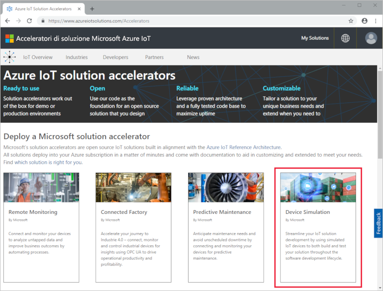
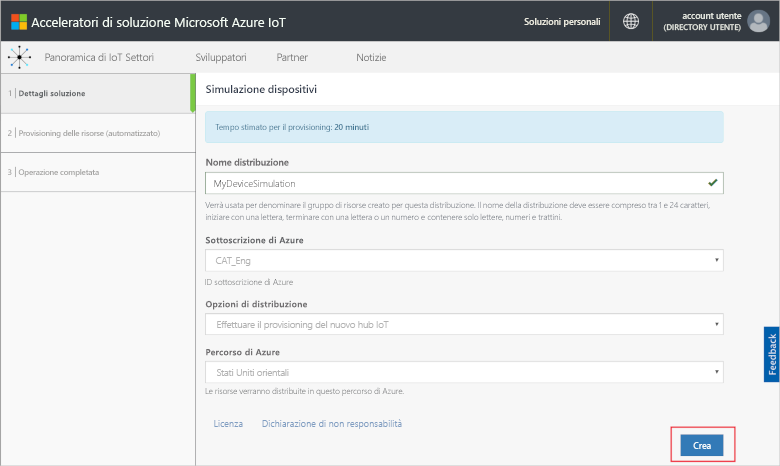
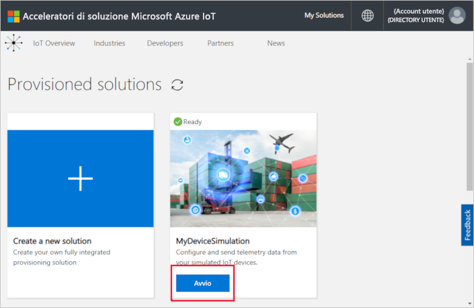
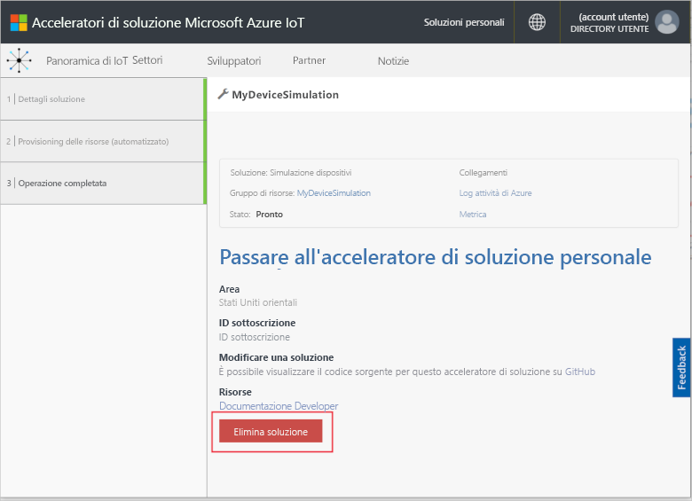

# Guida introduttiva: Distribuire ed eseguire una soluzione di simulazione dei dispositivi basata sul cloud

Questa guida introduttiva illustra come distribuire l'acceleratore della soluzione Simulazione dispositivi di Azure IoT da usare per testare la soluzione IoT. Dopo aver distribuito l'acceleratore della soluzione, si usa la pagina **Simulation** (Simulazione) per creare ed eseguire una simulazione.

Per completare questa guida introduttiva, è necessaria una sottoscrizione di Azure attiva.

Se non si ha una sottoscrizione di Azure, creare un [account gratuito](https://azure.microsoft.com/free/?WT.mc_id=A261C142F) prima di iniziare.

## Distribuire la soluzione

Prima di distribuire l'acceleratore della soluzione nella sottoscrizione di Azure, è necessario impostare alcune opzioni di configurazione.

Accedere ad [azureiotsolutions.com](https://www.azureiotsolutions.com/Accelerators) usando le credenziali dell'account Azure.

Fare clic su **Prova adesso** nel riquadro **Simulazione dispositivi**.

Nella pagina **Crea soluzione Simulazione dispositivi** immettere un **nome soluzione** univoco. Prendere nota del nome della soluzione. Si tratta del nome del gruppo di risorse di Azure che contiene tutte le risorse della soluzione.

Selezionare **Sottoscrizione** e **Area** da usare per distribuire l'acceleratore della soluzione. In genere, si sceglie l'area più vicina. È necessario essere [amministratore globale o utente](iot-accelerators-permissions.md) nella sottoscrizione.

Selezionare la casella per distribuire un hub IoT da usare con la soluzione Simulazione dispositivi. È sempre possibile modificare in un secondo momento l'hub IoT usato dalla simulazione.

Fare clic su **Crea soluzione** per iniziare il provisioning della soluzione. Questo processo richiede almeno cinque minuti:

## Accedere alla soluzione

Al termine del processo di provisioning, è possibile accedere al dashboard dell'acceleratore della soluzione Simulazione dispositivi.

Nella pagina **Soluzioni di cui è stato effettuato il provisioning** fare clic sull'acceleratore della soluzione Simulazione dispositivi:

È possibile esaminare le informazioni sull'acceleratore della soluzione Simulazione dispositivi nel pannello visualizzato. Scegliere **Dashboard soluzione** per visualizzare l'acceleratore della soluzione Simulazione dispositivi:

Fare clic su **Accetta** per accettare la richiesta di autorizzazioni. Il dashboard della soluzione Simulazione dispositivi viene visualizzato nel browser:

## Configurare la simulazione

Si configura e si esegue una simulazione dal dashboard. Usare i valori nella tabella seguente per configurare la simulazione:

| Impostazione             | Valore                       |
| ------------------- | --------------------------- |
| Hub IoT di destinazione      | "Use pre-provisioned IoT Hub" (Usa l'hub IoT di cui è già stato eseguito il provisioning) |
| Modello del dispositivo        | Chiller (Refrigeratore)                     |
| Number of devices (Numero di dispositivi)   | 10                          |
| Telemetry frequency (Frequenza telemetria) | 10 secondi                  |
| Simulation duration (Durata simulazione) | 5 minuti                   |

## Eseguire la simulazione

Fare clic su **Avvia simulazione**. La simulazione viene eseguita per la durata scelta. È possibile arrestare la simulazione in qualsiasi momento facendo clic su **Arresta simulazione**. La simulazione mostra le statistiche per l'esecuzione corrente. Fare clic su **View IoT Hub metrics in the Azure portal** (Visualizza le metriche di hub IoT nel portale di Azure) per visualizzare le metriche segnalate dall'hub IoT:

È possibile eseguire solo una simulazione alla volta da un'istanza di cui è stato effettuato il provisioning dell'acceleratore della soluzione.

## Pulire le risorse

Se si prevede di esplorare la soluzione ulteriormente, lasciare distribuito l'acceleratore della soluzione Simulazione dispositivi.

Se l'acceleratore di soluzione non è più necessario, eliminarlo dalla pagina [Soluzioni di cui è stato effettuato il provisioning](https://www.azureiotsolutions.com/Accelerators#dashboard) selezionandolo e facendo clic su **Elimina soluzione**:

## Passaggi successivi

In questa guida introduttiva è stato distribuito l'acceleratore della soluzione Simulazione dispositivi ed è stata eseguita una simulazione di un dispositivo IoT.

Per informazioni su come usare un hub IoT esistente in una simulazione, vedere la guida pratica seguente:

> [!div class="nextstepaction"]
> [Use an existing IoT hub with the Device Simulation solution accelerator (Usare un hub IoT esistente con l'acceleratore della soluzione Simulazione dispositivi)](iot-accelerators-device-simulation-choose-hub.md)
