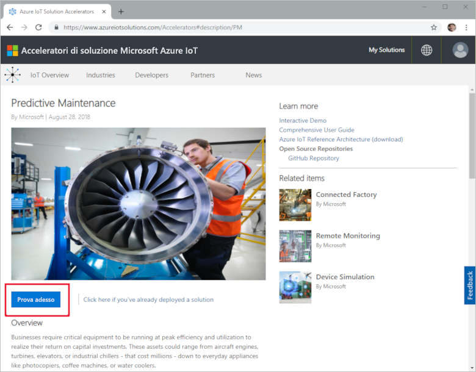
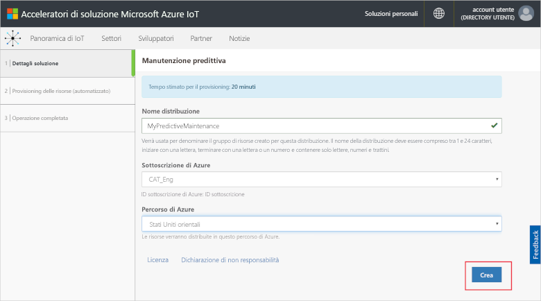
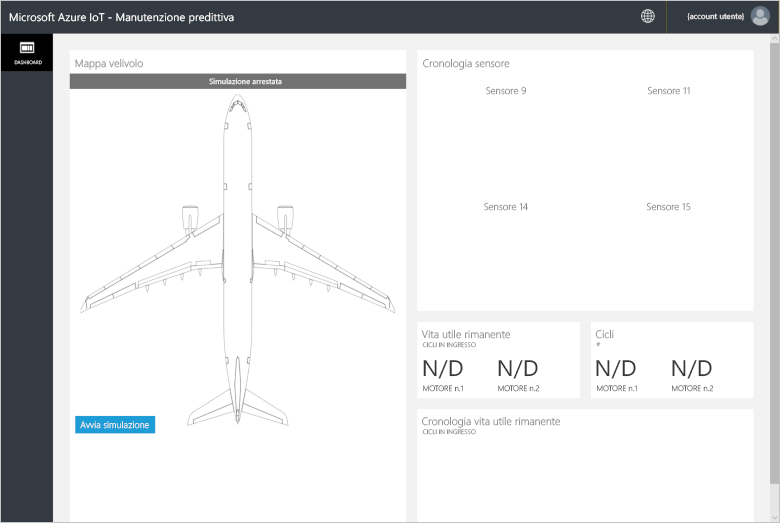
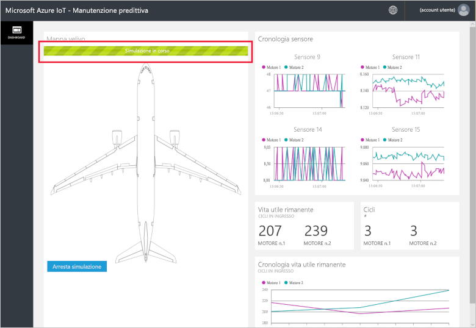
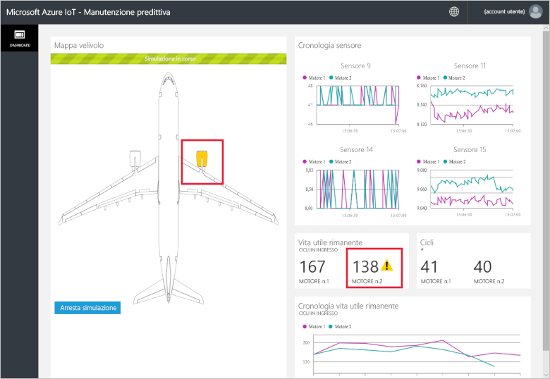

# Guida introduttiva: Distribuire una soluzione basata sul cloud per eseguire un'analisi di manutenzione predittiva sui dispositivi connessi

Questa guida introduttiva illustra come distribuire l'acceleratore della soluzione di manutenzione predittiva IoT di Azure da usare come soluzione di manutenzione predittiva basata sul cloud per i dispositivi IoT. Dopo aver distribuito l'acceleratore della soluzione, si usa la pagina **Dashboard** della soluzione per eseguire una simulazione usando i dati sui motori di aeromobili.

Fabrikam è una compagnia aerea locale che si concentra sulle esperienze eccezionali dei clienti a prezzi competitivi. Una causa di ritardi dei voli sono i problemi di manutenzione e la manutenzione dei motori degli aeromobili è particolarmente complessa. Fabrikam deve evitare a tutti i costi i guasti dei motori durante il volo, quindi controlla regolarmente i motori e pianifica la manutenzione in base a un programma. Tuttavia, i motori non sempre si usurano allo stesso modo. Sui motori viene eseguita manutenzione superflua. Ancora più importante, si verificano problemi che possono forzare a terra un aereo fino a quando non viene eseguita la manutenzione. Se un aereo si trova in un luogo in cui tecnici esperti o parti di ricambio non sono disponibili, questi problemi possono essere particolarmente costosi.

I motori degli aeromobili Fabrikam sono instrumentati con sensori che controllano le condizioni del motore durante il volo. Dopo aver accumulato anni di dati operativi e sui guasti dei motori, i ricercatori di dati di Fabrikam hanno sviluppato un modello per prevedere la vita utile rimanente (RUL) di un motore di aeromobile. Il modello usa una correlazione tra i dati provenienti da quattro dei sensori del motore e l'usura del motore che conduce a un eventuale guasto. Mentre Fabrikam continua a eseguire controlli periodici per garantire la sicurezza, ora può usare i modelli per calcolare il valore RUL per ogni motore dopo ogni volo. Fabrikam può ora prevedere i futuri punti di errore e pianificare la manutenzione per ridurre al minimo il tempo di fermo a terra e ridurre i costi operativi, garantendo la sicurezza dei passeggeri e dell'equipaggio.

## prerequisiti

Per completare questa guida introduttiva, è necessaria una sottoscrizione di Azure attiva.

Se non si ha una sottoscrizione di Azure, creare un [account gratuito](https://azure.microsoft.com/free/?WT.mc_id=A261C142F) prima di iniziare.

## Distribuire la soluzione

Prima di distribuire l'acceleratore della soluzione nella sottoscrizione di Azure, è necessario impostare alcune opzioni di configurazione.

Accedere ad [azureiotsolutions.com](https://www.azureiotsolutions.com/Accelerators) usando le credenziali dell'account Azure.

Fare clic su **Prova adesso** nel riquadro **Manutenzione predittiva**.

Nella pagina **Crea soluzione Manutenzione predittiva** immettere un valore univoco per **Nome soluzione** per l'acceleratore della soluzione di manutenzione predittiva.

Selezionare **Sottoscrizione** e **Area** da usare per distribuire l'acceleratore della soluzione. In genere, si sceglie l'area più vicina. È necessario essere [amministratore globale o utente](iot-accelerators-permissions.md) nella sottoscrizione.

Fare clic su **Create Solution** (Crea soluzione) per iniziare la distribuzione. Questo processo richiede almeno cinque minuti:

## Accedere alla soluzione

Al termine della distribuzione della sottoscrizione di Azure, è possibile accedere al dashboard dell'acceleratore della soluzione di manutenzione predittiva.

Nella pagina **Soluzioni di cui è stato effettuato il provisioning** fare clic sul nuovo acceleratore della soluzione di manutenzione predittiva. È possibile visualizzare informazioni sull'acceleratore della soluzione nel pannello visualizzato. Scegliere **Dashboard soluzione** per visualizzare l'acceleratore della soluzione di manutenzione predittiva:

Fare clic su **Accetta** per accettare la richiesta di autorizzazioni. Il dashboard della soluzione di manutenzione predittiva viene visualizzato nel browser:

Fare clic su **Avvia simulazione** per iniziare la simulazione. Il dashboard viene popolato con cronologia del sensore, vita utile rimanente, cicli e cronologia della vita utile rimanente:

Quando la vita utile rimanente è inferiore a 160, una soglia arbitraria scelta a scopo dimostrativo, il portale della soluzione mostra un simbolo di avviso accanto alla visualizzazione della vita utile rimanente. Il portale della soluzione evidenzia anche in giallo il motore dell'aereo. Si noti come i valori della vita utile rimanente abbiano complessivamente una tendenza generale al ribasso, ma tendano a oscillare in alto o in basso. Questo comportamento dovuto alle diverse lunghezze dei cicli e all'accuratezza del modello.

La simulazione completa richiede circa 35 minuti per completare 148 cicli. La soglia di 160 per la vita utile rimanente viene raggiunta per la prima volta dopo circa 5 minuti ed entrambi i motori la raggiungono a circa 8 minuti.

La simulazione viene eseguita sul set di dati completo per 148 cicli e si stabilizza sui valori finali dei cicli e della vita utile rimanente.

È possibile arrestare la simulazione in qualsiasi punto, ma facendo clic su **Start Simulation** viene riprodotta la simulazione dall'inizio del set di dati.

## Pulire le risorse

Se si prevede di esplorare la soluzione ulteriormente, lasciare distribuito l'acceleratore della soluzione di manutenzione predittiva.

Se l'acceleratore della soluzione non è più necessario, eliminarlo dalla pagina [Soluzioni di cui è stato effettuato il provisioning](https://www.azureiotsolutions.com/Accelerators#dashboard):

## Passaggi successivi

In questa guida introduttiva è stato distribuito l'acceleratore della soluzione di manutenzione predittiva ed è stata eseguita una simulazione.

Per altre informazioni sull'acceleratore della soluzione, vedere l'articolo.

> [!div class="nextstepaction"]
> [Panoramica dell'acceleratore di soluzioni di manutenzione predittiva](iot-accelerators-predictive-walkthrough.md)
