# Guida introduttiva: Provare una soluzione di monitoraggio remoto basata sul cloud

Questa guida introduttiva illustra come distribuire l'acceleratore di soluzione Monitoraggio remoto di IoT di Azure. In questa soluzione basata sul cloud viene usata la pagina **Dashboard** per visualizzare i dispositivi simulati su una mappa e la pagina **Maintenance** (Manutenzione) per rispondere a un avviso di pressione da un dispositivo refrigeratore simulato. È possibile usare questo acceleratore di soluzione come punto di partenza per un'implementazione personalizzata o come strumento di apprendimento.

La distribuzione iniziale configura l'acceleratore di soluzione per una società denominata Contoso. Gli operatori di Contoso possono gestire una selezione di diversi tipi di dispositivi, ad esempio refrigeratori, distribuiti in ambienti fisici diversi. Un dispositivo refrigeratore invia temperatura, umidità e dati di telemetria sulla pressione all'acceleratore della soluzione di monitoraggio remoto.

Questo argomento di avvio rapido implementa una versione di **base** dell'acceleratore di soluzione a scopi dimostrativi e di test per ridurre al minimo i costi. Per altre informazioni sulle diverse versioni che è possibile implementare, vedere [Distribuzioni di base e standard](iot-accelerators-remote-monitoring-deploy-cli.md#basic-and-standard-deployments).

Per completare questa guida introduttiva, è necessaria una sottoscrizione di Azure attiva.

Se non si ha una sottoscrizione di Azure, creare un [account gratuito](https://azure.microsoft.com/free/?WT.mc_id=A261C142F) prima di iniziare.

## Distribuire la soluzione

Prima di distribuire l'acceleratore della soluzione nella sottoscrizione di Azure, è necessario impostare alcune opzioni di configurazione.

Accedere ad [azureiotsolutions.com](https://www.azureiotsolutions.com/Accelerators) usando le credenziali dell'account Azure.

Fare clic sul riquadro **Monitoraggio remoto**. Nella pagina **Monitoraggio remoto** fare clic su **Prova adesso**:

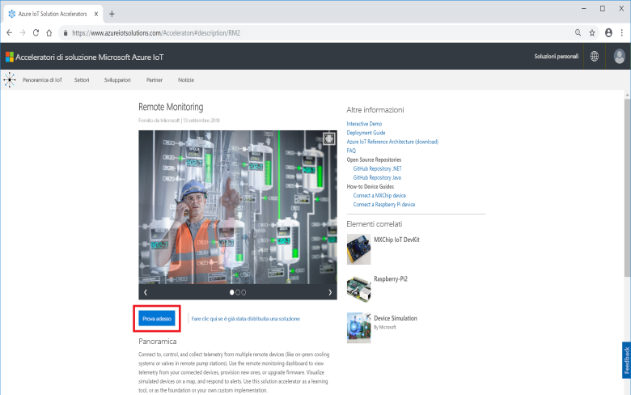

Scegliere **Microservizi C#** come **Opzioni di distribuzione**. Le implementazioni di Java e C# hanno funzionalità identiche.

Immettere un valore univoco in **Solution name** (Nome soluzione) per l'acceleratore della soluzione di monitoraggio remoto. Per questa guida introduttiva usare il nome **contoso-rm**.

Selezionare **Sottoscrizione** e **Area** da usare per distribuire l'acceleratore della soluzione. In genere, si sceglie l'area più vicina. Per questa guida introduttiva usare l'area **Stati Uniti orientali**.
È possibile scegliere **Visual Studio Enterprise**, ma per farlo è necessario essere un [utente o amministratore globale](iot-accelerators-permissions.md).

Per iniziare la distribuzione, fare clic su **Crea**. Questo processo richiede almeno cinque minuti:

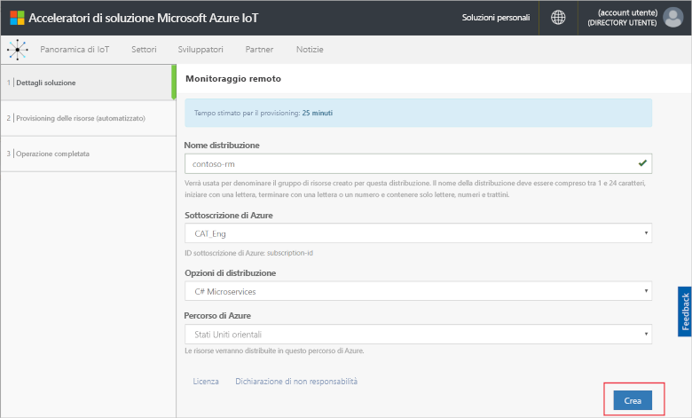

## Accedere alla soluzione

Al termine della distribuzione nella sottoscrizione di Azure, verrà visualizzato un segno di spunta verde e la dicitura **Pronto** nel riquadro della soluzione. È ora possibile accedere al dashboard dell'acceleratore di soluzione Monitoraggio remoto.

Nella pagina **Provisioned solutions** (Soluzioni di cui è stato effettuato il provisioning), fare clis sul nuovo acceleratore della soluzione di monitoraggio remoto:

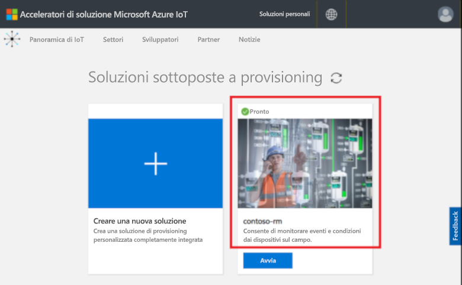

È possibile esaminare le informazioni sull'acceleratore della soluzione di monitoraggio remoto nel pannello visualizzato. Scegliere **Vai a Acceleratore di soluzione** per visualizzare l'acceleratore della soluzione Monitoraggio remoto:

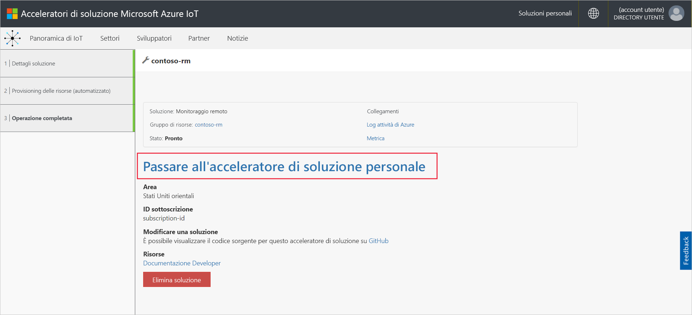

Fare clic su **Accept** (Accetta) per accettare la richiesta di autorizzazioni; il dashboard della soluzione di monitoraggio remoto viene visualizzato nel browser:

[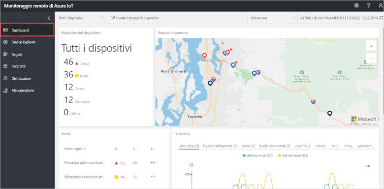](./media/quickstart-remote-monitoring-deploy/solutiondashboard-expanded.png#lightbox)

## Visualizzare i dispositivi

Il dashboard della soluzione mostra le informazioni seguenti sui dispositivi simulati di Contoso:

* Il pannello **Device statistics** (Statistiche dispositivo) mostra le informazioni di riepilogo sugli avvisi e il numero totale di dispositivi. Nella distribuzione predefinita, Contoso dispone di 10 dispositivi simulati di tipi diversi.

* Il pannello **Device locations** (Percorsi dispositivo) mostra dove si trovano fisicamente i dispositivi. Il colore del segnaposto indica quando sono presenti avvisi dal dispositivo.

* Il pannello **Alerts** (Avvisi) mostra i dettagli degli avvisi dai dispositivi.

* Il pannello **Telemetry** (Dati di telemetria) mostra i dati di telemetria dai dispositivi. È possibile visualizzare flussi di telemetria diversi facendo clic sui tipi di dati di telemetria nella parte superiore.

* Il pannello **Analytics** (Analitica) mostra informazioni combinate sugli avvisi dai dispositivi.

## Rispondere a un avviso

Gli operatori di Contoso possono monitorare i dispositivi dal dashboard della soluzione. Il pannello **Device statistics** (Device statistics): mostra che sono stati generati alcuni avvisi critici e il pannello **Alerts** (Avvisi) mostra che la maggior parte proviene da un dispositivo refrigeratore. Per i dispositivi refrigeratore di Contoso, una pressione interna oltre 250 PSI indica un malfunzionamento del dispositivo.

### Identificare il problema

Nella pagina **Dashboard** nel pannello **Alerts** (Avvisi) è possibile osservare l'avviso **Chiller pressure too high** (Pressione refrigeratore troppo alta). Il refrigeratore ha un segnaposto rosso sulla mappa (potrebbe essere necessario utilizzare panoramica e zoom sulla mappa):

[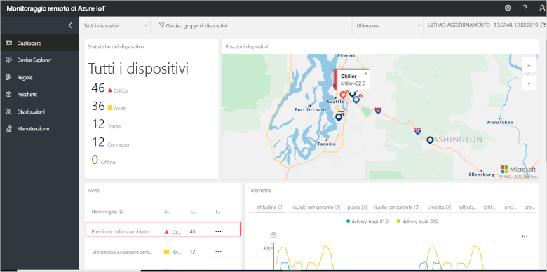](./media/quickstart-remote-monitoring-deploy/dashboardalarm-expanded.png#lightbox)

Nel pannello **Alerts** (Avvisi) fare clic su **...** nella colonna **Explore** (Esplora) accanto alla regola **Chiller pressure too high** (Pressione refrigeratore troppo alta). Viene visualizzata la pagina **Maintenance** (Manutenzione) che consente di visualizzare i dettagli della regola che ha attivato l'avviso.

La pagina **Chiller pressure too high** (Pressione refrigeratore troppo alta) mostra i dettagli della regola che ha attivato gli avvisi. La pagina indica inoltre quando sono stati generati gli avvisi e quale dispositivo li ha attivati:

[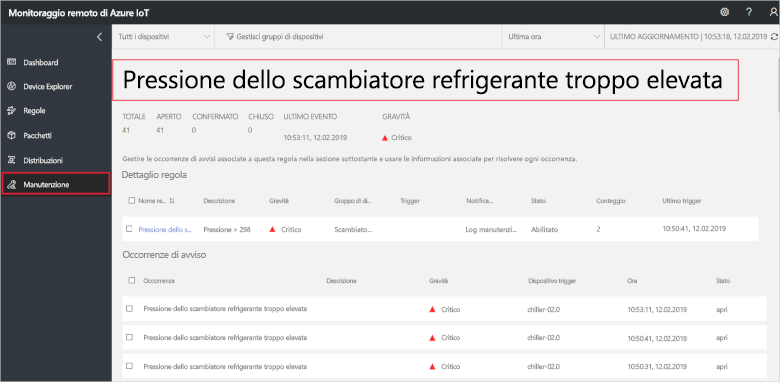](./media/quickstart-remote-monitoring-deploy/maintenancealarmlist-expanded.png#lightbox)

Sono stati ora identificati il problema che ha attivato l'avviso e il dispositivo associato. Per un operatore, i passaggi successivi consistono nel confermare l'avviso e correggere il problema.

### Correggere il problema

Per indicare ad altri operatori che si sta intervenendo sull'avviso, selezionarlo e modificare il valore di **Alert status** (Stato avviso) in **Acknowledged** (Confermato):

[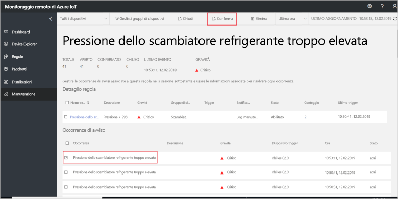](./media/quickstart-remote-monitoring-deploy/maintenanceacknowledge-expanded.png#lightbox)

Il valore nella colonna stato viene modificato in **Acknowledged** (Confermato).

Per intervenire sul refrigeratore, scorrere a **Related information** (Informazioni correlate), selezionare il dispositivo refrigeratore nell'elenco **Alerted devices** (Dispositivi avvisati), quindi scegliere **Jobs** (Processi):

[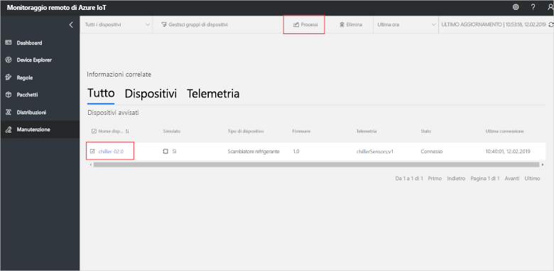](./media/quickstart-remote-monitoring-deploy/maintenanceschedule-expanded.png#lightbox)

Nel pannello **Jobs** (Processi) scegliere **Run method** (Esegui metodo) e quindi il metodo **EmergencyValveRelease**. Aggiungere il nome del processo **ChillerPressureRelease** e fare clic su **Applica**. Queste impostazioni creano un processo che viene eseguito immediatamente.

Per visualizzare lo stato del processo, tornare alla pagina **Maintenance** (Manutenzione) e visualizzare l'elenco di processi nella visualizzazione **Jobs** (Processi). Possono essere necessari alcuni secondi prima di vedere che il processo è stato eseguito:

[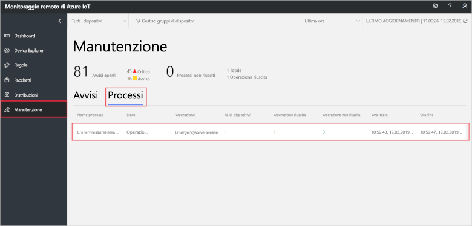](./media/quickstart-remote-monitoring-deploy/maintenancerunningjob-expanded.png#lightbox)

### Controllare che la pressione sia tornata normale

Per visualizzare i dati di telemetria sulla pressione per il refrigeratore, passare alla pagina **Dashboard**, selezionare **Pressure** (Pressione) nel pannello dei dati di telemetria e confermare che la pressione per **chiller-02.0** è tornata normale:

[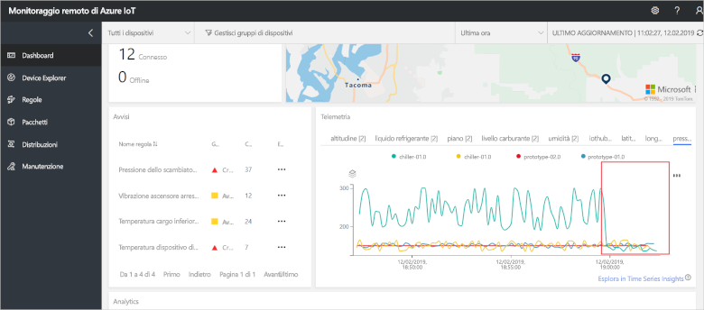](./media/quickstart-remote-monitoring-deploy/pressurenormal-expanded.png#lightbox)

Per chiudere l'evento imprevisto, passare alla pagina **Maintenance** (Manutenzione), selezionare l'avviso e impostare lo stato su **Closed** (Chiuso):

[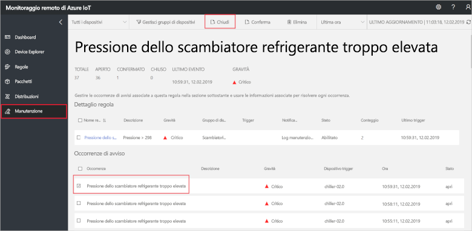](./media/quickstart-remote-monitoring-deploy/maintenanceclose-expanded.png#lightbox)

Il valore nella colonna stato viene modificato in **Closed** (Chiuso).

## Pulire le risorse

Se si intende passare alle esercitazioni, lasciare l'acceleratore della soluzione di monitoraggio remoto distribuito.

Se l'acceleratore di soluzione non è più necessario, eliminarlo dalla pagina [Soluzioni di cui è stato effettuato il provisioning](https://www.azureiotsolutions.com/Accelerators#dashboard) selezionandolo e facendo clic su **Elimina soluzione**:

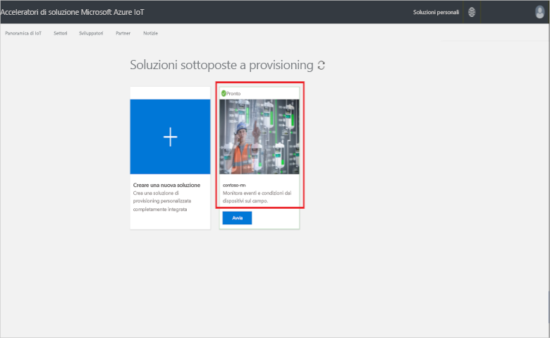

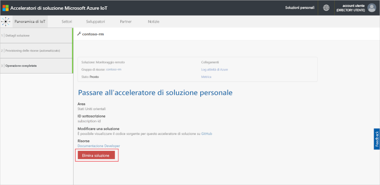

## Passaggi successivi

In questa guida introduttiva, è stato distribuito l'acceleratore della soluzione di monitoraggio remoto e completata un'attività di monitoraggio con i dispositivi simulati nella distribuzione di Contoso predefinita.

Per altre informazioni sull'acceleratore di soluzione con dispositivi simulati, continuare con l'esercitazione successiva.

> [!div class="nextstepaction"]
> [Esercitazione: Monitorare i dispositivi IoT](iot-accelerators-remote-monitoring-monitor.md)