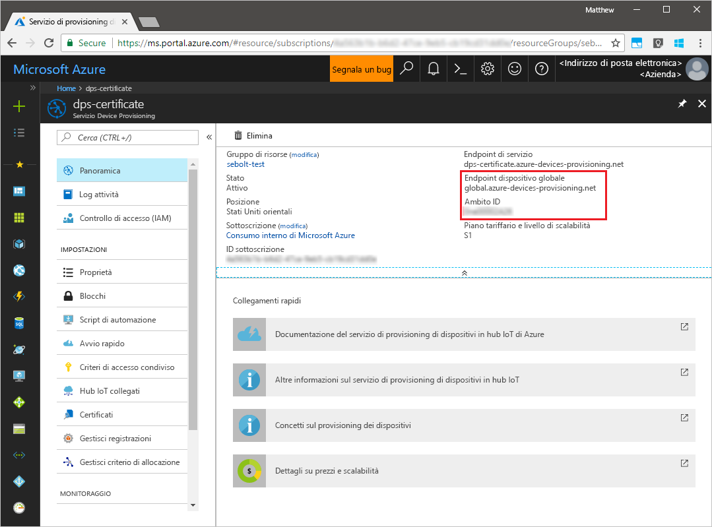
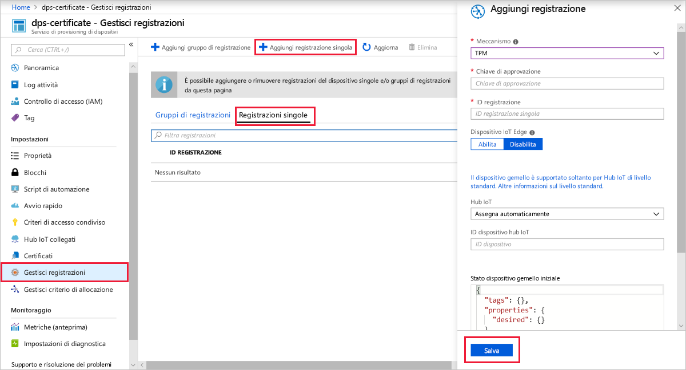
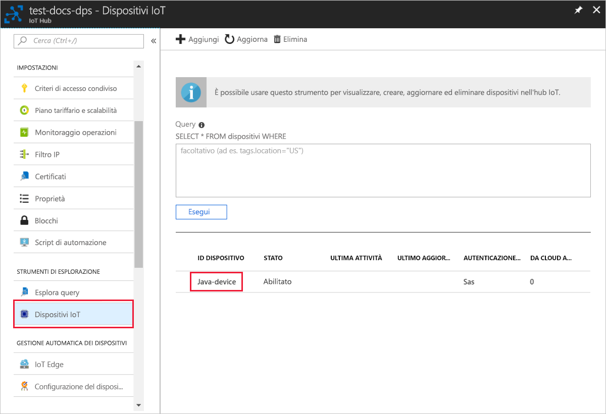

# <a name="create-and-provision-a-simulated-tpm-device-using-java-device-sdk-for-azure-iot-hub-device-provisioning-service"></a>Creare ed effettuare il provisioning di un dispositivo simulato TPM usando l'SDK per dispositivi Java per il servizio Device Provisioning in hub IoT di Azure

[!INCLUDE [iot-dps-selector-quick-create-simulated-device-tpm](../../includes/iot-dps-selector-quick-create-simulated-device-tpm.md)]

Questi passaggi illustrano come creare un dispositivo simulato nel computer di sviluppo che esegue un sistema operativo Windows, eseguire il simulatore Windows TPM come [modulo di protezione hardware](https://azure.microsoft.com/blog/azure-iot-supports-new-security-hardware-to-strengthen-iot-security/) del dispositivo e usare l'esempio di codice per connettere questo dispositivo simulato con il servizio Device Provisioning e l'hub IoT. 

Se non si ha familiarità con il processo di provisioning automatico, è necessario vedere [Concetti relativi al provisioning automatico](concepts-auto-provisioning.md). È anche necessario aver completato la procedura descritta in [Configurare il servizio Device Provisioning in hub IoT con il portale di Azure](./quick-setup-auto-provision.md) prima di continuare. 

Il servizio Device Provisioning in Azure IoT supporta due tipi di registrazione:
- [Gruppi di registrazioni](concepts-service.md#enrollment-group): usato per registrare più dispositivi correlati.
- [Registrazioni singole](concepts-service.md#individual-enrollment): usato per registrare un singolo dispositivo.

Questo articolo descrive le registrazioni singole.

[!INCLUDE [IoT Device Provisioning Service basic](../../includes/iot-dps-basic.md)]

## <a name="prepare-the-environment"></a>Preparare l'ambiente 

1. Verificare che [Java SE Development Kit 8](https://aka.ms/azure-jdks) sia installato nel computer.

1. Scaricare e installare [Maven](https://maven.apache.org/install.html).

1. Verificare che `git` sia installato nel computer e venga aggiunto alle variabili di ambiente accessibili alla finestra di comando. Vedere gli [strumenti client Git di Software Freedom Conservancy](https://git-scm.com/download/) per la versione più recente degli strumenti `git` da installare, tra cui **Git Bash**, l'app da riga di comando che è possibile usare per interagire con il repository Git locale. 

1. Aprire un prompt dei comandi. Clonare il repository GitHub per l'esempio di codice di simulazione del dispositivo.
    
    ```cmd/sh
    git clone https://github.com/Azure/azure-iot-sdk-java.git --recursive
    ```

1. Eseguire il simulatore [TPM](https://docs.microsoft.com/windows/device-security/tpm/trusted-platform-module-overview). Fare clic su **Consenti l'accesso** per consentire le modifiche alle impostazioni _Windows Firewall_. che è in ascolto di un socket sulle porte 2321 e 2322. Non chiudere questa finestra. Il simulatore deve restare in esecuzione fino alla fine di questa guida introduttiva. 

    ```cmd/sh
    .\azure-iot-sdk-java\provisioning\provisioning-tools\tpm-simulator\Simulator.exe
    ```

    

1. In un prompt dei comandi separato passare alla cartella radice e compilare le dipendenze dell'esempio.

    ```cmd/sh
    cd azure-iot-sdk-java
    mvn install -DskipTests=true
    ```

1. Passare alla cartella dell'esempio.

    ```cmd/sh
    cd provisioning/provisioning-samples/provisioning-tpm-sample
    ```

1. Accedere al portale di Azure, fare clic sul pulsante **Tutte le risorse** nel menu a sinistra e aprire il servizio Device Provisioning. Prendere nota dell'_ambito ID_ e dell'_endpoint globale del servizio di provisioning_.

    

1. Modificare `src/main/java/samples/com/microsoft/azure/sdk/iot/ProvisioningTpmSample.java` per poter includere l'_ambito ID_ e l'_endpoint globale del servizio di provisioning_ annotati prima.  

    ```java
    private static final String idScope = "[Your ID scope here]";
    private static final String globalEndpoint = "[Your Provisioning Service Global Endpoint here]";
    private static final ProvisioningDeviceClientTransportProtocol PROVISIONING_DEVICE_CLIENT_TRANSPORT_PROTOCOL = ProvisioningDeviceClientTransportProtocol.HTTPS;
    ```

1. Compilare il progetto. Passare alla cartella di destinazione ed eseguire il file JAR creato.

    ```cmd/sh
    mvn clean install
    cd target
    java -jar ./provisioning-tpm-sample-{version}-with-deps.jar
    ```

1. Inizia l'esecuzione del programma. Prendere nota della _chiave di verifica dell'autenticità_ e dell'_ID registrazione_ per la sezione successiva e lasciare il programma in esecuzione.

    
    

## <a name="create-a-device-enrollment-entry"></a>Creare una voce per la registrazione dei dispositivi

1. Accedere al portale di Azure, fare clic sul pulsante **Tutte le risorse** nel menu a sinistra e aprire il servizio Device Provisioning.

1. Nel pannello di riepilogo del servizio Device Provisioning selezionare **Manage enrollments** (Gestisci registrazioni). Selezionare la scheda **Individual Enrollments** (Registrazione singola) e fare clic sul pulsante in alto **Add individual enrollment** (Aggiungi registrazione singola). 

1. Nella sezione **Add Enrollment**(Aggiungi registrazione) immettere le seguenti informazioni:
    - Selezionare **TPM** come *meccanismo* di attestazione dell'identità.
    - Immettere l'*ID registrazione* e la *chiave di verifica dell'autenticità* per il dispositivo TPM annotati in precedenza. 
    - Selezionare un hub IoT collegato al servizio di provisioning.
    - Immettere un ID dispositivo univoco. Assicurarsi di non usare dati sensibili quando si assegna un nome al dispositivo.
    - Aggiornare lo **stato iniziale del dispositivo gemello** con la configurazione iniziale desiderata per il dispositivo.
    - Al termine, fare clic sul pulsante **Save** (Salva). 

      

   Dopo la corretta registrazione, l'*ID registrazione* del dispositivo viene visualizzato nell'elenco della scheda *Registrazioni singole*. 


## <a name="simulate-the-device"></a>Simulare il dispositivo

1. Nella finestra di comando che esegue il codice di esempio Java sul computer premere INVIO per continuare l'esecuzione dell'applicazione. Si notino i messaggi che simulano l'avvio e la connessione del dispositivo al servizio Device Provisioning per ottenere le informazioni dell'hub IoT.  

    

1. Dopo il corretto provisioning del dispositivo simulato nell'hub IoT collegato al servizio di provisioning, l'ID del dispositivo viene visualizzato nel pannello **Device Explorer** dell'hub.

     

    Se si è modificato lo *stato iniziale del dispositivo gemello* rispetto al valore predefinito della voce di registrazione del dispositivo, è possibile eseguire il pull dello stato del dispositivo desiderato dall'hub e agire di conseguenza. Per altre informazioni, vedere [Comprendere e usare dispositivi gemelli nell'hub IoT](../iot-hub/iot-hub-devguide-device-twins.md)


## <a name="clean-up-resources"></a>Pulire le risorse

Se si prevede di continuare a usare ed esplorare l'esempio di client del dispositivo, non pulire le risorse create in questa guida introduttiva. Se non si prevede di continuare, usare i passaggi seguenti per eliminare tutte le risorse create da questa guida introduttiva.

1. Chiudere la finestra di output di esempio di client del dispositivo sul computer.
1. Chiudere la finestra del simulatore TPM sul computer.
1. Nel portale di Azure fare clic su **Tutte le risorse** nel menu a sinistra e quindi selezionare il servizio Device Provisioning. Aprire il pannello **Gestisci registrazioni** per il servizio, quindi fare clic sulla scheda **Registrazioni singole**. Selezionare l'*ID registrazione* del dispositivo registrato in questa guida introduttiva e fare clic sul pulsante **Elimina** nella parte superiore. 
1. Nel portale di Azure fare clic su **Tutte le risorse** nel menu a sinistra e quindi selezionare l'hub IoT. Aprire il pannello **Dispositivi IoT** per l'hub, selezionare l'*ID* del dispositivo registrato in questa guida introduttiva e quindi fare clic su **Elimina** nella parte superiore.

## <a name="next-steps"></a>Passaggi successivi

In questa guida introduttiva è stato creato un dispositivo simulato TPM nel computer e ne è stato effettuato il provisioning nell'hub IoT usando il servizio Device Provisioning in hub IoT. Per informazioni su come registrare il dispositivo TPM a livello di codice, passare alla guida introduttiva per la registrazione a livello di codice di un dispositivo TPM. 

> [!div class="nextstepaction"]
> [Guida introduttiva di Azure - Registrare un dispositivo TPM nel servizio Device Provisioning in hub IoT di Azure](quick-enroll-device-tpm-java.md)
