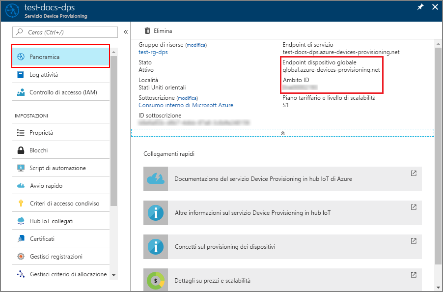
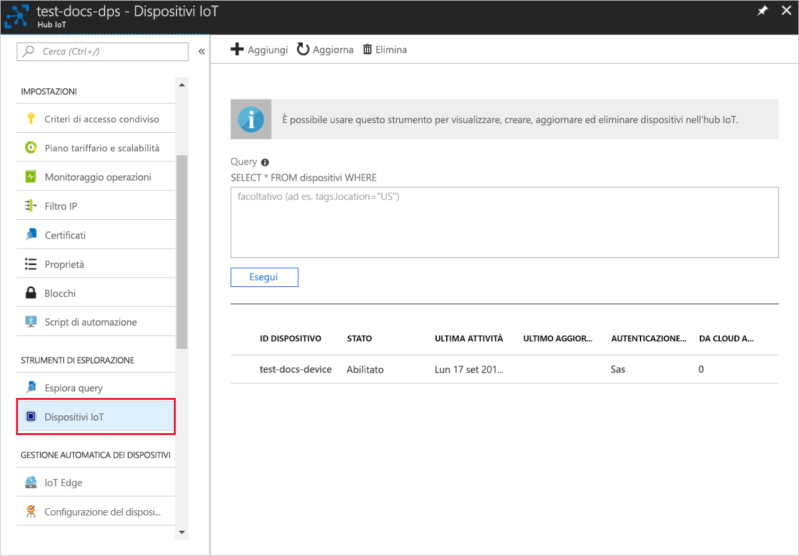

# <a name="create-and-provision-an-x509-simulated-device-using-nodejs-device-sdk-for-iot-hub-device-provisioning-service"></a>Creare ed effettuare il provisioning di un dispositivo simulato X.509 usando l'SDK per dispositivi Node.js per il servizio Device Provisioning in hub IoT
[!INCLUDE [iot-dps-selector-quick-create-simulated-device-x509](../../includes/iot-dps-selector-quick-create-simulated-device-x509.md)]

Questi passaggi illustrano come creare una voce di registrazione nel servizio Device Provisioning, simulare un dispositivo X.509 nel computer di sviluppo, connettere il dispositivo simulato al servizio Device Provisioning e registrare il dispositivo nell'hub IoT usando [Azure IoT Hub Node.js Device SDK](https://github.com/Azure/azure-iot-sdk-node).

Se non si ha familiarità con il processo di provisioning automatico, è necessario vedere [Concetti relativi al provisioning automatico](concepts-auto-provisioning.md). È anche necessario aver completato la procedura descritta in [Configurare il servizio Device Provisioning in hub IoT con il portale di Azure](./quick-setup-auto-provision.md) prima di continuare. 

[!INCLUDE [IoT Device Provisioning Service basic](../../includes/iot-dps-basic.md)]

## <a name="prepare-the-environment"></a>Preparare l'ambiente 

1. Completare la procedura descritta in [Configurare il servizio Device Provisioning in hub IoT con il portale di Azure](./quick-setup-auto-provision.md) prima di continuare.

2. Verificare che [Node.js v4.0 o versione successiva](https://nodejs.org) sia installato nel computer.

3. Verificare che [Git](https://git-scm.com/download/) sia installato nel computer e venga aggiunto alle variabili di ambiente accessibili alla finestra di comando. 

4. Verificare che [OpenSSL](https://www.openssl.org/) sia installato nel computer e venga aggiunto alle variabili di ambiente accessibili alla finestra di comando. Questa raccolta può essere compilata e installata dall'origine o scaricata e installata da [terze parti](https://wiki.openssl.org/index.php/Binaries) come [questa](https://sourceforge.net/projects/openssl/). 

    > [!NOTE]
    > Se sono già stati creati i certificati X.509 _radice_, _intermedio_ e/o _foglia_, è possibile ignorare questo passaggio e tutti i passaggi successivi relativi alla generazione di certificati.
    >

## <a name="create-a-self-signed-x509-device-certificate-and-individual-enrollment-entry"></a>Creare un certificato dispositivo X.509 autofirmato e la voce di registrazione singola

In questa sezione si userà un certificato X.509 autofirmato. È importante tenere presente quanto segue:

* I certificati autofirmati sono destinati solo alle operazioni di testing e non dovrebbero essere usati nell'ambiente di produzione.
* La data di scadenza predefinita per un certificato autofirmato è 1 anno.

Si userà il codice di esempio da [Azure IoT SDK per Node.js](https://github.com/Azure/azure-iot-sdk-node.git) per creare il certificato da usare con la voce di registrazione singola per il dispositivo simulato.


1. Aprire un prompt dei comandi. Clonare il repository di GitHub per gli esempi di codice:
    
    ```cmd/sh
    git clone https://github.com/Azure/azure-iot-sdk-node.git --recursive
    ```

2. Passare allo script di generazione del certificato e compilare il progetto. 

    ```cmd/sh
    cd azure-iot-sdk-node/provisioning/tools
    npm install
    ```

3. Creare un certificato X.509 _foglia_ eseguendo lo script con il proprio _certificate-name_. Si noti che il nome comune del certificato foglia diventa l'[ID registrazione](https://docs.microsoft.com/azure/iot-dps/concepts-device#registration-id), quindi usare solo caratteri alfanumerici minuscoli e trattini.

    ```cmd/sh
    node create_test_cert.js device {certificate-name}
    ```

4. Accedere al [portale di Azure](https://portal.azure.com), fare clic sul pulsante **Tutte le risorse** nel menu a sinistra e aprire l'istanza del servizio Device Provisioning.

5. Nel pannello di riepilogo del servizio Device Provisioning selezionare **Manage enrollments** (Gestisci registrazioni). Selezionare la scheda **Individual Enrollments** (Registrazione singola) e fare clic sul pulsante **Add individual enrollment** (Aggiungi registrazione singola) in alto. 

6. Nel riquadro **Add Enrollment** (Aggiungi registrazione) immettere le informazioni seguenti:
    - Selezionare **X.509** come *meccanismo* di attestazione dell'identità.
    - In *Primary certificate .pem or .cer file* (File di certificato primario con estensione pem o cer) fare clic su *Selezionare un file* per selezionare il file di certificato **{nome-certificato}_cert.pem** creato nei passaggi precedenti.  
    - Facoltativamente, è possibile specificare le informazioni seguenti:
      - Selezionare un hub IoT collegato al servizio di provisioning.
      - Immettere un ID dispositivo univoco. Assicurarsi di non usare dati sensibili quando si assegna un nome al dispositivo. 
      - Aggiornare lo **stato iniziale del dispositivo gemello** con la configurazione iniziale desiderata per il dispositivo.
   - Al termine, fare clic sul pulsante **Save** (Salva). 

    [](./media/quick-create-simulated-device-x509-node/device-enrollment.png#lightbox)

    Al termine della registrazione, il dispositivo X.509 verrà visualizzato come **{certificatename}** nella colonna *ID registrazione* della scheda *Registrazioni singole*. Prendere nota del valore per usarlo in seguito.

## <a name="simulate-the-device"></a>Simulare il dispositivo

[Azure IoT Hub Node.js Device SDK](https://github.com/Azure/azure-iot-sdk-node) offre un modo semplice per simulare un dispositivo. Per altre informazioni, vedere [Concetti relativi ai dispositivi](https://docs.microsoft.com/azure/iot-dps/concepts-device).

1. Nel portale di Azure selezionare il pannello **Panoramica** per il servizio Device Provisioning e prendere nota dei valori **_Endpoint dispositivo globale_** e **_Ambito ID_**.

     

2. Copiare il _certificato_ e la _chiave_ nella cartella di esempio.

    ```cmd/sh
    copy .\{certificate-name}_cert.pem ..\device\samples\{certificate-name}_cert.pem
    copy .\{certificate-name}_key.pem ..\device\samples\{certificate-name}_key.pem
    ```

3. Passare allo script di test del dispositivo e compilare il progetto. 

    ```cmd/sh
    cd ..\device\samples
    npm install
    ```

4. Modificare il file **register\_x509.js**. Salvare il file dopo aver apportato le modifiche seguenti.
    - Sostituire `provisioning host` con l'**_endpoint dispositivo globale_** annotato nel **passaggio 1** precedente.
    - Sostituire `id scope` con l'**_ID ambito_** annotato nel **passaggio 1** precedente. 
    - Sostituire `registration id` con l'**_ID registrazione_** annotato nella sezione precedente.
    - Sostituire `cert filename` e `key filename` con i file copiati nel **passaggio 2** precedente. 

5. Eseguire lo script e verificare che il provisioning del dispositivo sia stato eseguito correttamente.

    ```cmd/sh
    node register_x509.js
    ```   

6. Nel portale passare all'hub IoT collegato al servizio di provisioning e aprire il pannello **Dispositivi IoT**. Al termine del provisioning del dispositivo X.509 simulato nell'hub, il relativo ID dispositivo verrà visualizzato nel pannello **Dispositivi IoT** con *STATO* **abilitato**. Potrebbe essere necessario fare clic sul pulsante **Aggiorna** nella parte superiore se il pannello è stato aperto prima dell'esecuzione dell'applicazione del dispositivo di esempio. 

     

    Se si è modificato lo *stato iniziale del dispositivo gemello* rispetto al valore predefinito della voce di registrazione del dispositivo, è possibile eseguire il pull dello stato del dispositivo desiderato dall'hub e agire di conseguenza. Per altre informazioni, vedere [Comprendere e usare dispositivi gemelli nell'hub IoT](../iot-hub/iot-hub-devguide-device-twins.md).


## <a name="clean-up-resources"></a>Pulire le risorse

Se si prevede di continuare a usare ed esplorare l'esempio di client del dispositivo, non pulire le risorse create in questa guida introduttiva. Se non si prevede di continuare, usare i passaggi seguenti per eliminare tutte le risorse create da questa guida introduttiva.

1. Chiudere la finestra di output di esempio di client del dispositivo sul computer.
2. Nel portale di Azure fare clic su **Tutte le risorse** nel menu a sinistra e quindi selezionare il servizio Device Provisioning. Aprire il pannello **Gestisci registrazioni** per il servizio, quindi fare clic sulla scheda **Registrazioni singole**. Selezionare l'*ID registrazione* del dispositivo registrato in questa guida introduttiva e fare clic sul pulsante **Elimina** nella parte superiore. 
3. Nel portale di Azure fare clic su **Tutte le risorse** nel menu a sinistra e quindi selezionare l'hub IoT. Aprire il pannello **Dispositivi IoT** per l'hub, selezionare l'*ID* del dispositivo registrato in questa guida introduttiva e quindi fare clic su **Elimina** nella parte superiore.


## <a name="next-steps"></a>Passaggi successivi

In questa guida introduttiva è stato creato un dispositivo X.509 simulato e ne è stato effettuato il provisioning nell'hub IoT usando il servizio Device Provisioning in hub IoT di Azure nel portale. Per informazioni su come registrare il dispositivo X.509 a livello di codice, passare alla guida introduttiva per la registrazione a livello di codice dei dispositivi X.509. 

> [!div class="nextstepaction"]
> [Guida introduttiva di Azure - Registrare dispositivi X.509 nel servizio Device Provisioning in hub IoT di Azure](quick-enroll-device-x509-node.md)
