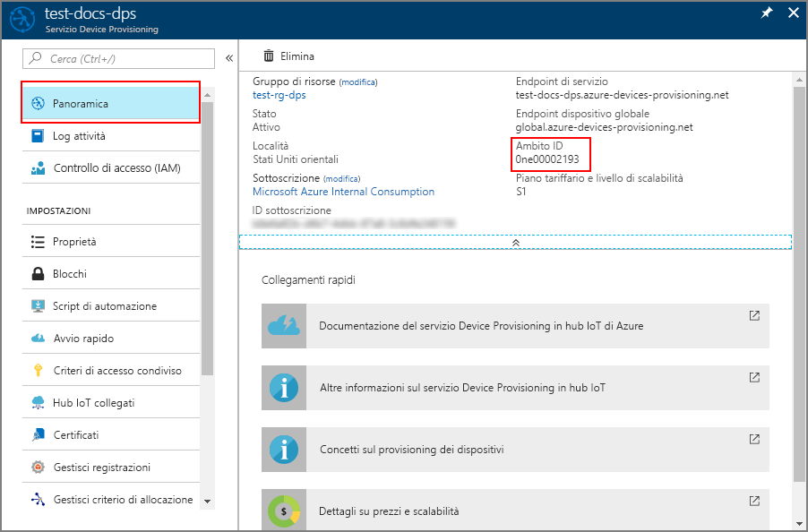
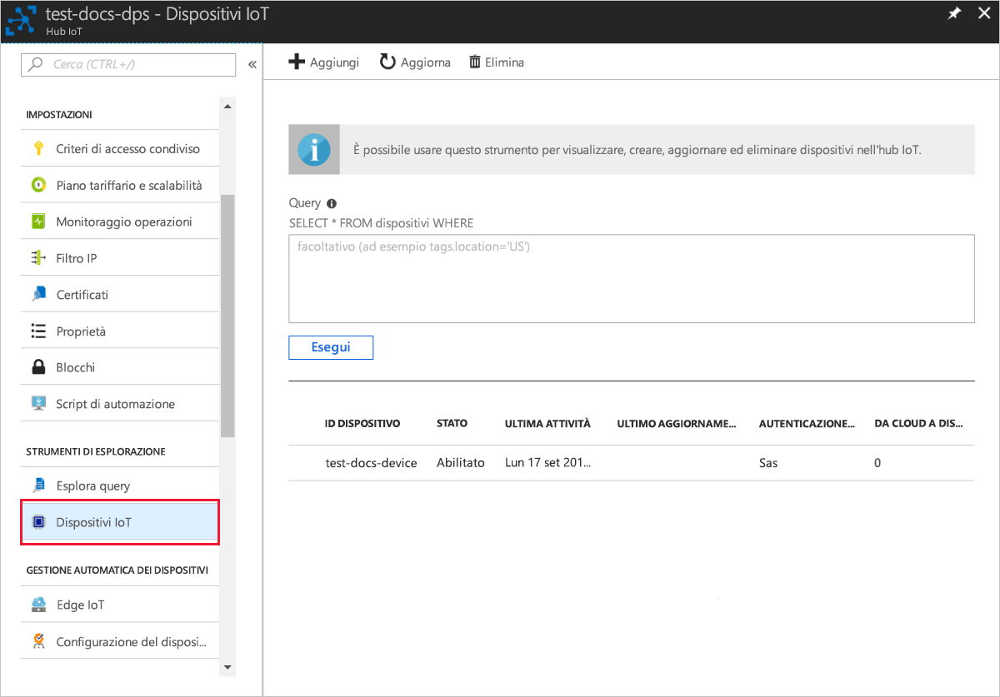

# <a name="quickstart-provision-an-x509-simulated-device-using-the-azure-iot-c-sdk"></a>Guida introduttiva: Effettuare il provisioning di un dispositivo simulato X.509 tramite Azure IoT C SDK

[!INCLUDE [iot-dps-selector-quick-create-simulated-device-x509](../../includes/iot-dps-selector-quick-create-simulated-device-x509.md)]

In questa guida introduttiva si apprenderà come creare ed eseguire un simulatore di dispositivo X.509 in un computer di sviluppo Windows. Si configurerà il dispositivo simulato da assegnare a un hub IoT usando una registrazione con un'istanza del servizio Device Provisioning. Si userà codice di esempio da [Azure IoT C SDK](https://github.com/Azure/azure-iot-sdk-c) per simulare una sequenza di avvio per il dispositivo. Il dispositivo verrà riconosciuto in base alla registrazione nel servizio di provisioning e assegnato all'hub IoT.

Se non si ha familiarità con il processo di provisioning automatico, vedere [Concetti relativi al provisioning automatico](concepts-auto-provisioning.md). Assicurarsi anche di avere completato la procedura descritta in [Configurare il servizio Device Provisioning in hub IoT con il portale di Azure](./quick-setup-auto-provision.md) prima di continuare con questa guida introduttiva. 

Il servizio Device Provisioning in Azure IoT supporta due tipi di registrazione:
- [Gruppi di registrazioni](concepts-service.md#enrollment-group): Usato per registrare più dispositivi correlati.
- [Registrazioni singole](concepts-service.md#individual-enrollment): Usato per registrare un singolo dispositivo.

Questo articolo descrive le registrazioni singole.

[!INCLUDE [quickstarts-free-trial-note](../../includes/quickstarts-free-trial-note.md)]


## <a name="prerequisites"></a>Prerequisiti

* Visual Studio 2015 oppure [Visual Studio 2017](https://www.visualstudio.com/vs/) con il carico di lavoro [Sviluppo di applicazioni desktop con C++](https://www.visualstudio.com/vs/support/selecting-workloads-visual-studio-2017/) abilitato.
* La versione più recente di [Git](https://git-scm.com/download/) installata.


<a id="setupdevbox"></a>

## <a name="prepare-a-development-environment-for-the-azure-iot-c-sdk"></a>Preparare un ambiente di sviluppo per Azure IoT C SDK

In questa sezione si preparerà un ambiente di sviluppo usato per compilare [Azure IoT C SDK](https://github.com/Azure/azure-iot-sdk-c), che include il codice di esempio per la sequenza di avvio X.509.

1. Scaricare il [sistema di compilazione CMake](https://cmake.org/download/).

    È importante che nel computer siano installati i prerequisiti di Visual Studio (Visual Studio e carico di lavoro 'Sviluppo di applicazioni desktop con C++') **prima** di avviare l'installazione di `CMake`. Quando i prerequisiti sono pronti e il download è stato verificato, installare il sistema di compilazione CMake.

2. Aprire un prompt dei comandi o la shell Git Bash. Eseguire il comando seguente per clonare il repository GitHub [Azure IoT C SDK](https://github.com/Azure/azure-iot-sdk-c):
    
    ```cmd/sh
    git clone https://github.com/Azure/azure-iot-sdk-c.git --recursive
    ```
    Il completamento di questa operazione richiederà alcuni minuti.


3. Creare una sottodirectory `cmake` nella directory radice del repository Git e passare a tale cartella. 

    ```cmd/sh
    cd azure-iot-sdk-c
    mkdir cmake
    cd cmake
    ```

4. L'esempio di codice usa un certificato X.509 per fornire l'attestazione tramite l'autenticazione X.509. Eseguire il comando seguente che compila una versione dell'SDK specifica per la piattaforma di sviluppo client. Verrà generata una soluzione di Visual Studio per il dispositivo simulato nella directory `cmake`. 

    ```cmd
    cmake -Duse_prov_client:BOOL=ON ..
    ```
    
    Se `cmake` non trova il compilatore C++, si potrebbero verificare errori di compilazione durante l'esecuzione del comando precedente. In tal caso, provare a eseguire questo comando nel [prompt dei comandi di Visual Studio](https://docs.microsoft.com/dotnet/framework/tools/developer-command-prompt-for-vs). 

    Al termine della compilazione, le ultime righe di output saranno simili all'output seguente:

    ```cmd/sh
    $ cmake -Duse_prov_client:BOOL=ON ..
    -- Building for: Visual Studio 15 2017
    -- Selecting Windows SDK version 10.0.16299.0 to target Windows 10.0.17134.
    -- The C compiler identification is MSVC 19.12.25835.0
    -- The CXX compiler identification is MSVC 19.12.25835.0

    ...

    -- Configuring done
    -- Generating done
    -- Build files have been written to: E:/IoT Testing/azure-iot-sdk-c/cmake
    ```


<a id="portalenroll"></a>

## <a name="create-a-self-signed-x509-device-certificate"></a>Creare un certificato per un dispositivo X.509 autofirmato

In questa sezione si userà un certificato X.509 autofirmato. È importante tenere presente quanto segue:

* I certificati autofirmati sono destinati solo alle operazioni di testing e non dovrebbero essere usati nell'ambiente di produzione.
* La data di scadenza predefinita per un certificato autofirmato è un anno.

Si userà il codice di esempio da Azure IoT C SDK per creare il certificato da usare con la voce di registrazione singola per il dispositivo simulato.

1. Avviare Visual Studio e aprire il nuovo file di soluzione denominato `azure_iot_sdks.sln`. Questo file della soluzione si trova nella cartella `cmake` creata in precedenza nella radice del repository Git azure-iot-sdk-c.

2. Nel menu di Visual Studio selezionare **Compila** > **Compila soluzione** per compilare tutti i progetti nella soluzione.

3. Nella finestra *Esplora soluzioni* di Visual Studio passare alla cartella **Provision\_Tools**. Fare clic con il pulsante destro del mouse sul progetto **dice\_device\_enrollment** e scegliere **Set as Startup Project** (Imposta come progetto di avvio). 

4. Nel menu di Visual Studio selezionare **Debug** > **Avvia senza eseguire debug** per eseguire la soluzione. Nella finestra di output immettere **i** per la registrazione singola quando richiesto. 

    Nella finestra di output viene visualizzato un certificato X.509 autofirmato generato in locale per il dispositivo simulato. Copiare l'output negli Appunti, a partire da **-----BEGIN CERTIFICATE-----** fino alla prima occorrenza di **-----END CERTIFICATE-----**, assicurandosi di includere anche queste due righe. È necessario solo il primo certificato indicato nella finestra di output.
 
5. Usando un editor di testo, salvare il certificato in un nuovo file denominato **_X509testcert.pem_**. 


## <a name="create-a-device-enrollment-entry-in-the-portal"></a>Creare una voce per la registrazione del dispositivo nel portale

1. Accedere al portale di Azure, fare clic sul pulsante **Tutte le risorse** nel menu a sinistra e aprire il servizio Device Provisioning.

2. Selezionare **Gestisci registrazioni** e quindi fare clic sul pulsante **Aggiungi registrazione singola** nella parte superiore. 

3. In **Aggiungi registrazione** immettere le informazioni seguenti e fare clic sul pulsante **Salva**.

    - **Meccanismo:** Selezionare **X.509** come *meccanismo* di attestazione dell'identità.
    - **File di certificato primario con estensione pem o cer:** fare clic su **Selezionare un file** per selezionare il file di certificato, X509testcert.pem, creato nei passaggi precedenti.
    - **ID dispositivo hub IoT:** immettere **test-docs-cert-device** per assegnare un ID al dispositivo.

      [](./media/quick-create-simulated-device-x509/device-enrollment.png#lightbox)

      Al termine della registrazione, il dispositivo X.509 verrà visualizzato come **riot-device-cert** nella colonna *ID registrazione* della scheda *Registrazioni singole*. 


<a id="firstbootsequence"></a>

## <a name="simulate-first-boot-sequence-for-the-device"></a>Simulare la sequenza del primo avvio per il dispositivo

In questa sezione verrà aggiornato il codice di esempio per inviare la sequenza di avvio del dispositivo all'istanza del servizio Device Provisioning. Con questa sequenza di avvio il dispositivo verrà riconosciuto e assegnato a un hub IoT collegato all'istanza del servizio Device Provisioning.


1. Nel portale di Azure selezionare la scheda **Panoramica** per il servizio Device Provisioning e prendere nota del valore di **_Ambito ID_**.

     

2. Nella finestra *Esplora soluzioni* di Visual Studio passare alla cartella **Provision\_Samples**. Espandere il progetto di esempio denominato **prov\_dev\_client\_sample**. Espandere **File di origine** e aprire **prov\_dev\_client\_sample.c**.

3. Trovare la costante `id_scope` e sostituire il valore con il valore **Ambito ID** copiato in precedenza. 

    ```c
    static const char* id_scope = "0ne00002193";
    ```

4. Trovare la definizione per la funzione `main()` nello stesso file. Assicurarsi che la variabile `hsm_type` sia impostata su `SECURE_DEVICE_TYPE_X509` invece di `SECURE_DEVICE_TYPE_TPM` come illustrato di seguito.

    ```c
    SECURE_DEVICE_TYPE hsm_type;
    //hsm_type = SECURE_DEVICE_TYPE_TPM;
    hsm_type = SECURE_DEVICE_TYPE_X509;
    ```

5. Fare clic con il pulsante destro del mouse sul progetto **prov\_dev\_client\_sample** e scegliere **Imposta come progetto di avvio**. 

6. Nel menu di Visual Studio selezionare **Debug** > **Avvia senza eseguire debug** per eseguire la soluzione. Nella richiesta di ricompilare il progetto fare clic su **Sì** per ricompilare il progetto prima dell'esecuzione.

    L'output seguente è un esempio dell'avvio corretto del client del dispositivo di provisioning di esempio, che si connette all'istanza del servizio Device Provisioning per ottenere informazioni sull'hub IoT ed effettuare la registrazione:

    ```cmd
    Provisioning API Version: 1.2.7

    Registering... Press enter key to interrupt.

    Provisioning Status: PROV_DEVICE_REG_STATUS_CONNECTED
    Provisioning Status: PROV_DEVICE_REG_STATUS_ASSIGNING
    Provisioning Status: PROV_DEVICE_REG_STATUS_ASSIGNING

    Registration Information received from service: 
    test-docs-hub.azure-devices.net, deviceId: test-docs-cert-device    
    ```

7. Nel portale passare all'hub IoT collegato al servizio di provisioning e fare clic sulla scheda **Dispositivi IoT**. Al termine del provisioning del dispositivo X.509 simulato nell'hub, il relativo ID dispositivo verrà visualizzato nel pannello **Dispositivi IoT** con *STATO* **abilitato**. Potrebbe essere necessario fare clic sul pulsante **Aggiorna** nella parte superiore. 

     


## <a name="clean-up-resources"></a>Pulire le risorse

Se si prevede di continuare a usare ed esplorare l'esempio di client del dispositivo, non pulire le risorse create in questa guida introduttiva. Se non si prevede di continuare, usare i passaggi seguenti per eliminare tutte le risorse create da questa guida introduttiva.

1. Chiudere la finestra di output di esempio di client del dispositivo sul computer.
1. Nel portale di Azure fare clic su **Tutte le risorse** nel menu a sinistra e quindi selezionare il servizio Device Provisioning. Aprire **Gestisci registrazioni** per il servizio e quindi fare clic sulla scheda **Registrazioni singole**. Selezionare l'*ID registrazione* del dispositivo registrato in questa guida introduttiva e fare clic sul pulsante **Elimina** nella parte superiore. 
1. Nel portale di Azure fare clic su **Tutte le risorse** nel menu a sinistra e quindi selezionare l'hub IoT. Aprire **Dispositivi IoT** per l'hub, selezionare l'*ID* del dispositivo registrato in questa guida introduttiva e quindi fare clic su **Elimina** nella parte superiore.

## <a name="next-steps"></a>Passaggi successivi

In questa guida introduttiva è stato creato un dispositivo X.509 simulato nel computer Windows e ne è stato effettuato il provisioning nell'hub IoT usando il servizio Device Provisioning in hub IoT di Azure nel portale. Per informazioni su come registrare il dispositivo X.509 a livello di codice, passare alla guida introduttiva per la registrazione a livello di codice dei dispositivi X.509. 

> [!div class="nextstepaction"]
> [Guida introduttiva di Azure - Registrare dispositivi X.509 nel servizio Device Provisioning in hub IoT di Azure](quick-enroll-device-x509-java.md)
