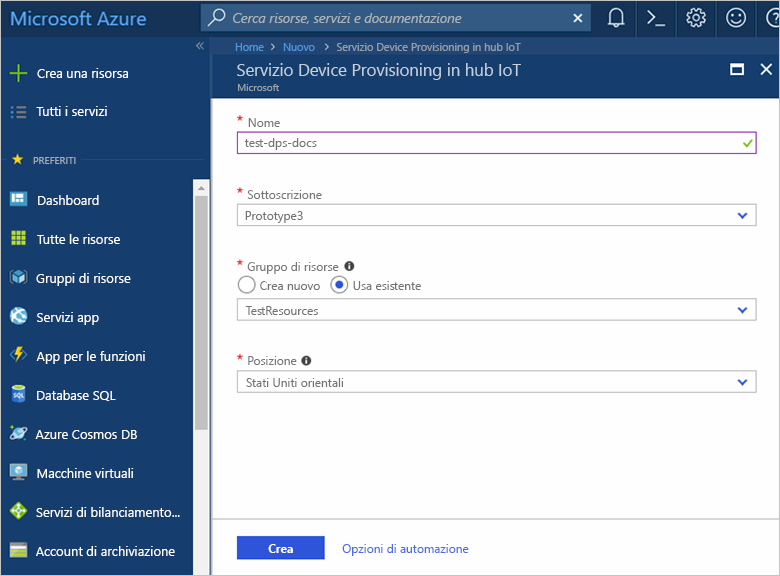
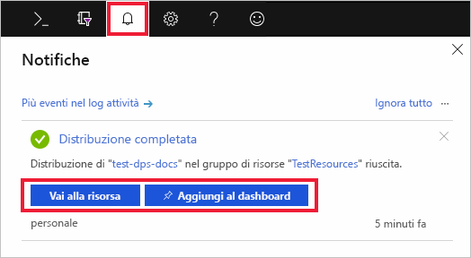
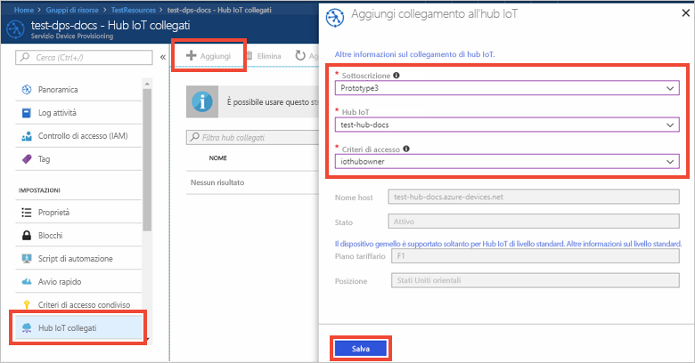

# Configurare il servizio Device Provisioning in hub IoT con il portale di Azure

Questa procedura illustra come configurare le risorse cloud di Azure nel portale per il provisioning dei dispositivi. Questo articolo include i passaggi per la creazione dell'hub IoT e di una nuova istanza del servizio Device Provisioning in hub IoT, oltre al collegamento dei due servizi. 

Se non si ha una sottoscrizione di Azure, creare un [account gratuito](https://azure.microsoft.com/free/?WT.mc_id=A261C142F) prima di iniziare.

## Creare un hub IoT

[!INCLUDE [iot-hub-include-create-hub](../../includes/iot-hub-include-create-hub.md)]

## Creare una nuova istanza del servizio Device Provisioning in hub IoT

1. Fare clic sul pulsante **Crea una risorsa** visualizzato nell'angolo in alto a sinistra nel portale di Azure.

2. *Nel Marketplace* cercare il **servizio Device Provisioning**. Selezionare il servizio **Device Provisioning in hub IoT** e fare clic sul pulsante **Crea**. 

3. Specificare le informazioni seguenti per la nuova istanza del servizio Device Provisioning e quindi fare clic su **Crea**.

    * **Nome:** specificare un nome univoco per la nuova istanza del servizio Device Provisioning. Se il nome immesso è disponibile, viene visualizzato un segno di spunta verde.
    * **Sottoscrizione**: scegliere la sottoscrizione da usare per creare l'istanza del servizio Device Provisioning.
    * **Gruppo di risorse:** questo campo consente di creare un nuovo gruppo di risorse o sceglierne uno esistente per contenere la nuova istanza. Scegliere lo stesso gruppo di risorse che contiene l'hub Iot creato in precedenza, ad esempio, **TestResources**. Inserendo tutte le risorse correlate in un gruppo è possibile gestirle insieme. Ad esempio, con l'eliminazione del gruppo di risorse vengono eliminate tutte le risorse contenute in quel gruppo. Per altre informazioni, vedere [Usare i gruppi di risorse per gestire le risorse di Azure](../azure-resource-manager/resource-group-portal.md).
    * **Località:** selezionare la località più vicina ai dispositivi.

      

4. Fare clic sul pulsante di notifica per monitorare la creazione dell'istanza della risorsa. Dopo la distribuzione del servizio, fare clic su **Aggiungi al dashboard**e quindi su **Vai alla risorsa**.

    

## Collegare l'hub IoT e il servizio Device Provisioning

In questa sezione verrà aggiunta una configurazione all'istanza del servizio Device Provisioning. Questa configurazione imposta l'hub IoT per i dispositivi che verranno sottoposti a provisioning.

1. Fare clic sul pulsante **Tutte le risorse** nel menu a sinistra del portale di Azure. Selezionare l'istanza del servizio Device Provisioning creata nella sezione precedente.  

2. Nel pannello di riepilogo del servizio Device Provisioning selezionare **Linked IoT hubs** (Hub IoT collegati). Fare clic sul pulsante **+ Aggiungi** in alto. 

3. Nella pagina **Aggiungi collegamento all'hub IoT** fornire le informazioni seguenti per collegare la nuova istanza del servizio Device Provisioning a un hub IoT. Fare quindi clic su **Salva**. 

    * **Sottoscrizione:**  selezionare la sottoscrizione contenente l'hub IoT che si vuole collegare alla nuova istanza del servizio Device Provisioning.
    * **Hub IoT:** selezionare l'hub IoT da collegare alla nuova istanza del servizio Device Provisioning.
    * **Criteri di accesso:** selezionare **iothubowner** come credenziali per stabilire il collegamento con l'hub IoT.  

      

3. L'hub selezionato verrà ora visualizzato nel pannello **Linked IoT hubs** (Hub IoT collegati). Potrebbe essere necessario fare clic su **Aggiorna** per visualizzare **Hub IoT collegati**.

## Pulire le risorse

Altre guide introduttive della raccolta si basano su questa. Se si prevede di continuare a usare le guide introduttive o le esercitazioni successive, non eliminare le risorse create in questa guida introduttiva. Se non si prevede di continuare, seguire questa procedura per eliminare tutte le risorse create da questa guida introduttiva nel portale di Azure.

1. Nel portale di Azure fare clic su **Tutte le risorse** nel menu a sinistra e quindi selezionare il servizio Device Provisioning. Nella parte superiore del pannello **Tutte le risorse** fare clic su **Elimina**.  
2. Nel portale di Azure fare clic su **Tutte le risorse** nel menu a sinistra e quindi selezionare l'hub IoT. Nella parte superiore del pannello **Tutte le risorse** fare clic su **Elimina**.  

## Passaggi successivi

In questa guida introduttiva sono stati distribuiti un hub IoT e un'istanza del servizio Device Provisioning e le due risorse sono state collegate. Per informazioni su come usare questa configurazione per eseguire il provisioning di un dispositivo simulato, proseguire con la guida introduttiva per la creazione di un dispositivo simulato.

> [!div class="nextstepaction"]
> [Guida introduttiva per la creazione di un dispositivo simulato](./quick-create-simulated-device.md)
