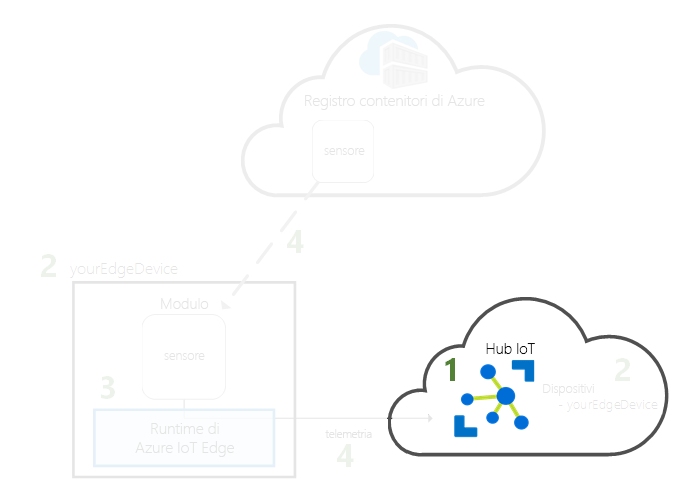
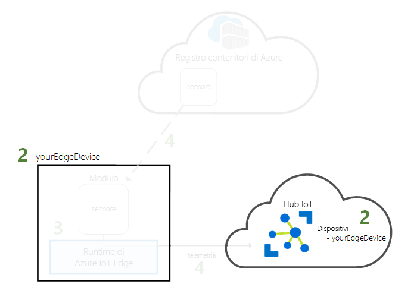
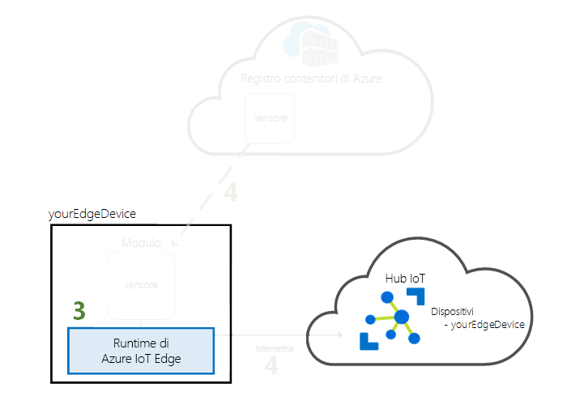
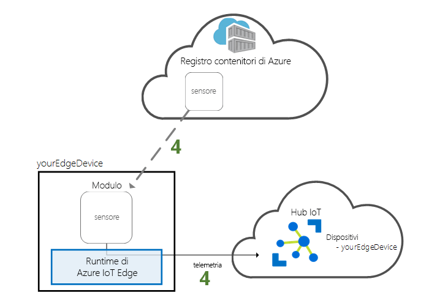

# <a name="quickstart-deploy-your-first-iot-edge-module-to-a-linux-x64-device"></a>Guida introduttiva: Distribuire il primo modulo IoT Edge in un dispositivo Linux x64

Azure IoT Edge sposta la potenza del cloud sui dispositivi di Internet delle cose. In questa guida introduttiva si apprende come usare l'interfaccia cloud per distribuire in modalità remota codice predefinito in un dispositivo IoT Edge.

In questa guida introduttiva si apprende come:

1. Creare un hub IoT.
2. Registrare un dispositivo IoT Edge nell'hub IoT.
3. Installare e avviare il runtime IoT Edge nel dispositivo.
4. Distribuire in remoto un modulo in un dispositivo IoT Edge.


Questa guida introduttiva trasforma il computer o la macchina virtuale Linux in un dispositivo IoT Edge. È quindi possibile distribuire un modulo dal portale di Azure nel dispositivo. Il modulo distribuito in questa guida introduttiva è un sensore simulato che genera dati di temperatura, umidità e pressione. Le altre esercitazioni su Azure IoT Edge si basano sulle operazioni eseguite qui tramite la distribuzione di moduli che analizzano dati simulati per ottenere informazioni aziendali accurate.

Se non si ha una sottoscrizione di Azure attiva, creare un [account gratuito](https://azure.microsoft.com/free) prima di iniziare.

[!INCLUDE [cloud-shell-try-it.md](../../includes/cloud-shell-try-it.md)]

Usare l'interfaccia della riga di comando di Azure per completare molti dei passaggi di questa guida introduttiva. Azure IoT include un'estensione per abilitare funzionalità aggiuntive. 

Aggiungere l'estensione Azure IoT all'istanza di Cloud Shell.

   ```azurecli-interactive
   az extension add --name azure-cli-iot-ext
   ```

## <a name="prerequisites"></a>Prerequisiti

Risorse cloud: 

* Un gruppo di risorse per la gestione di tutte le risorse usate in questa guida introduttiva. 

   ```azurecli-interactive
   az group create --name IoTEdgeResources --location westus2
   ```

Dispositivo IoT Edge:

* Un dispositivo o macchina virtuale Linux da usare come dispositivo IoT Edge. Se si vuole creare una macchina virtuale in Azure, usare il comando seguente per iniziare rapidamente:

   ```azurecli-interactive
   az vm create --resource-group IoTEdgeResources --name EdgeVM --image Canonical:UbuntuServer:16.04-LTS:latest --admin-username azureuser --generate-ssh-keys --size Standard_DS1_v2
   ```

   Potrebbero occorrere alcuni minuti per creare e avviare la nuova macchina virtuale. 

   Quando si crea una nuova macchina virtuale, prendere nota del valore di **publicIpAddress**, che viene fornito come parte dell'output del comando di creazione. Questo indirizzo IP pubblico verrà usato per connettersi alla macchina virtuale più avanti in questa guida introduttiva.

## <a name="create-an-iot-hub"></a>Creare un hub IoT

Iniziare creando un hub IoT con l'interfaccia della riga di comando di Azure.



Per questa guida introduttiva è possibile usare il livello gratuito dell'hub IoT. Se l'hub IoT è già stato usato in passato ed già stato creato un hub gratuito, è possibile usarlo qui. Ogni sottoscrizione può avere un solo hub IoT gratuito. 

Il codice seguente crea un hub **F1** gratuito nel gruppo di risorse **IoTEdgeResources**. Sostituire *{hub_name}* con un nome univoco per l'hub IoT.

   ```azurecli-interactive
   az iot hub create --resource-group IoTEdgeResources --name {hub_name} --sku F1 
   ```

   Se si verifica un errore perché è già presente un hub gratuito nella sottoscrizione, modificare lo SKU in **S1**. Se si verifica un errore che indica che il nome dell'hub IoT non è disponibile, significa che qualcuno ha già un hub con lo stesso nome. Provare con un nuovo nome. 

## <a name="register-an-iot-edge-device"></a>Registrare un dispositivo IoT Edge

Registrare un dispositivo IoT Edge con l'hub IoT appena creato.


Creare un'identità del dispositivo per il dispositivo simulato in modo che possa comunicare con l'hub IoT. L'identità del dispositivo si trova nel cloud e si usa una stringa di connessione del dispositivo univoca per associare un dispositivo fisico a un'identità del dispositivo. 

Poiché i dispositivi IoT Edge si comportano e possono essere gestiti in modo diverso rispetto ai dispositivi IoT tipici, indicare con un flag `--edge-enabled` che l'identità si riferisce a un dispositivo IoT Edge. 

1. In Azure Cloud Shell immettere il comando seguente per creare un dispositivo denominato **myEdgeDevice** nell'hub.

   ```azurecli-interactive
   az iot hub device-identity create --hub-name {hub_name} --device-id myEdgeDevice --edge-enabled
   ```

   Se viene visualizzato un errore relativo alle chiavi dei criteri iothubowner, assicurarsi che Cloud Shell esegua la versione più recente dell'estensione azure-cli-iot-ext. 

2. Recuperare la stringa di connessione per il dispositivo, che collega il dispositivo fisico alla sua identità nell'hub IoT. 

   ```azurecli-interactive
   az iot hub device-identity show-connection-string --device-id myEdgeDevice --hub-name {hub_name}
   ```

3. Copiare la stringa di connessione dall'output JSON e salvarla. Usare questo valore per configurare il runtime IoT Edge nella sezione successiva.

   

## <a name="install-and-start-the-iot-edge-runtime"></a>Installare e avviare il runtime di IoT Edge

Installare e avviare il runtime Azure IoT Edge nel dispositivo IoT Edge. 


Il runtime di IoT Edge viene distribuito in tutti i dispositivi IoT Edge. È costituito da tre componenti. Il **daemon di sicurezza IoT Edge** si avvia a ogni avvio di un dispositivo Edge ed esegue l' avvio del dispositivo avviando l'agente IoT Edge. L'**agente IoT Edge** semplifica la distribuzione e il monitoraggio di moduli nel dispositivo IoT Edge, tra cui l'hub di IoT Edge. L'**hub IoT Edge** gestisce le comunicazioni tra moduli nel dispositivo IoT Edge e tra il dispositivo e l'hub IoT. 

Durante la configurazione del runtime, si immette una stringa di connessione del dispositivo. Usare la stringa recuperata tramite l'interfaccia della riga di comando di Azure. La stringa associa il dispositivo fisico all'identità del dispositivo IoT Edge in Azure. 

### <a name="connect-to-your-iot-edge-device"></a>Stabilire la connessione al dispositivo IoT Edge

I passaggi descritti in questa sezione vengono eseguiti nel dispositivo IoT Edge. Se si usa il proprio computer come dispositivo IoT Edge, è possibile passare alla sezione successiva. Se si usa una macchina virtuale o hardware secondario, stabilire ora la connessione. 

Se per questa guida è stata creata una macchina virtuale di Azure, recuperare l'indirizzo IP pubblico indicato nell'output del comando di creazione. È anche possibile trovare l'indirizzo IP pubblico nella pagina di panoramica della macchina virtuale nel portale di Azure. Usare il comando seguente per connettersi alla macchina virtuale. Sostituire **{publicIpAddress}** con l'indirizzo del computer. 

```azurecli-interactive
ssh azureuser@{publicIpAddress}
```

### <a name="register-your-device-to-use-the-software-repository"></a>Registrare il dispositivo per usare il repository software

I pacchetti necessari per eseguire il runtime IoT Edge vengono gestiti in un repository software. Configurare il dispositivo IoT Edge per accedere a questo repository. 

I passaggi descritti in questa sezione sono destinati ai dispositivi x64 che eseguono **Ubuntu 16.04**. Per accedere al repository software in altre versioni di Linux o da dispositivi con altre architetture, vedere [Installare il runtime di Azure IoT Edge in Linux (x64)](how-to-install-iot-edge-linux.md) o [Linux (ARM32v7/armhf)](how-to-install-iot-edge-linux-arm.md).

1. Nel computer usato come dispositivo IoT Edge, installare la configurazione del repository.

   ```bash
   curl https://packages.microsoft.com/config/ubuntu/16.04/prod.list > ./microsoft-prod.list
   sudo cp ./microsoft-prod.list /etc/apt/sources.list.d/
   ```

2. Installare una chiave pubblica per accedere al repository.

   ```bash
   curl https://packages.microsoft.com/keys/microsoft.asc | gpg --dearmor > microsoft.gpg
   sudo cp ./microsoft.gpg /etc/apt/trusted.gpg.d/
   ```

### <a name="install-a-container-runtime"></a>Installare un runtime del contenitore

Il runtime IoT Edge è un set di contenitori e la logica distribuita nel dispositivo IoT Edge viene inclusa in pacchetti come contenitori. Preparare il dispositivo per questi componenti installando un runtime del contenitore.

1. Aggiornare **apt get**.

   ```bash
   sudo apt-get update
   ```

2. Installare **Moby**, un runtime del contenitore.

   ```bash
   sudo apt-get install moby-engine
   ```

3. Installare i comandi dell'interfaccia della riga di comando per Moby. 

   ```bash
   sudo apt-get install moby-cli
   ```

### <a name="install-and-configure-the-iot-edge-security-daemon"></a>Installare e configurare il daemon di sicurezza IoT Edge

Il daemon di sicurezza viene installato come servizio di sistema in modo che il runtime IoT Edge venga avviato a ogni avvio del dispositivo. L'installazione include anche una versione di **hsmlib**, che permette al daemon di sicurezza di interagire con la sicurezza hardware del dispositivo. 

1. Scaricare e installare il daemon di sicurezza IoT Edge. 

   ```bash
   sudo apt-get update
   sudo apt-get install iotedge
   ```

2. Aprire il file di configurazione di IoT Edge. Poiché è un file protetto, potrebbe essere necessario usare privilegi elevati per accedervi.
   
   ```bash
   sudo nano /etc/iotedge/config.yaml
   ```

3. Aggiungere la stringa di connessione del dispositivo IoT Edge. Trovare la variabile **device_connection_string** e aggiornarne il valore con la stringa copiata dopo la registrazione del dispositivo. La stringa di connessione associa il dispositivo fisico all'identità del dispositivo creata in Azure.

4. Salvare e chiudere il file. 

   `CTRL + X`, `Y`, `Enter`

5. Riavviare il daemon di sicurezza di IoT Edge per applicare le modifiche.

   ```bash
   sudo systemctl restart iotedge
   ```

### <a name="view-the-iot-edge-runtime-status"></a>Visualizzare lo stato del runtime IoT Edge

Verificare che il runtime sia stato installato e configurato correttamente.

>[!TIP]
>Per eseguire comandi `iotedge` sono necessari privilegi elevati. Quando ci si disconnette dal computer e si accede di nuovo per la prima volta dopo l'installazione del runtime IoT Edge, le autorizzazioni vengono aggiornate automaticamente. Fino ad allora, usare **sudo** davanti ai comandi. 

1. Verificare che il daemon di sicurezza IoT Edge sia in esecuzione come servizio di sistema.

   ```bash
   sudo systemctl status iotedge
   ```

   

2. Se è necessario risolvere problemi del servizio, recuperare i log di servizio. 

   ```bash
   journalctl -u iotedge
   ```

3. Visualizzare i moduli in esecuzione nel dispositivo. 

   ```bash
   sudo iotedge list
   ```

   

Il dispositivo IoT Edge è ora configurato. È pronto per eseguire i moduli distribuiti nel cloud. 

## <a name="deploy-a-module"></a>Distribuire un modulo

Gestire il dispositivo Azure IoT Edge dal cloud per distribuire un modulo che invierà dati di telemetria all'hub IoT.


[!INCLUDE [iot-edge-deploy-module](../../includes/iot-edge-deploy-module.md)]

## <a name="view-generated-data"></a>Visualizzare i dati generati

In questa guida introduttiva è stato creato un nuovo dispositivo IoT Edge, nel quale è stato installato il runtime di IoT Edge. È stato quindi usato il portale di Azure per eseguire il push di un modulo di IoT Edge da eseguire nel dispositivo senza dovere apportare modifiche al dispositivo stesso. In questo caso il modulo di cui è stato eseguito il push crea dati ambientali che è possibile usare per le esercitazioni.

Aprire di nuovo il prompt dei comandi nel dispositivo IoT Edge. Verificare che il modulo distribuito dal cloud sia in esecuzione nel dispositivo IoT Edge:

   ```bash
   sudo iotedge list
   ```

   

Visualizzare i messaggi inviati dal modulo di sensore di temperatura:

   ```bash
   sudo iotedge logs SimulatedTemperatureSensor -f
   ```

   >[!TIP]
   >Quando si fa riferimento ai nomi di modulo, i comandi del dispositivo IoT Edge distinguono tra maiuscole e minuscole.

   

Il modulo di sensore di temperatura può essere in attesa di connettersi all'hub di IoT Edge se l'ultima riga visualizzata nel log è **Using transport Mqtt_Tcp_Only**. Provare ad arrestare il modulo e permettere all'agente IoT Edge di riavviarlo. È possibile arrestare il modulo con il comando `sudo docker stop SimulatedTemperatureSensor`.

È anche possibile visualizzare i messaggi ricevuti dall'hub IoT usando l'[estensione Azure IoT Hub Toolkit per Visual Studio Code](https://marketplace.visualstudio.com/items?itemName=vsciot-vscode.azure-iot-toolkit) (in precedenza Azure IoT Toolkit). 

## <a name="clean-up-resources"></a>Pulire le risorse

Se si vuole continuare con le esercitazioni su IoT Edge, è possibile usare il dispositivo registrato e configurato in questa guida introduttiva. In caso contrario, è possibile eliminare le risorse di Azure create e rimuovere il runtime IoT Edge dal dispositivo.

### <a name="delete-azure-resources"></a>Eliminare le risorse di Azure

Se la macchina virtuale e l'hub IoT sono stati creati in un nuovo gruppo di risorse, è possibile eliminare il gruppo e tutte le risorse associate. Verificare il contenuto del gruppo di risorse per assicurarsi che non vi siano dati da conservare. Se non si vuole eliminare l'intero gruppo, è possibile eliminare le singole risorse.

Rimuovere il gruppo **IoTEdgeResources**.

   ```azurecli-interactive
   az group delete --name IoTEdgeResources 
   ```

### <a name="remove-the-iot-edge-runtime"></a>Rimuovere il runtime IoT Edge

Se si vuole rimuovere le installazioni dal dispositivo, usare i comandi seguenti.  

Rimuovere il runtime IoT Edge.

   ```bash
   sudo apt-get remove --purge iotedge
   ```

Quando il runtime IoT Edge viene rimosso, i contenitori creati vengono arrestati, ma rimangono sul dispositivo. Visualizzare tutti i contenitori.

   ```bash
   sudo docker ps -a
   ```

Eliminare i contenitori creati nel dispositivo dal runtime IoT Edge. 

   ```bash
   sudo docker rm -f SimulatedTemperatureSensor
   sudo docker rm -f edgeHub
   sudo docker rm -f edgeAgent
   ```

Rimuovere il runtime del contenitore.

   ```bash
   sudo apt-get remove --purge moby-cli
   sudo apt-get remove --purge moby-engine
   ```

## <a name="next-steps"></a>Passaggi successivi

Questa esercitazione costituisce un prerequisito per tutte le esercitazioni su IoT Edge. È possibile continuare con una delle altre esercitazioni per ottenere informazioni sui modi in cui Azure IoT Edge può contribuire alla trasformazione dei dati in informazioni aziendali dettagliate nei dispositivi perimetrali.

> [!div class="nextstepaction"]
> [Filtrare dati dei sensori tramite una funzione di Azure](tutorial-deploy-function.md)
