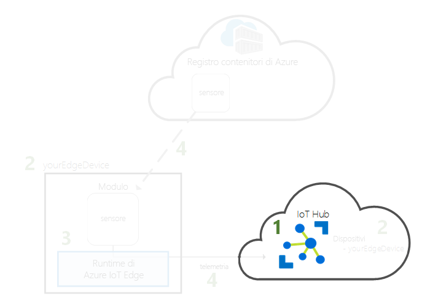
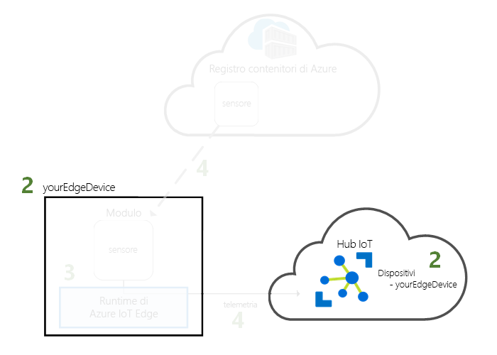
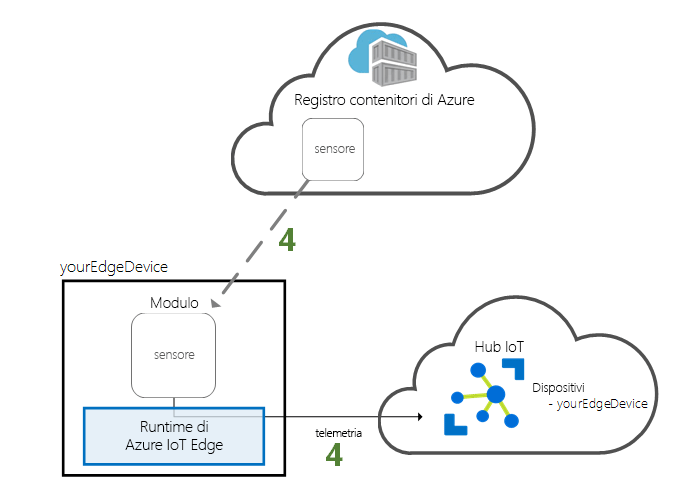

# <a name="quickstart-deploy-your-first-iot-edge-module-from-the-azure-portal-to-a-windows-device---preview"></a>Guida introduttiva: Distribuire il primo modulo di IoT Edge dal portale di Azure in un dispositivo Windows - Anteprima

In questa guida introduttiva viene usata l'interfaccia cloud di Azure IoT Edge per distribuire in modalità remota codice predefinito in un dispositivo IoT Edge. Per eseguire questa attività, prima di tutto creare e configurare una macchina virtuale Windows da usare come dispositivo IoT Edge, quindi è possibile distribuirvi un modulo.

In questa guida introduttiva si apprende come:

1. Creare un hub IoT.
2. Registrare un dispositivo IoT Edge nell'hub IoT.
3. Installare e avviare il runtime IoT Edge nel dispositivo.
4. Distribuire in remoto un modulo in un dispositivo IoT Edge e inviare dati di telemetria all'hub IoT.


Il modulo distribuito in questa guida introduttiva è un sensore simulato che genera dati di temperatura, umidità e pressione. Le altre esercitazioni su Azure IoT Edge si basano sulle operazioni eseguite qui tramite la distribuzione di moduli che analizzano dati simulati per ottenere informazioni aziendali accurate.

> [!NOTE]
> Il runtime IoT Edge in Windows è disponibile in [anteprima pubblica](https://azure.microsoft.com/support/legal/preview-supplemental-terms/).

Se non si ha una sottoscrizione di Azure attiva, creare un [account gratuito](https://azure.microsoft.com/free) prima di iniziare.

[!INCLUDE [cloud-shell-try-it.md](../../includes/cloud-shell-try-it.md)]

Usare l'interfaccia della riga di comando di Azure per completare molti dei passaggi di questa guida introduttiva. Azure IoT include un'estensione per abilitare funzionalità aggiuntive.

Aggiungere l'estensione Azure IoT all'istanza di Cloud Shell.

   ```azurecli-interactive
   az extension add --name azure-cli-iot-ext
   ```

## <a name="prerequisites"></a>Prerequisiti

Risorse cloud:

* Un gruppo di risorse per la gestione di tutte le risorse usate in questa guida introduttiva.

   ```azurecli-interactive
   az group create --name IoTEdgeResources --location westus2
   ```

Dispositivo IoT Edge:

* Una macchina virtuale Windows da usare come dispositivo IoT Edge. È possibile creare questa macchina virtuale usando il comando seguente, sostituendo *{password}* con una password sicura:

  ```azurecli-interactive
  az vm create --resource-group IoTEdgeResources --name EdgeVM --image MicrosoftWindowsDesktop:Windows-10:rs5-pro:latest --admin-username azureuser --admin-password {password} --size Standard_DS1_v2
  ```

  La creazione e l'avvio della nuova macchina virtuale potrebbero richiedere alcuni minuti. È quindi possibile scaricare un file RDP da usare per la connessione alla macchina virtuale:

  1. Passare alla nuova macchina virtuale Windows nel portale di Azure.
  1. Selezionare **Connessione**.
  1. Nella scheda **RDP** selezionare **Scarica file RDP**.

  Aprire questo file con Connessione Desktop remoto per connettersi alla macchina di virtuale Windows usando il nome e la password dell'amministratore specificati con il comando `az vm create`.

## <a name="create-an-iot-hub"></a>Creare un hub IoT

Per iniziare, creare un hub IoT con l'interfaccia della riga di comando di Azure.



Per questa guida introduttiva è possibile usare il livello gratuito dell'hub IoT. Se l'hub IoT è già stato usato in passato ed già stato creato un hub gratuito, è possibile usarlo qui. Ogni sottoscrizione può avere un solo hub IoT gratuito.

Il codice seguente crea un hub **F1** gratuito nel gruppo di risorse **IoTEdgeResources**. Sostituire *{hub_name}* con un nome univoco per l'hub IoT.

   ```azurecli-interactive
   az iot hub create --resource-group IoTEdgeResources --name {hub_name} --sku F1
   ```

   Se si verifica un errore perché è già presente un hub gratuito nella sottoscrizione, modificare lo SKU in **S1**. Se si verifica un errore che indica che il nome dell'hub IoT non è disponibile, significa che qualcuno ha già un hub con lo stesso nome. Provare con un nuovo nome.

## <a name="register-an-iot-edge-device"></a>Registrare un dispositivo IoT Edge

Registrare un dispositivo IoT Edge con l'hub IoT appena creato.


Creare un'identità del dispositivo per il dispositivo simulato in modo che possa comunicare con l'hub IoT. L'identità del dispositivo si trova nel cloud e si usa una stringa di connessione del dispositivo univoca per associare un dispositivo fisico a un'identità del dispositivo.

Poiché i dispositivi IoT Edge si comportano e possono essere gestiti in modo diverso rispetto ai dispositivi IoT tipici, indicare con un flag `--edge-enabled` che l'identità si riferisce a un dispositivo IoT Edge.

1. In Azure Cloud Shell immettere il comando seguente per creare un dispositivo denominato **myEdgeDevice** nell'hub.

   ```azurecli-interactive
   az iot hub device-identity create --device-id myEdgeDevice --hub-name {hub_name} --edge-enabled
   ```

   Se viene visualizzato un errore relativo alle chiavi dei criteri iothubowner, assicurarsi che Cloud Shell esegua la versione più recente dell'estensione azure-cli-iot-ext.

2. Recuperare la stringa di connessione per il dispositivo, che collega il dispositivo fisico alla sua identità nell'hub IoT.

   ```azurecli-interactive
   az iot hub device-identity show-connection-string --device-id myEdgeDevice --hub-name {hub_name}
   ```

3. Copiare il valore della chiave `connectionString` dall'output JSON e salvarlo. Questo valore corrisponde alla stringa di connessione che verrà usata per configurare il runtime IoT Edge nella sezione successiva.

   

## <a name="install-and-start-the-iot-edge-runtime"></a>Installare e avviare il runtime di IoT Edge

Installare il runtime Azure IoT Edge nel dispositivo IoT Edge e configurarlo con una stringa di connessione del dispositivo.


Il runtime di IoT Edge viene distribuito in tutti i dispositivi IoT Edge. È costituito da tre componenti. Il **daemon di sicurezza IoT Edge** si avvia a ogni avvio di un dispositivo IoT Edge ed esegue il bootstrap del dispositivo avviando l'agente IoT Edge. L'**agente IoT Edge** gestisce la distribuzione e il monitoraggio di moduli nel dispositivo IoT Edge, tra cui l'hub di IoT Edge. L'**hub di IoT Edge** gestisce le comunicazioni tra moduli nel dispositivo IoT Edge e tra il dispositivo e l'hub IoT.

Lo script di installazione include anche un motore di contenitore denominato Moby, che gestisce le immagini del contenitore nel dispositivo IoT Edge.

Durante l'installazione del runtime, viene chiesto di immettere una stringa di connessione del dispositivo. Usare la stringa recuperata tramite l'interfaccia della riga di comando di Azure. La stringa associa il dispositivo fisico all'identità del dispositivo IoT Edge in Azure.

### <a name="connect-to-your-iot-edge-device"></a>Stabilire la connessione al dispositivo IoT Edge

I passaggi di questa sezione vengono eseguiti tutti nel dispositivo IoT Edge, quindi è utili connettersi alla macchina virtuale ora tramite Desktop remoto.

### <a name="prepare-your-device-for-containers"></a>Preparare il dispositivo per i contenitori

Lo script di installazione installa automaticamente il motore Moby nel dispositivo prima di installare IoT Edge. Preparare il dispositivo attivando la funzionalità Contenitori.

1. Nella barra di avvio cercare **Attivazione e disattivazione delle funzionalità Windows** e aprire il programma Pannello di controllo.
1. Trovare e selezionare **Contenitori**.
1. Selezionare **OK**.

Al termine della procedura, è necessario riavviare Windows per rendere effettive le modifiche apportate, ma è possibile farlo dalla sessione di Desktop remoto anziché riavviare la macchina virtuale dal portale di Azure.

### <a name="download-and-install-the-iot-edge-service"></a>Scaricare e installare il servizio IoT Edge

Usare PowerShell per scaricare e installare il runtime IoT Edge. Usare la stringa di connessione del dispositivo recuperata dall'hub IoT per configurare il dispositivo.

1. Nel dispositivo IoT Edge eseguire PowerShell come amministratore.

2. Scaricare e installare il servizio IoT Edge nel dispositivo.

   ```powershell
   . {Invoke-WebRequest -useb aka.ms/iotedge-win} | Invoke-Expression; `
   Install-SecurityDaemon -Manual -ContainerOs Windows
   ```

3. Quando viene chiesto un elemento **DeviceConnectionString**, fornire la stringa copiata nella sezione precedente. Non racchiudere tra virgolette la stringa di connessione.

### <a name="view-the-iot-edge-runtime-status"></a>Visualizzare lo stato del runtime IoT Edge

Verificare che il runtime sia stato installato e configurato correttamente.

1. Verificare lo stato del servizio IoT Edge.

   ```powershell
   Get-Service iotedge
   ```

2. Se è necessario risolvere problemi del servizio, recuperare i log di servizio.

   ```powershell
   # Displays logs from today, newest at the bottom.

   Get-WinEvent -ea SilentlyContinue `
    -FilterHashtable @{ProviderName= "iotedged";
      LogName = "application"; StartTime = [datetime]::Today} |
    select TimeCreated, Message |
    sort-object @{Expression="TimeCreated";Descending=$false} |
    format-table -autosize -wrap
   ```

3. Visualizzare tutti i moduli in esecuzione nel dispositivo IoT Edge. Poiché il servizio è stato avviato per la prima volta, verrà visualizzato solo il modulo **edgeAgent** in esecuzione. Il modulo edgeAgent viene eseguito per impostazione predefinita e permette di installare e avviare tutti i moduli aggiuntivi distribuiti nel dispositivo.

   ```powershell
   iotedge list
   ```

   

Il completamento dell'installazione e l'avvio del modulo dell'agente IoT Edge potrebbero richiedere alcuni minuti.

Il dispositivo IoT Edge è ora configurato. È pronto per eseguire i moduli distribuiti nel cloud.

## <a name="deploy-a-module"></a>Distribuire un modulo

Gestire il dispositivo Azure IoT Edge dal cloud per distribuire un modulo che invia dati di telemetria all'hub IoT.


[!INCLUDE [iot-edge-deploy-module](../../includes/iot-edge-deploy-module.md)]

## <a name="view-generated-data"></a>Visualizzare i dati generati

In questa guida introduttiva è stato registrato un dispositivo IoT Edge, nel quale è stato installato il runtime IoT Edge. È stato quindi usato il portale di Azure per distribuire un modulo di IoT Edge da eseguire nel dispositivo senza dovere apportare modifiche al dispositivo stesso.

In questo caso il modulo di cui è stato eseguito il push crea dati di esempio che possono essere usati per i test. Il modulo relativo al sensore di temperatura simulato genera dati dell'ambiente che possono essere usati successivamente per i test. Il sensore simulato monitora un macchinario e l'ambiente intorno al macchinario. Questo sensore può trovarsi ad esempio in una stanza di server, in un ambiente di produzione o in una turbina eolica. Il messaggio include la temperatura e l'umidità dell'ambiente, la temperatura e la pressione dell'apparecchiatura e un timestamp. Le esercitazioni di IoT Edge usano i dati creati da questo modulo come dati di test per le analisi.

Verificare che il modulo distribuito dal cloud sia in esecuzione nel dispositivo IoT Edge.

```powershell
iotedge list
```

   

Visualizzare i messaggi inviati dal modulo di sensore di temperatura al cloud.

```powershell
iotedge logs SimulatedTemperatureSensor -f
```

   >[!TIP]
   >Quando si fa riferimento ai nomi di modulo, i comandi del dispositivo IoT Edge distinguono tra maiuscole e minuscole.

   

È anche possibile visualizzare i messaggi ricevuti dall'hub IoT usando l'[estensione Azure IoT Hub Toolkit per Visual Studio Code](https://marketplace.visualstudio.com/items?itemName=vsciot-vscode.azure-iot-toolkit).(precedentemente Azure IoT Toolkit).

## <a name="clean-up-resources"></a>Pulire le risorse

Se si vuole continuare con le esercitazioni su IoT Edge, è possibile usare il dispositivo registrato e configurato in questa guida introduttiva. In caso contrario, è possibile eliminare le risorse di Azure create e rimuovere il runtime IoT Edge dal dispositivo.

### <a name="delete-azure-resources"></a>Eliminare le risorse di Azure

Se la macchina virtuale e l'hub IoT sono stati creati in un nuovo gruppo di risorse, è possibile eliminare il gruppo e tutte le risorse associate. Verificare il contenuto del gruppo di risorse per assicurarsi che non vi siano dati da conservare. Se non si vuole eliminare l'intero gruppo, è possibile eliminare le singole risorse.

Rimuovere il gruppo **IoTEdgeResources**.

   ```azurecli-interactive
   az group delete --name IoTEdgeResources
   ```

### <a name="remove-the-iot-edge-runtime"></a>Rimuovere il runtime IoT Edge

Se si vuole rimuovere le installazioni dal dispositivo, usare i comandi seguenti.  

Rimuovere il runtime IoT Edge. Se si prevede di reinstallare IoT Edge, omettere i parametri `-DeleteConfig` e `-DeleteMobyDataRoot` in modo che sia possibile ripetere l'installazione con la stessa configurazione appena impostata.

   ```powershell
   . {Invoke-WebRequest -useb aka.ms/iotedge-win} | Invoke-Expression; `
   Uninstall-SecurityDaemon -DeleteConfig -DeleteMobyDataRoot
   ```

## <a name="next-steps"></a>Passaggi successivi

In questa guida introduttiva è stato creato un dispositivo IoT Edge ed è stata usata l'interfaccia cloud di Azure IoT Edge per distribuire il codice nel dispositivo. A questo punto, è disponibile un dispositivo di test che genera dati non elaborati relativi al proprio ambiente.

È ora possibile continuare con una delle altre esercitazioni per scoprire in che modo trasformare questi dati in informazioni aziendali accurate tramite Azure IoT Edge.

> [!div class="nextstepaction"]
> [Filtrare dati dei sensori tramite una funzione di Azure](tutorial-deploy-function.md)
