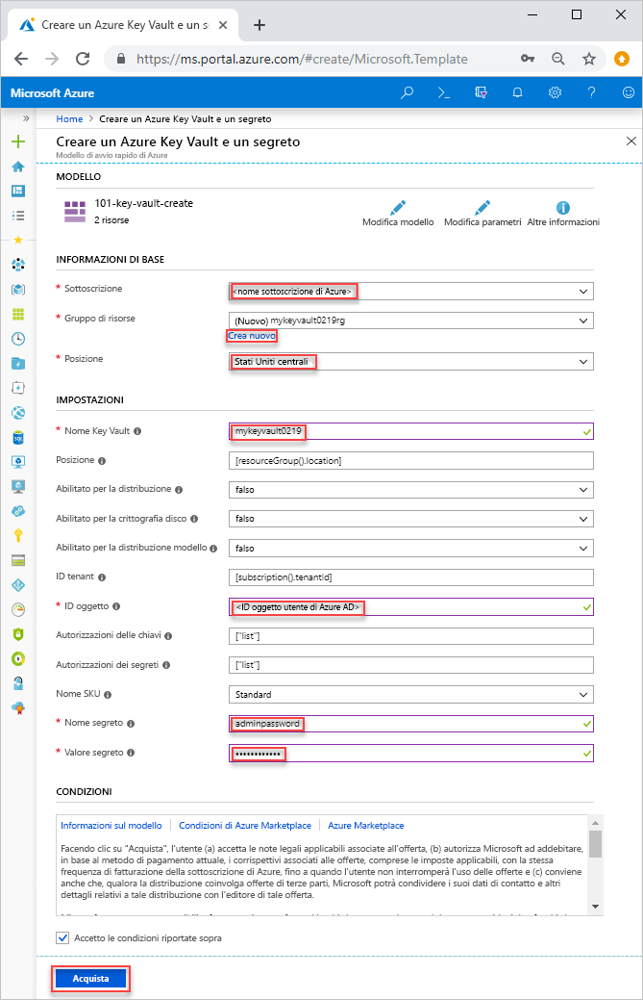

# <a name="quickstart-set-and-retrieve-a-secret-from-azure-key-vault-using-resource-manager-template"></a>Guida introduttiva: Impostare e recuperare un segreto da Azure Key Vault tramite un modello di Resource Manager

[Azure Key Vault](./key-vault-overview.md) è un servizio cloud che offre un archivio sicuro per i segreti, ad esempio le chiavi, le password, i certificati e così via. Questo argomento di avvio rapido illustra il processo di distribuzione di un modello di Resource Manager per creare un insieme di credenziali delle chiavi e un segreto. Per altre informazioni sullo sviluppo di modelli di Resource Manager, vedere la [documentazione di Resource Manager](/azure/azure-resource-manager/) e le [informazioni di riferimento sui modelli](/azure/templates/microsoft.keyvault/allversions).

Se non si ha una sottoscrizione di Azure, creare un [account gratuito](https://azure.microsoft.com/free/?WT.mc_id=A261C142F) prima di iniziare.

## <a name="prerequisites"></a>Prerequisiti

Per completare l'esercitazione di questo articolo, sono necessari gli elementi seguenti:

* Per la configurazione delle autorizzazioni nel modello è necessario l'ID oggetto utente di Azure AD. La procedura seguente recupera l'ID oggetto (GUID).

    1. Eseguire il seguente comando di Azure PowerShell o dell'interfaccia della riga di comando di Azure selezionando **Prova** e quindi incollare lo script nel riquadro della shell. Per incollare lo script, fare clic con il pulsante destro del mouse nella shell e quindi scegliere **Incolla**. 

        ```azurecli-interactive
        echo "Enter your email address that is used to sign in to Azure:" &&
        read upn &&
        az ad user show --upn-or-object-id $upn --query "objectId" 
        ```

        ```azurepowershell-interactive
        $upn = Read-Host -Prompt "Enter your email address used to sign in to Azure"
        (Get-AzADUser -UserPrincipalName $upn).Id
        ```

    2. Annotare l'ID di oggetto poiché verrà richiesto nella sezione successiva di questo avvio rapido.

## <a name="create-a-vault-and-a-secret"></a>Creare un insieme di credenziali e un segreto

Il modello usato in questo avvio rapido proviene dai [modelli di avvio rapido di Azure](https://azure.microsoft.com/resources/templates/101-key-vault-create/). Altri esempi di modelli di Azure Key Vault sono disponibili [qui](https://azure.microsoft.com/resources/templates/?resourceType=Microsoft.Keyvault).

1. Selezionare l'immagine seguente per accedere ad Azure e aprire un modello. Il modello crea un insieme di credenziali delle chiavi e un segreto.

    <a href="https://portal.azure.com/#create/Microsoft.Template/uri/https%3A%2F%2Fraw.githubusercontent.com%2FAzure%2Fazure-quickstart-templates%2Fmaster%2F101-key-vault-create%2Fazuredeploy.json"></a>

2. Selezionare o immettere i valori seguenti.  

    

    A meno che non sia specificato, usare il valore predefinito per creare l'insieme di credenziali delle chiavi e un segreto.

    * **Sottoscrizione**: selezionare una sottoscrizione di Azure.
    * **Gruppo di risorse**: selezionare **Crea nuovo**, immettere un nome univoco per il gruppo di risorse e quindi fare clic su **OK**. 
    * **Località**: selezionare una località.  Ad esempio **Stati Uniti centrali**.
    * **Nome insieme di credenziali delle chiavi**: immettere un nome per l'insieme di credenziali delle chiavi che deve essere globalmente univoco all'interno dello spazio dei nomi .vault.azure.net.  
    * **ID tenant**: viene recuperato automaticamente dalla funzione del modello.  Non modificare il valore predefinito.
    * **ID oggetto utente AD**: immettere l'ID oggetto utente di Azure AD recuperato nella sezione [Prerequisiti](#prerequisites).
    * **Nome segreto**: immettere un nome per il segreto archiviato nell'insieme di credenziali delle chiavi,  ad esempio **adminpassword**.
    * **Valore del segreto**: immettere il valore del segreto.  Se si archivia una password, è consigliabile usare la password generata che è stata creata nella sezione Prerequisiti.
    * **Accetto le condizioni riportate sopra**: selezionare questa casella.
3. Selezionare **Acquisto**.

## <a name="validate-the-deployment"></a>Convalidare la distribuzione

È possibile usare il portale di Azure per controllare l'insieme di credenziali delle chiavi e il segreto oppure usare lo script dell'interfaccia della riga di comando di Azure o di Azure PowerShell seguente per elencare il segreto creato.

```azurecli-interactive
echo "Enter your key vault name:" &&
read keyVaultName &&
az keyvault secret list --vault-name $keyVaultName
```

```azurepowershell-interactive
$keyVaultName = Read-Host -Prompt "Enter your key vault name"
Get-AzKeyVaultSecret -vaultName $keyVaultName
```

## <a name="clean-up-resources"></a>Pulire le risorse

Altre guide introduttive ed esercitazioni relative a Key Vault si basano su questa guida introduttiva. Se si prevede di usare le guide introduttive e le esercitazioni successive, è consigliabile non cancellare le risorse create.
Quando non è più necessario, eliminare il gruppo di risorse per eliminare l'istanza di Key Vault e le risorse correlate. Per eliminare il gruppo di risorse mediante l'interfaccia della riga di comando di Azure oppure Azure PowerShell:

```azurecli-interactive
echo "Enter the Resource Group name:" &&
read resourceGroupName &&
az group delete --name $resourceGroupName 
```
```azurepowershell-interactive
$resourceGroupName = Read-Host -Prompt "Enter the Resource Group name"
Remove-AzResourceGroup -Name $resourceGroupName 
```

## <a name="next-steps"></a>Passaggi successivi

In questo argomento di avvio rapido sono stati creati un insieme di credenziali delle chiavi e un segreto usando un modello di Azure Resource Manager, quindi la distribuzione è stata convalidata. Per altre informazioni su Key Vault e Azure Resource Manager, continuare con gli articoli seguenti.

- Leggere una [panoramica di Azure Key Vault](key-vault-overview.md)
- Vedere altre informazioni su [Azure Resource Manager](../azure-resource-manager/resource-group-overview.md)
- Leggere altri dettagli su [chiavi, segreti e certificati](about-keys-secrets-and-certificates.md)
- Esaminare le [procedure consigliate per Azure Key Vault](key-vault-best-practices.md)