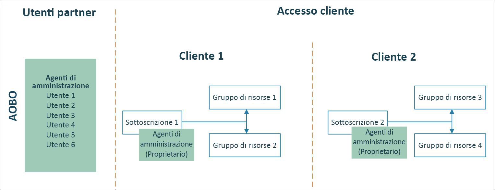

# Azure Lighthouse e programma Cloud Solution Provider

I partner [CSP (Cloud Solution Provider)](https://docs.microsoft.com/partner-center/csp-overview) possono accedere alle sottoscrizioni di Azure create per i clienti tramite il programma CSP usando la funzionalità [Amministra per conto terzi](https://channel9.msdn.com/Series/cspdev/Module-11-Admin-On-Behalf-Of-AOBO). Questo accesso consente di supportare, configurare e gestire le sottoscrizioni dei clienti direttamente.

Il meccanismo Amministra per conto terzi concede l'accesso completo agli ambienti dei clienti. L'uso della gestione delle risorse delegate di Azure insieme alla funzionalità Amministra per conto terzi consente di migliorare la sicurezza, permettendo di ridurre gli accessi non necessari abilitando autorizzazioni più granulari per gli utenti. 

## Funzionalità Amministra per conto terzi

Con la funzionalità Amministra per conto terzi, gli utenti con il ruolo [Agente amministratore](https://docs.microsoft.com/partner-center/permissions-overview#manage-commercial-transactions-in-partner-center-azure-ad-and-csp-roles) nel tenant avranno l'accesso Amministra per conto terzi alle sottoscrizioni di Azure create tramite il programma CSP. Tutti gli utenti che devono accedere alle sottoscrizioni di qualsiasi cliente devono essere membri di questo gruppo. La funzionalità Amministra per conto terzi non offre la possibilità di creare gruppi distinti per clienti diversi o di abilitare ruoli diversi per gruppi o utenti.

## Gestione risorse delegate di Azure

Usando la gestione delle risorse delegate di Azure, è possibile assegnare gruppi diversi a clienti o ruoli diversi, come illustrato nel diagramma seguente. Poiché gli utenti avranno il livello di accesso appropriato tramite la gestione delle risorse delegate di Azure, è possibile ridurre il numero di utenti che hanno il ruolo Agente amministratore e che hanno quindi l'accesso Amministra per conto terzi. Questo garantisce una maggiore sicurezza limitando l'accesso non necessario alle risorse dei clienti. Offre anche maggiori possibilità di gestire più clienti su larga scala.

Per eseguire l'onboarding di una sottoscrizione creata tramite il programma CSP, seguire la procedura descritta in [Eseguire l'onboarding di una sottoscrizione nella gestione risorse delegate di Azure](../how-to/onboard-customer.md). Tutti gli utenti che hanno il ruolo Agente amministratore nel tenant possono eseguire questa operazione di onboarding.

Si noti che per le sottoscrizioni create tramite i programmi CSP, le richieste di supporto possono essere generate solo dagli utenti con il ruolo Agente amministratore nel tenant del provider di servizi. Gli utenti aggiunti tramite la gestione risorse delegate di Azure non potranno aprire richieste di supporto per le risorse delegate in queste sottoscrizioni.

## Collegamento amministrazione partner

È possibile associare l'ID MPN (Microsoft Partner Network) alle sottoscrizioni caricate per tenere traccia dell'impatto sugli engagement dei clienti.

Se si [pubblica un'offerta di servizio gestito in Azure Marketplace](../how-to/publish-managed-services-offers.md), l'ID MPN viene associato al profilo di pubblicazione e automaticamente associato all'offerta. I ricavi generati dalle risorse di Azure tramite questa offerta verranno quindi attribuiti all'organizzazione. Nei sistemi per la creazione di report dei partner, ad esempio Centro per i partner o MPN, l'attribuzione verrà visualizzata come Collegamento amministratore partner.

Se si [esegue l'onboarding dei clienti per la gestione risorse delegate di Azure usando i modelli di Azure Resource Manager](../how-to/onboard-customer.md), è comunque possibile associare l'ID MPN per ricevere il riconoscimento per l'impatto sugli engagement dei clienti, ma sarà necessario effettuare questa operazione manualmente. Per altre informazioni, vedere [Collegare un ID partner agli account Azure](https://docs.microsoft.com/azure/billing/billing-partner-admin-link-started). 

## Passaggi successivi

- Informazioni sulle [esperienze di gestione tra tenant](cross-tenant-management-experience.md).
- Informazioni sul [programma Cloud Solution Provider](https://docs.microsoft.com/partner-center/csp-overview).
