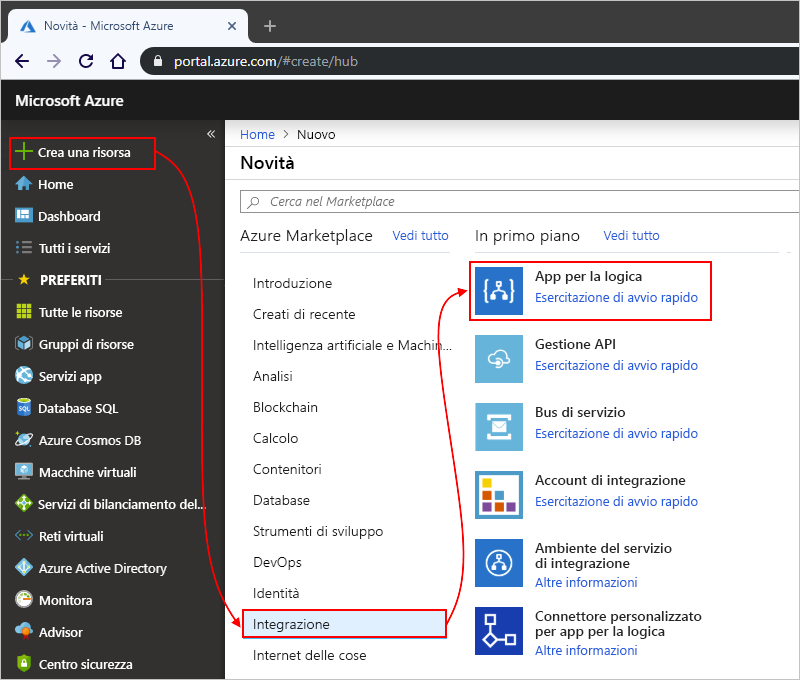
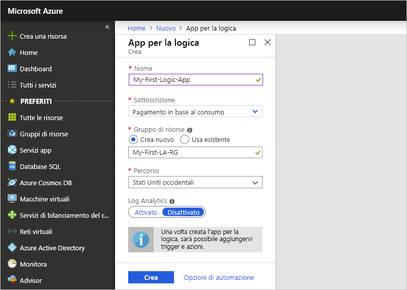
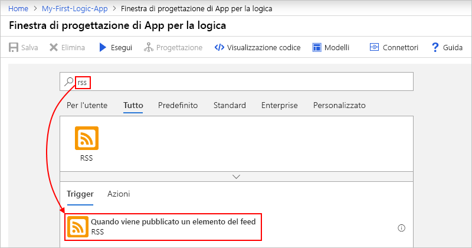
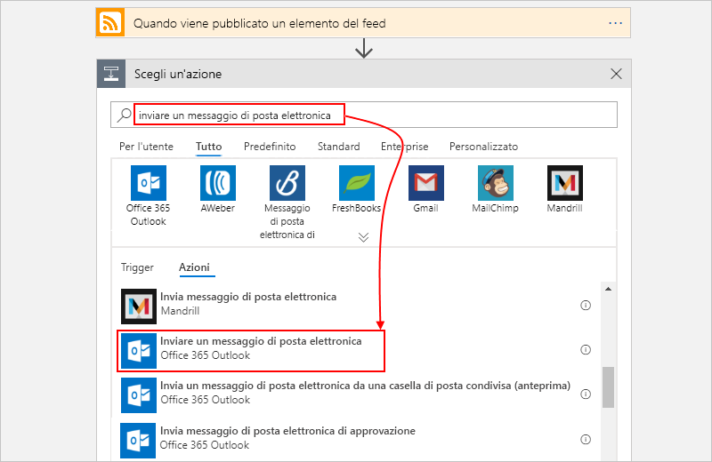
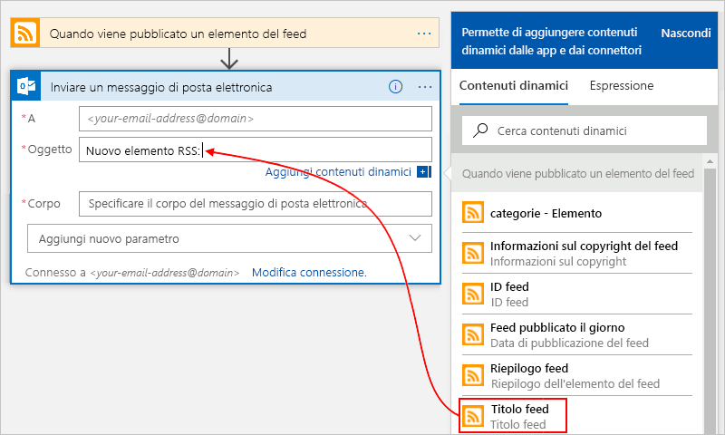
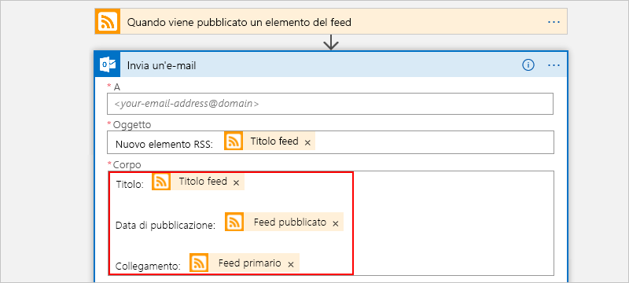
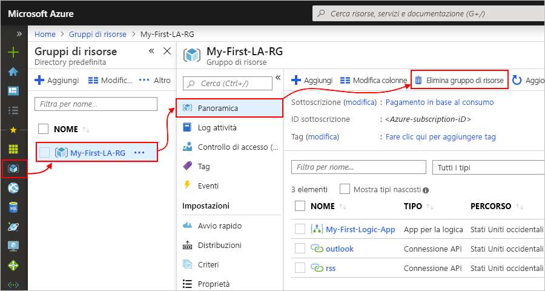

# <a name="quickstart-build-your-first-logic-app-workflow---azure-portal"></a>Guida introduttiva: Creare il primo flusso di lavoro dell'app per la logica - Portale di Azure

Questa guida introduttiva spiega come creare il primo flusso di lavoro automatizzato con [App per la logica di Azure](../logic-apps/logic-apps-overview.md). In questo articolo viene creata un'app per la logica che verifica la presenza di nuovi elementi nel feed RSS di un sito Web a intervalli regolari. Se sono presenti nuovi elementi, l'app per la logica invia un messaggio di posta elettronica per ogni elemento. Al termine, a livello generale l'app per la logica dovrebbe avere un flusso di lavoro simile al seguente:


Per seguire questa guida introduttiva, è necessario un account di posta elettronica di un provider supportato da App per la logica, come Office 365 Outlook, Outlook.com o Gmail. Per altri provider, [vedere qui l'elenco dei connettori](https://docs.microsoft.com/connectors/). Questa app per la logica usa un account Office 365 Outlook. Se si usa un altro account di posta elettronica, la procedura generale resta invariata, ma l'interfaccia utente potrebbe essere leggermente diversa. 

Se inoltre non si ha una sottoscrizione di Azure, è necessario <a href="https://azure.microsoft.com/free/" target="_blank">iscriversi per creare un account Azure gratuito</a>.

## <a name="sign-in-to-the-azure-portal"></a>Accedere al portale di Azure

Accedere al <a href="https://portal.azure.com" target="_blank">portale di Azure</a> con le credenziali dell'account Azure.

## <a name="create-your-logic-app"></a>Creare l'app per la logica 

1. Nel menu principale di Azure scegliere **Crea una risorsa** > **Integrazione aziendale** > **App per la logica**.

   

3. In **Crea app per la logica** specificare i dettagli sull'app per la logica come mostrato di seguito. Al termine, scegliere **Aggiungi al dashboard** > **Crea**.

   

   | Impostazione | Valore | DESCRIZIONE | 
   | ------- | ----- | ----------- | 
   | **Nome** | MyFirstLogicApp | Nome dell'app per la logica | 
   | **Sottoscrizione** | <*nome-sottoscrizione-Azure*> | Nome della sottoscrizione di Azure | 
   | **Gruppo di risorse** | My-First-LA-RG | Nome del [gruppo di risorse di Azure](../azure-resource-manager/resource-group-overview.md) usato per organizzare le risorse correlate | 
   | **Posizione** | Stati Uniti orientali 2 | Area in cui archiviare le informazioni sull'app per la logica | 
   | **Log Analytics** | Off | Lasciare l'impostazione **No** per la registrazione diagnostica. | 
   |||| 

3. Dopo che Azure ha distribuito l'app, Progettazione app per la logica si apre e visualizza una pagina con un video introduttivo e i trigger più usati. In **Modelli** scegliere **App per la logica vuota**.

   

Aggiungere quindi un [trigger](../logic-apps/logic-apps-overview.md#logic-app-concepts) che attiva il flusso di lavoro quando nel feed RSS è presente un nuovo elemento. Ogni app per la logica deve essere avviata con un trigger, che viene attivato quando si verifica un determinato evento o quando viene soddisfatta una condizione specifica. Ogni volta che il trigger viene attivato, il motore di App per la logica crea un'istanza dell'app per la logica che si avvia ed esegue il flusso di lavoro.

<a name="add-rss-trigger"></a>

## <a name="check-rss-feed-with-a-trigger"></a>Controllare il feed RSS con un trigger

1. Nella finestra di progettazione immettere "rss" nella casella di ricerca. Selezionare il trigger: **RSS - Quando viene pubblicato un elemento del feed**

   

2. Specificare queste informazioni per il trigger come mostrato e descritto di seguito: 

   

   | Impostazione | Valore | DESCRIZIONE | 
   | ------- | ----- | ----------- | 
   | **URL feed RSS** | ```http://feeds.reuters.com/reuters/topNews``` | Collegamento per il feed RSS che si vuole monitorare | 
   | **Interval** | 1 | Numero di intervalli di attesa tra i controlli | 
   | **Frequenza** | Minuto | Unità di tempo per ogni intervallo tra i controlli  | 
   |  |  |  | 

   La combinazione di intervallo e frequenza consente di definire la pianificazione per il trigger dell'app per la logica. 
   Questa app per la logica controlla il feed ogni minuto.

3. Per nascondere i dettagli del trigger per il momento, fare clic sulla barra del titolo del trigger.

   

4. Salvare l'app per la logica. Nella barra degli strumenti della finestra di progettazione scegliere **Salva**. 

L'app per la logica è ora attiva, ma non esegue alcuna operazione oltre a controllare il feed RSS. Aggiungere quindi un'azione per la risposta all'attivazione del trigger.

## <a name="send-email-with-an-action"></a>Inviare messaggi di posta elettronica con un'azione

Aggiungere ora un'[azione](../logic-apps/logic-apps-overview.md#logic-app-concepts) per l'invio di un messaggio di posta elettronica quando compaiono nuovi elementi nel feed RSS. 

1. Nel trigger **Quando viene pubblicato un elemento del feed** scegliere **+ Nuovo passaggio** > **Aggiungi un'azione**.

   

2. In **Scegliere un'azione** cercare "invia messaggio di posta elettronica" e quindi selezionare l'azione "invia messaggio di posta elettronica" per il provider di posta elettronica desiderato. Per filtrare l'elenco di azioni in base a un servizio specifico, selezionare prima di tutto il connettore in **Connettori**.

   

   * Per un account aziendale o dell'istituto di istruzione di Azure, selezionare Office 365 Outlook. 
   * Per gli account Microsoft personali, selezionare Outlook.com.

3. Se viene chiesto di immettere le credenziali, accedere all'account di posta elettronica in modo che App per la logica crei una connessione all'account.

4. Nell'azione **Invia un messaggio di posta elettronica** specificare i dati da includere nel messaggio. 

   1. Nella casella **A** immettere l'indirizzo di posta elettronica del destinatario. 
   AI fini del test delle app è possibile indicare il proprio indirizzo di posta elettronica.

      Per il momento ignorare l'elenco di parametri o l'elenco **Aggiungi contenuto dinamico** che viene visualizzato. 
      Quando si fa clic all'interno di alcune caselle di modifica, viene visualizzato questo elenco che mostra tutti i parametri disponibili del passaggio precedente che è possibile includere come input nel flusso di lavoro.
      La larghezza del browser determina l'elenco visualizzato.

   2. Nella casella **Oggetto** immettere questo testo seguito da uno spazio vuoto: ```New RSS item: ```

      
 
   3. Nell'elenco di parametri o nell'elenco **Aggiungi contenuto dinamico** selezionare **Titolo feed** per includere il titolo dell'elemento RSS.

      Ecco ad esempio l'elenco di parametri:

      

      Ed ecco l'elenco di contenuto dinamico:

      

      Al termine dell'operazione, l'oggetto del messaggio sarà simile al seguente:

      

      Se nella finestra di progettazione viene visualizzato un ciclo "For each", il campo selezionato contiene una matrice, come ad esempio il campo **categories-item**. 
      Per questi tipi di campi, la finestra di progettazione aggiunge automaticamente questo ciclo intorno all'azione che fa riferimento a tale campo. 
      In questo modo, l'app per la logica esegue la stessa azione su ogni elemento della matrice. 
      Per rimuovere il ciclo, scegliere i **puntini di sospensione** (**...**) nella barra del titolo del ciclo e quindi scegliere **Elimina**.

   4. Nella casella **Corpo** immettere questo testo e selezionare questi campi per il corpo del messaggio di posta elettronica. 
   Per aggiungere righe vuote in una casella di modifica, premere MAIUSC+INVIO. 

      

      | Impostazione | DESCRIZIONE | 
      | ------- | ----------- | 
      | **Titolo feed** | Titolo dell'elemento | 
      | **Data di pubblicazione del feed** | Data e ora di pubblicazione dell'elemento | 
      | **Collegamento al feed primario** | URL dell'elemento | 
      ||| 
   
5. Salvare l'app per la logica.

Testare quindi l'app per la logica.

## <a name="run-your-logic-app"></a>Eseguire l'app per la logica

Per avviare manualmente l'app per la logica, sulla barra degli strumenti della finestra di progettazione scegliere **Esegui**. In alternativa, attendere che l'app per la logica controlli il feed RSS in base alla pianificazione specificata (ogni minuto). Se il feed RSS include nuovi elementi, l'app per la logica invia un messaggio di posta elettronica per ogni nuovo elemento. In caso contrario, l'app per la logica attende l'intervallo successivo prima di controllare di nuovo. 

Ecco un esempio di messaggio di posta elettronica inviato dall'app per la logica. Se non si riceve alcun messaggio di posta elettronica, controllare la cartella della posta indesiderata.


Da un punto di vista tecnico, quando il trigger controlla il feed RSS e trova nuovi elementi, il trigger viene attivato e il motore di App per la logica crea un'istanza del flusso di lavoro dell'app per la logica che esegue le azioni del flusso di lavoro.
Se il trigger non trova nuovi elementi, non viene attivato e non crea un'istanza del flusso di lavoro.

Si è così completata la creazione ed esecuzione della prima app per la logica nel portale di Azure.

## <a name="clean-up-resources"></a>Pulire le risorse

Quando non è più necessario, eliminare il gruppo di risorse contenente l'app per la logica e le risorse correlate. Nel menu principale di Azure passare a **Gruppi di risorse** e selezionare il gruppo di risorse per l'app per la logica. Scegliere **Elimina gruppo di risorse**. Immettere il nome del gruppo di risorse come conferma e scegliere **Elimina**.



## <a name="get-support"></a>Supporto

* In caso di domande, visitare il [forum di App per la logica di Azure](https://social.msdn.microsoft.com/Forums/en-US/home?forum=azurelogicapps).
* Per votare o inviare idee relative alle funzionalità, visitare il [sito dei commenti e suggerimenti degli utenti di App per la logica](http://aka.ms/logicapps-wish).

## <a name="next-steps"></a>Passaggi successivi

In questa esercitazione è stata creata la prima app per la logica che verifica la presenza di aggiornamenti del feed RSS in base alla pianificazione specificata (ogni minuto) ed esegue un'azione (invio di un messaggio di posta elettronica) quando sono presenti aggiornamenti. Per altre informazioni, continuare con questa esercitazione che consente di creare flussi di lavoro più avanzati basati sulla pianificazione:

> [!div class="nextstepaction"]
> [Controllare il traffico con un'app per la logica basata su utilità di pianificazione](../logic-apps/tutorial-build-schedule-recurring-logic-app-workflow.md)