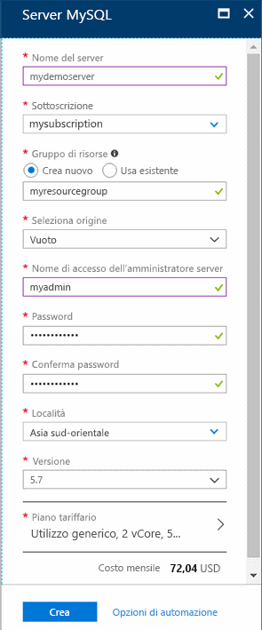
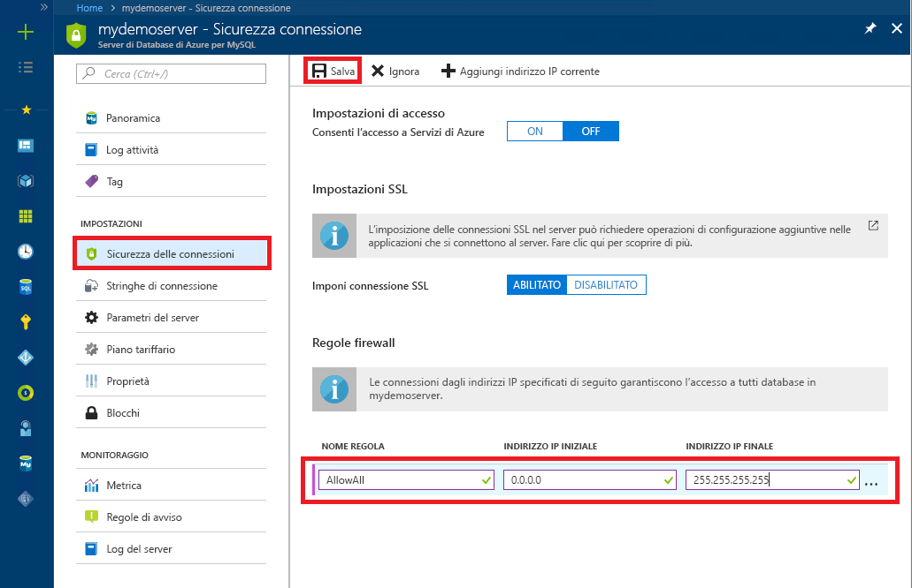

# <a name="tutorial-design-an-azure-database-for-mysql-database-using-the-azure-portal"></a>Esercitazione: Progettare un database di Database di Azure per MySQL con il portale di Azure
Il database di Azure per MySQL è un servizio gestito che consente di eseguire, gestire e scalare dei database MySQL a disponibilità elevata nel cloud. Tramite il portale di Azure, è possibile gestire facilmente il server e progettare un database.

In questa esercitazione si userà il portale di Azure per imparare a:

> [!div class="checklist"]
> * Creare un database di Azure per MySQL
> * Configurare il firewall del server
> * Usare lo strumento da riga di comando mysql per creare un database
> * Caricare dati di esempio
> * Eseguire query sui dati
> * Aggiornare i dati
> * Ripristinare i dati

Se non si ha una sottoscrizione di Azure, creare un [account Azure gratuito](https://azure.microsoft.com/free/) prima di iniziare.

## <a name="sign-in-to-the-azure-portal"></a>Accedere al portale di Azure
Aprire il Web browser preferito e visitare il [portale di Microsoft Azure](https://portal.azure.com/). Immettere le credenziali per accedere al portale. La visualizzazione predefinita è il dashboard del servizio.

## <a name="create-an-azure-database-for-mysql-server"></a>Creare un server Database di Azure per MySQL
Verrà creato un database di Azure per MySQL con un set definito di [risorse di calcolo e di archiviazione](./concepts-compute-unit-and-storage.md). Il server viene creato all'interno di un [gruppo di risorse di Azure](https://docs.microsoft.com/azure/azure-resource-manager/resource-group-overview).

1. Passare a **database** > **Database di Azure per MySQL**. Se non si trova MySQL Server nella categoria **Database**, fare clic su **Visualizza tutto** per mostrare tutti i servizi di database disponibili. È possibile anche digitare **Database di Azure per MySQL** nella casella di ricerca per trovare rapidamente il servizio.
   
   

2. Fare clic sul riquadro **Database di Azure per MySQL** e quindi fare clic su **Crea**. Compilare il modulo di Database di Azure per MySQL.
   
   

    **Impostazione** | **Valore consigliato** | **Descrizione campo** 
    ---|---|---
    Nome server | Nome server univoco | Scegliere un nome univoco per identificare il database di Azure per il server MySQL. Ad esempio, mydemoserver. Al nome del server specificato viene aggiunto il nome di dominio *mysql.database.azure.com*. Il nome del server può contenere solo lettere minuscole, numeri e il segno meno (-) e deve avere una lunghezza compresa tra 3 e 63 caratteri.
    Sottoscrizione | Sottoscrizione in uso | Selezionare la sottoscrizione di Azure da usare per il server. Se si hanno più sottoscrizioni, scegliere quella in cui viene fatturata la risorsa.
    Gruppo di risorse | *myresourcegroup* | Specificare il nome di un gruppo di risorse nuovo o esistente.
    Selezionare l'origine | *Vuoto* | Selezionare *Vuoto* per creare un nuovo server da zero. Selezionare *Backup* se si sta creando un server da un backup geografico di un server Database di Azure per MySQL esistente.
    Accesso amministratore server | myadmin | Account di accesso da usare per la connessione al server. Il nome di accesso dell'amministratore non può essere **azure_superuser**, **admin**, **administrator**, **root**, **guest** o **public**.
    Password | *A scelta dell'utente* | Specificare una nuova password per l'account dell'amministratore del server. Deve avere una lunghezza compresa tra 8 e 128 caratteri. La password deve contenere caratteri di tre delle categorie seguenti: lettere maiuscole, lettere minuscole, numeri (0-9) e caratteri non alfanumerici (!, $, #, % e così via).
    Conferma password | *A scelta dell'utente*| Confermare la password dell'account amministratore.
    Località | *Area più vicina ai propri utenti*| Scegliere la località più vicina agli utenti o alle altre applicazioni Azure.
    Versione | *Ultima versione*| Ultima versione, a meno che non si abbiano requisiti specifici per cui deve esserne usata un'altra.
    Piano tariffario | **Utilizzo generico**, **Generazione 5**, **2 vCore**, **5 GB**, **7 giorni**, **Con ridondanza geografica** | Configurazioni di calcolo, archiviazione e backup per il nuovo server. Selezionare **Piano tariffario**. Selezionare quindi la scheda **Utilizzo generico**. *Generazione 5*, *2 vCore*, *5 GB* e *7 giorni* sono i valori predefiniti per **Generazione di calcolo**, **vCore**, **Archiviazione** e **Periodo di conservazione backup**. È possibile lasciare questi dispositivi di scorrimento nella posizione in cui si trovano. Per abilitare l'archiviazione con ridondanza geografica dei backup del server, selezionare **Con ridondanza geografica** in **Opzioni di ridondanza per il backup**. Per salvare la selezione del piano tariffario, selezionare **OK**. Lo screenshot successivo mostra queste selezioni.
    
   

3. Fare clic su **Create**(Crea). Dopo pochi minuti, un nuovo database di Azure per il server MySQL sarà in esecuzione nel cloud. È possibile fare clic sul pulsante **Notifiche** sulla barra degli strumenti per monitorare il processo di distribuzione.

## <a name="configure-firewall"></a>Configurare il firewall
I database di Azure per MySQL sono protetti da un firewall. Per impostazione predefinita, vengono rifiutate tutte le connessioni al server e ai database all'interno del server. Prima di connettersi per la prima volta al database di Azure per MySQL, configurare il firewall per aggiungere l'indirizzo IP della rete pubblica del computer client (o un intervallo di indirizzi IP).

1. Fare clic sul server appena creato e quindi fare clic su **Sicurezza connessione**.
   
   
2. È possibile scegliere **Aggiungi indirizzo IP corrente** o configurare le regole del firewall qui. Ricordarsi di fare clic su **Salva** dopo aver creato le regole.
È ora possibile connettersi al server usando lo strumento da riga di comando mysql o lo strumento MySQL Workbench GUI.

> [!TIP]
> Il Database di Azure per il server MySQL comunica sulla porta 3306. Se si sta tentando di connettersi da una rete aziendale, il traffico in uscita attraverso la porta 3306 potrebbe non essere autorizzato dal firewall della rete. In questo caso non è possibile connettersi al server MySQL di Azure, a meno che il reparto IT non apra la porta 3306.

## <a name="get-connection-information"></a>Ottenere informazioni di connessione
Ottenere il **Nome server** completo e il **Nome di accesso dell'amministratore server** per il database di Azure per il server MySQL dal portale di Azure. Usare il nome completo del server per connettersi al server tramite lo strumento da riga di comando mysql. 

1. Nel [portale di Azure](https://portal.azure.com/) fare clic su **Tutte le risorse** nel menu a sinistra, digitare il nome e cercare il database di Azure per il server MySQL. Selezionare il nome del server per visualizzare i dettagli.

2. Nella pagina **Panoramica** prendere nota di **Nome server** e **Nome di accesso dell'amministratore server**. È possibile fare clic sul pulsante Copia accanto a ogni campo per copiarlo negli Appunti.
   

In questo esempio, il nome del server è *mydemoserver.mysql.database.azure.com* e l'account di accesso amministratore del server è *myadmin\@mydemoserver*.

## <a name="connect-to-the-server-using-mysql"></a>Connettersi al server usando mysql
Usare lo [strumento da riga di comando mysql](https://dev.mysql.com/doc/refman/5.7/en/mysql.html) per stabilire una connessione al database di Azure per il server MySQL. È possibile eseguire lo strumento da riga di comando mysql nel browser usando Azure Cloud Shell o avviarlo dal computer tramite gli strumenti mysql installati localmente. Per avviare Azure Cloud Shell, fare clic sul pulsante `Try It` in un blocco di codice in questo articolo oppure visitare il portale di Azure e fare clic sull'icona `>_` nella barra degli strumenti in alto a destra. 

Digitare il comando per la connessione:
```azurecli-interactive
mysql -h mydemoserver.mysql.database.azure.com -u myadmin@mydemoserver -p
```

## <a name="create-a-blank-database"></a>Creazione di un database vuoto
Dopo aver eseguito la connessione al server, creare un database vuoto con cui lavorare.
```sql
CREATE DATABASE mysampledb;
```

Nel prompt eseguire il comando seguente per cambiare la connessione nel database appena creato:
```sql
USE mysampledb;
```

## <a name="create-tables-in-the-database"></a>Creare tabelle nel database
Dopo aver appreso come connettersi al Database di Azure per MySQL, si possono completare alcune attività di base:

In primo luogo, creare una tabella e caricarvi alcuni dati. Creare una tabella che contenga le informazioni riguardanti l'inventario.
```sql
CREATE TABLE inventory (
    id serial PRIMARY KEY, 
    name VARCHAR(50), 
    quantity INTEGER
);
```

## <a name="load-data-into-the-tables"></a>Caricare i dati nelle tabelle
Dopo aver creato una tabella, inserire alcuni dati. Nella finestra del prompt dei comandi aperta, eseguire la query seguente per inserire alcune righe di dati.
```sql
INSERT INTO inventory (id, name, quantity) VALUES (1, 'banana', 150); 
INSERT INTO inventory (id, name, quantity) VALUES (2, 'orange', 154);
```

A questo punto, ci sono due righe di dati di esempio nella tabella creata in precedenza.

## <a name="query-and-update-the-data-in-the-tables"></a>Eseguire una query e aggiornare i dati nelle tabelle
Eseguire la query seguente per recuperare informazioni dalla tabella del database.
```sql
SELECT * FROM inventory;
```

Si possono anche aggiornare query e aggiornare i dati nelle tabelle.
```sql
UPDATE inventory SET quantity = 200 WHERE name = 'banana';
```

La riga viene aggiornata di conseguenza quando si recuperano dati.
```sql
SELECT * FROM inventory;
```

## <a name="restore-a-database-to-a-previous-point-in-time"></a>Ripristinare un database a un momento precedente
Si supponga di avere eliminato un'importante tabella di database e di non poter ripristinare i dati facilmente. Il servizio Database di Azure per MySQL consente di ripristinare il server a un punto nel tempo, creando una copia dei database in un nuovo server. È possibile usare questo nuovo server per ripristinare i dati eliminati. La procedura seguente consente di ripristinare il server di esempio in un punto precedente all'aggiunta della tabella.

1. Nel portale di Azure individuare il database di Azure per MySQL. Nella pagina **Panoramica** fare clic su **Ripristina** nella barra degli strumenti. Verrà visualizzata la pagina Ripristina.

   

2. Compilare il modulo **Ripristina** con le informazioni richieste.
   
   
   
   - **Punto di ripristino**: selezionare un punto nel tempo per il ripristino, all'interno dell'intervallo di tempo elencato. Assicurarsi di convertire il fuso orario locale in ora UTC.
   - **Ripristina nel nuovo server**: specificare il nome del nuovo server in cui eseguire il ripristino
   - **Località**: l'area corrisponde a quella del server di origine e non può essere modificata.
   - **Piano tariffario**: il piano tariffario corrisponde a quello del server di origine e non può essere modificato.
   
3. Fare clic su **OK** per ripristinare il server da [ripristinare in un punto nel tempo](./howto-restore-server-portal.md) precedente all'eliminazione della tabella. Il ripristino di un server crea una nuova copia del server, a partire dal momento nel tempo specificato. 

## <a name="next-steps"></a>Passaggi successivi
In questa esercitazione si userà il portale di Azure per imparare a:

> [!div class="checklist"]
> * Creare un database di Azure per MySQL
> * Configurare il firewall del server
> * Usare lo strumento da riga di comando mysql per creare un database
> * Caricare dati di esempio
> * Eseguire query sui dati
> * Aggiornare i dati
> * Ripristinare i dati

> [!div class="nextstepaction"]
> [Come connettere le applicazioni a Database di Azure per MySQL](./howto-connection-string.md)
