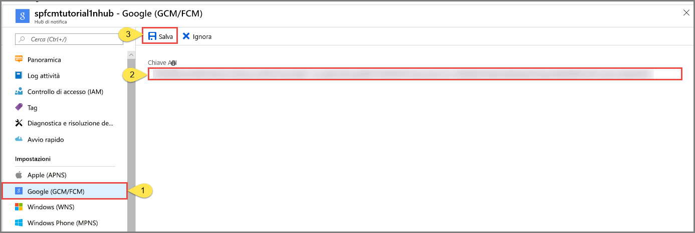
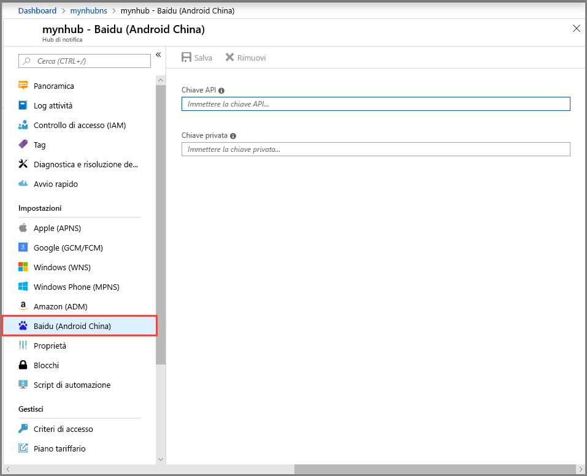

# Configurare un hub di notifica di Azure con le impostazioni PNS (Platform Notification System) nel portale di Azure 
Hub di notifica di Azure offre un motore di push di facile uso e con scalabilità orizzontale che consente di inviare notifiche a qualsiasi piattaforma (iOS, Android, Windows, Kindle, Baidu e così via) da qualsiasi back-end (cloud o locale). Per altre informazioni sul servizio, vedere [Informazioni su Hub di notifica](notification-hubs-push-notification-overview.md).

[Creare un hub di notifica di Azure tramite il portale di Azure](create-notification-hub-portal.md) se non lo si è già fatto. Questa guida introduttiva illustra come configurare un hub di notifica nel portale di Azure con le impostazioni PNS (Platform Notification System).

## Apple Push Notification Service (APNS)
1. Nella pagina **Hub di notifica** nel portale di Azure selezionare **Apple (servizio APN)** in **Impostazioni** nel menu a sinistra.
2. Se si seleziona **Certificato**, eseguire le operazioni seguenti:
    1. Selezionare l'**icona del file** e selezionare il file **.p12** da caricare. 
    2. Specificare la **password**.
    3. Selezionare la modalità **Sandbox**. Usare la modalità **Produzione** solo se si vuole inviare notifiche push agli utenti che hanno acquistato l'app dallo Store.

        
3. Se si seleziona **Token**, seguire questa procedura: 
    1. Immettere i valori per **ID chiave**, **ID bundle**, **ID team** e **token**.
    2. Selezionare la modalità **Sandbox**. Usare la modalità **Produzione** solo se si vuole inviare notifiche push agli utenti che hanno acquistato l'app dallo Store.

        

Per un'esercitazione completa sull'invio di notifiche push a dispositivi iOS con Hub di notifica di Azure e Apple Push Notification Service (servizio APN), vedere [questa esercitazione](notification-hubs-ios-apple-push-notification-apns-get-started.md).

## Google Firebase Cloud Messaging (FCM)
1. Nella pagina **Hub di notifica** nel portale di Azure selezionare **Google (GCM/FCM)** in **Impostazioni** nel menu a sinistra. 
2. Incollare la **chiave del server** per il progetto FCM salvato in precedenza. 
3. Sulla barra degli strumenti selezionare **Salva**. 

    
4. Negli avvisi viene visualizzato un messaggio che indica che gli hub di notifica sono stati aggiornati correttamente. Il pulsante **Save** (Salva) è disabilitato. 

Per un'esercitazione completa sull'invio di notifiche push a dispositivi Android con Hub di notifica di Azure e Google Firebase Cloud Messaging, vedere [questa esercitazione](notification-hubs-android-push-notification-google-fcm-get-started.md).

## Servizio notifica Push Windows (WNS)
1. Nella pagina **Hub di notifica** nel portale di Azure selezionare **Windows (WNS)** in **Impostazioni** nel menu a sinistra.
2. Immettere i valori per **SID pacchetto** e **Chiave di sicurezza**.
3. Sulla barra degli strumenti selezionare **Salva**.

    

Per un'esercitazione completa sull'invio di notifiche push a un'app per la piattaforma UWP (Universal Windows Platform) in esecuzione in un dispositivo Windows, vedere [questa esercitazione](notification-hubs-windows-store-dotnet-get-started-wns-push-notification.md).

## Windows Phone - Servizio notifica push Microsoft
1. Nella pagina **Hub di notifica** nel portale di Azure selezionare **Windows Phone (MPNS)** in **Impostazioni**.
2. Se si vogliono abilitare le notifiche push non autenticate, selezionare **Abilita notifiche push non autenticate** e selezionare **Salva** nella barra degli strumenti.

    
3. Se si vogliono usare le notifiche push **autenticate**, seguire questa procedura:
    1. Selezionare **Carica certificato** nella barra degli strumenti.
    2. Selezionare l'**icona del file** e selezionare il file del certificato.
    3. Immettere la **password** per il certificato. 
    4. Selezionare **OK** per chiudere la pagina **Carica certificato**. 
    5. Nella pagina **Windows Phone(MPNS)** selezionare **Salva** nella barra degli strumenti.

Per un'esercitazione completa sull'invio di notifiche push a un'app per Windows Phone 8 con il Servizio di notifica push Microsoft (MPNS), vedere [questa esercitazione](notification-hubs-windows-mobile-push-notifications-mpns.md).
      
## Amazon Device Messaging (ADM)
1. Nella pagina **Hub di notifica** nel portale di Azure selezionare **Amazon (ADM)** in **Impostazioni** nel menu a sinistra.
2. Immettere i valori per **ID client** e **Segreto client**.
3. Sulla barra degli strumenti selezionare **Salva**.
    
    

Per un'esercitazione completa sull'uso di Hub di notifica di Azure per l'invio di notifiche push a un'applicazione Kindle, vedere [questa esercitazione](notification-hubs-kindle-amazon-adm-push-notification.md).

## Baidu (Android China)
1. Nella pagina **Hub di notifica** nel portale di Azure selezionare **Baidu (Android China)** in **Impostazioni** nel menu a sinistra. 
2. Immettere la **chiave API** ottenuta dalla console di Baidu nel progetto push cloud Baidu. 
3. Immettere la **chiave privata** ottenuta dalla console di Baidu nel progetto push cloud Baidu. 
4. Sulla barra degli strumenti selezionare **Salva**. 

    
4. Negli avvisi viene visualizzato un messaggio che indica che gli hub di notifica sono stati aggiornati correttamente. Il pulsante **Save** (Salva) è disabilitato. 

Per un'esercitazione completa sull'invio di notifiche push con Hub di notifica di Azure e push cloud Baidu, vedere [questa esercitazione](notification-hubs-baidu-china-android-notifications-get-started.md).

## Passaggi successivi
In questa guida introduttiva è stato illustrato come configurare diversi sistemi PNS (Platform Notification System) per un hub di notifica nel portale di Azure. 

Per istruzioni dettagliate complete per l'invio di notifiche push a queste diverse piattaforme, vedere le esercitazioni presenti nella sezione **Esercitazioni**.

- [Inviare notifiche push a dispositivi iOS con Hub di notifica di Azure e Apple Push Notification Service (servizio APN)](notification-hubs-ios-apple-push-notification-apns-get-started.md)
- [Effettuare il push di notifiche ai dispositivi Android con Hub di notifica di Azure e Google Firebase Cloud Messaging](notification-hubs-android-push-notification-google-fcm-get-started.md)
- [Inviare notifiche push a un'app della piattaforma UWP (Universal Windows Platform) in esecuzione in un dispositivo Windows](notification-hubs-windows-store-dotnet-get-started-wns-push-notification.md)
- [Inviare notifiche push a un'app per Windows Phone 8 con il Servizio di notifica push Microsoft (MPNS)](notification-hubs-windows-mobile-push-notifications-mpns.md)
- [Inviare notifiche push a un'applicazione Kindle](notification-hubs-kindle-amazon-adm-push-notification.md)
- [Inviare notifiche push con Hub di notifica di Azure e push cloud Baidu](notification-hubs-baidu-china-android-notifications-get-started.md)
