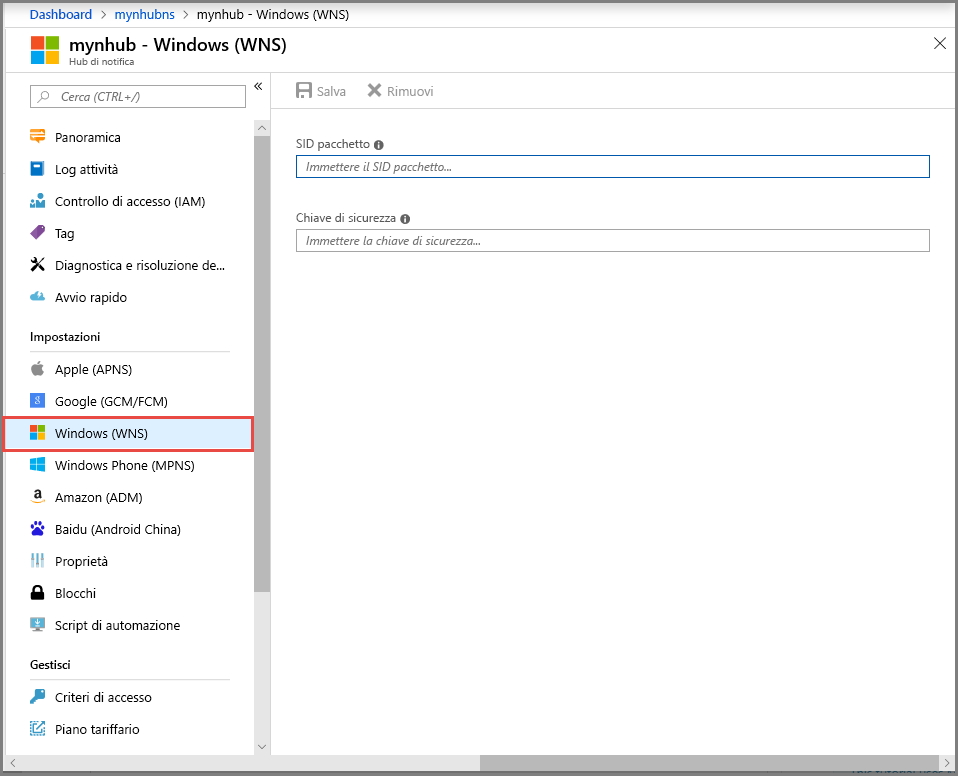
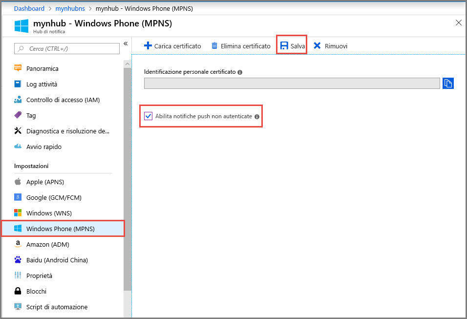

# Configurare notifiche push in un hub di notifica nel portale di Azure

Hub di notifica di Azure offre un motore di push facile da usare e di cui è possibile aumentare il numero di istanze. Usare Hub di notifica per inviare notifiche a qualsiasi piattaforma (iOS, Android, Windows, Baidu) e da qualsiasi back-end (cloud o locale). Per altre informazioni, vedere [Informazioni su Hub di notifica di Azure](notification-hubs-push-notification-overview.md).

In questo argomento di avvio rapido si useranno le impostazioni Platform Notification System (PNS) in Hub di notifica per configurare le notifiche push su più piattaforme. Questo argomento di avvio rapido illustra i passaggi da eseguire nel portale di Azure.

Se non è stato già creato un hub di notifica, crearne uno ora. Per altre informazioni, vedere [Creare un hub di notifica di Azure nel portale di Azure](create-notification-hub-portal.md). 

## Apple Push Notification Service

Per configurare Apple Push Notification Service (APNS):

1. Nella pagina **Hub di notifica** del portale di Azure, selezionare **Apple (APNS)** nel menu a sinistra.

1. Per **Modalità di autenticazione** selezionare **Certificato** oppure **Token**.

   a. Se si seleziona **Certificato**:
   * Selezionare l'icona del file e quindi il file con estensione *p12* da caricare.
   * Immettere una password.
   * Selezionare la modalità **Sandbox**. In alternativa, se si vogliono inviare notifiche push agli utenti che hanno acquistato l'app dallo Store, selezionare la modalità **Produzione**.

     

   b. Se si seleziona **Token**:

   * Immettere i valori per **ID chiave**, **ID bundle**, **ID team** e **Token**.
   * Selezionare la modalità **Sandbox**. In alternativa, se si vogliono inviare notifiche push agli utenti che hanno acquistato l'app dallo Store, selezionare la modalità **Produzione**.

     

Per altre informazioni, vedere [Inviare notifiche push a iOS tramite Hub di notifica di Azure](notification-hubs-ios-apple-push-notification-apns-get-started.md).

## Google Firebase Cloud Messaging

Per configurare le notifiche push per Google Firebase Cloud Messaging (FCM):

1. Nella pagina **Hub di notifica** del portale di Azure, selezionare **Google (GCM/FCM)** nel menu a sinistra. 
2. Incollare il valore di **Chiave API** per il progetto FCM salvato in precedenza. 
3. Selezionare **Salva**. 

   

Dopo aver completato questi passaggi, un avviso indica che l'hub di notifica è stata aggiornato correttamente. Il pulsante **Save** (Salva) è disabilitato. 

Per altre informazioni, vedere [Effettuare il push di notifiche ai dispositivi Android con Hub di notifica e Google FCM](notification-hubs-android-push-notification-google-fcm-get-started.md).

## Servizi notifica Push Windows

Per configurare Servizi notifica Push Windows (WNS):

1. Nella pagina **Hub di notifica** del portale di Azure, selezionare **Windows (WNS)** nel menu a sinistra.
2. Immettere i valori per **SID pacchetto** e **Chiave di sicurezza**.
3. Selezionare **Salva**.

   

Per informazioni, vedere [Inviare notifiche alle app della piattaforma UWP con Hub di notifica di Azure](notification-hubs-windows-store-dotnet-get-started-wns-push-notification.md).

## Servizio notifica push Microsoft per Windows Phone

Per configurare Servizio notifica push Microsoft (MPNS) per Windows Phone: 

1. Nella pagina **Hub di notifica** del portale di Azure, selezionare **Windows Phone (MPNS)** nel menu a sinistra.
1. Abilitare le notifiche push non autenticate o autenticate:

   a. Per abilitare le notifiche push non autenticate, selezionare **Abilita notifiche push non autenticate** > **Salva**.

      

   b. Per abilitare le notifiche push autenticate:
      * Selezionare **Carica certificato** sulla barra degli strumenti.
      * Selezionare l'icona del file e quindi il file del certificato.
      * Immettere la password per il certificato.
      * Selezionare **OK**.
      * Nella pagina **Windows Phone(MPNS)** selezionare **Salva**.

Per altre informazioni, vedere [Effettuare il push di notifiche alle app Windows Phone con Hub di notifica](notification-hubs-windows-mobile-push-notifications-mpns.md).
      

## Baidu (Android China)

Per configurare le notifiche push per Baidu:

1. Nella pagina **Hub di notifica** del portale di Azure, selezionare **Baidu (Android China)** nel menu a sinistra. 
2. Immettere il valore **Chiave API** ottenuto dalla console di Baidu nel progetto push cloud Baidu. 
3. Immettere il valore **Chiave privata** ottenuto dalla console di Baidu nel progetto push cloud Baidu. 
4. Selezionare **Salva**. 

    

Dopo aver completato questi passaggi, un avviso indica che l'hub di notifica è stata aggiornato correttamente. Il pulsante **Save** (Salva) è disabilitato. 

Per altre informazioni, vedere [Introduzione ad Hub di notifica tramite Baidu](notification-hubs-baidu-china-android-notifications-get-started.md).

## Passaggi successivi
In questo argomento di avvio rapido è stato illustrato come configurare le impostazioni Platform Notification System per un hub di notifica nel portale di Azure. 

Per altre informazioni su come effettuare il push di notifiche a diverse piattaforme, vedere queste esercitazioni:

- [Effettuare il push di notifiche ai dispositivi iOS con Hub di notifica e APNS](notification-hubs-ios-apple-push-notification-apns-get-started.md)
- [Effettuare il push di notifiche ai dispositivi Android con Hub di notifica e Google FCM](notification-hubs-android-push-notification-google-fcm-get-started.md)
- [Inviare notifiche a un'app della piattaforma UWP in un dispositivo Windows](notification-hubs-windows-store-dotnet-get-started-wns-push-notification.md)
- [Effettuare il push di notifiche a un'app Windows Phone 8 con MPNS](notification-hubs-windows-mobile-push-notifications-mpns.md)
- [Effettuare il push di notifiche con Hub di notifica e push cloud Baidu](notification-hubs-baidu-china-android-notifications-get-started.md)
