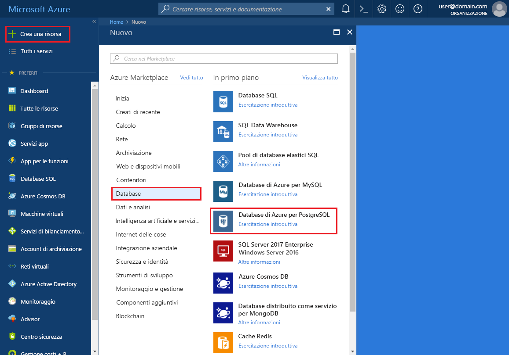
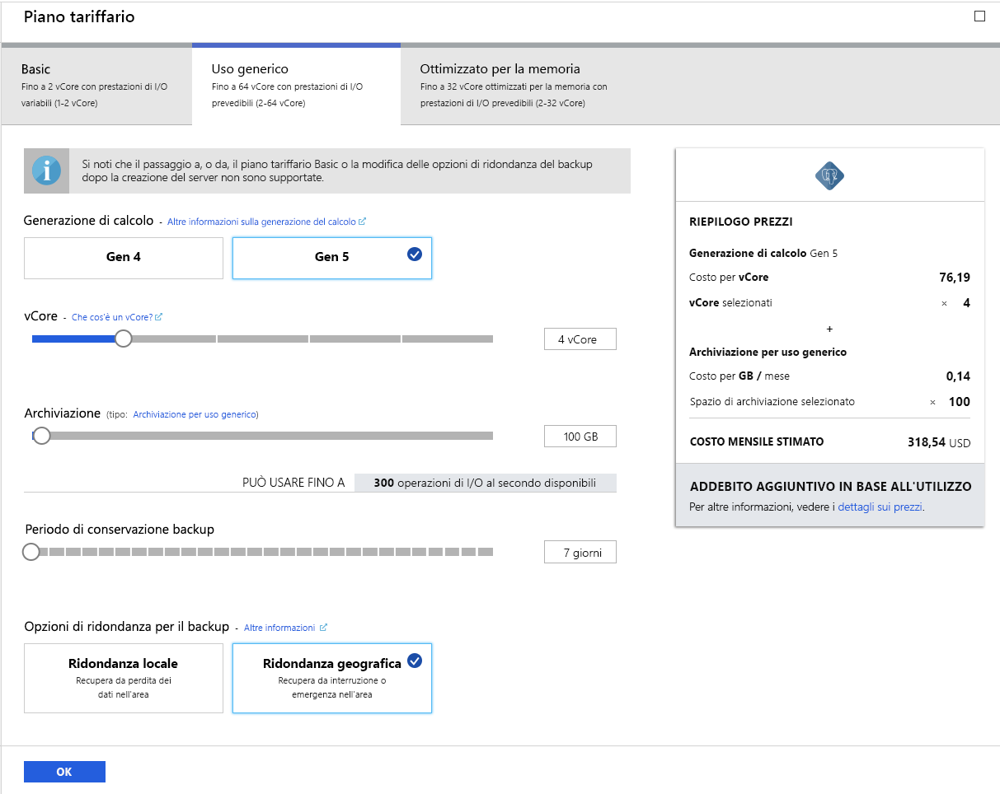
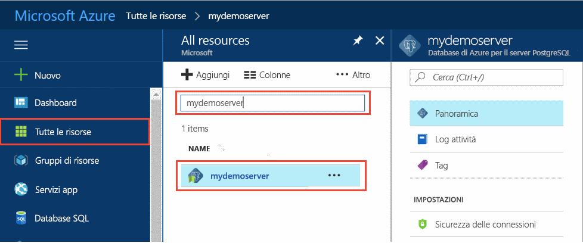

# <a name="quickstart-create-an-azure-database-for-postgresql-server-in-the-azure-portal"></a>Guida introduttiva: Creare un server Database di Azure per PostgreSQL nel portale di Azure

Il database di Azure per PostgreSQL è un servizio gestito usato per eseguire, gestire e ridimensionare database PostgreSQL a disponibilità elevata nel cloud. Questa guida introduttiva illustra come creare un server Database di Azure per PostgreSQL in circa cinque minuti con il portale di Azure.

Se non si ha una sottoscrizione di Azure, creare un [account Azure gratuito](https://azure.microsoft.com/free/) prima di iniziare.

## <a name="sign-in-to-the-azure-portal"></a>Accedere al portale di Azure
Aprire il Web browser e passare al [portale](https://portal.azure.com/). Immettere le credenziali per accedere al portale. La visualizzazione predefinita è il dashboard del servizio.

## <a name="create-an-azure-database-for-postgresql-server"></a>Creare un database di Azure per il server PostgreSQL

Un server Database di Azure per PostgreSQL viene creato con un set definito di [risorse di calcolo e di archiviazione](./concepts-pricing-tiers.md). Il server viene creato all'interno di un [gruppo di risorse di Azure](../azure-resource-manager/resource-group-overview.md).

Per creare un database di Azure per il server PostgreSQL, seguire questa procedura:
1. Selezionare il pulsante **Crea una risorsa** (+) nell'angolo superiore sinistro del portale.

2. Selezionare **Database** > **Database di Azure per PostgreSQL**.

    

3. Compilare il modulo dei dettagli del nuovo server con le informazioni seguenti:

    

    Impostazione|Valore consigliato|DESCRIZIONE
    ---|---|---
    Nome server |*mydemoserver*|Nome univoco per identificare il database di Azure per il server PostgreSQL. Al nome del server specificato viene aggiunto il nome di dominio *postgres.database.azure.com*. Il server può contenere solo lettere minuscole, numeri e il segno meno (-). Deve contenere almeno da 3 a 63 caratteri.
    Sottoscrizione|Nome della sottoscrizione utente|Sottoscrizione di Azure da usare per il server. Se si hanno più sottoscrizioni, scegliere quella in cui viene fatturata la risorsa.
    Gruppo di risorse|*myresourcegroup*| Nuovo nome di gruppo di risorse o uno esistente nella sottoscrizione.
    Selezionare l'origine | *Vuoto* | Selezionare *Vuoto* per creare un nuovo server da zero. Si selezionerebbe *Backup* se si stesse creando un server da un backup geografico di un server Database di Azure per PostgreSQL esistente.
    Accesso amministratore server |*myadmin*| Account di accesso da usare per la connessione al server. Il nome di accesso dell'amministratore non può essere **azure_superuser**, **azure_pg_admin**, **admin**, **administrator**, **root**, **guest** o **public**. Non può iniziare con **pg_**.
    Password |Password| Nuova password per l'account amministratore del server. Deve contenere tra 8 e 128 caratteri. La password deve contenere caratteri di tre delle categorie seguenti: lettere maiuscole, lettere minuscole, numeri (da 0 a 9) e caratteri non alfanumerici (!, $, #, % e così via).
    Località|Area più vicina ai propri utenti| Località più vicina agli utenti.
    Version|Ultima versione| Versione più recente di PostgreSQL, a meno che non si abbiano requisiti specifici diversi.
    Piano tariffario | **Utilizzo generico**, **Generazione 4**, **2 vCore**, **5 GB**, **7 giorni**, **Con ridondanza geografica** | Configurazioni di calcolo, archiviazione e backup per il nuovo server. Selezionare **Piano tariffario**. Selezionare quindi la scheda **Utilizzo generico**. *Generazione 4*, *2 vCore*, *5 GB* e *7 giorni* sono i valori predefiniti per **Generazione di calcolo**, **vCore**, **Archiviazione** e **Periodo di conservazione backup**. È possibile lasciare questi dispositivi di scorrimento nella posizione in cui si trovano. Per abilitare l'archiviazione con ridondanza geografica dei backup del server, selezionare **Con ridondanza geografica** in **Opzioni di ridondanza per il backup**. Per salvare la selezione del piano tariffario, selezionare **OK**. Lo screenshot successivo mostra queste selezioni.

    > [!IMPORTANT]
    > L'account di accesso amministratore server e la password qui specificati sono necessari per accedere al server e ai relativi database più avanti in questa guida introduttiva. Prendere nota di queste informazioni per usarle in seguito.

    

4. Selezionare **Crea** per effettuare il provisioning del server. Questa operazione può richiedere qualche minuto.

5. Sulla barra degli strumenti selezionare l'icona **Notifiche** a forma di campana per monitorare il processo di distribuzione. Al termine della distribuzione è possibile selezionare **Aggiungi al dashboard** per creare un riquadro di questo server nel dashboard del portale di Azure come collegamento alla pagina **Panoramica** del server. Selezionare **Vai alla risorsa** per aprire la pagina **Panoramica** del server.

    
   
   Per impostazione predefinita, un database **postgres** viene creato nel server. Il database [postgres](https://www.postgresql.org/docs/9.6/static/app-initdb.html) è un database predefinito che può essere usato da utenti, utilità e applicazioni di terze parti. (L'altro database predefinito è **azure_maintenance**. La sua funzione è quella di separare i processi del servizio gestito dalle azioni dell'utente. Non è possibile accedere a questo database.)

## <a name="configure-a-server-level-firewall-rule"></a>Configurare una regola del firewall a livello di server

Database di Azure per PostgreSQL crea un firewall a livello di server, che impedisce alle applicazioni e agli strumenti esterni di connettersi al server e ai database nel server, a meno che non si crei una regola per aprire il firewall per indirizzi IP specifici. 

1. Al termine della distribuzione, individuare il server. Se necessario, è possibile eseguire una ricerca. Scegliere ad esempio **Tutte le risorse** dal menu a sinistra. Digitare il nome del server, ad esempio **mydemoserver**, per cercare il server appena creato. Selezionare il nome del server nell'elenco dei risultati della ricerca. Si apre la pagina **Panoramica** del server in cui vengono fornite le opzioni per una configurazione aggiuntiva.
 
    

2. Nella pagina del server selezionare **Sicurezza connessione**.

3. In **Regole del firewall** selezionare la casella di testo vuota nella colonna **Nome regola** per iniziare a creare la regola del firewall. 

    Per questa guida introduttiva verranno consentiti tutti gli indirizzi IP nel server. Inserire nella casella di testo di ogni colonna i valori seguenti:

    Nome regola | Indirizzo IP iniziale | Indirizzo IP finale 
    ---|---|---
    AllowAllIps | 0.0.0.0 | 255.255.255.255

     

4. Sulla barra degli strumenti superiore della pagina **Sicurezza connessione** selezionare **Salva**. Prima di continuare, attendere che venga visualizzata la notifica che informa che l'aggiornamento della sicurezza della connessione è stato completato.

    > [!NOTE]
    > Le connessioni al database di Azure per il server PostgreSQL comunicano sulla porta 5432. Quando si cerca di connettersi da una rete aziendale, il traffico in uscita sulla porta 5432 potrebbe non essere consentito dal firewall della rete. In questo caso, non è possibile connettersi al server a meno che il reparto IT non apra la porta 5432.
    >

## <a name="get-the-connection-information"></a>Ottenere le informazioni di connessione

Quando si crea il database di Azure per il server PostgreSQL, viene creato un database predefinito **postgres**. Per connettersi al server di database, sono necessari il nome del server completo e le credenziali di accesso amministratore. È possibile che si sia preso nota prima di questi valori durante la lettura dell'articolo introduttivo. In caso contrario, è possibile trovare facilmente il nome del server e le informazioni di accesso nella pagina **Panoramica** del server nel portale.

Aprire la pagina **Panoramica** del server. Annotare il **nome del server** e il **nome di accesso dell'amministratore del server**. Passare il puntatore del mouse su ogni campo per visualizzare il simbolo di copia a destra del testo. Selezionare il simbolo di copia necessario per copiare i valori.

 

## <a name="connect-to-the-postgresql-database-by-using-psql-in-cloud-shell"></a>Connettersi al database PostgreSQL usando psql in Cloud Shell

Sono diverse le applicazioni che è possibile usare per connettere il database di Azure per il server PostgreSQL. Verrà usata prima l'utilità della riga di comando psql per illustrare la connessione al server. È possibile usare un Web browser e Azure Cloud Shell, come descritto qui, senza dover installare software aggiuntivi. È anche possibile connettersi dall'utilità psql, se è già installata nel computer.

1. Nel riquadro di spostamento in alto selezionare il simbolo del terminale per aprire Cloud Shell.

   

2. Cloud Shell si apre nel browser, in cui è quindi possibile digitare i comandi della shell Bash.

   

3. Al prompt di Cloud Shell connettersi a un database nel database di Azure per il server PostgreSQL digitando la riga di comando psql.

    Per connettersi a un database di Azure per il server PostgreSQL con l'utilità [psql](https://www.postgresql.org/docs/9.6/static/app-psql.html), usare il formato seguente:
    ```bash
    psql --host=<yourserver> --port=<port> --username=<server admin login> --dbname=<database name>
    ```

    Il comando seguente, ad esempio, stabilisce la connessione a un server di esempio:

    ```bash
    psql --host=mydemoserver.postgres.database.azure.com --port=5432 --username=myadmin@mydemoserver --dbname=postgres
    ```

    Parametro psql |Valore|DESCRIZIONE
    ---|---|---
    --host | Nome server | Nome del server usato in precedenza al momento della creazione del database di Azure per il server PostgreSQL. Il server di esempio visualizzato è **mydemoserver.postgres.database.azure.com**. Usare il nome di dominio completo (**\*.postgres.database.azure.com**) come nell'esempio. Se non si ricorda il nome del server, seguire la procedura descritta nella sezione precedente per ottenere le informazioni di connessione. 
    --port | 5432 | Porta da usare quando ci si connette al database di Azure per il server PostgreSQL. 
    --username | Nome di accesso amministratore server |Nome utente di accesso amministratore del server specificato in precedenza al momento della creazione del database di Azure per il server PostgreSQL. Se non si ricorda il nome utente, seguire la procedura descritta nella sezione precedente per ottenere le informazioni di connessione. Il formato è *username@servername*.
    --dbname | *postgres* | Nome del database predefinito generato dal sistema creato per la prima connessione. Successivamente viene creato il database personalizzato.

    Dopo avere eseguito il comando psql con i propri valori dei parametri, verrà richiesto di immettere la password amministratore server. Si tratta della stessa password specificata al momento della creazione del server. 

    Parametro psql |Valore consigliato|DESCRIZIONE
    ---|---|---
    password | Password amministratore dell'utente | I caratteri della password digitati non verranno visualizzati nel prompt di Bash. Dopo avere digitato tutti i caratteri, premere INVIO per eseguire l'autenticazione e la connessione.

    Dopo che è stata stabilita la connessione, l'utilità psql visualizza un prompt postgres in cui è possibile digitare comandi sql. Nell'output della connessione iniziale potrebbe essere visualizzato un avviso perché la versione di psql in Cloud Shell potrebbe essere diversa dalla versione del server Database di Azure per PostgreSQL. 
    
    Output di psql esempio:
    ```bash
    psql (9.5.7, server 9.6.2)
    WARNING: psql major version 9.5, server major version 9.6.
        Some psql features might not work.
    SSL connection (protocol: TLSv1.2, cipher: ECDHE-RSA-AES256-SHA384, bits: 256, compression: off)
    Type "help" for help.
   
    postgres=> 
    ```

    > [!TIP]
    > Se il firewall non è configurato per consentire l'indirizzo IP di Cloud Shell, verrà visualizzato l'errore seguente:
    > 
    > "psql: FATAL:  no pg_hba.conf entry for host "0.0.0.0", user "myadmin", database "postgres", SSL on FATAL: SSL connection is required. Specify SSL options and retry.
    > 
    > Per risolvere l'errore, assicurarsi che la configurazione del server corrisponda alla procedura illustrata nella sezione "Configurare una regola del firewall a livello di server" di questo articolo.

4. Creare un database vuoto denominato "mypgsqldb" al prompt digitando il comando seguente:
    ```bash
    CREATE DATABASE mypgsqldb;
    ```
    Il completamento del comando può richiedere alcuni minuti. 

5. Al prompt eseguire il comando seguente per cambiare le connessioni passando al database appena creato **mypgsqldb**:
    ```bash
    \c mypgsqldb
    ```

6. Digitare `\q` e quindi premere INVIO per uscire da psql. Al termine, è possibile chiudere Cloud Shell.

Ora che si è connessi al server Database di Azure per PostgreSQL tramite psql in Cloud Shell e si è creato un database utente vuoto, continuare con la sezione successiva per connettersi usando un altro strumento comune, pgAdmin.

## <a name="connect-to-the-postgresql-server-using-pgadmin"></a>Connettersi al server PostgreSQL usando pgAdmin

pgAdmin è uno strumento open source usato con PostgreSQL. È possibile installare pgAdmin dal [sito Web pgadmin](http://www.pgadmin.org/). La versione di pgAdmin può essere diversa da quella usata in questa guida introduttiva. Se è necessario altro materiale sussidiario, vedere la documentazione di pgAdmin.

1. Aprire l'applicazione pgAdmin nel computer client.

2. Dalla barra degli strumenti passare a **Object** (Oggetto), passare il puntatore del mouse su **Create** (Crea) e selezionare **Server**.

3. Nella finestra di dialogo **Create - Server** (Creazione server) immettere un nome descrittivo univoco per il server nella scheda **General** (Generale), ad esempio **mydemoserver**.

    

4. Nella finestra di dialogo **Create - Server** (Creazione server) compilare la tabella delle impostazioni nella scheda **Connection** (Connessione).

   

    Parametro di pgAdmin |Valore|DESCRIZIONE
    ---|---|---
    Host name/address (Nome host/indirizzo) | Nome server | Nome del server usato in precedenza al momento della creazione del database di Azure per il server PostgreSQL. Il server di esempio è **mydemoserver.postgres.database.azure.com**. Usare il nome di dominio completo (**\*.postgres.database.azure.com**) come nell'esempio. Se non si ricorda il nome del server, seguire la procedura descritta nella sezione precedente per ottenere le informazioni di connessione. 
    Porta | 5432 | Porta da usare quando ci si connette al database di Azure per il server PostgreSQL. 
    Maintenance Database (Database manutenzione) | *postgres* | Nome del database predefinito generato dal sistema.
    Username | Nome di accesso amministratore server | Nome utente di accesso amministratore del server specificato in precedenza al momento della creazione del database di Azure per il server PostgreSQL. Se non si ricorda il nome utente, seguire la procedura descritta nella sezione precedente per ottenere le informazioni di connessione. Il formato è *username@servername*.
    Password | Password amministratore dell'utente | Password scelta in precedenza in questa guida introduttiva durante la creazione del server.
    Ruolo | Lasciare vuoto | Non è necessario specificare un nome di ruolo in questa fase. Lasciare vuoto questo campo.
    SSL Mode (Modalità SSL) | *Require* (Richiedi) | La modalità SSL può essere impostata nella scheda SSL di pgAdmin. Per impostazione predefinita, tutti i server Database di Azure per PostgreSQL vengono creati con l'opzione di applicazione del protocollo SSL attivata. Per disattivare l'applicazione del protocollo SSL, vedere [Applicazione delle connessioni SSL](./concepts-ssl-connection-security.md).
    
5. Selezionare **Salva**.

6. Nel riquadro **Browser** a sinistra espandere il nodo **Servers** (Server). Selezionare il server, ad esempio **mydemoserver**. Fare clic per connettersi.

7. Espandere il nodo del server e quindi il nodo **Databases** (Database) sottostante. L'elenco includerà il database *postgres* esistente e qualsiasi altro database creato. Con Database di Azure per PostgreSQL è possibile creare più database per ogni server.

8. Fare clic con il pulsante destro del mouse su **Databases** (Database), scegliere il menu **Create** (Crea) e quindi selezionare **Database**.

9. Digitare un nome di database a scelta nel campo **Database**, ad esempio **mypgsqldb2**.

10. Selezionare il **proprietario** del database nella casella di riepilogo. Scegliere il nome di accesso amministratore server, ad esempio **myadmin**.

   

11. Selezionare **Save** (Salva) per creare un nuovo database vuoto.

12. Il database creato verrà visualizzato nel riquadro **Browser** nell'elenco dei database sotto il nome del server.


## <a name="clean-up-resources"></a>Pulire le risorse
È possibile eseguire la pulizia delle risorse create nel corso della guida introduttiva in due modi. Si può eliminare il [gruppo di risorse di Azure](../azure-resource-manager/resource-group-overview.md), in modo da includere tutte le risorse del gruppo. Se invece si vogliono mantenere intatte le altre risorse, eliminare solo la risorsa server.

> [!TIP]
> Altre guide introduttive della raccolta si basano su questa. Se si intende continuare a usare le guide introduttive, non eseguire la pulizia delle risorse create in questa. Se non si intende continuare, seguire questa procedura per eliminare le risorse create con questa guida introduttiva nel portale.

Per eliminare l'intero gruppo di risorse, incluso il server appena creato:
1. Individuare il gruppo di risorse nel portale. Scegliere **Gruppi di risorse** dal menu a sinistra. Selezionare quindi il nome del gruppo di risorse, ad esempio **myresourcegroup**.

2. Nella pagina del gruppo di risorse selezionare **Elimina**. Digitare nella casella di testo il nome del gruppo di risorse, che in questo esempio è **myresourcegroup**, per confermare l'eliminazione. Selezionare **Elimina**.

Per eliminare solo il server appena creato:
1. Individuare il server nel portale, se non è già aperto. Scegliere **Tutte le risorse** dal menu a sinistra. Cercare quindi il server creato.

2. Nella pagina **Panoramica** selezionare **Elimina**.

    

3. Verificare il nome del server che si vuole eliminare e visualizzare i database sottostanti interessati. Digitare il nome del server nella casella di testo, ad esempio **mydemoserver**. Selezionare **Elimina**.

## <a name="next-steps"></a>Passaggi successivi
> [!div class="nextstepaction"]
> [Eseguire la migrazione del database usando le funzionalità di esportazione e importazione](./howto-migrate-using-export-and-import.md)
