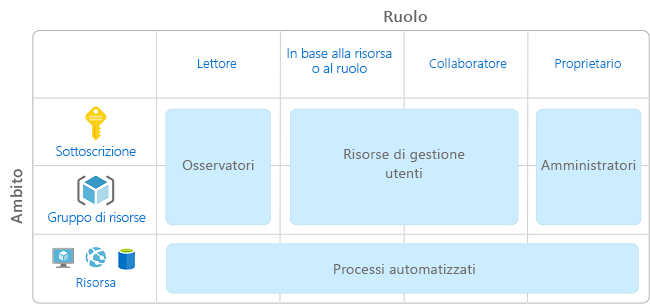
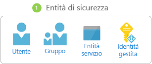
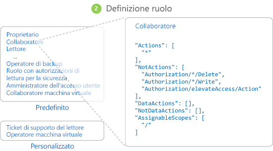
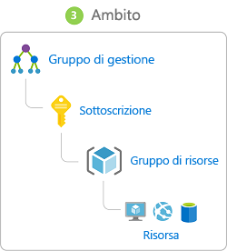
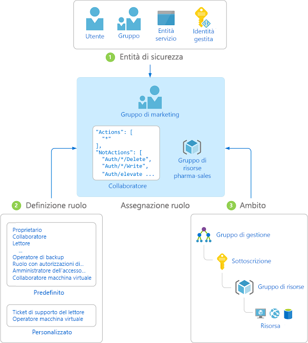

# Che cos'è il controllo degli accessi in base al ruolo?

La gestione dell'accesso per le risorse cloud è una funzione essenziale per qualsiasi organizzazione che usa il cloud. Il controllo degli accessi in base al ruolo consente la gestione degli utenti autorizzati ad accedere alle risorse di Azure, delle operazioni che possono eseguire su tali risorse e delle aree a cui hanno accesso.

Il controllo degli accessi in base al ruolo è un sistema di autorizzazione basato su [Azure Resource Manager](../azure-resource-manager/resource-group-overview.md) che garantisce una gestione degli accessi con granularità fine delle risorse in Azure.

## Quali operazioni si possono eseguire con il controllo degli accessi in base al ruolo?

Di seguito sono riportati alcuni esempi di operazioni eseguibili con il controllo degli accessi in base al ruolo:

- Consentire a un utente di gestire le macchine virtuali in una sottoscrizione e un altro utente a gestire le reti virtuali
- Consentire a un gruppo di amministratori di database di gestire database SQL all'interno di una sottoscrizione
- Consentire a un utente di gestire tutte le risorse in un gruppo di risorse, ad esempio le macchine virtuali, i siti Web e le subnet
- Consentire a un'applicazione di accedere a tutte le risorse in un gruppo di risorse

## Procedure consigliate per l'uso del controllo degli accessi in base al ruolo

Usando il Controllo degli accessi in base al ruolo, è possibile separare i compiti all'interno del team e concedere agli utenti solo la quantità di accesso di cui hanno bisogno per svolgere il proprio lavoro. Invece di concedere a tutti autorizzazioni senza restrizioni per la sottoscrizione o le risorse di Azure, è possibile consentire solo determinate azioni in un particolare ambito.

Quando si pianifica la strategia di controllo degli accessi, è consigliabile concedere agli utenti almeno il privilegio per completare la propria sessione di lavoro. Il diagramma seguente mostra uno schema consigliato per l'uso del controllo degli accessi in base al ruolo.

## Come funziona il controllo degli accessi in base al ruolo

Il modo in cui si controlla l'accesso alle risorse utilizzando il controllo degli accessi in base al ruolo è quello di creare assegnazioni di ruolo. Questo è un concetto chiave da comprendere: si tratta di come sono applicate le autorizzazioni. Un'assegnazione di ruolo è costituita da tre elementi: entità di sicurezza, definizione del ruolo e ambito.

### Entità di sicurezza

Un'*entità di sicurezza* è un oggetto che rappresenta un utente, un gruppo o un'entità servizio che richiede l'accesso alle risorse di Azure.

- Utente: un soggetto che dispone di un profilo in Azure Active Directory. È anche possibile assegnare ruoli agli utenti in altri tenant. Per informazioni sugli utenti in altre organizzazioni, vedere [Azure Active Directory B2B](/azure/active-directory/active-directory-b2b-what-is-azure-ad-b2b).
- Gruppo: un set di utenti creato in Azure Active Directory. Quando si assegna un ruolo a un gruppo, tutti gli utenti all'interno di tale gruppo dispongono del ruolo appropriato. 
- Entità servizio: un'identità di sicurezza utilizzata da applicazioni o servizi per accedere a specifiche risorse di Azure. È possibile pensare a questo elemento come a un'*identità utente* (nome utente e password o certificato) per un'applicazione.

### Definizione di ruolo

Una *definizione di ruolo* è una raccolta di autorizzazioni, talvolta semplicemente chiamata *ruolo*. Una definizione di ruolo elenca le operazioni che è possibile eseguire, ad esempio lettura, scrittura ed eliminazione, I ruoli possono essere di livello superiore, ad esempio quello di proprietario, o specifici, ad esempio quello di lettore di macchina virtuale.

Azure include diversi [ruoli predefiniti](built-in-roles.md) che è possibile usare. Di seguito sono elencati quattro fondamentali ruoli predefiniti. I primi tre si applicano a tutti i tipi di risorse.

- [Proprietario](built-in-roles.md#owner): ha accesso completo a tutte le risorse, compreso il diritto di delegare l'accesso ad altri utenti.
- [Collaboratore](built-in-roles.md#contributor): può creare e gestire tutti i tipi di risorse di Azure, ma non può concedere l'accesso ad altri.
- [Lettore](built-in-roles.md#reader): può visualizzare le risorse di Azure esistenti.
- [Amministratore Accesso utenti](built-in-roles.md#user-access-administrator): consente di gestire l'accesso degli utenti alle risorse di Azure.

Il resto dei ruoli predefiniti consente la gestione di risorse di Azure specifiche. Ad esempio, il ruolo [Collaboratore Macchina virtuale](built-in-roles.md#virtual-machine-contributor) consente a un utente di creare e gestire macchine virtuali. Se i ruoli predefiniti non soddisfano le esigenze specifiche dell'organizzazione, è possibile creare [ruoli personalizzati](custom-roles.md).

Azure ha introdotto operazioni sui dati (attualmente in anteprima) che consentono di concedere l'accesso ai dati all'interno di un oggetto. Ad esempio, se un utente dispone dell'accesso in lettura ai dati per un account di archiviazione, può leggere i BLOB o i messaggi all'interno di tale account. Per altre informazioni, vedere [Informazioni sulle definizioni del ruolo](role-definitions.md).

### Scope

*Ambito* è il limite al quale si applica l'accesso. Quando si assegna un ruolo, è possibile limitare ulteriormente le azioni consentite definendo un ambito. Ciò è utile se si intende creare un [collaboratore di siti Web](built-in-roles.md#website-contributor), ma solo per un gruppo di risorse.

In Azure, è possibile specificare un ambito su più livelli: sottoscrizione, gruppo di risorse o risorsa. Gli ambiti sono strutturati in base a una relazione padre-figlio in cui ogni elemento figlio avrà un solo padre.

L'accesso assegnato a un ambito padre viene ereditato dall'ambito figlio. Ad esempio: 

- Se si assegna il ruolo [Lettore](built-in-roles.md#reader) a un gruppo nell'ambito di sottoscrizione, i membri di tale gruppo possono visualizzare ogni gruppo di risorse e risorsa nella sottoscrizione.
- Se si assegna il ruolo [Collaboratore](built-in-roles.md#contributor) a un'applicazione nell'ambito del gruppo di risorse, è possibile gestire risorse di tutti i tipi in quel gruppo di risorse, ma non altri gruppi di risorse nella sottoscrizione.

Azure include anche un ambito oltre le sottoscrizioni chiamato [gruppi di gestione](../azure-resource-manager/management-groups-overview.md), che è disponibile in anteprima. I gruppi di gestione rappresentano un modo per gestire più sottoscrizioni. Quando si specifica l'ambito per il controllo degli accessi in base al ruolo, è possibile specificare un gruppo di gestione o una sottoscrizione, un gruppo di risorse o una gerarchia di risorse.

### Assegnazione di ruolo

Un'*assegnazione di ruolo* è il processo di associazione della definizione di un ruolo a un utente, un gruppo o un fornitore di servizi in un particolare ambito ai fini della concessione dell'accesso. L'accesso viene concesso mediante la creazione di un'assegnazione di ruolo e viene revocato rimuovendo un'assegnazione di ruolo.

Lo schema seguente mostra un esempio di assegnazione di ruolo. In questo esempio, al gruppo marketing è stato assegnato il ruolo di [collaboratore](built-in-roles.md#contributor) per il gruppo di risorse pharma-sales. Ciò significa che gli utenti del gruppo marketing possono creare o gestire le risorse di Azure nel gruppo di risorse pharma-sales. Gli utenti marketing non hanno accesso alle risorse all'esterno del gruppo di risorse pharma-sales, a meno che non facciano parte di un'altra assegnazione di ruolo.

È possibile creare assegnazioni di ruolo nel portale di Azure, nell'interfaccia della riga di comando di Azure, in Azure PowerShell, tramite gli SDK Azure o le API REST. È possibile avere fino a 2000 assegnazioni di ruolo in ogni sottoscrizione. Per creare e rimuovere assegnazioni di ruoli, l'utente deve disporre dell'autorizzazione `Microsoft.Authorization/roleAssignments/*`. Questa autorizzazione viene concessa tramite il ruolo [Proprietario](built-in-roles.md#owner) o [Amministratore accessi utente](built-in-roles.md#user-access-administrator).

## Passaggi successivi

- [Quickstart: Grant access for a user using RBAC and the Azure portal](quickstart-assign-role-user-portal.md) (Guida introduttiva: Concedere l'accesso a un utente tramite il controllo degli accessi in base al ruolo e il portale di Azure)
- [Gestire l'accesso usando il controllo degli accessi in base al ruolo e il portale di Azure](role-assignments-portal.md)
- [Comprendere i diversi ruoli in Azure](rbac-and-directory-admin-roles.md)
