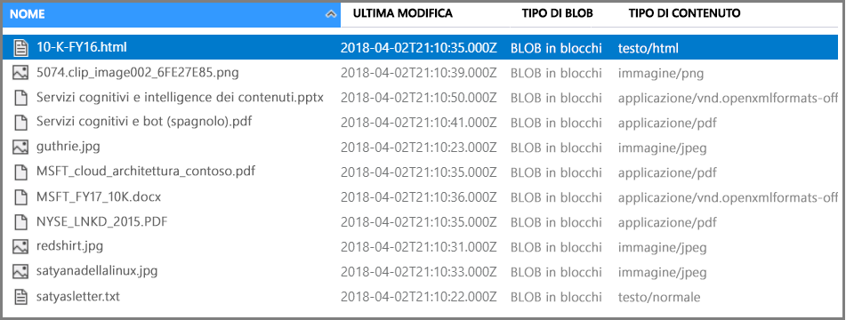
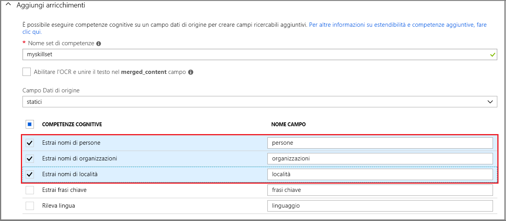
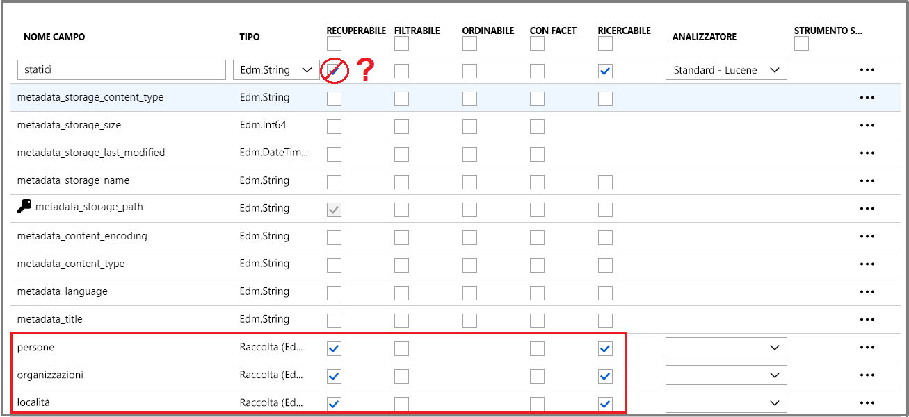

# Guida introduttiva: Creare una pipeline di ricerca cognitiva con competenze e dati di esempio

La ricerca cognitiva (anteprima) aggiunge competenza di estrazione dei dati, di elaborazione del linguaggio naturale (NLP) e di elaborazione delle immagini a una pipeline di indicizzazione di Ricerca di Azure, rendendo più ricercabile il contenuto non ricercabile o non strutturato. Le informazioni create da una competenza, ad esempio il riconoscimento dell'entità o l'analisi delle immagini, vengono aggiunte a un indice in Ricerca di Azure.

In questa Guida introduttiva è possibile provare la pipeline di arricchimento nel [portale di Azure](https://portal.azure.com) prima di scrivere una singola riga di codice:

* Iniziare con i dati di esempio nell'archivio BLOB di Azure
* Configurare l'[Importazione guidata dati](search-import-data-portal.md) per l'indicizzazione e l'arricchimento 
* Eseguire la procedura guidata (una competenza entità rileva gli utenti, la posizione e le organizzazioni)
* Usare [Esplora ricerche](search-explorer.md) per eseguire una query per i dati arricchiti.

##  Aree supportate

È possibile provare la ricerca cognitiva in un servizio Ricerca di Azure creato nelle aree seguenti:

* Stati Uniti centro-occidentali
* Stati Uniti centro-meridionali
* Stati Uniti orientali
* Europa occidentale
* Europa settentrionale
* Asia sud-orientale

Se non si ha una sottoscrizione di Azure, creare un [account gratuito](https://azure.microsoft.com/free/?WT.mc_id=A261C142F) prima di iniziare.

> [!NOTE]
> La ricerca cognitiva è disponibile in anteprima pubblica. Le funzionalità di esecuzione di set di competenze e di estrazione e normalizzazione di immagini sono attualmente disponibili gratuitamente. Il prezzo per queste funzionalità verrà annunciato in un momento successivo. 

## Prerequisiti

["Che cos'è la ricerca cognitiva?"](cognitive-search-concept-intro.md) introduce l'architettura e i componenti dell'arricchimento. 

Servizi di Azure viene usato esclusivamente in questo scenario. La creazione dei servizi necessari fa parte della preparazione.

+ Archivio BLOB di Azure fornisce i dati di origine.
+ Ricerca di Azure gestisce l'inserimento dati e l'indicizzazione, l'arricchimento della ricerca cognitiva e le query di ricerca full-text.

### Configurare Ricerca di Azure

Prima di tutto, iscriversi al servizio Ricerca di Azure. 

1. Passare al [portale di Azure](https://portal.azure.com) e accedere con l'account di Azure.

1. Fare clic su **Crea una risorsa**, cercare Ricerca di Azure e fare clic su **Crea**. Vedere [Creare un servizio di Ricerca di Azure nel portale](search-create-service-portal.md) se è la prima volta che si configura un servizio di ricerca ed è necessaria ulteriore assistenza.

  

1. Per Gruppo di risorse creare un gruppo di risorse per contenere tutte le risorse che verranno create in questa guida introduttiva. In questo modo è più semplice pulire le risorse dopo aver completato la Guida introduttiva.

1. Per Località scegliere una delle [aree supportate](#supported-regions) per la ricerca cognitiva.

1. Per Piano tariffario è possibile creare un servizio **Gratuito** per completare le esercitazioni e le guide introduttive. Per eseguire altre analisi usando dati personali, creare un [servizio a pagamento](https://azure.microsoft.com/pricing/details/search/), ad esempio **Basic** o **Standard**. 

  Un servizio Gratuito è limitato a 3 indici, dimensioni BLOB massime di 16 MB e 2 minuti di indicizzazione, capacità insufficienti per mettere alla prova tutte le funzionalità della ricerca cognitiva. Per esaminare i limiti per i diversi livelli, vedere [Limiti del servizio](search-limits-quotas-capacity.md).

  > [!NOTE]
  > La ricerca cognitiva è disponibile in anteprima pubblica. L'esecuzione di set di competenze è attualmente disponibile in tutti i livelli, incluso quello gratuito. Il prezzo per questa funzionalità verrà annunciato in un momento successivo.

1. Aggiungere il servizio al dashboard per un rapido accesso alle informazioni sul servizio.

  

### Configurare il servizio BLOB di Azure e caricare i dati di esempio

La pipeline di arricchimento effettua il pull da origini dati di Azure supportate dagli [indicizzatori di Ricerca di Azure](search-indexer-overview.md). Per questo esercizio viene usato l'archivio BLOB per presentare più tipi di contenuto.

1. [Scaricare i dati di esempio](https://1drv.ms/f/s!As7Oy81M_gVPa-LCb5lC_3hbS-4) costituiti da un piccolo set di file di tipi diversi. 

1. Effettuare l'iscrizione per l'archivio BLOB di Azure, creare un account di archiviazione, accedere a Storage Explorer e creare un contenitore. Vedere la [guida introduttiva ad Azure Storage Explorer](../storage/blobs/storage-quickstart-blobs-storage-explorer.md) per istruzioni su tutti i passaggi.

1. Con Azure Storage Explorer nel contenitore creato fare clic su **Carica** per caricare i file di esempio.

  

## Creare la pipeline di arricchimento

Tornare alla pagina dashboard del servizio Ricerca di Azure e fare clic su **Importa dati** sulla barra dei comandi per impostare l'arricchimento in quattro passaggi.

### Passaggio 1: Creare un'origine dati

In **Definisci la connessione ai dati** > **Archiviazione BLOB di Azure**, selezionare l'account e il contenitore creati. Assegnare un nome origine dati e utilizzare i valori predefiniti per il resto. 

   

Fare clic su **OK** per creare l'origine dati.

Uno dei vantaggi dell'utilizzo dell'**Importazione guidata dati** è che consente anche di creare l'indice. Quando viene creata l'origine dati, la procedura guidata crea contemporaneamente uno scheda dell'indice. La creazione dell'indice può richiedere alcuni secondi.

### Passaggio 2: Aggiungere competenze cognitive

Successivamente, aggiungere i passaggi di arricchimento alla pipeline di indicizzazione. Nel portale sono disponibili competenze cognitive predefinite per l'analisi delle immagini e l'analisi del testo. Nel portale, un set di competenze agisce su un campo di origine singolo. Ciò potrebbe sembrare una destinazione di piccole dimensioni, ma per i BLOB di Azure il campo `content` contiene la maggior parte del documento BLOB (ad esempio, un documento Word o un di mazzo PowerPoint). Di conseguenza, questo campo è un input ideale perché contiene tutto il contenuto del BLOB.

A volte può essere utile estrarre la rappresentazione testuale da file composti prevalentemente da immagini digitalizzate, ad esempio un file PDF generato da uno scanner. Ricerca di Azure può estrarre automaticamente il contenuto da immagini incorporate nel documento. A tale scopo, selezionare l'opzione **Enable OCR and merge all text into merged_content field** (Abilita OCR e unisci tutto il testo nel campo merged_content). Questo comando creerà automaticamente un campo `merged_content` che contiene sia il testo estratto dal documento che la rappresentazione testuale delle immagini incorporate nel documento. Quando si seleziona questa opzione il campo `Source data field` verrà impostato su `merged_content`.

In **Aggiungi competenze cognitive**, scegliere le competenze che eseguono l'elaborazione del linguaggio naturale. Per questa Guida introduttiva, scegliere il riconoscimento entità per gli utenti, le organizzazioni e i percorsi.

Fare clic su **OK** per accettare la definizione.
   
  

L'elaborazione del linguaggio naturale viene eseguita tramite il contenuto di testo nel set di dati di esempio. Poiché non sono state selezionate opzioni di elaborazione delle immagini, il file JPEG trovato nel set di dati di esempio non verrà elaborato in questa Guida introduttiva. 

### Passaggio 3: Configurare l'indice

L'utente ricorda l'indice creato con l'origine dati? In questo passaggio è possibile visualizzare lo schema e potenzialmente rivedere tutte le impostazioni. 

Per questa Guida introduttiva, la procedura guidata ha imposta valori predefiniti ragionevoli in modo efficace: 

+ Ogni indice deve avere un nome. Per questo tipo di origine dati, il nome predefinito è *azureblob-index*.

+ Ogni documento deve avere una chiave. La procedura guidata sceglie un campo con valori univoci. In questa Guida introduttiva, la chiave è *metadata_storage_path*.

+ Ogni insieme di campi deve includere campi con un tipo di dati che descrivono i relativi valori e ogni campo deve contenere attributi indice che descrivono come viene utilizzato nello scenario di ricerca. 

Poiché è stato definito n set di competenze, la procedura guida presume che si vogliono il campo dati di origine e i campi di output creati dalle competenze. Per questo motivo, il portale aggiunge campi di indice per `content`, `people`, `organizations` e `locations`. Si noti che la procedura guidata abilita automaticamente Recuperabile e Ricercabile per questi campi.

In **Personalizza indice** esaminare gli attributi nei campi per vedere come vengono utilizzati in un indice. Ricercabile indica un campo in cui è possibile eseguire ricerche. Recuperabile significa che può essere restituito nei risultati. 

Provare a cancellare Recuperabile dal campo `content`. Nei BLOB questo campo può estendersi a migliaia di righe, difficili da leggere in uno strumento come **Esplora ricerche**.

Fare clic su **OK** per accettare la definizione dell'indice.

  

> [!NOTE]
> I campi non utilizzati sono stati eliminati dalla screenshot per ragioni di brevità. Proseguendo nel portale, nell'elenco vengono visualizzati campi aggiuntivi.

### Passaggio 4: Configurare l'indicizzatore

L'indicizzatore è una risorsa di alto livello che guida il processo di indicizzazione. Specifica il nome dell'origine dati, l'indice e la frequenza di esecuzione. Il risultato finale dell'**Importazione guidata dati** è sempre un indicizzatore che è possibile eseguire ripetutamente.

Nella pagina **Indicizzatore** assegnare un nome all'indicizzatore e utilizzare il valore predefinito "Esegui una sola volta" per eseguirlo immediatamente. 

  

Fare clic su **OK** per importare, arricchire e indicizzare i dati.

  

L'indicizzazione e l'arricchimento possono richiedere tempo, per questo motivo sono consigliati set di dati più piccoli per l'esplorazione anticipata. È possibile monitorare l'indicizzazione nella pagina Notifiche del portale di Azure. 

## Eseguire query in Esplora ricerche

Dopo aver creato un indice, è possibile inviare query per la restituzione di documenti dall'indice. Nel portale usare **Esplora ricerche** per eseguire query e visualizzare i risultati. 

1. Nella pagina del dashboard del servizio di ricerca fare clic su **Esplora ricerche** sulla barra dei comandi.

1. Selezionare **Cambia indice** in alto per selezionare l'indice creato.

1. Immettere una stringa di ricerca per una query nell'indice, ad esempio "John F. Kennedy".

I risultati vengono restituiti in formato JSON, che può essere dettagliato e difficile da leggere, soprattutto in documenti di grandi dimensioni proveniente da BLOB di Azure. 

Se non è possibile analizzare facilmente i risultati, usare CTRL + F per cercare all'interno dei documenti. Per questa query, è possibile eseguire la ricerca di "John F. Kennedy" all'interno di JSON per visualizzare le istanze di tale termine di ricerca. 

CTRL + F consente inoltre di determinare il numero di documenti presenti in un determinato set di risultati. Per i BLOB di Azure, il portale sceglie "metadata_storage_path" come chiave perché ogni valore è univoco per il documento. Usando CTRL-F, cercare "metadata_storage_path" per ottenere il conteggio dei documenti. Per questa query, due documenti nei risultati contengono il termine "John F. Kennedy".

  

## Risultati

Il primo esercizio di indicizzazione arricchito è stato completato. Lo scopo di questa Guida introduttiva era quello di introdurre i concetti importanti e assistere l'utente nella procedura guidata per creare un prototipo di soluzione di ricerca cognitiva usando i propri dati.

Alcuni concetti chiave ci auguriamo l'utente abbia compreso includono la dipendenza da origini dati di Azure. L'arricchimento della ricerca cognitiva è associato a indicizzatori e gli indicizzatori sono specifici di Azure e dell'origine. Anche se in questa Guida introduttiva viene usato Archivio BLOB di Azure, sono possibili altre origini dati di Azure. Per altre informazioni, vedere [Indicizzatori in Ricerca di Azure](search-indexer-overview.md).

Un altro concetto importante è che le competenze vengono eseguite tramite campi di input. Nel portale, è necessario scegliere un singolo campo di origine per tutte le competenze. Nel codice, gli input possono essere altri campi o l'output di una competenza upstream.

 Viene eseguito il mapping degli input di una competenza a un campo di output in un indice. Internamente, il portale configura [annotazioni](cognitive-search-concept-annotations-syntax.md) e definisce un [set di competenze](cognitive-search-defining-skillset.md), stabilendo l'ordine delle operazioni e il flusso generale. Questi passaggi sono nascosti nel portale, ma quando si avvia la scrittura di codice, questi concetti diventano importanti.

Infine, si è appreso che la visualizzazione dei risultati viene ottenuta eseguendo una query dell'indice. Infine, Ricerca di Azure offre un indice ricercabile, in cui è possibile eseguire una query utilizzando la [sintassi di query semplice](https://docs.microsoft.com/rest/api/searchservice/simple-query-syntax-in-azure-search) oppure [completamente estesa](https://docs.microsoft.com/rest/api/searchservice/lucene-query-syntax-in-azure-search). Un indice che contiene campi arricchiti è come qualsiasi altro. Se si intende incorporare [analizzatori personalizzati](search-analyzers.md) o standard, [profili di punteggio](https://docs.microsoft.com/rest/api/searchservice/add-scoring-profiles-to-a-search-index), [sinonimi](search-synonyms.md), [filtri con facet](search-filters-facets.md), ricerca geografica o qualsiasi altra funzionalità di Ricerca di Azure, è possibile farlo.

## Pulire le risorse

Se l'esplorazione è conclusa, il modo più veloce per pulire le risorse consiste nell'eliminare il gruppo di risorse contenente il servizio Ricerca di Azure e il servizio BLOB di Azure.  

Supponendo che entrambi i servizi siano stati inseriti nello stesso gruppo, eliminare il gruppo di risorse a questo punto per eliminare definitivamente tutti gli elementi in esso contenuti, inclusi i servizi e qualsiasi contenuto archiviato creato per questo esercizio. Nel portale, il nome del gruppo di risorse è indicato nella pagina Panoramica di ciascun servizio.

## Passaggi successivi

È possibile usare l'esperimento e l'arricchimento rieseguendo la procedura guidata con diverse competenze e campi di origine dati. Per ripetere questa procedura, eliminare l'indice e l'indicizzatore, quindi ricreare l'indicizzatore con una nuova combinazione di selezioni.

+ In **Panoramica** > **Indici** selezionare l'indice creato e quindi fare clic su **Elimina**.

+ In **Panoramica** fare doppio clic nel riquadro **Indicizzatori**. Individuare l'indicizzatore creato ed eliminarlo.

In alternativa, riutilizzare i dati di esempio e i servizi creati per apprendere come eseguire stesse attività a livello di codice nella prossima esercitazione. 

> [!div class="nextstepaction"]
> [Esercitazione: Informazioni sull'API REST di ricerca cognitiva](cognitive-search-tutorial-blob.md)
