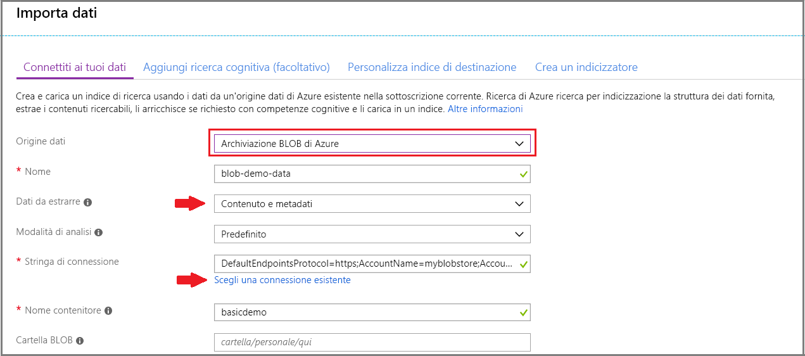
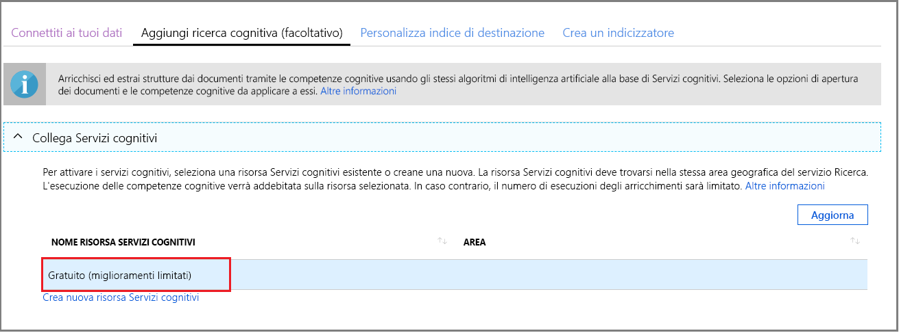
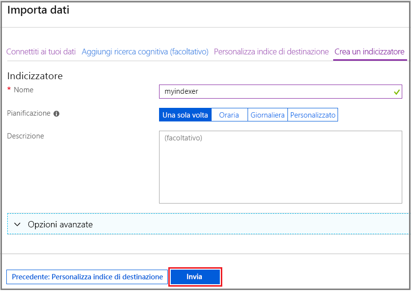
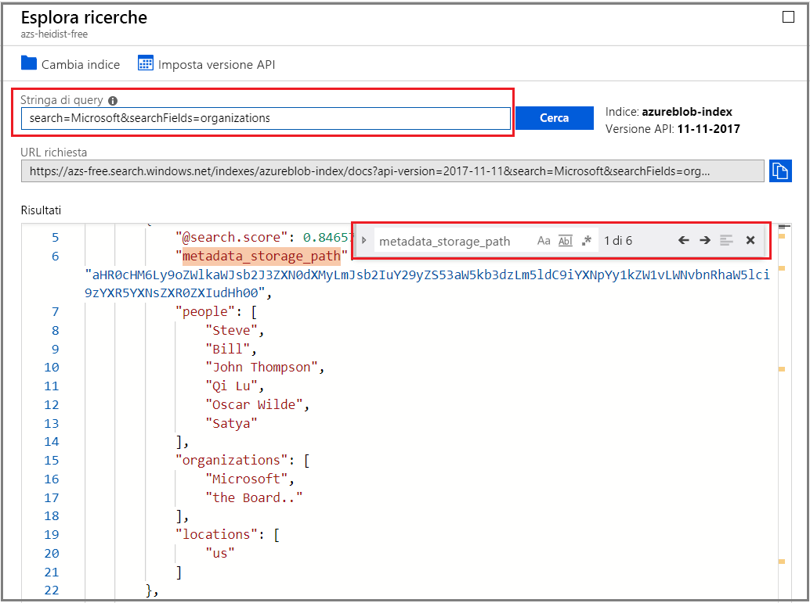

# Guida introduttiva: creare una pipeline di ricerca cognitiva con competenze e dati di esempio

La ricerca cognitiva (anteprima) aggiunge competenza di estrazione dei dati, di elaborazione del linguaggio naturale (NLP) e di elaborazione delle immagini a una pipeline di indicizzazione di Ricerca di Azure, rendendo più ricercabile il contenuto non ricercabile o non strutturato. 

Una pipeline di ricerca cognitiva integra [risorse di Servizi cognitivi](https://azure.microsoft.com/services/cognitive-services/), ad esempio [OCR](cognitive-search-skill-ocr.md), [rilevamento della lingua](cognitive-search-skill-language-detection.md) e [riconoscimento delle entità](cognitive-search-skill-entity-recognition.md), in un processo di indicizzazione. Gli algoritmi di intelligenza artificiale di Servizi cognitivi vengono usati per individuare modelli, funzionalità e caratteristiche nei dati di origine, restituendo strutture e contenuto testuale che è possibile usare nella soluzioni di ricerca full-text basate su Ricerca di Azure.

In questo argomento di avvio rapido è possibile creare la prima pipeline di arricchimento nel [portale di Azure](https://portal.azure.com) prima di scrivere una singola riga di codice:

> [!div class="checklist"]
> * Iniziare con i dati di esempio nell'archivio BLOB di Azure
> * Configurare l'[**Importazione guidata dati**](search-import-data-portal.md) per l'indicizzazione cognitiva e l'arricchimento 
> * Eseguire la procedura guidata (una competenza entità rileva gli utenti, la posizione e le organizzazioni)
> * Usare [**Esplora ricerche**](search-explorer.md) per eseguire query sui dati arricchiti

##  Aree supportate

È possibile provare la ricerca cognitiva in un servizio Ricerca di Azure creato nelle aree seguenti:

* Stati Uniti centro-occidentali
* Stati Uniti centro-meridionali
* Stati Uniti orientali
* Stati Uniti orientali 2
* Stati Uniti occidentali 2
* Canada centrale
* Europa occidentale
* Regno Unito meridionale
* Europa settentrionale
* Brasile meridionale
* Asia sud-orientale
* India centrale
* Australia orientale

Se non si ha una sottoscrizione di Azure, creare un [account gratuito](https://azure.microsoft.com/free/?WT.mc_id=A261C142F) prima di iniziare.

> [!NOTE]
> A partire dal 21 dicembre 2018 è possibile associare una risorsa dei Servizi cognitivi a un set di competenze della Ricerca di Azure. In questo modo sarà possibile iniziare ad addebitare per l'esecuzione del set di competenze. In questa data avrà inizio anche l'addebito dell'estrazione delle immagini come parte della fase di individuazione dei documenti. L'estrazione del testo dai documenti continuerà a essere offerta gratuitamente.
>
> L'esecuzione delle competenze predefinite verrà addebitata in base ai[prezzi con pagamento in base al consumo dei Servizi cognitivi](https://azure.microsoft.com/pricing/details/cognitive-services/). Per l'estrazione delle immagini verranno applicati i prezzi di anteprima, come illustrato nella [pagina dei prezzi di Ricerca di Azure](https://go.microsoft.com/fwlink/?linkid=2042400). [Altre informazioni](cognitive-search-attach-cognitive-services.md).

## Prerequisiti

["Che cos'è la ricerca cognitiva?"](cognitive-search-concept-intro.md) introduce l'architettura e i componenti dell'arricchimento. 

Servizi di Azure viene usato esclusivamente in questo scenario. La creazione dei servizi necessari fa parte della preparazione.

+ [Archiviazione BLOB di Azure](https://azure.microsoft.com/services/storage/blobs/) fornisce i dati di origine
+ [Servizi cognitivi](https://azure.microsoft.com/services/cognitive-services/) fornisce l'intelligenza artificiale (è possibile creare queste risorse in linea, quando si specifica la pipeline)
+ [Ricerca di Azure](https://azure.microsoft.com/services/search/) fornisce la pipeline di indicizzazione arricchita e un'esperienza avanzata di ricerca di testo in formato libero da usare nelle app personalizzate

### Configurare Ricerca di Azure

Prima di tutto, iscriversi al servizio Ricerca di Azure. 

1. Passare al [portale di Azure](https://portal.azure.com) e accedere con l'account di Azure.

1. Fare clic su **Crea una risorsa**, cercare Ricerca di Azure e fare clic su **Crea**. Vedere [Creare un servizio di Ricerca di Azure nel portale](search-create-service-portal.md) se è la prima volta che si configura un servizio di ricerca ed è necessaria ulteriore assistenza.

  

1. Per Gruppo di risorse creare un nuovo gruppo di risorse per contenere tutte le risorse che verranno create in questo argomento di avvio rapido. In questo modo è più semplice pulire le risorse dopo aver completato la Guida introduttiva.

1. Per Località scegliere una delle [aree supportate](#supported-regions) per la ricerca cognitiva.

1. Per Piano tariffario è possibile creare un servizio **Gratuito** per completare le esercitazioni e le guide introduttive. Per eseguire altre analisi usando dati personali, creare un [servizio a pagamento](https://azure.microsoft.com/pricing/details/search/), ad esempio **Basic** o **Standard**. 

  Un servizio Gratuito è limitato a 3 indici, dimensioni BLOB massime di 16 MB e 2 minuti di indicizzazione, capacità insufficienti per mettere alla prova tutte le funzionalità della ricerca cognitiva. Per esaminare i limiti per i diversi livelli, vedere [Limiti del servizio](search-limits-quotas-capacity.md).

  

  > [!NOTE]
  > La ricerca cognitiva è disponibile in anteprima pubblica. L'esecuzione di set di competenze è attualmente disponibile in tutti i livelli, incluso quello gratuito. Sarà possibile eseguire un numero limitato di miglioramenti senza associare una risorsa di Servizi cognitivi a pagamento. [Altre informazioni](cognitive-search-attach-cognitive-services.md).

1. Aggiungere il servizio al dashboard per un rapido accesso alle informazioni sul servizio.

  

### Configurare il servizio BLOB di Azure e caricare i dati di esempio

La pipeline di arricchimento effettua il pull da origini dati di Azure supportate dagli [indicizzatori di Ricerca di Azure](search-indexer-overview.md). Nota bene: il servizio tabelle di Azure non è supportato per la ricerca cognitiva. Per questo esercizio viene usato l'archivio BLOB per presentare più tipi di contenuto.

1. [Scaricare i dati di esempio](https://1drv.ms/f/s!As7Oy81M_gVPa-LCb5lC_3hbS-4) costituiti da un piccolo set di file di tipi diversi. 

1. Effettuare l'iscrizione per l'archivio BLOB di Azure, creare un account di archiviazione, aprire le pagine del servizio BLOB e creare un contenitore. Nel contenitore, impostare il livello di accesso pubblico su **Contenitore**. Per altre informazioni, vedere la [sezione "Creare un contenitore"](../storage/blobs/storage-unstructured-search.md#create-a-container) nell'esercitazione *Cercare dati non strutturati*.

1. Nel contenitore creato fare clic su **Carica** per caricare i file di esempio nel passaggio precedente.

  

## Creare la pipeline di arricchimento

Tornare alla pagina dashboard del servizio Ricerca di Azure e fare clic su **Importa dati** sulla barra dei comandi per impostare l'arricchimento cognitivo in quattro passaggi.

  

### Passaggio 1: Creare un'origine dati

In **Definisci la connessione ai dati** scegliere **Archiviazione BLOB di Azure** e selezionare l'account e il contenitore creati. Assegnare un nome origine dati e utilizzare i valori predefiniti per il resto. 

  

Passare alla pagina successiva.

  

### Passaggio 2: Aggiungere competenze cognitive

Successivamente, aggiungere i passaggi di arricchimento alla pipeline di indicizzazione. Se non si ha una risorsa di Servizi cognitivi, è possibile iscriversi per una versione gratuita che offre 20 transazioni al giorno. I dati di esempio sono costituiti da 14 file, quindi l'allocazione giornaliera risulterà usata quasi completamente dopo aver eseguito questa procedura guidata.

1. Espandere **Collega Servizi cognitivi** per visualizzare le opzioni per le API Servizi cognitivi. Ai fini di questa esercitazione, è possibile usare la risorsa **Gratuita**.

  

2. Espandere **Aggiungi arricchimenti** e selezionare le competenze che eseguono l'elaborazione del linguaggio naturale. Per questa Guida introduttiva, scegliere il riconoscimento entità per gli utenti, le organizzazioni e i percorsi.

  

  Il portale offre competenze predefinite per l'analisi del testo e l'elaborazione OCR. Nel portale, un set di competenze agisce su un campo di origine singolo. Ciò potrebbe sembrare una destinazione di piccole dimensioni, ma per i BLOB di Azure il campo `content` contiene la maggior parte del documento BLOB (ad esempio, un documento Word o un di mazzo PowerPoint). Di conseguenza, questo campo è un input ideale perché contiene tutto il contenuto del BLOB.

3. Passare alla pagina successiva.

  

> [!NOTE]
> L'elaborazione del linguaggio naturale viene eseguita tramite il contenuto di testo nel set di dati di esempio. Poiché l'opzione OCR non è stata selezionata, i file JPEG e PNG trovati nel set di dati di esempio non verranno elaborati in questo argomento di avvio rapido. 

### Passaggio 3: Configurare l'indice

La procedura guidata in genere è in grado di dedurre un indice predefinito. In questo passaggio è possibile visualizzare lo schema dell'indice generato e potenzialmente rivedere le impostazioni. Di seguito è riportato l'indice predefinito creato per il set di dati dimostrativi BLOB.

Per questa Guida introduttiva, la procedura guidata ha imposta valori predefiniti ragionevoli in modo efficace: 

+ Il nome predefinito è *azureblob-index* in base al tipo di origine dati. 

+ I campi predefiniti si basano sul campo dati di origine iniziale (`content`) e i campi di output ( `people`, `organizations` e `locations`) creati dalla pipeline cognitiva. I tipi di dati predefiniti vengono dedotti dai metadati e dal campionamento dei dati.

+ La chiave predefinita è *metadata_storage_path* (questo campo contiene valori univoci).

+ Gli attributi predefiniti per questi campi sono **Recuperabile** e **Ricercabile**. **Ricercabile** indica un campo in cui è possibile eseguire ricerche. **Recuperabile** significa che può essere restituito nei risultati. La procedura guidata presuppone che si voglia rendere questi campi recuperabili e ricercabili perché sono stati creati con un insieme di competenze.

  

Osservare il testo barrato e il punto interrogativo sull'attributo **Recuperabile** accanto al campo `content`. Per i documenti BLOB a elevato utilizzo di testo, il campo `content` contiene la maggior parte del contenuto del file, eseguito potenzialmente in migliaia di righe. Se è necessario passare il contenuto del file al codice client, assicurarsi che il campo **Recuperabile** resti selezionato. In caso contrario, prendere in considerazione la cancellazione di questo attributo in `content` se gli elementi estratti (`people`, `organizations` e `locations`) sono sufficienti per gli scopi desiderati.

Contrassegnare un campo come **Recuperabile** non significa che il campo *debba* essere presente nei risultati della ricerca. È possibile controllare con precisione la composizione dei risultati della ricerca usando il parametro di query **$select** per specificare i campi da includere. Per i campi con grandi quantità di testo come `content`, il parametro **$select** è la soluzione per fornire risultati della ricerca gestibili agli utenti umani dell'applicazione, garantendo allo stesso tempo che il codice abbia accesso a tutte le informazioni necessarie attraverso l'attributo **Recuperabile**.
  
Passare alla pagina successiva.

  

### Passaggio 4: Configurare l'indicizzatore

L'indicizzatore è una risorsa di alto livello che guida il processo di indicizzazione. Specifica il nome dell'origine dati, l'indice di destinazione e la frequenza di esecuzione. Il risultato finale dell'**Importazione guidata dati** è sempre un indicizzatore che è possibile eseguire ripetutamente.

Nella pagina **Indicizzatore** si può accettare il nome predefinito e usare l'opzione di pianificazione **Esegui una volta** per l'esecuzione immediata. 

  

Fare clic su **Invia** per creare e contemporaneamente eseguire l'indicizzatore.

## Monitorare l'indicizzazione

I passaggi di arricchimento richiedono più tempo rispetto all'indicizzazione tipica basata su testo. La procedura guidata dovrebbe aprire l'elenco degli indicizzatori nella pagina di panoramica in modo che sia possibile monitorare lo stato di avanzamento. In caso contrario, passare alla pagina Panoramica e fare clic su **Indicizzatori**.

L'avviso viene visualizzato perché i file JPG e PNG sono file di immagine e la competenza OCR è stata omessa da questa pipeline. Verranno anche visualizzate notifiche di troncamento. Ricerca di Azure limita l'estrazione a 32.000 caratteri nel livello gratuito.

  

L'indicizzazione e l'arricchimento possono richiedere tempo, per questo motivo sono consigliati set di dati più piccoli per l'esplorazione anticipata. 

## Eseguire query in Esplora ricerche

Dopo aver creato un indice, è possibile inviare query per la restituzione di documenti dall'indice. Nel portale usare **Esplora ricerche** per eseguire query e visualizzare i risultati. 

1. Nella pagina del dashboard del servizio di ricerca fare clic su **Esplora ricerche** sulla barra dei comandi.

1. Selezionare **Cambia indice** in alto per selezionare l'indice creato.

1. Immettere una stringa di ricerca per una query nell'indice, ad esempio `search=Microsoft&searchFields=organizations`.

I risultati vengono restituiti in formato JSON, che può essere dettagliato e difficile da leggere, soprattutto in documenti di grandi dimensioni proveniente da BLOB di Azure. Se non è possibile analizzare facilmente i risultati, usare CTRL + F per cercare all'interno dei documenti. Per questa query, è possibile cercare termini specifici all'interno del codice JSON. 

CTRL + F consente inoltre di determinare il numero di documenti presenti in un determinato set di risultati. Per i BLOB di Azure, il portale sceglie "metadata_storage_path" come chiave perché ogni valore è univoco per il documento. Usando CTRL-F, cercare "metadata_storage_path" per ottenere il conteggio dei documenti. 

  

## Risultati

Il primo esercizio di indicizzazione arricchita con risorse cognitive è stato completato. Lo scopo di questa Guida introduttiva era quello di introdurre i concetti importanti e assistere l'utente nella procedura guidata per creare un prototipo di soluzione di ricerca cognitiva usando i propri dati.

Alcuni concetti chiave ci auguriamo l'utente abbia compreso includono la dipendenza da origini dati di Azure. L'arricchimento della ricerca cognitiva è associato a indicizzatori e gli indicizzatori sono specifici di Azure e dell'origine. Anche se in questa Guida introduttiva viene usato Archivio BLOB di Azure, sono possibili altre origini dati di Azure. Per altre informazioni, vedere [Indicizzatori in Ricerca di Azure](search-indexer-overview.md).

Un altro concetto importante è che le competenze vengono eseguite tramite campi di input. Nel portale, è necessario scegliere un singolo campo di origine per tutte le competenze. Nel codice, gli input possono essere altri campi o l'output di una competenza upstream.

 Viene eseguito il mapping degli input di una competenza a un campo di output in un indice. Internamente, il portale configura [annotazioni](cognitive-search-concept-annotations-syntax.md) e definisce un [set di competenze](cognitive-search-defining-skillset.md), stabilendo l'ordine delle operazioni e il flusso generale. Questi passaggi sono nascosti nel portale, ma quando si avvia la scrittura di codice, questi concetti diventano importanti.

Infine, si è appreso che la visualizzazione dei risultati viene ottenuta eseguendo una query dell'indice. Infine, Ricerca di Azure offre un indice ricercabile, in cui è possibile eseguire una query utilizzando la [sintassi di query semplice](https://docs.microsoft.com/rest/api/searchservice/simple-query-syntax-in-azure-search) oppure [completamente estesa](https://docs.microsoft.com/rest/api/searchservice/lucene-query-syntax-in-azure-search). Un indice che contiene campi arricchiti è come qualsiasi altro. Se si intende incorporare [analizzatori personalizzati](search-analyzers.md) o standard, [profili di punteggio](https://docs.microsoft.com/rest/api/searchservice/add-scoring-profiles-to-a-search-index), [sinonimi](search-synonyms.md), [filtri con facet](search-filters-facets.md), ricerca geografica o qualsiasi altra funzionalità di Ricerca di Azure, è possibile farlo.

## Pulire le risorse

Se l'esplorazione è conclusa, il modo più veloce per pulire le risorse consiste nell'eliminare il gruppo di risorse contenente il servizio Ricerca di Azure e il servizio BLOB di Azure.  

Supponendo che entrambi i servizi siano stati inseriti nello stesso gruppo, eliminare il gruppo di risorse a questo punto per eliminare definitivamente tutti gli elementi in esso contenuti, inclusi i servizi e qualsiasi contenuto archiviato creato per questo esercizio. Nel portale, il nome del gruppo di risorse è indicato nella pagina Panoramica di ciascun servizio.

## Passaggi successivi

In base al modo in cui si è effettuato il provisioning della risorsa di Servizi cognitivi, è possibile usare sperimentare con l'indicizzazione e l'arricchimento rieseguendo la procedura guidata con diverse competenze e campi di origine dati. Per ripetere questa procedura, eliminare l'indice e l'indicizzatore, quindi ricreare l'indicizzatore con una nuova combinazione di selezioni.

+ In **Panoramica** > **Indici** selezionare l'indice creato e quindi fare clic su **Elimina**.

+ In **Panoramica** fare doppio clic nel riquadro **Indicizzatori**. Individuare l'indicizzatore creato ed eliminarlo.

In alternativa, riutilizzare i dati di esempio e i servizi creati per apprendere come eseguire stesse attività a livello di codice nella prossima esercitazione. 

> [!div class="nextstepaction"]
> [Esercitazione: Informazioni sulle API REST della ricerca cognitiva](cognitive-search-tutorial-blob.md)
