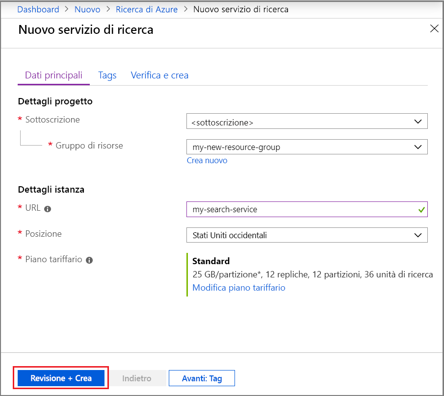
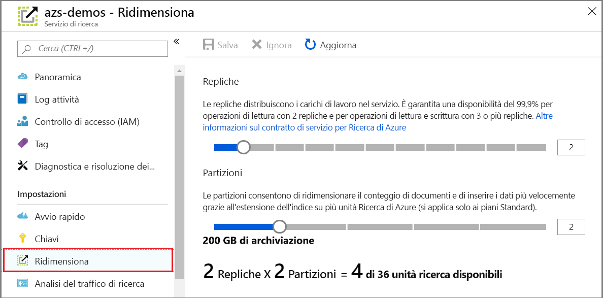

# Creare un servizio di Ricerca di Azure nel portale

Ricerca di Azure è una risorsa autonoma usata per aggiungere un'esperienza di ricerca alle app personalizzate. Anche se Ricerca di Azure si integra facilmente con molti altri servizi di Azure, è possibile usarlo anche da solo, con le app dei server di rete o con il software in esecuzione in altre piattaforme cloud.

In questo articolo verrà illustrato come creare una risorsa Ricerca di Azure nel [portale di Azure](https://portal.azure.com/).

Se si preferisce PowerShell, usare il [modello di servizio](https://azure.microsoft.com/resources/templates/101-azure-search-create/) di Azure Resource Manager. Per informazioni su come iniziare, vedere [Gestire il servizio Ricerca di Azure con PowerShell](search-manage-powershell.md).

## Sottoscrizione gratuita o a pagamento

[Aprire un account Azure gratuito](https://azure.microsoft.com/pricing/free-trial/?WT.mc_id=A261C142F) e usare i crediti per provare i servizi di Azure a pagamento. Dopo avere consumato i crediti, mantenere l'account e continuare a usare i servizi di Azure gratuiti, ad esempio Siti Web. Verranno applicati addebiti alla carta di credito solo se l'utente modifica le impostazioni e richiede esplicitamente l'addebito.

In alternativa, [attivare i benefici della sottoscrizione MSDN](https://azure.microsoft.com/pricing/member-offers/msdn-benefits-details/?WT.mc_id=A261C142F). Con la sottoscrizione MSDN ogni mese si accumulano crediti che è possibile usare per i servizi di Azure a pagamento. 

## Trovare Ricerca di Azure

1. Accedere al [portale di Azure](https://portal.azure.com/).
2. Fare clic sul segno più ("+ Crea risorsa") nell'angolo superiore sinistro.
3. Usare la barra di ricerca per trovare "Ricerca di Azure" o passare alla risorsa tramite **Web** > **Ricerca di Azure**.

## Assegnare un nome all'endpoint URL e al servizio

Il nome del servizio fa parte dell'endpoint dell'URL in cui vengono eseguite le chiamate API: `https://your-service-name.search.windows.net`. Immettere il nome del servizio nel campo **URL**.

Se ad esempio si vuole che l'endpoint sia `https://my-app-name-01.search.windows.net`, immettere `my-app-name-01`.

Requisiti per i nomi di servizio:

* Deve essere univoco all'interno dello spazio dei nomi search.windows.net
* lunghezza compresa tra 2 e 60 caratteri
* È possibile usare lettere minuscole, cifre o trattini ("-")
* Non può contenere un trattino ("-") nei primi 2 caratteri o nell'ultimo carattere
* Non deve contenere trattini consecutivi ("--")

## Selezionare una sottoscrizione

Se sono disponibili più sottoscrizioni, sceglierne una che includa anche i servizi di archiviazione file o dati. Ricerca di Azure può rilevare automaticamente archiviazione BLOB e archiviazione tabelle di Azure, il database SQL e Azure Cosmos DB per l'indicizzazione tramite [*indicizzatori*](search-indexer-overview.md), ma solo per i servizi nella stessa sottoscrizione.

## Selezionare un gruppo di risorse

Un gruppo di risorse è una raccolta di servizi e risorse di Azure usati insieme. Se ad esempio si usa Ricerca di Azure per l'indicizzazione di un database SQL, entrambi i servizi devono far parte dello stesso gruppo di risorse.

Se si combinano le risorse in un singolo gruppo o se i gruppi di risorse esistenti sono riempiti con risorse usate in soluzioni non correlate, creare un nuovo gruppo di risorse solo per la risorsa Ricerca di Azure.

> [!TIP]
> L'eliminazione di un gruppo di risorse elimina anche i servizi in esso contenuti. Per i progetti prototipo che usano più servizi, l'inserimento di tutti gli elementi nello stesso gruppo di risorse ne semplifica l'eliminazione al termine del progetto.

## Selezionare un percorso di hosting

Ricerca di Azure, in qualità di servizio di Azure, può essere ospitato nei data center di tutto il mondo. I [prezzi possono variare](https://azure.microsoft.com/pricing/details/search/) in base all'area geografica.

Se si prevede di usare la ricerca cognitiva, scegliere un'[area geografica in cui la funzionalità è disponibile](cognitive-search-quickstart-blob.md#supported-regions).

## Selezionare un piano tariffario (SKU)

[Ricerca di Azure attualmente è disponibile con vari piani tariffari](https://azure.microsoft.com/pricing/details/search/): Gratuito, Basic o Standard. Ogni piano tariffario prevede una specifica [capacità e limiti](search-limits-quotas-capacity.md). Per indicazioni, vedere [Scegliere uno SKU o un piano tariffario per Ricerca di Azure](search-sku-tier.md) .

Per carichi di lavoro di produzione viene in genere scelto il piano Standard, ma la maggior parte dei clienti inizia con il servizio gratuito.

Non è possibile modificare il piano tariffario dopo aver creato il servizio. Se in un secondo momento si vuole passare a un piano tariffario superiore o inferiore, è necessario creare nuovamente il servizio.

## Creare il servizio

Ricordarsi di aggiungere il servizio al dashboard per semplificare l'accesso.

## Ottenere una chiave e un endpoint dell'URL

Con poche eccezioni, per usare il nuovo servizio è necessario specificare l'endpoint dell'URL e una chiave API di autorizzazione. Per eseguire guide introduttive, esercitazioni come [Esplorare le API REST di Ricerca di Azure (Postman)](search-fiddler.md) e [Come usare Ricerca di Azure da un'applicazione .NET](search-howto-dotnet-sdk.md), esempi e codice personalizzato con una specifica risorsa, è necessario fornire un endpoint e una chiave.

1. Nella pagina di panoramica del servizio individuare e copiare l'endpoint dell'URL visualizzato a destra.

   

2. Nel riquadro di spostamento sinistro selezionare **Chiavi** e quindi copiare una delle due chiavi di amministrazione (sono equivalenti). Le chiavi API di amministrazione sono necessarie per creare, aggiornare ed eliminare oggetti nel servizio.

   

Per le attività basate sul portale, l'endpoint e la chiave non sono necessari. Il portale è già collegato alla risorsa di Ricerca di Azure con diritti amministrativi. Per un'esercitazione sul portale, iniziare da [Esercitazione: Importare, indicizzare ed eseguire query in Ricerca di Azure](search-get-started-portal.md).

## Ridimensionare il servizio

La creazione di un servizio può richiedere 15 minuti o più, a seconda del livello. Al termine del provisioning del servizio, è possibile ridimensionare il servizio per adattarlo alle proprie esigenze. Poiché è stato scelto il piano tariffario Standard per il servizio Ricerca di Azure, è possibile ridimensionare il servizio in due dimensioni, ovvero partizioni e repliche. Se fosse stato scelto il piano Basic, sarebbe stato possibile aggiungere solo le repliche. Se è stato effettuato il provisioning del servizio Gratuito, la scalabilità non è disponibile.

Le ***partizioni*** consentono di archiviare e di eseguire ricerche in un numero maggiore di documenti nel servizio.

***Repliche*** consentire al servizio gestire un carico superiore di query di ricerca.

L'aggiunta di risorse fa aumentare la fattura mensile. Il [calcolatore prezzi](https://azure.microsoft.com/pricing/calculator/) consente di capire le ramificazioni della fattura dovute all'aggiunta di risorse. Tenere presente che è possibile modificare le risorse in base al carico. Ad esempio, è possibile aumentare le risorse per creare un indice iniziale completo e ridurle successivamente a un livello più appropriato per l'indicizzazione incrementale.

> [!Important]
> Un servizio deve disporre di [2 repliche per ogni contratto di servizio di sola lettura e 3 repliche per ogni contratto di servizio di lettura/scrittura](https://azure.microsoft.com/support/legal/sla/search/v1_0/).

1. Passare alla pagina del servizio di ricerca nel portale di Azure.
2. Nel riquadro di navigazione a sinistra selezionare **Impostazioni** > **Scalabilità**.
3. Usare la barra di scorrimento per aggiungere risorse di entrambi i tipi.

> [!Note]
> Ogni livello presenta [limiti](search-limits-quotas-capacity.md) diversi per il numero totale di unità di ricerca consentite in un singolo servizio (repliche * partizioni = unità di ricerca totali).

## Aggiunta di un secondo servizio

La maggior parte dei clienti usa un solo servizio su cui esegue il provisioning a un livello che offre il [giusto equilibrio di risorse](search-sku-tier.md). Un servizio può ospitare più indici, soggetto ai [limiti massimi del livello selezionato](search-capacity-planning.md), con ciascun indice isolato dall'altro. In Ricerca di Azure, le richieste possono essere indirizzate solo a un indice, riducendo al minimo la possibilità di recupero di dati accidentali o intenzionali da altri indici nello stesso servizio.

Sebbene la maggior parte dei clienti usi un solo servizio, la ridondanza del servizio potrebbe essere necessaria se i requisiti operativi includono i seguenti elementi:

* Ripristino di emergenza (interruzione del data center). Ricerca di Azure non offre il failover immediato in caso di interruzione. Per consigli e informazioni aggiuntive, vedere [Amministrazione del servizio](search-manage.md).
* L'analisi della modellazione multi-tenancy ha determinato che i servizi aggiuntivi siano la progettazione ottimale. Per altre informazioni, vedere [Progettazione per multi-tenancy](search-modeling-multitenant-saas-applications.md).
* Per le applicazioni distribuite globalmente, è possibile richiedere un'istanza di Ricerca di Azure in più aree per ridurre al minimo la latenza del traffico internazionale dell'applicazione.

> [!NOTE]
> In Ricerca di Azure, non è possibile isolare i carichi di lavoro di indicizzazione ed esecuzione di query, pertanto, non è possibile creare più servizi per i carichi di lavoro isolati. Per un indice viene sempre eseguita una query sul servizio in cui è stato creato (non è possibile creare un indice in un servizio e copiarlo in un altro).

Non è necessario un secondo servizio per la disponibilità elevata. La disponibilità elevata per le query si raggiunge quando si usano 2 o più repliche nello stesso servizio. Gli aggiornamenti di replica sono sequenziali, il che significa che almeno uno è operativo quando viene implementato un aggiornamento del servizio. Per altre informazioni sul tempo di attività, vedere i [Contratti di servizio](https://azure.microsoft.com/support/legal/sla/search/v1_0/).

## Passaggi successivi

Dopo il provisioning di un servizio Ricerca di Azure, è possibile continuare nel portale con la creazione del primo indice.

> [!div class="nextstepaction"]
> [Esercitazione: Importare dati, creare un indice ed eseguire query nel portale](search-get-started-portal.md)
