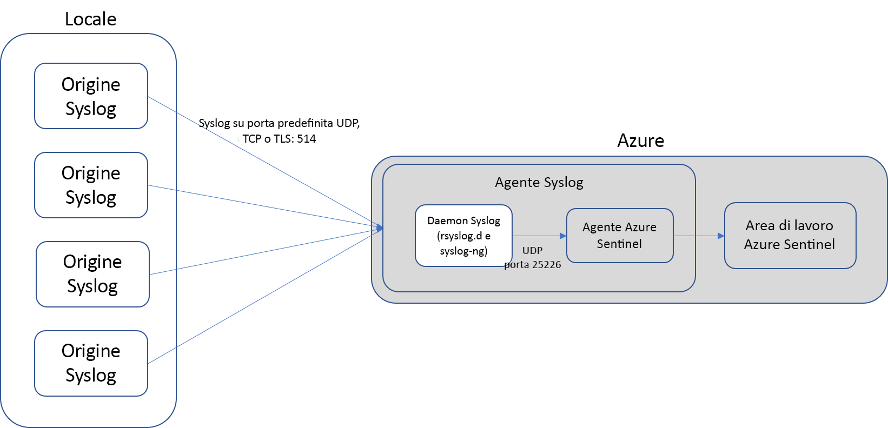
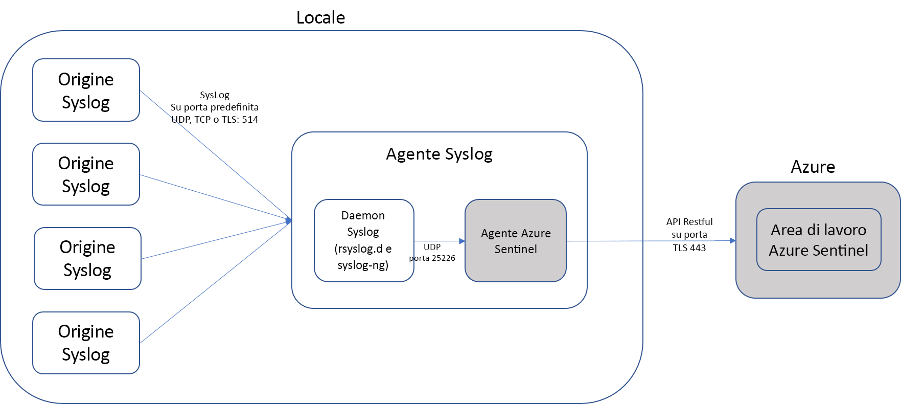

# Connettere le origini dati

> [!IMPORTANT]
> Azure Sentinel è attualmente in anteprima pubblica.
> Questa versione di anteprima viene messa a disposizione senza contratto di servizio e non è consigliata per i carichi di lavoro di produzione. Alcune funzionalità potrebbero non essere supportate o potrebbero presentare funzionalità limitate. Per altre informazioni, vedere [Condizioni supplementari per l'utilizzo delle anteprime di Microsoft Azure](https://azure.microsoft.com/support/legal/preview-supplemental-terms/).

Per eseguire l'onboarding di Azure Sentinel, è necessario innanzitutto connettersi alle origini dati. Azure Sentinel include numerosi connettori predefiniti per l'integrazione in tempo reale con le soluzioni Microsoft, comprese le soluzioni Microsoft Threat Protection e origini Microsoft 365, tra cui Office 365, Azure AD, Azure ATP, Microsoft Cloud App Security e altre ancora. Inoltre, sono presenti connettori predefiniti a soluzioni non Microsoft, per l'ecosistema di sicurezza allargato. Per connettere le origini dati con Azure Sentinel è anche possibile usare Common Event Format, Syslog o API REST.  

## Metodi di connessione dati

Azure Sentinel supporta i metodi di connessione dati seguenti:

- **Servizi Microsoft**:  I servizi Microsoft sono connessi in modo nativo. Sfruttando la struttura di Azure per l'integrazione immediata, è possibile connettere le soluzioni seguenti in pochi clic:
    - [Office 365](connect-office-365.md)
    - [Log di controllo e di accesso di Azure AD](connect-azure-active-directory.md)
    - [Attività di Azure](connect-azure-activity.md)
    - [Azure AD Identity Protection](connect-azure-ad-Identity-protection.md)
    - [Centro sicurezza di Azure](connect-azure-security-center.md)
    - [Azure Information Protection](connect-azure-information-protection.md)
    - [Azure Advanced Threat Protection](connect-azure-atp.md)
    - [Cloud App Security](connect-cloud-app-security.md)
    - [Eventi di sicurezza di Windows](connect-windows-security-events.md) 
    - [Windows Firewall](connect-windows-firewall.md)

- **Soluzioni esterne tramite API**: alcune origini dati vengono connesse tramite le API fornite dall'origine dati connessa. In genere, la maggior parte delle tecnologie di sicurezza fornisce un set di API tramite cui è possibile recuperare i registri eventi. Le API si connettono ad Azure Sentinel e raccolgono tipi di dati specifici da inviare ad Azure Log Analytics. Le appliance connesse tramite API includono:
    - [Barracuda](connect-barracuda.md)
    - [Symantec](connect-symantec.md)
- **Soluzioni esterne tramite agente**: Azure Sentinel può essere connesso a tutte le altre origini dati in grado di eseguire lo streaming dei log in tempo reale usando il protocollo Syslog, tramite un agente.  La maggior parte delle appliance usa il protocollo Syslog per inviare messaggi di evento che includono il log stesso e dati sul log. Il formato dei log varia, ma la maggior parte delle appliance supporta lo standard CEF (Common Event Format).  L'agente di Azure Sentinel, che si basa su Microsoft Monitoring Agent, converte i log CEF in un formato che può essere inserito in Log Analytics. A seconda del tipo di appliance, l'agente è installato direttamente nell'appliance oppure in un server Linux dedicato. L'agente per Linux riceve gli eventi dal daemon Syslog tramite UDP, ma nei casi in cui è previsto che un computer Linux raccolga un numero elevato di eventi Syslog, questi vengono inviati tramite TCP dal daemon Syslog all'agente e quindi dall'agente a Log Analytics.
    - Firewall, proxy ed endpoint:
        - [F5](connect-f5.md)
        - [Check Point](connect-checkpoint.md)
        - [Cisco ASA](connect-cisco.md)
        - [Fortinet](connect-fortinet.md)
        - [Palo Alto](connect-paloalto.md)
        - [Altre appliance CEF](connect-common-event-format.md)
        - [Altre appliance Syslog](connect-syslog.md)
    - Soluzioni DLP
    - [Provider di intelligence sulle minacce](connect-threat-intelligence.md)
    - [Computer DNS](connect-dns.md) -agente installato direttamente nel computer DNS
    - Server Linux
    - Altri cloud
    
## Opzioni di connessione tramite agente

Per connettere l'appliance esterna ad Azure Sentinel, l'agente deve essere distribuito in un computer dedicato (macchina virtuale o locale) per supportare la comunicazione tra l'appliance e Azure Sentinel. È possibile distribuire l'agente manualmente o automaticamente. La distribuzione automatica è disponibile solo se il computer dedicato è una nuova macchina virtuale che si sta creando in Azure. 

In alternativa, è possibile distribuire l'agente manualmente in una macchina virtuale di Azure esistente, in una macchina virtuale in un altro cloud o in un computer locale.

## Passaggi successivi

- Per iniziare a usare Azure Sentinel, è necessario avere una sottoscrizione di Microsoft Azure. Se non si ha una sottoscrizione, è possibile iscriversi per una [versione di valutazione gratuita](https://azure.microsoft.com/free/).
- Informazioni su come [caricare i dati in Azure Sentinel](quickstart-onboard.md) e [ottenere visibilità sui dati e sulle potenziali minacce](quickstart-get-visibility.md).
