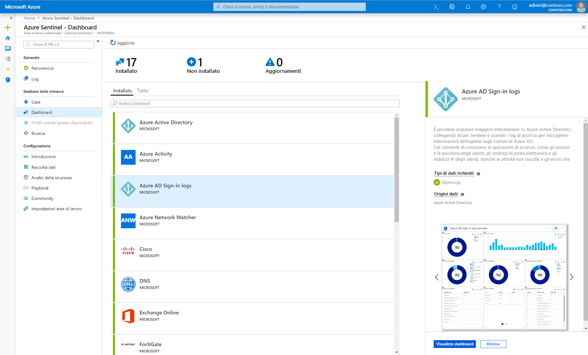
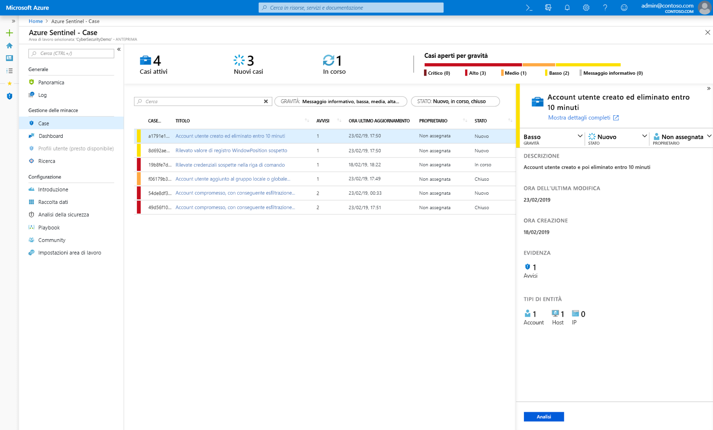
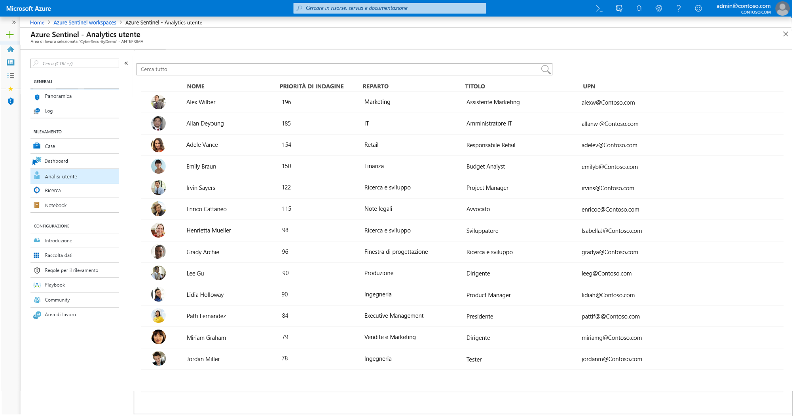
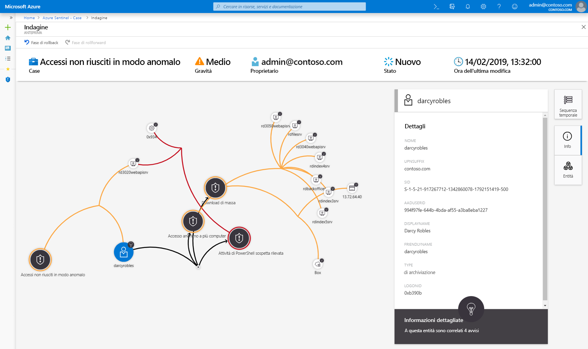
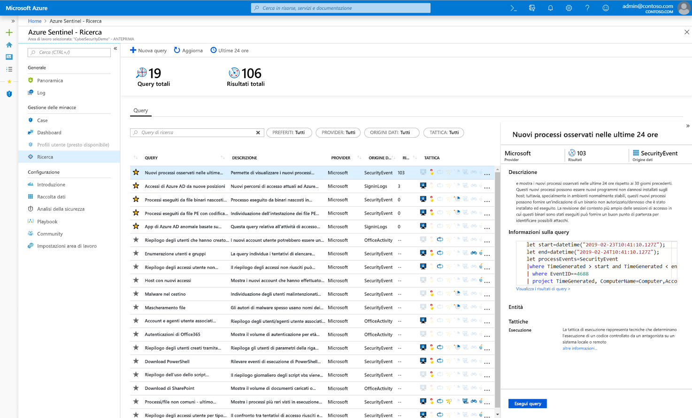

# Cos'è l'anteprima di Azure Sentinel?

> [!IMPORTANT]
> Azure Sentinel è attualmente in anteprima pubblica.
> Questa versione di anteprima viene messa a disposizione senza contratto di servizio e non è consigliata per i carichi di lavoro di produzione. Alcune funzionalità potrebbero non essere supportate o potrebbero presentare funzionalità limitate. Per altre informazioni, vedere [Condizioni supplementari per l'utilizzo delle anteprime di Microsoft Azure](https://azure.microsoft.com/support/legal/preview-supplemental-terms/).

Microsoft Azure Sentinel è una soluzione di tipo **SIEM (Security Information and Event Management)** e **SOAR (Security Orchestration, Automation and Response)** scalabile e nativa del cloud. Azure Sentinel offre analisi della sicurezza intelligenti e intelligence sulle minacce per l'intera azienda, fornendo un'unica soluzione per il rilevamento degli avvisi, la visibilità delle minacce, la ricerca proattiva e la risposta alle minacce. 

Azure Sentinel offre una vista a colpo d'occhio sull'azienda, alleviando il carico associato ad attacchi sempre più sofisticati, volume crescente degli avvisi e lunghi tempi di risoluzione.

- **Raccoglie i dati su scala cloud** per tutti gli utenti, i dispositivi, le applicazioni e l'infrastruttura, in locale e in più cloud. 

- **Rileva minacce precedentemente non individuate** e riduce al minimo i falsi positivi usando le sofisticate funzionalità di analisi e intelligence sulle minacce di Microsoft. 

- **Analizza le minacce con l'intelligenza artificiale** e individua le attività sospette su larga scala, sfruttando i vantaggi di anni di esperienza di Microsoft a livello di cybersecurity. 

- **Risponde rapidamente agli eventi imprevisti** con orchestrazione e automazione integrate delle attività comuni.

Basato sull'intera gamma di servizi di Azure esistenti, Azure Sentinel incorpora in modo nativo servizi collaudati come Log Analytics e App per la logica. Azure Sentinel arricchisce l'indagine e il rilevamento con l'intelligenza artificiale e fornisce il flusso di Threat Intelligence di Microsoft, consentendo di aggiungere anche la propria intelligence sulle minacce. 

 
## Connessione a tutte le origini dati

Per eseguire l'onboarding Azure Sentinel, è necessario innanzitutto [connettersi alle origini di sicurezza](connect-data-sources.md). Azure Sentinel include numerosi connettori predefiniti per l'integrazione in tempo reale con le soluzioni Microsoft, comprese le soluzioni Microsoft Threat Protection e origini Microsoft 365, tra cui Office 365, Azure AD, Azure ATP, Microsoft Cloud App Security e altre ancora. Inoltre, sono presenti connettori predefiniti a soluzioni non Microsoft, per l'ecosistema di sicurezza allargato. Per connettere le origini dati con Azure Sentinel è anche possibile usare Common Event Format, Syslog o API REST.  

## Dashboard

Dopo la connessione delle origini dati è possibile scegliere da una raccolta di [dashboard creati da esperti](quickstart-get-visibility.md#dashboards), che elaborano informazioni cognitive dettagliate dalle origini dati. Ogni dashboard è completamente personalizzabile. È possibile aggiungere la propria logica, modificare le query o anche creare un dashboard da zero.

I dashboard forniscono una visualizzazione interattiva usando funzionalità di analisi avanzata per aiutare gli analisti della sicurezza a comprendere più chiaramente ciò che accade durante un attacco. Gli strumenti di indagine consentono di eseguire il drill-down in qualsiasi campo e da qualsiasi dato, per sviluppare rapidamente il contesto della minaccia. 

## Analytics

Per ridurre i risultati non significativi e minimizzare il numero di avvisi da esaminare e di cui ricercare le cause, Azure Sentinel usa [l'analisi per correlare gli avvisi in eventi imprevisti](tutorial-detect-threats.md). Gli **eventi imprevisti** sono gruppi di avvisi correlati che insieme creano una possibile minaccia di utilità pratica ai fini delle indagini e della risoluzione. È possibile usare le regole di correlazione predefinite così come sono o come punto di partenza per crearne di personalizzate. Azure Sentinel fornisce anche regole di Machine Learning per mappare il comportamento di rete e quindi cercare le anomalie in tutte le risorse. Queste funzionalità di analisi uniscono i puntini, combinando gli avvisi con un basso livello di affidabilità relativi a entità diverse in potenziali eventi imprevisti della sicurezza di affidabilità elevata.

## Analisi degli utenti

Grazie all'integrazione nativa di Machine Learning (ML) e [analisi degli utenti](user-analytics.md), Azure Sentinel consente di rilevare rapidamente le minacce. Azure Sentinel si integra alla perfezione con Azure Advanced Threat Protection per analizzare il comportamento degli utenti e classificare in ordine di priorità quelli da esaminare per primi, in base ai relativi avvisi e ai modelli di attività sospette in Azure Sentinel e Microsoft 365.

## Automazione e orchestrazione della sicurezza

È possibile automatizzare le attività comuni e [semplificare l'orchestrazione della sicurezza con playbook](tutorial-respond-threats-playbook.md) che si integrano con i servizi di Azure e con gli strumenti esistenti. Basata su App per la logica di Azure, la soluzione di automazione e orchestrazione di Azure Sentinel fornisce un'architettura altamente estendibile, che rende possibile ridimensionare l'automazione man mano che emergono nuove tecnologie e minacce. Per compilare playbook con App per la logica di Azure, è possibile scegliere da una raccolta in costante crescita di playbook predefiniti. Questi includono [oltre 200 connettori](https://docs.microsoft.com/azure/connectors/apis-list) per servizi, ad esempio Funzioni di Azure. I connettori consentono di applicare qualsiasi logica personalizzata in codice, ServiceNow, Jira, Zendesk, richieste HTTP, Microsoft Teams, Slack, Windows Defender ATP e Cloud App Security.

Ad esempio, se si usa il sistema di creazione dei ticket ServiceNow, è possibile usare gli strumenti forniti da App per la logica di Azure per automatizzare i flussi di lavoro e aprire un ticket in ServiceNow ogni volta che viene rilevato un evento specifico.

## Analisi

Gli strumenti di [indagine approfondita](tutorial-investigate-cases.md) di Azure Sentinel aiutano a comprendere l'ambito e individuare la causa radice di una potenziale minaccia per la sicurezza. È possibile scegliere un'entità nel grafico interattivo per porre domande interessanti per una specifica entità, oltre che eseguire il drill-down nell'entità e nelle relative connessioni per risalire alla causa radice della minaccia. 

## Ricerca

Usando i [potenti strumenti di ricerca e query](hunting.md) di Azure Sentinel, basati sul framework MITRE, è possibile cercare in modo proattivo le minacce alla sicurezza tra le origini dati dell'organizzazione prima che venga attivato un avviso. Dopo aver individuato la query di ricerca che fornisce informazioni cognitive dettagliate di valore elevato sui possibili attacchi, è anche possibile creare regole di rilevamento personalizzate basate sulla query e presentare queste informazioni sotto forma di avvisi al personale addetto a rispondere agli eventi imprevisti di sicurezza. Durante la ricerca si possono creare segnalibri per gli eventi interessanti, per potervi tornare in seguito, condividerli con altri utenti e raggrupparli con altri eventi correlati per creare un caso interessante da sottoporre a indagine.

## Community

La community di Azure Sentinel è una risorsa potente per il rilevamento delle minacce e l'automazione. Gli analisti della sicurezza di Microsoft creano e aggiungono continuamente nuovi dashboard, playbook, query di ricerca e altro ancora, pubblicandoli nella community perché ognuno possa usarli nel proprio ambiente. È possibile scaricare contenuto di esempio dal [repository](https://aka.ms/asicommunity) GitHub privato della community, per creare dashboard personalizzati, query di ricerca, notebook e playbook per Azure Sentinel. 

## Passaggi successivi

- Per iniziare a usare Azure Sentinel, è necessario avere una sottoscrizione di Microsoft Azure. Se non si ha una sottoscrizione, è possibile iscriversi per una [versione di valutazione gratuita](https://azure.microsoft.com/free/).
- Informazioni su come [caricare i dati in Azure Sentinel](quickstart-onboard.md) e [ottenere visibilità sui dati e sulle potenziali minacce](quickstart-get-visibility.md).
