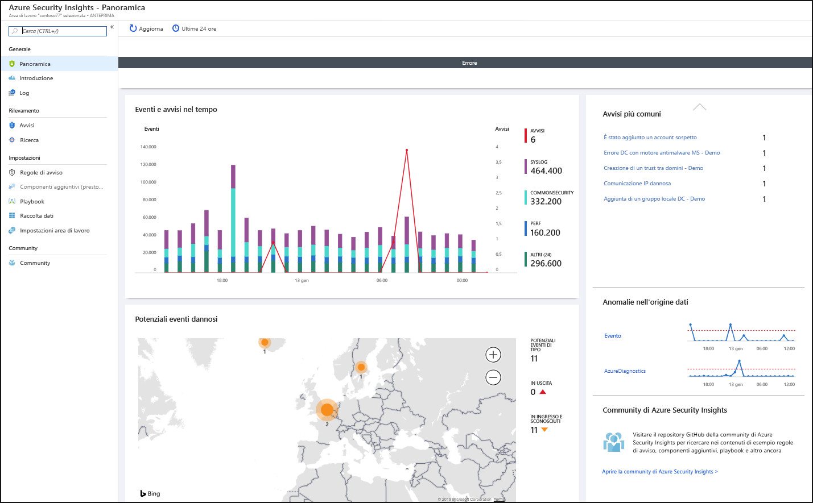
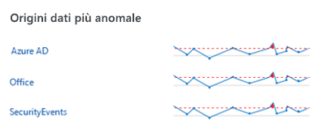
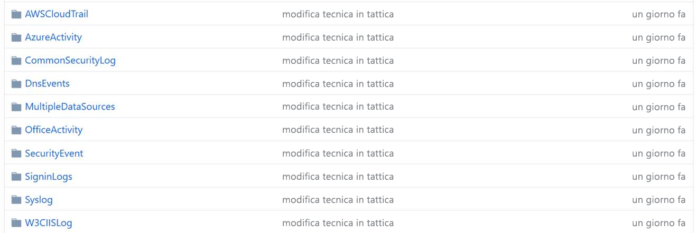
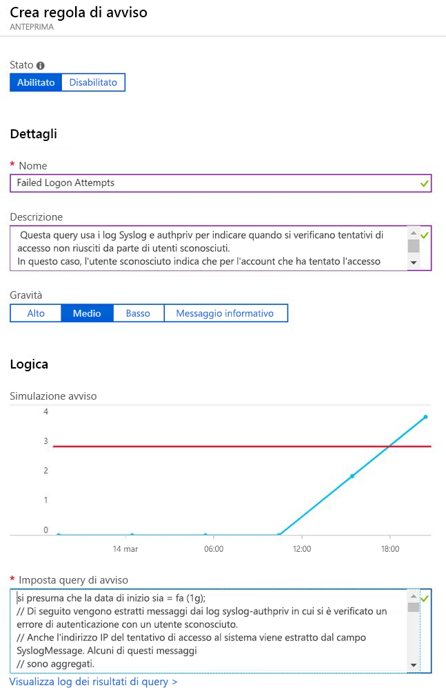

# Guida introduttiva: Introduzione all'anteprima di Azure Sentinel

> [!IMPORTANT]
> Azure Sentinel è attualmente in anteprima pubblica.
> Questa versione di anteprima viene messa a disposizione senza contratto di servizio e non è consigliata per i carichi di lavoro di produzione. Alcune funzionalità potrebbero non essere supportate o potrebbero presentare funzionalità limitate. Per altre informazioni, vedere [Condizioni supplementari per l'utilizzo delle anteprime di Microsoft Azure](https://azure.microsoft.com/support/legal/preview-supplemental-terms/).

In questo argomento di avvio rapido si apprenderà come visualizzare e monitorare velocemente ciò che avviene all'interno dell'ambiente usando Azure Sentinel. Dopo aver connesso le origini dati ad Azure Sentinel, si ottengono visualizzazione e analisi immediate dei dati, grazie alle quali è possibile sapere ciò che avviene in tutte le origini dati connesse. Azure Sentinel è dotato di dashboard che offrono tutta la potenza degli strumenti già disponibili in Azure, oltre a tabelle e grafici integrati per fornire l'analisi di log e query. È possibile usare i dashboard predefiniti o creare un nuovo dashboard con facilità, da zero o in base a un dashboard esistente. 

## Ottenere visualizzazioni

Per visualizzare e ottenere analisi di ciò che accade nell'ambiente, in primo luogo esaminare il dashboard di panoramica per avere un'idea delle condizioni di sicurezza dell'organizzazione. È possibile fare clic su ogni elemento di questi riquadri per eseguire il drill-down ai dati non elaborati da cui vengono creati. Per ridurre i risultati non significativi e minimizzare il numero di avvisi da esaminare e di cui ricercare le cause, Azure Sentinel usa una tecnica di fusione per correlare gli avvisi in casi. I **casi** sono gruppi di avvisi correlati che insieme creano un evento imprevisto di utilità pratica ai fini delle indagini e della risoluzione.

- Nel portale di Azure selezionare Azure Sentinel e quindi selezionare l'area di lavoro che si vuole monitorare.

  

- La barra degli strumenti nella parte superiore indica il numero di eventi che si sono verificati nel periodo di tempo selezionato e lo confronta con le 24 ore precedenti. La barra degli strumenti indica gli avvisi che sono stati attivati da questi eventi (il piccolo numero rappresenta i cambiamenti nelle ultime 24 ore) e quanti eventi sono aperti, in corso e chiusi. Qui si può controllare se ci sia un forte aumento o calo nel numero degli eventi. Se si verifica un calo, è possibile che una connessione abbia smesso di inviare segnalazioni ad Azure Sentinel. Se si verifica un aumento, può essere accaduto qualcosa di sospetto. Controllare se sono presenti nuovi avvisi.

   

Il corpo principale della pagina di panoramica offre informazioni dettagliate a colpo d'occhio sullo stato di sicurezza dell'area di lavoro:

- **Events and alerts over time** (Eventi e avvisi nel tempo): elenca il numero di eventi e il numero di avvisi creato da tali eventi. Se è presente un picco insolito, dovrebbero comparire avvisi in proposito. La presenza di un picco di eventi insolito senza avvisi associati potrebbe rappresentare un motivo di preoccupazione.

- **Potential malicious events** (Potenziali eventi dannosi): quando viene rilevato traffico da origini note per essere dannose, Azure Sentinel lo segnala sulla mappa. Se il segnale è arancione, si tratta di traffico in ingresso: qualcuno sta provando ad accedere all'organizzazione da un indirizzo IP dannoso noto. Se è rosso indica attività in uscita, ovvero che dati della rete interna vengono trasmessi all'esterno dell'organizzazione verso un indirizzo IP dannoso noto.

   

- **Recent cases** (Casi recenti): per visualizzare i casi recenti, la loro gravità e il numero di avvisi associati al caso. La comparsa di un picco improvviso di un tipo specifico di avviso potrebbe indicare un attacco attivo in corso. Ad esempio, se è visibile un picco improvviso di 20 eventi Pass-the-Hash da Azure ATP, l'organizzazione potrebbe essere sotto attacco.

- **Data source anomalies** (Anomalie dell'origine dati): gli analisti di dati di Microsoft hanno creato modelli che cercano continuamente anomalie nei dati provenienti dalle origini dati. Se non sono presenti anomalie, non compare nulla. Se vengono rilevate anomalie, è necessario approfondire per capire cosa è successo. Ad esempio, fare clic sul picco nelle attività di Azure. È possibile fare clic su **Chart** (Grafico) per vedere quando si è verificato il picco e quindi filtrare le attività che si sono verificate in quel periodo di tempo per vedere cosa ha causato il picco.

   

## Usare i dashboard predefiniti

I dashboard predefiniti offrono dati integrati dalle origini dati connesse, consentendo di esaminare in modo approfondito gli eventi generati nei servizi. Sono disponibili dashboard predefiniti per Azure AD, eventi per attività di Azure ed eventi locali, che possono essere dati da eventi di Windows da server, da avvisi proprietari, da qualsiasi terza parte inclusi log del traffico firewall, Office 365 e protocolli non sicuri basati su eventi di Windows.

1. In **Settings** (Impostazioni) selezionare **Dashboards** (Dashboard). In **Installed** (Installati) è possibile visualizzare tutti i dashboard installati. In **All** (Tutti) è possibile visualizzare l'intera raccolta di dashboard predefiniti disponibili per l'installazione. 
2. Cercare un dashboard specifico per vedere l'intero elenco e una descrizione di ciò che offre ognuno di essi. 
3. Supponendo che si usi Azure AD, per iniziare a usare Azure Sentinel è consigliabile installare almeno i dashboard seguenti:
   - **Azure AD**: usare uno dei seguenti o entrambi:
       - **Azure AD sign-ins** (Accessi ad Azure AD) analizza gli accessi nel tempo per verificare se esistono anomalie. Questo dashboard segnala i tentativi di accesso non riusciti da parte di applicazioni, dispositivi e posizioni in modo, permettendo di notare immediatamente eventuali attività insolite. Prestare attenzione alla presenza di più accessi non riusciti. 
       - **Azure AD audit logs** (Log di controllo di Azure AD) analizza le attività di amministrazione, ad esempio modifiche agli utenti, come aggiunte rimozioni e così via, creazione di gruppi e modifiche.  

   - Aggiungere un dashboard per il firewall. Ad esempio, aggiungere il dashboard Palo Alto. Il dashboard analizza il traffico del firewall, offrendo correlazioni tra i dati del firewall e gli eventi di minaccia ed evidenziando gli eventi sospetti tra le entità. I dashboard forniscono informazioni sulle tendenze del traffico e consentono di eseguire il drill-down e filtrare i risultati. 

      

È possibile personalizzare i dashboard modificando la query principale . È possibile fare clic sul pulsante  per passare a[Log Analytics e modificare la query](../azure-monitor/log-query/get-started-portal.md) ed è possibile selezionare i puntini di sospensione (...) e quindi **Personalizza dati riquadro**, che consente di modificare il filtro temporale principale o rimuovere specifici riquadri dal dashboard.

Per altre informazioni sull'uso delle query, vedere [Esercitazione: Visualizzare i dati in Log Analytics](../azure-monitor/learn/tutorial-logs-dashboards.md)

### Aggiungere un nuovo riquadro

Se si vuole aggiungere un nuovo riquadro, è possibile aggiungerlo a un dashboard esistente, a uno creato autonomamente oppure a un dashboard predefinito di Azure Sentinel. 
1. In Log Analytics creare un riquadro seguendo le istruzioni disponibili in [Esercitazione: Visualizzare i dati in Log Analytics](../azure-monitor/learn/tutorial-logs-dashboards.md). 
2. Dopo aver creato il riquadro, sotto **Aggiungi** selezionare il dashboard in cui si vuole che compaia il riquadro.

## Creare nuovi dashboard
È possibile creare un nuovo dashboard da zero o usare un dashboard predefinito come base per il nuovo dashboard.

1. Per creare un nuovo dashboard da zero, selezionare **Dashboard** e quindi **+Nuovo dashboard**.
2. Selezionare la sottoscrizione in cui creare il dashboard e assegnargli un nome descrittivo. Ogni dashboard è una risorsa di Azure come qualsiasi altra, ed è possibile assegnargli ruoli (controllo degli accessi in base al ruolo) per definire e limitare chi può accedervi. 
3. Per fare in modo che sia visualizzato tra i dashboard disponibili e potervi aggiungere visualizzazioni, è necessario condividerlo. Fare clic su **Condividi** e quindi su **Gestisci utenti**. 
 
1. Usare **Verifica l'accesso** e le **Assegnazioni di ruolo** come si farebbe per qualsiasi altra risorsa di Azure. Per altre informazioni, vedere [Condividere i dashboard di Azure tramite il Controllo degli accessi in base al ruolo](../azure-portal/azure-portal-dashboard-share-access.md).

## Esempi di nuovi dashboard

La query di esempio seguente consente di confrontare le tendenze del traffico tra le varie settimane. È possibile cambiare facilmente il fornitore di dispositivi e l'origine dati su cui eseguire la query. Questo esempio usa SecurityEvent di Windows, è possibile modificarlo per eseguirlo su AzureActivity o CommonSecurityLog su qualsiasi altro firewall.

     |where DeviceVendor = = "Palo Alto Networks":
      // week over week query
      SecurityEvent
      | where TimeGenerated > ago(14d)
      | summarize count() by bin(TimeGenerated, 1d)
      | extend Week = iff(TimeGenerated>ago(7d), "This Week", "Last Week"), TimeGenerated = iff(TimeGenerated>ago(7d), TimeGenerated, TimeGenerated + 7d)

Si potrebbe voler creare una query che incorpora i dati da più origini. È possibile creare una query che esamina i log di controllo di Azure Active Directory cercando i nuovi utenti che sono stati creati, quindi controlla i log di Azure per verificare se l'utente ha iniziato ad apportare modifiche alle assegnazioni di ruolo entro 24 ore dalla creazione. Questa attività sospetta verrebbe mostrata in questo dashboard:

    AuditLogs
    | where OperationName == "Add user"
    | project AddedTime = TimeGenerated, user = tostring(TargetResources[0].userPrincipalName)
    | join (AzureActivity
    | where OperationName == "Create role assignment"
    | project OperationName, RoleAssignmentTime = TimeGenerated, user = Caller) on user
    | project-away user1

È possibile creare dashboard diversi in base al ruolo della persona che sta esaminando i dati e a ciò che sta cercando. Ad esempio, si può creare un dashboard per l'amministratore di rete che include i dati del firewall. È anche possibile creare dashboard in base alla frequenza con cui si vogliono esaminare, se ci sono elementi che si vogliono controllare ogni giorno e altri che si vogliono controllare ogni ora. Ad esempio, si potrebbero esaminare gli accessi ad Azure AD ogni ora per cercare eventuali anomalie. 

## Creare nuovi rilevamenti

È possibile generare rilevamenti sulle [origini dati connesse ad Azure Sentinel](connect-data-sources.md) per analizzare le minacce nell'organizzazione.

Quando si crea una nuova funzionalità di rilevamento, sfruttare i rilevamenti incorporati predisposti dai ricercatori di sicurezza Microsoft più adatti alle origini dati connesse.

1. [Nella community di GitHub](https://github.com/Azure/Azure-Sentinel/tree/master/Detections) andare alla cartella **Rilevamenti** e selezionare le cartelle pertinenti.
   
 
3.  Passare alla scheda **Analytics** e selezionare **aggiungi**.
   

3.  Copiare tutti i parametri per la regola e fare clic su **Crea**.
   

 
## Passaggi successivi
In questo argomento di avvio rapido si è appreso come iniziare a usare Azure Sentinel. Continuare con l'esercitazione su [come rilevare le minacce](tutorial-detect-threats.md).
> [!div class="nextstepaction"]
> [Rilevare le minacce](tutorial-detect-threats.md) per automatizzare le risposte alle minacce.

