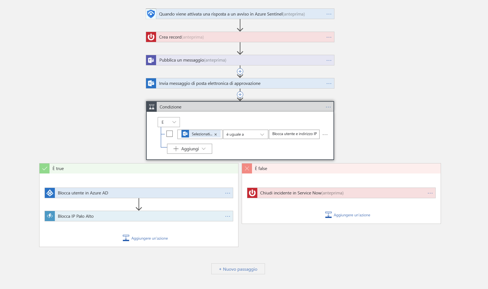

# Esercitazione: Configurare le risposte automatiche alle minacce nell'anteprima di Azure Sentinel

> [!IMPORTANT]
> Azure Sentinel è attualmente in anteprima pubblica.
> Questa versione di anteprima viene messa a disposizione senza contratto di servizio e non è consigliata per i carichi di lavoro di produzione. Alcune funzionalità potrebbero non essere supportate o potrebbero presentare funzionalità limitate. Per altre informazioni, vedere [Condizioni supplementari per l'utilizzo delle anteprime di Microsoft Azure](https://azure.microsoft.com/support/legal/preview-supplemental-terms/).

Questa esercitazione illustra come usare i playbook di sicurezza in Azure Sentinel per impostare risposte automatiche ai problemi relativi alla sicurezza rilevati da Azure Sentinel.

> [!div class="checklist"]
> * Informazioni sui playbook
> * Creare un playbook
> * Eseguire un playbook

## Definizione di playbook di sicurezza in Azure Sentinel

Un playbook di sicurezza è una raccolta di procedure che possono essere eseguite da Azure Sentinel in risposta a un avviso. Un playbook di sicurezza può contribuire ad automatizzare e orchestrare la risposta e può essere eseguito manualmente o impostato per l'esecuzione automatica quando vengono attivati avvisi specifici. I playbook di sicurezza in Azure Sentinel si basano su [App per la logica di Azure](https://docs.microsoft.com/azure/logic-apps/logic-apps-what-are-logic-apps), il che significa che sarà possibile sfruttare tutta la potenza, la personalizzazione e i modelli integrati di App per la logica. Ogni playbook viene creato per la specifica sottoscrizione scelta, ma quando si osserva la pagina dei playbook verranno visualizzati tutti i playbook delle sottoscrizioni selezionate.

> [!NOTE]
> I playbook sfruttano le funzionalità di App per la logica di Azure, quindi sono previsti addebiti. Per altre informazioni, vedere la pagina dei prezzi per [App per la logica di Azure](https://azure.microsoft.com/pricing/details/logic-apps/).

Se ad esempio si teme che utenti malintenzionati accedano alle risorse di rete, è possibile impostare un avviso che cerca indirizzi IP dannosi che accedono alla rete. È quindi possibile creare un playbook che esegue queste operazioni:
1. Quando viene attivato l'avviso, aprire un ticket in ServiceNow o in qualsiasi altro sistema di creazione di ticket IT.
2. Inviare un messaggio al canale delle operazioni di sicurezza in Microsoft Teams o Slack per assicurarsi che i propri analisti della sicurezza siano a conoscenza dell'evento imprevisto.
3. Inviare tutte le informazioni nell'avviso all'amministratore di rete senior e all'amministratore della sicurezza. Il messaggio di posta elettronica include anche due pulsanti di opzione **Blocca** o **Ignora**.
4. Il playbook continua a funzionare dopo la ricezione di una risposta dagli amministratori.
5. Se gli amministratori scelgono **Blocca**, l'indirizzo IP viene bloccato nel firewall e l'utente è disabilitato in Azure AD.
6. Se gli amministratori scelgono **Ignora**, l'avviso viene chiuso in Azure Sentinel e l'evento imprevisto viene chiuso in ServiceNow.

I playbook di sicurezza possono essere eseguiti manualmente o automaticamente. Se vengono eseguiti manualmente, quando si riceve un avviso è possibile scegliere di eseguire un playbook su richiesta come risposta all'avviso selezionato. Se vengono eseguiti automaticamente, la regola di correlazione creata viene impostata per l'esecuzione automatica di uno o più playbook quando viene attivato l'avviso.

## Creare un playbook di sicurezza

Seguire questa procedura per creare un nuovo playbook di sicurezza in Azure Sentinel:

1. Aprire il dashboard di **Azure Sentinel**.
2. In **Gestione** selezionare **Playbook**.

   

3. Nella pagina**Azure Sentinel - Playbook (anteprima)** fare clic sul pulsante **Aggiungi**.

    

4. Nella pagina **Crea app per la logica** digitare le informazioni richieste per creare la nuova app per la logica e fare clic su **Crea**. 

5. In [**Progettazione app per la logica**](../logic-apps/logic-apps-overview.md) selezionare il modello che si vuole usare. Se si seleziona un modello che richiede credenziali, sarà necessario fornirle. In alternativa è possibile creare un nuovo playbook vuoto da zero. Selezionare **App per la logica vuota**. 

   

6. Verrà visualizzata la pagina Progettazione app per la logica in cui è possibile creare un nuovo modello oppure modificarne uno esistente. Vedere altre informazioni sulla creazione di un playbook con [App per la logica](../logic-apps/logic-apps-create-logic-apps-from-templates.md).

7. Se si sta creando un playbook vuoto, nel campo **Cerca tutti i connettori e i trigger** digitare *Azure Sentinel* e selezionare **When a response to an Azure Sentinel alert is triggered** (Quando viene attivata una risposta a un avviso di Azure Sentinel).  Dopo averlo creato, il nuovo playbook viene visualizzato nell'elenco **Playbook**. Se non viene visualizzato, fare clic su **Aggiorna**. 

7. È ora possibile definire cosa accade quando si attiva il playbook. È possibile aggiungere un'azione, una condizione logica, condizioni switch case o cicli.

   

## Come eseguire un playbook di sicurezza

È possibile eseguire un playbook su richiesta.

Per eseguire un playbook su richiesta:

1. Nella pagina **Cases** (Casi) selezionare un caso e fare clic su **View full details** (Visualizza i dettagli completi).

2. Nella scheda**Alerts** (Avvisi) fare clic sull'avviso sul quale eseguire il playbook, scorrere verso destra e fare clic su **View playbooks** (Visualizza i playbook). Selezionare quindi un playbook da **eseguire** dall'elenco di playbook disponibili nella sottoscrizione. 

## Passaggi successivi
In questo articolo si è appreso come eseguire un playbook in Azure Sentinel. Per altre informazioni su Azure Sentinel, vedere gli articoli seguenti: In questa esercitazione si è appreso come eseguire un playbook in Azure Sentinel. Vedere ora [come cercare le minacce in modo proattivo](hunting.md) usando Azure Sentinel.
> [!div class="nextstepaction"]
> [Cercare le minacce](hunting.md) per individuare le minacce in modo proattivo nella rete.

