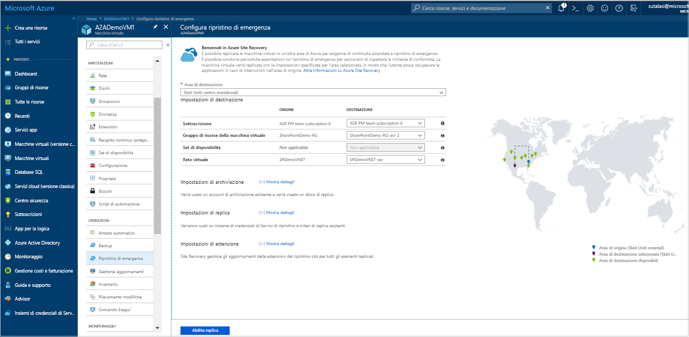
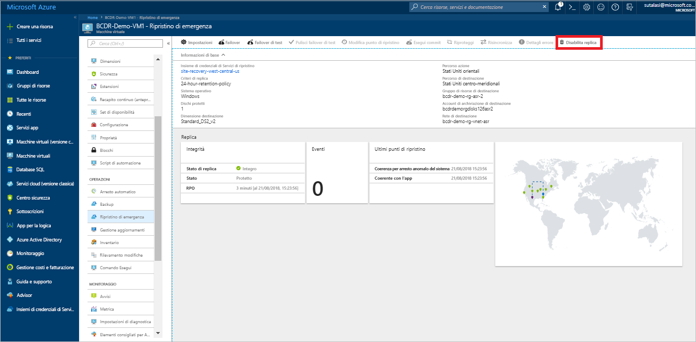

# Configurare il ripristino di emergenza in un'area di Azure secondaria per una macchina virtuale di Azure        

Il servizio [Azure Site Recovery](site-recovery-overview.md) contribuisce a realizzare la strategia di continuità aziendale e ripristino di emergenza (BCDR) mantenendo operative le app aziendali durante le interruzioni pianificate e non pianificate. Site Recovery gestisce e coordina il ripristino di emergenza di computer locali e macchine virtuali di Azure, incluse le operazioni di replica, failover e failback.

Questa guida introduttiva illustra come replicare una macchina virtuale di Azure in un'area di Azure diversa.

Se non si ha una sottoscrizione di Azure, creare un [account gratuito](https://azure.microsoft.com/free/?WT.mc_id=A261C142F) prima di iniziare.

> [!NOTE]
> Scopo di questo articolo è illustrare a un nuovo utente l'esperienza Azure Site Recovery con le opzioni predefinite e una minima personalizzazione. Per maggiori informazioni sulle diverse impostazioni personalizzabili, vedere [l'esercitazione relativa all'abilitazione della replica per le macchine virtuali di Azure](azure-to-azure-tutorial-enable-replication.md).

## Accedere ad Azure

Accedere al portale di Azure all'indirizzo http://portal.azure.com.

## Abilitare la replica per la macchina virtuale di Azure

1. Nel portale di Azure fare clic su **Macchine virtuali** e selezionare la macchina virtuale che si vuole replicare.
2. In **Operazioni** fare clic su **Ripristino di emergenza**.
3. In **Configure disaster recovery** (Configura ripristino di emergenza)  >  **Area di destinazione** selezionare l'area di destinazione in cui si vuole eseguire la replica.
4. Per questa guida introduttiva, accettare le altre impostazioni predefinite.
5. Fare clic su **Abilitazione della replica**. Verrà avviato un processo per abilitare la replica per la macchina virtuale.

    

## Verificare le impostazioni

Al termine del processo di replica, è possibile controllare lo stato di replica, modificare le impostazioni di replica e testare la distribuzione.

1. Nel menu della macchina virtuale fare clic su **Ripristino di emergenza**.
2. È possibile verificare l'integrità della replica, i punti di ripristino creati, nonché le aree di origine e di destinazione sulla mappa.

   

## Pulire le risorse

La replica della macchina virtuale nell'area primaria viene arrestata nel momento in cui si disabilita la replica corrispondente:

- Le impostazioni della replica di origine vengono automaticamente pulite. Si noti che l'estensione Site Recovery installata come parte della replica non viene rimossa e deve essere rimossa manualmente. 
- Viene arrestata anche la fatturazione di Site Recovery per la macchina virtuale.

Per arrestare la replica, seguire questa procedura

1. Selezionare la macchina virtuale.
2. In **Ripristino di emergenza** fare clic su **Disabilita replica**.

   

## Passaggi successivi

In questa guida introduttiva è stata replicata una singola macchina virtuale in un'area secondaria. È ora possibile esplorare altre opzioni e provare a replicare un set di macchine virtuali di Azure usando un piano di ripristino.

> [!div class="nextstepaction"]
> [Configurare il ripristino di emergenza per macchine virtuali di Azure](azure-to-azure-tutorial-enable-replication.md)
