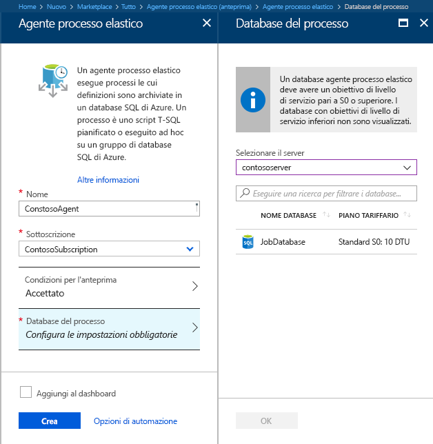
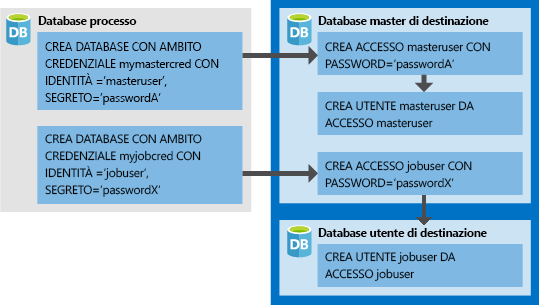

# <a name="create-configure-and-manage-elastic-jobs"></a>Creare, configurare e gestire processi elastici

In questo articolo si apprenderà come creare, configurare e gestire processi elastici. Se non si sono mai usati processi elastici, vedere [altre informazioni sui concetti di automazione dei processi nel database SQL di Azure](sql-database-job-automation-overview.md).

## <a name="create-and-configure-the-agent"></a>Creare e configurare l'agente

1. Creare o identificare un database SQL vuoto con livello di servizio S0 o superiore. Questo database verrà usato come *database di processo* durante la creazione dell'agente di processo elastico.
2. Creare un agente di processo elastico nel [portale](https://portal.azure.com/#create/Microsoft.SQLElasticJobAgent) o con [PowerShell ](elastic-jobs-powershell.md#create-the-elastic-job-agent).

   

## <a name="create-run-and-manage-jobs"></a>Creare, eseguire e gestire i processi

1. Creare una credenziale per l'esecuzione del processo nel *database di processo* usando [PowerShell](elastic-jobs-powershell.md#create-job-credentials-so-that-jobs-can-execute-scripts-on-its-targets) o [T-SQL](elastic-jobs-tsql.md#create-a-credential-for-job-execution).
2. Definire il gruppo di destinazione, ovvero i database nei quali eseguire il processo, usando [PowerShell ](elastic-jobs-powershell.md#define-the-target-databases-you-want-to-run-the-job-against)o [T-SQL ](elastic-jobs-tsql.md#create-a-target-group-servers).
3. Creare una credenziale di agente di processo in ogni database in cui verrà eseguito il processo[, aggiungendo l'utente (o il ruolo) a ogni database del gruppo](sql-database-control-access.md). Per un esempio, vedere l'[esercitazione di PowerShell](elastic-jobs-powershell.md#create-job-credentials-so-that-jobs-can-execute-scripts-on-its-targets).
4. Creare un processo usando [PowerShell](elastic-jobs-powershell.md#create-a-job) o [T-SQL](elastic-jobs-tsql.md#deploy-new-schema-to-many-databases).
5. Aggiungere passaggi di processo usando [PowerShell](elastic-jobs-powershell.md#create-a-job-step) o [T-SQL](elastic-jobs-tsql.md#deploy-new-schema-to-many-databases).
6. Eseguire un processo usando [PowerShell](elastic-jobs-powershell.md#run-the-job) o [T-SQL](elastic-jobs-tsql.md#begin-ad-hoc-execution-of-a-job).
7. Monitorare lo stato di esecuzione del processo usando il portale, [PowerShell](elastic-jobs-powershell.md#monitor-status-of-job-executions) o [T-SQL](elastic-jobs-tsql.md#monitor-job-execution-status).

   

## <a name="credentials-for-running-jobs"></a>Credenziali per l'esecuzione di processi

I processi usano [credenziali con ambito database](/sql/t-sql/statements/create-database-scoped-credential-transact-sql) per la connessione ai database specificati dal gruppo di destinazione al momento dell'esecuzione. Se un gruppo di destinazione contiene server o pool, queste credenziali con ambito database vengono usate per connettersi al database master ed enumerare i database disponibili.

La configurazione delle credenziali corrette per l'esecuzione di un processo può essere poco chiara, quindi tenere a mente i punti seguenti:

- Le credenziali di ambito database devono essere create nel *database di processo*.
- Per completare correttamente il processo, **tutti i database di destinazione devono avere un account di accesso con [autorizzazioni sufficienti](https://docs.microsoft.com/sql/relational-databases/security/permissions-database-engine)** (`jobuser` nello schema seguente).
- Le credenziali possono essere riutilizzate in tutti i processi e le password delle credenziali vengono crittografate e protette dagli utenti che hanno accesso in sola lettura agli oggetti del processo.

L'immagine seguente semplifica la comprensione e la configurazione delle credenziali di processo corrette. **Ricordarsi di creare l'utente in ogni database (tutti i *database utente di destinazione*) in cui è necessario eseguire il processo**.



## <a name="security-best-practices"></a>Procedure di sicurezza consigliate

Alcune considerazioni sulle procedure consigliate per l'uso dei processi elastici:

- Limitare l'utilizzo delle API a utenti attendibili.
- Le credenziali devono avere i privilegi minimi necessari per eseguire il passaggio del processo. Per altre informazioni, vedere [Autorizzazioni in SQL Server](https://docs.microsoft.com/dotnet/framework/data/adonet/sql/authorization-and-permissions-in-sql-server).
- Quando si usa un server e/o un membro del gruppo di destinazione del pool, è consigliabile creare una credenziale separata con diritti per il database master per visualizzare/elencare i database, usata per espandere gli elenchi dei database dei server e/o dei pool prima dell'esecuzione del processo.

## <a name="agent-performance-capacity-and-limitations"></a>Prestazioni, capacità e limitazioni degli agenti

I processi elastici usano risorse di calcolo minime in attesa del completamento di processi di lunga durata.

A seconda delle dimensioni del gruppo di database di destinazione e del tempo di esecuzione desiderato per un processo (numero di processi simultanei), l'agente richiede prestazioni e risorse di calcolo differenti per il *database di processo*: maggiore è il numero di destinazioni e di processi, maggiore sarà la quantità di risorse di calcolo necessarie.

Attualmente, l'anteprima è limitata a 100 processi simultanei.

### <a name="prevent-jobs-from-reducing-target-database-performance"></a>Impedire ai processi di ridurre le prestazioni del database di destinazione

Per garantire che le risorse non siano sovraccariche quando si eseguono processi sul database in un pool elastico SQL, è possibile configurare i processi in modo da limitare il numero di database in cui un processo può essere eseguito contemporaneamente.

Impostare il numero di database simultanei, un processo viene eseguito, impostando il `sp_add_jobstep` stored della procedure `@max_parallelism` parametro in T-SQL o `Add-AzSqlElasticJobStep -MaxParallelism` in PowerShell.

## <a name="best-practices-for-creating-jobs"></a>Procedure consigliate per la creazione di processi

### <a name="idempotent-scripts"></a>Script idempotenti
Gli script T-SQL di un processo devono essere [idempotenti](https://en.wikipedia.org/wiki/Idempotence). **Idempotente** significa che se lo script ha esito positivo e viene eseguito di nuovo, si ottiene lo stesso risultato. Uno script potrebbe non riuscire a causa di problemi di rete temporanei. In tal caso, il processo ritenterà automaticamente l'esecuzione dello script per un numero di volte predefinito prima di desistere. Uno script idempotente ha lo stesso risultato anche se è stato eseguito correttamente due volte o più.

Una semplice strategia consiste nel verificare l'esistenza di un oggetto prima di crearlo.


```sql
IF NOT EXIST (some_object)
    -- Create the object
    -- If it exists, drop the object before recreating it.
```

Analogamente, uno script deve poter essere eseguito correttamente verificando in modo logico e risolvendo qualsiasi condizione trovata.


## <a name="next-steps"></a>Passaggi successivi

- [Creare e gestire processi elastici usando PowerShell](elastic-jobs-powershell.md)
- [Creare e gestire processi elastici usando Transact-SQL (T-SQL)](elastic-jobs-tsql.md)
