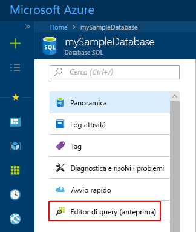
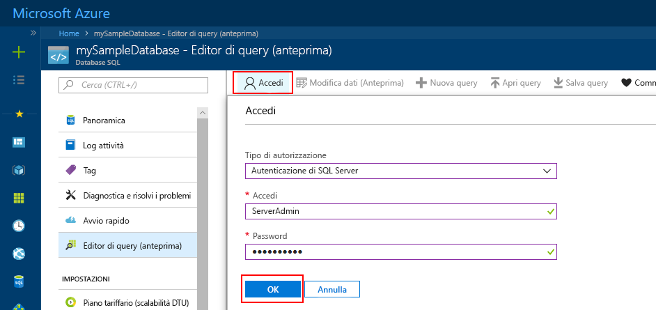
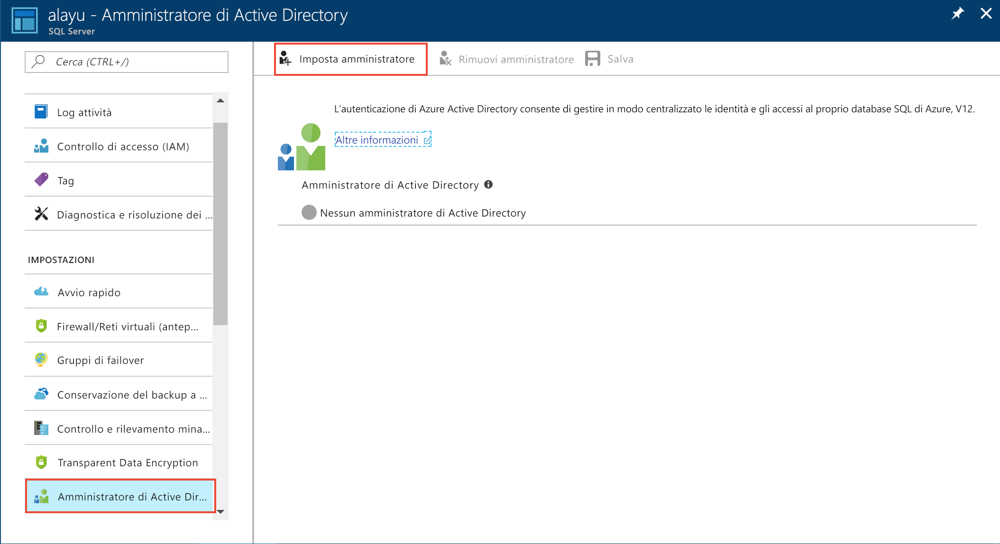
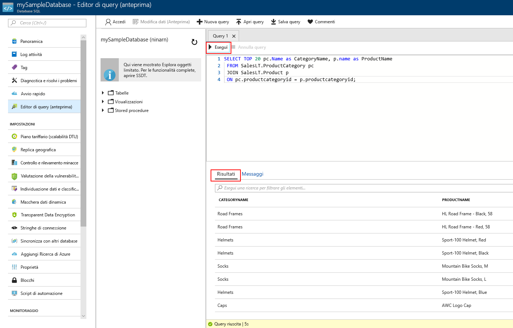

# <a name="quickstart-use-the-azure-portals-sql-query-editor-to-connect-and-query-data"></a>Guida introduttiva: Usare l'editor di query SQL del portale di Azure per connettersi ed eseguire query sui dati

L'editor di query SQL è uno strumento del browser nel portale di Azure che consente di eseguire facilmente query SQL sul database SQL di Azure o su Azure SQL Data Warehouse. In questa guida introduttiva si usa l'editor di query per connettersi a un database SQL e quindi eseguire query e inserire, aggiornare ed eliminare dati con istruzioni Transact-SQL.

## <a name="prerequisites"></a>Prerequisiti

Per completare questa esercitazione, sono necessari:

[!INCLUDE [prerequisites-create-db](../../includes/sql-database-connect-query-prerequisites-create-db-includes.md)]

> [!NOTE]
> Verificare che l'opzione **Consenti l'accesso a Servizi di Azure** sia impostata su **SÌ** nelle impostazioni del firewall di SQL Server. Questa opzione consente all'editor di query SQL di accedere a database e data warehouse.

## <a name="sign-in-the-azure-portal"></a>Accedere al portale di Azure

Accedere al [portale di Azure](https://portal.azure.com/).

## <a name="connect-using-sql-authentication"></a>Connettersi con l'autenticazione SQL

1. Selezionare **Database SQL** nel menu a sinistra e quindi **mySampleDatabase**.

2. Nel menu a sinistra trovare e selezionare **Editor di query (anteprima)**. Verrà visualizzata la **pagina di accesso**.

    

3. Nel menu a discesa **Tipo di autorizzazione** selezionare **Autenticazione di SQL Server** e quindi immettere l'ID utente e la password dell'account amministratore del server usato per creare il database.

     

4. Selezionare **OK**.


## <a name="connect-using-azure-active-directory"></a>Connettersi con Azure Active Directory

La configurazione di un amministratore di Active Directory (AD) consente di usare una singola identità per accedere al portale di Azure e al database SQL. Seguire questa procedura per configurare un amministratore di AD per SQL Server.

> [!NOTE]
* Gli account di posta elettronica (ad esempio outlook.com, gmail.com, yahoo.com e così via) non sono ancora supportati come amministratori di AD. Assicurarsi di scegliere un utente creato in modo nativo o federato in Azure AD.
* L'accesso come amministratore di Azure AD non funziona con account per cui è abilitata l'autenticazione a due fattori.

1. Selezionare **Tutte le risorse** nel menu a sinistra e quindi l'istanza di SQL Server.

2. Nel menu **Impostazioni** dell'istanza di SQL Server selezionare **Amministratore di Active Directory**.

3. Sulla barra degli strumenti della pagina relativa all'amministratore di AD selezionare**Imposta amministratore** e scegliere l'utente o il gruppo da usare come amministratore di AD.

    

4. Sulla barra degli strumenti della pagina relativa all'amministratore di AD selezionare **Salva**.

5. Passare al database **mySampleDatabase** e selezionare **Editor di query (anteprima)** nel menu a sinistra. Verrà visualizzata la **pagina di accesso**. Se si è un amministratore di AD, a destra in **Accesso Single Sign-On Active Directory** verrà visualizzato un messaggio che informa che è stato eseguito l'accesso. 
   
6. Selezionare **OK**.


## <a name="view-data"></a>Visualizzare i dati

1. Dopo l'autenticazione, incollare il codice SQL seguente nell'editor di query per recuperare i primi 20 prodotti per categoria.

   ```sql
    SELECT TOP 20 pc.Name as CategoryName, p.name as ProductName
    FROM SalesLT.ProductCategory pc
    JOIN SalesLT.Product p
    ON pc.productcategoryid = p.productcategoryid;
   ```

2. Selezionare **Esegui** sulla barra degli strumenti e quindi esaminare l'output nel riquadro **Risultati**.



## <a name="insert-data"></a>Inserire dati

Eseguire l'istruzione [INSERT](https://msdn.microsoft.com/library/ms174335.aspx) Transact-SQL seguente per aggiungere un nuovo prodotto nella tabella `SalesLT.Product`.

1. Sostituire la query precedente con questa.

   ```sql
   INSERT INTO [SalesLT].[Product]
           ( [Name]
           , [ProductNumber]
           , [Color]
           , [ProductCategoryID]
           , [StandardCost]
           , [ListPrice]
           , [SellStartDate]
           )
     VALUES
           ('myNewProduct'
           ,123456789
           ,'NewColor'
           ,1
           ,100
           ,100
           ,GETDATE() );
   ```


2. Selezionare **Esegui** per inserire una nuova riga nella tabella `Product`. Nel riquadro **Messaggi** verrà visualizzato **Query succeeded: Affected rows: 1** (Query riuscita. Righe interessate: 1).


## <a name="update-data"></a>Aggiornare i dati

Eseguire l'istruzione [UPDATE](https://msdn.microsoft.com/library/ms177523.aspx) Transact-SQL seguente per modificare il nuovo prodotto.

1. Sostituire la query precedente con questa.

   ```sql
   UPDATE [SalesLT].[Product]
   SET [ListPrice] = 125
   WHERE Name = 'myNewProduct';
   ```

2. Selezionare **Esegui** per aggiornare la riga specificata nella tabella `Product`. Nel riquadro **Messaggi** verrà visualizzato **Query succeeded: Affected rows: 1** (Query riuscita. Righe interessate: 1).

## <a name="delete-data"></a>Eliminare i dati

Eseguire l'istruzione [DELETE](https://msdn.microsoft.com/library/ms189835.aspx) Transact-SQL seguente per rimuovere il nuovo prodotto.

1. Sostituire la query precedente con questa:

   ```sql
   DELETE FROM [SalesLT].[Product]
   WHERE Name = 'myNewProduct';
   ```

2. Selezionare **Esegui** per eliminare la riga specificata nella tabella `Product`. Nel riquadro **Messaggi** verrà visualizzato **Query succeeded: Affected rows: 1** (Query riuscita. Righe interessate: 1).


## <a name="query-editor-considerations"></a>Considerazioni sull'editor di query

Quando si usa l'editor di query è necessario tenere presente quanto segue.

* Non è possibile usare l'editor di query per eseguire query su database di SQL Server in una rete virtuale.

* Premendo F5, la pagina dell'editor di query verrà aggiornata e qualsiasi query su cui si sta lavorando andrà persa.

* L'editor di query non supporta la connessione al database `master`.

* Esiste un timeout di 5 minuti per l'esecuzione delle query.

* L'editor di query supporta solo la proiezione cilindrica per i tipi di dati Geography.

* Non è disponibile alcun supporto per IntelliSense per le tabelle e le viste di database. L'editor supporta tuttavia il completamento automatico per i nomi già digitati.


## <a name="next-steps"></a>Passaggi successivi

Per altre informazioni sul supporto per Transact-SQL disponibile nei database SQL di Azure, vedere [Risoluzione delle differenze di Transact-SQL durante la migrazione al database SQL](sql-database-transact-sql-information.md).
