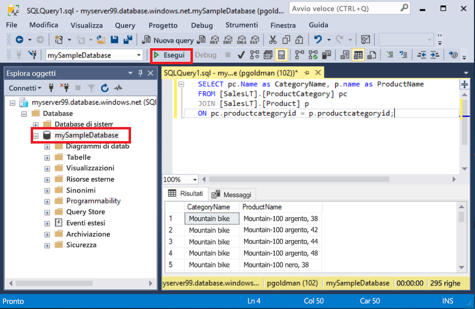
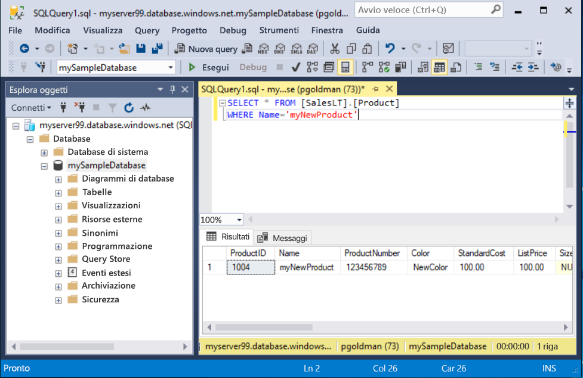

# <a name="quickstart-use-sql-server-management-studio-to-connect-and-query-an-azure-sql-database"></a>Avvio rapido: Usare SQL Server Management Studio per connettersi a un database SQL di Azure ed eseguire query

In questa Guida introduttiva, si userà [SQL Server Management Studio][ssms-install-latest-84g] (SSMS) per connettersi a un database SQL di Azure. Si eseguiranno quindi istruzioni Transact-SQL per eseguire query e per inserire, aggiornare ed eliminare dati. È possibile usare SSMS per gestire qualsiasi infrastruttura SQL, da SQL Server al database SQL per Microsoft Windows.  

## <a name="prerequisites"></a>Prerequisiti

- un database SQL di Azure. Per creare e quindi configurare un database in Database SQL di Azure è possibile usare una di queste guide introduttive:

  || Database singolo | Istanza gestita |
  |:--- |:--- |:---|
  | Create| [Portale](sql-database-single-database-get-started.md) | [Portale](sql-database-managed-instance-get-started.md) |
  || [CLI](scripts/sql-database-create-and-configure-database-cli.md) | [CLI](https://medium.com/azure-sqldb-managed-instance/working-with-sql-managed-instance-using-azure-cli-611795fe0b44) |
  || [PowerShell](scripts/sql-database-create-and-configure-database-powershell.md) | [PowerShell](scripts/sql-database-create-configure-managed-instance-powershell.md) |
  | Configurare | [Regola del firewall per gli indirizzi IP a livello di server](sql-database-server-level-firewall-rule.md)| [Connettività da una VM](sql-database-managed-instance-configure-vm.md)|
  |||[Connettività da locale](sql-database-managed-instance-configure-p2s.md)
  |Caricare i dati|Adventure Works caricato in base alla guida introduttiva|[Ripristinare Wide World Importers](sql-database-managed-instance-get-started-restore.md)
  |||Ripristinare o importare Adventure Works dal file [BACPAC](sql-database-import.md) ottenuto da [GitHub](https://github.com/Microsoft/sql-server-samples/tree/master/samples/databases/adventure-works)|
  |||

  > [!IMPORTANT]
  > Gli script in questo articolo sono scritti in modo da usare il database Adventure Works. Con un'istanza gestita, è necessario importare il database Adventure Works in un database dell'istanza oppure modificare gli script di questo articolo in modo da usare il database Wide World Importers.

## <a name="install-the-latest-ssms"></a>Installare la versione di SSMS più recente

Prima di iniziare, assicurarsi di aver installato l'ultima versione di [SSMS][ssms-install-latest-84g].

## <a name="get-sql-server-connection-information"></a>Ottenere informazioni di connessione SQL Server

Ottenere le informazioni di connessione necessarie per connettersi al database SQL di Azure. Nelle procedure successive saranno necessari il nome completo del server o il nome host, il nome del database e le informazioni di accesso.

1. Accedere al [portale di Azure](https://portal.azure.com/).

2. Passare alla pagina **Database SQL** o **Istanze gestite di SQL**.

3. Nella pagina **Panoramica** verificare il nome completo del server accanto a **Nome server** per un database singolo o accanto a **Host** per un'istanza gestita. Per copiare il nome del server o il nome host, passare il puntatore su di esso e selezionare l'icona **Copia**.

## <a name="connect-to-your-database"></a>Connettersi al database

In SMSS connettersi al server di database SQL di Azure.

> [!IMPORTANT]
> Un server di Database SQL di Azure è in ascolto sulla porta 1433. Per connettersi a un server di database SQL protetto da un firewall aziendale, è necessario che nel firewall sia aperta tale porta.
>

1. Aprire SQL Server Management Studio. Viene visualizzata la finestra di dialogo **Connetti al server** .

2. Immettere le seguenti informazioni:

   | Impostazione      | Valore consigliato    | DESCRIZIONE |
   | ------------ | ------------------ | ----------- |
   | **Tipo di server** | Motore di database | Valore obbligatorio. |
   | **Nome server** | Nome completo del server | Ad esempio, **mynewserver20170313.database.windows.net**. |
   | **autenticazione** | Autenticazione di SQL Server | Questa esercitazione usa l'autenticazione SQL. |
   | **Accesso** | ID utente dell'account amministratore del server | ID utente dell'account amministratore del server usato per creare il server. |
   | **Password** | Password dell'account amministratore del server | Password dell'account amministratore del server usato per creare il server. |
   ||||

     

3. Selezionare **Opzioni** nella finestra di dialogo **Connetti al server**. Nel menu a discesa **Connetti al database** selezionare **mySampleDatabase**.

     

4. Selezionare **Connessione**. Viene visualizzata la finestra Esplora oggetti.

5. Per visualizzare gli oggetti del database, espandere **Database** e quindi **mySampleDatabase**.

     

## <a name="query-data"></a>Eseguire query sui dati

Eseguire questo codice Transact-SQL [SELECT](https://msdn.microsoft.com/library/ms189499.aspx) per eseguire una query e individuare i primi 20 prodotti per categoria.

1. In Esplora oggetti fare clic con il pulsante destro del mouse su **mySampleDatabase** e scegliere **Nuova query**. Viene visualizzata una nuova finestra di query connessa al database.

2. Incollare questa query SQL nella finestra di query.

   ```sql
   SELECT pc.Name as CategoryName, p.name as ProductName
   FROM [SalesLT].[ProductCategory] pc
   JOIN [SalesLT].[Product] p
   ON pc.productcategoryid = p.productcategoryid;
   ```

3. Sulla barra degli strumenti selezionare **Esegui** per recuperare i dati dalle tabelle `Product` e `ProductCategory`.

    

## <a name="insert-data"></a>Inserire dati

Eseguire questo codice Transact-SQL [INSERT](https://msdn.microsoft.com/library/ms174335.aspx) per creare un nuovo prodotto nella tabella `SalesLT.Product`.

1. Sostituire la query precedente con questa.

   ```sql
   INSERT INTO [SalesLT].[Product]
           ( [Name]
           , [ProductNumber]
           , [Color]
           , [ProductCategoryID]
           , [StandardCost]
           , [ListPrice]
           , [SellStartDate] )
     VALUES
           ('myNewProduct'
           ,123456789
           ,'NewColor'
           ,1
           ,100
           ,100
           ,GETDATE() );
   ```

2. Selezionare **Esegui** per inserire una nuova riga nella tabella `Product`. Nel riquadro **Messaggi** verrà visualizzato **(1 riga interessata)**.

## <a name="view-the-result"></a>Visualizzare il risultato

1. Sostituire la query precedente con questa.

   ```sql
   SELECT * FROM [SalesLT].[Product]
   WHERE Name='myNewProduct'
   ```

2. Scegliere **Execute**(Esegui). Si ottiene il risultato seguente.

   

## <a name="update-data"></a>Aggiornare i dati

Eseguire questo codice Transact-SQL [UPDATE](https://msdn.microsoft.com/library/ms177523.aspx) per modificare il nuovo prodotto.

1. Sostituire la query precedente con questa.

   ```sql
   UPDATE [SalesLT].[Product]
   SET [ListPrice] = 125
   WHERE Name = 'myNewProduct';
   ```

2. Selezionare **Esegui** per aggiornare la riga specificata nella tabella `Product`. Nel riquadro **Messaggi** verrà visualizzato **(1 riga interessata)**.

## <a name="delete-data"></a>Eliminare i dati

Eseguire questo codice Transact-SQL [DELETE](https://msdn.microsoft.com/library/ms189835.aspx) per rimuovere il nuovo prodotto.

1. Sostituire la query precedente con questa.

   ```sql
   DELETE FROM [SalesLT].[Product]
   WHERE Name = 'myNewProduct';
   ```

2. Selezionare **Esegui** per eliminare la riga specificata nella tabella `Product`. Nel riquadro **Messaggi** verrà visualizzato **(1 riga interessata)**.

## <a name="next-steps"></a>Passaggi successivi

- Per informazioni su SSMS, vedere [SQL Server Management Studio](https://msdn.microsoft.com/library/ms174173.aspx).
- Per connettersi ed eseguire query tramite il portale di Azure, vedere [Connettersi ed eseguire query con l'editor di query SQL del portale di Azure](sql-database-connect-query-portal.md).
- Per connettersi ed eseguire query usando Visual Studio Code, vedere [Connettersi ed eseguire query con Visual Studio Code](sql-database-connect-query-vscode.md).
- Per connettersi ed eseguire una query usando .NET, vedere [Connettersi ed eseguire una query con .NET](sql-database-connect-query-dotnet.md).
- Per connettersi ed eseguire query usando PHP, vedere [Connettersi ed eseguire query con PHP](sql-database-connect-query-php.md).
- Per connettersi ed eseguire query usando Node.js, vedere [Connettersi ed eseguire query con Node.js](sql-database-connect-query-nodejs.md).
- Per connettersi ed eseguire query usando Java, vedere [Connettersi ed eseguire query con Java](sql-database-connect-query-java.md).
- Per connettersi ed eseguire query usando Python, vedere [Connettersi ed eseguire query con Python](sql-database-connect-query-python.md).
- Per connettersi ed eseguire query usando Ruby, vedere [Connettersi ed eseguire query con Ruby](sql-database-connect-query-ruby.md).

<!-- Article link references. -->

[ssms-install-latest-84g]: https://docs.microsoft.com/sql/ssms/sql-server-management-studio-ssms