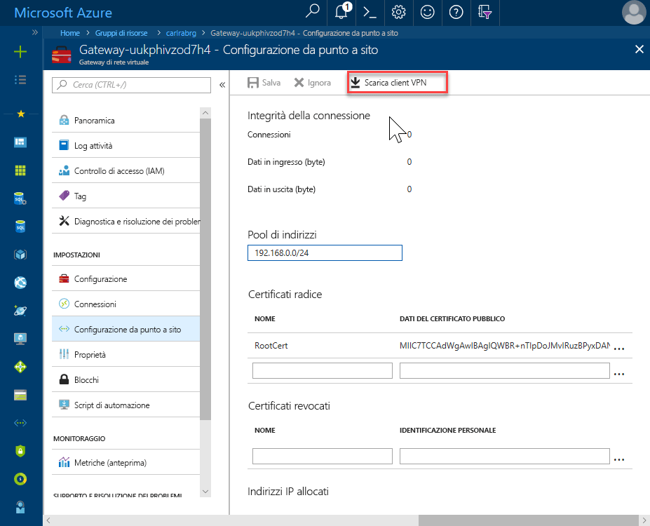

# <a name="configure-a-point-to-site-connection-to-an-azure-sql-database-managed-instance-from-on-premises"></a>Configurare una connessione da punto a sito a un'istanza gestita di database SQL di Azure da un computer locale

Questa guida introduttiva illustra come connettersi a un'istanza gestita di database SQL di Azure con [SQL Server Management Studio](https://docs.microsoft.com/sql/ssms/sql-server-management-studio-ssms) (SSMS) da un computer client locale tramite una connessione da punto a sito. Per informazioni sulle connessioni da punto a sito, vedere [Informazioni sulla VPN da punto a sito](../vpn-gateway/point-to-site-about.md)

## <a name="prerequisites"></a>Prerequisiti

La guida introduttiva:

- Usa come punto di partenza le risorse create nella guida introduttiva [Creare un'istanza gestita](sql-database-managed-instance-get-started.md).
- Richiede PowerShell 5.1 e Azure PowerShell 5.4.2 o versione successiva nel computer client locale.
- Richiede la versione più recente di [SQL Server Management Studio](https://docs.microsoft.com/sql/ssms/sql-server-management-studio-ssms) (SSMS) nel computer client locale

## <a name="attach-a-vpn-gateway-to-your-managed-instance-virtual-network"></a>Collegare un gateway VPN alla rete virtuale dell'istanza gestita

1. Aprire PowerShell nel computer client locale.
2. Copiare e incollare lo script PowerShell seguente. Questo script allega un gateway VPN alla rete virtuale dell'istanza gestita che è stata creata nella guida introduttiva [Creare un'istanza gestita](sql-database-managed-instance-get-started.md). Lo script esegue i tre passaggi seguenti:

   - Crea e installa i certificati nel computer client
   - Calcola l'intervallo IP della subnet del futuro gateway VPN
   - Crea la subnet del gateway
   - Distribuisce il modello di Azure Resource Manager che collega il gateway VPN alla subnet VPN

     ```powershell
     $scriptUrlBase = 'https://raw.githubusercontent.com/Microsoft/sql-server-samples/master/samples/manage/azure-sql-db-managed-instance/attach-vpn-gateway'

     $parameters = @{
       subscriptionId = '<subscriptionId>'
       resourceGroupName = '<resourceGroupName>'
       virtualNetworkName = '<virtualNetworkName>'
       certificateNamePrefix  = '<certificateNamePrefix>'
       }

     Invoke-Command -ScriptBlock ([Scriptblock]::Create((iwr ($scriptUrlBase+'/attachVPNGateway.ps1?t='+ [DateTime]::Now.Ticks)).Content)) -ArgumentList $parameters, $scriptUrlBase
     ```

3. Specificare i parametri richiesti nello script di PowerShell. I valori per `<subscriptionId>`, `<resourceGroup>` e `<virtualNetworkName>` devono corrispondere a quelli usati nella guida introduttiva [Creare un'istanza gestita](sql-database-managed-instance-get-started.md). Il valore per `<certificateNamePrefix>` può essere una stringa di propria scelta.

4. Eseguire lo script di PowerShell.

## <a name="create-a-vpn-connection-to-your-managed-instance"></a>Creare una connessione VPN all'istanza gestita

1. Accedere al [portale di Azure](https://portal.azure.com/).
2. Aprire il gruppo di risorse in cui è stato creato il gateway di rete virtuale e quindi aprire la risorsa del gateway di rete virtuale.

      

3. Fare clic su **Configurazione da punto a sito** e quindi su **Scarica client VPN**.

      
4. Estrarre i file dal file ZIP e quindi aprire la cartella estratta.
5. Passare alla cartella WindowsAmd64 e aprire il file **VpnClientSetupAmd64.exe**.
6. Se viene visualizzato un messaggio per segnalare che **il PC è stato protetto da Windows**, fare clic su **Altre informazioni** e quindi su **Esegui comunque**.

    \
7. Fare clic su **Sì** nella finestra di dialogo Controllo dell'account utente per continuare.
8. Nella finestra di dialogo MyNewVNet fare clic su **Sì** per installare un client VPN per MyNewVNet.

## <a name="connect-to-the-vpn-connection"></a>Connettersi alla VPN

1. Passare alle connessioni VPN nel computer client e fare clic su **MyNewVNet** per stabilire una connessione a questa rete virtuale.

      
2. Fare clic su **Connetti**.
3. Nella finestra di dialogo MyNewVNet fare clic su **Connetti**.

      
4. Quando viene segnalato che Gestione connessioni richiede privilegi elevati per aggiornare la tabella di route, fare clic su **Continua**.
5. Fare clic su **Sì** nella finestra di dialogo Controllo dell'account utente per continuare.

      

   È stata stabilita una connessione VPN alla rete virtuale dell'istanza gestita.

## <a name="use-ssms-to-connect-to-the-managed-instance"></a>Usare SSMS per connettersi all'istanza gestita

1. Nel computer client locale aprire SQL Server Management Studio (SSMS).
2. Nella finestra di dialogo **Connetti al server** immettere il **nome host** completo per l'istanza gestita nella casella **Nome server**, selezionare **Autenticazione di SQL Server**, specificare account di accesso e password e quindi fare clic su **Connetti**.

      

Dopo aver stabilito la connessione, è possibile visualizzare i database di sistema e utente nel nodo Database e vari oggetti nei nodi Sicurezza, Oggetti server, Replica, Gestione, SQL Server Agent e Profiler XEvent.

## <a name="next-steps"></a>Passaggi successivi

- Per una guida introduttiva che illustra come connettersi da una macchina virtuale di Azure, vedere [Configurare una connessione da punto a sito](sql-database-managed-instance-configure-p2s.md)
- Per una panoramica delle opzioni di connessione per le applicazioni, vedere [Connettere le applicazioni a un'istanza gestita](sql-database-managed-instance-connect-app.md).
- Per ripristinare un database SQL Server esistente da locale a un'istanza gestita, è possibile eseguire il ripristino da un file di backup del database usando il [Servizio Migrazione del database di Azure (DMS) per la migrazione](../dms/tutorial-sql-server-to-managed-instance.md) o usare il [comando T-SQL RESTORE](sql-database-managed-instance-get-started-restore.md) per eseguire un'importazione da un file di backup.
