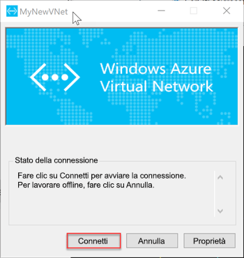

# <a name="quickstart-configure-a-point-to-site-connection-to-an-azure-sql-database-managed-instance-from-on-premises"></a>Avvio rapido: Configurare una connessione da punto a sito a un'istanza gestita di database SQL di Azure da un computer locale

Questa guida introduttiva illustra come connettersi a un'istanza gestita di database SQL di Azure con [SQL Server Management Studio](https://docs.microsoft.com/sql/ssms/sql-server-management-studio-ssms) (SSMS) da un computer client locale tramite una connessione da punto a sito. Per informazioni sulle connessioni da punto a sito, vedere [Informazioni sulla VPN da punto a sito](../vpn-gateway/point-to-site-about.md)

## <a name="prerequisites"></a>Prerequisiti

La guida introduttiva:

- Usa le risorse create in [Creare un'istanza gestita](sql-database-managed-instance-get-started.md) come punto iniziale.
- È necessario PowerShell 5.1 e AZ PowerShell 1.4.0 o versione successiva nel computer client locale. Se necessario, vedere le istruzioni per l'[installazione del modulo Azure PowerShell](https://docs.microsoft.com/powershell/azure/install-az-ps#install-the-azure-powershell-module).
- Richiede la versione più recente di [SQL Server Management Studio](https://docs.microsoft.com/sql/ssms/sql-server-management-studio-ssms) (SSMS) nel computer client locale.

## <a name="attach-a-vpn-gateway-to-your-managed-instance-virtual-network"></a>Collegare un gateway VPN alla rete virtuale dell'istanza gestita

1. Aprire PowerShell nel computer client locale.

2. Copiare questo script di PowerShell. Questo script allega un gateway VPN alla rete virtuale dell'istanza gestita che è stata creata nella guida introduttiva [Creare un'istanza gestita](sql-database-managed-instance-get-started.md). Lo script esegue queste operazioni:

   - Crea e installa i certificati nel computer client
   - Calcola l'intervallo IP della subnet del futuro gateway VPN
   - Crea la subnet del gateway
   - Distribuisce il modello di Azure Resource Manager che collega il gateway VPN alla subnet VPN

     ```powershell
     $scriptUrlBase = 'https://raw.githubusercontent.com/Microsoft/sql-server-samples/master/samples/manage/azure-sql-db-managed-instance/attach-vpn-gateway'

     $parameters = @{
       subscriptionId = '<subscriptionId>'
       resourceGroupName = '<resourceGroupName>'
       virtualNetworkName = '<virtualNetworkName>'
       certificateNamePrefix  = '<certificateNamePrefix>'
       }

     Invoke-Command -ScriptBlock ([Scriptblock]::Create((iwr ($scriptUrlBase+'/attachVPNGatewayAz.ps1?t='+ [DateTime]::Now.Ticks)).Content)) -ArgumentList $parameters, $scriptUrlBase
     ```

     > [!IMPORTANT]
     > Per usare il modulo Azure PowerShell Resource Manager anziché il modulo di Az, usare il cmdlet seguente: `attachVPNGateway.ps1` anziché il `attachVPNGatewayAz.ps1` cmdlet.

3. Incollare lo script nella finestra di PowerShell e fornire i parametri obbligatori. I valori per `<subscriptionId>`, `<resourceGroup>` e `<virtualNetworkName>` devono corrispondere a quelli usati per l'avvio rapido [Creare un'istanza gestita](sql-database-managed-instance-get-started.md). Il valore per `<certificateNamePrefix>` può essere una stringa di propria scelta.

4. Eseguire lo script di PowerShell.

> [!IMPORTANT]
> Non continuare finché non viene completato lo script di PowerShell.

## <a name="create-a-vpn-connection-to-your-managed-instance"></a>Creare una connessione VPN all'istanza gestita

1. Accedere al [portale di Azure](https://portal.azure.com/).
2. Aprire il gruppo di risorse in cui è stato creato il gateway di rete virtuale e quindi aprire la risorsa del gateway di rete virtuale.
3. Selezionare **Configurazione da punto a sito** e quindi selezionare **Scarica client VPN**.

      
4. Nel computer client in locale, estrarre i file dal file zip e quindi aprire la cartella con i file estratti.
5. Aprire il '**WindowsAmd64** cartella e aprire il **VpnClientSetupAmd64.exe** file.
6. Se viene visualizzato un messaggio per segnalare che **il PC è stato protetto da Windows**, fare clic su **Altre informazioni** e quindi su **Esegui comunque**.

    \
7. Nella finestra di dialogo controllo dell'Account utente, fare clic su **Sì** per continuare.
8. Nella finestra di dialogo che fanno riferimento a rete virtuale, selezionare **Sì** per installare il Client VPN per rete virtuale.

## <a name="connect-to-the-vpn-connection"></a>Connettersi alla VPN

1. Passare a **VPN** nelle **rete e Internet** nel computer client in locale e selezionare la rete virtuale a istanza gestita per stabilire una connessione a questa rete virtuale. Nell'immagine seguente, la rete virtuale è denominata **MyNewVNet**.

      
2. Selezionare **Connessione**.
3. Nella finestra di dialogo, selezionare **Connessione**.

      
4. Quando viene segnalato che Gestione connessioni richiede privilegi elevati per aggiornare la tabella di route, scegliere **Continua**.
5. Selezionare **Sì** nella finestra di dialogo Controllo dell'account utente per continuare.

   È stata stabilita una connessione VPN alla rete virtuale dell'istanza gestita.

      

## <a name="use-ssms-to-connect-to-the-managed-instance"></a>Usare SSMS per connettersi all'istanza gestita

1. Nel computer client locale aprire SQL Server Management Studio (SSMS).
2. Nella finestra di dialogo **Connetti al server** immettere il **nome host** completo per l'istanza gestita nella casella **Nome server**.
3. Selezionare **Autenticazione di SQL Server**, specificare il nome utente e la password e quindi selezionare **Connetti**.

      

Dopo la connessione, è possibile visualizzare i database di sistema e utente nel nodo database. È inoltre possibile visualizzare diversi oggetti nei nodi di sicurezza, oggetti server, replica, gestione, SQL Server Agent e Profiler XEvent.

## <a name="next-steps"></a>Passaggi successivi

- Per una guida introduttiva che illustra come connettersi da una macchina virtuale di Azure, vedere [Configurare una connessione da punto a sito](sql-database-managed-instance-configure-p2s.md).
- Per una panoramica delle opzioni di connessione delle applicazioni, consultare [Connessione delle applicazioni a un'Istanza gestita](sql-database-managed-instance-connect-app.md).
- Per ripristinare un database SQL Server esistente dal sistema locale a un'istanza gestita, è possibile usare il [Servizio Migrazione del database di Azure (DMS) per la migrazione](../dms/tutorial-sql-server-to-managed-instance.md) o il [comando T-SQL RESTORE](sql-database-managed-instance-get-started-restore.md) per il ripristino da un file di backup del database.
