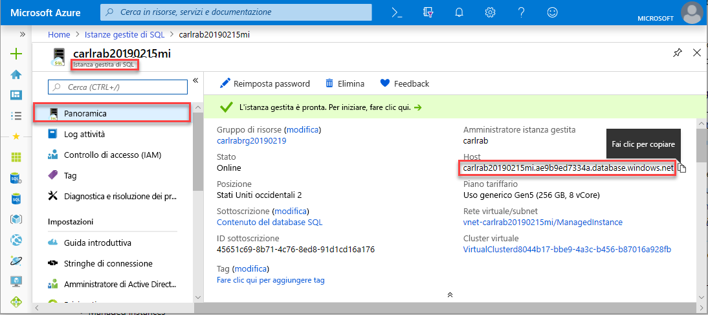

# Guida introduttiva: Creare un'istanza gestita di database SQL di Azure

Questa guida introduttiva illustra come creare un'[istanza gestita](sql-database-managed-instance.md) di database SQL di Azure nel portale di Azure.

Se non si ha una sottoscrizione di Azure, [creare un account gratuito](https://azure.microsoft.com/free/) prima di iniziare.

## Accedere al portale di Azure

Accedere al [portale di Azure](https://portal.azure.com/).

## Creare un'istanza gestita

I passaggi seguenti mostrano come creare un'istanza gestita.

1. Scegliere **Crea una risorsa** nell'angolo superiore sinistro del portale di Azure.
2. Individuare **Istanza gestita** e quindi selezionare **Azure SQL Managed Instance**.
3. Selezionare **Create**.

   

4. Compilare il modulo **Istanza gestita** con le informazioni richieste, usando le informazioni riportate nella tabella seguente:

   | Impostazione| Valore consigliato | DESCRIZIONE |
   | ------ | --------------- | ----------- |
   | **Sottoscrizione** | Sottoscrizione in uso | Una sottoscrizione in cui si dispone dell'autorizzazione per creare nuove risorse |
   |**Nome istanza gestita**|Qualsiasi nome valido|Per informazioni sui nomi validi, vedere [Regole di denominazione e restrizioni](https://docs.microsoft.com/azure/architecture/best-practices/naming-conventions).|
   |**Account di accesso amministratore istanza gestita**|Qualsiasi nome utente valido|Per informazioni sui nomi validi, vedere [Regole di denominazione e restrizioni](https://docs.microsoft.com/azure/architecture/best-practices/naming-conventions). Non usare "serveradmin" perché è un ruolo a livello di server riservato.|
   |**Password**|Qualsiasi password valida|La password deve contenere almeno 16 caratteri e soddisfare i [requisiti di complessità definiti](../virtual-machines/windows/faq.md#what-are-the-password-requirements-when-creating-a-vm).|
   |**Posizione**|La posizione in cui si desidera creare l'istanza gestita|Per informazioni sulle aree, vedere [Aree di Azure](https://azure.microsoft.com/regions/).|
   |**Rete virtuale**|Selezionare **Crea nuova rete virtuale** o una rete virtuale valida e una subnet.| Se una rete/subnet è disattivata, prima di selezionarla come destinazione per la nuova istanza gestita deve essere [modificata per soddisfare i requisiti di rete](sql-database-managed-instance-configure-vnet-subnet.md). Per informazioni sui requisiti per la configurazione dell'ambiente di rete per un'istanza gestita, vedere [Configurare una rete virtuale per Istanza gestita di database SQL di Azure](sql-database-managed-instance-connectivity-architecture.md). |
   |**Gruppo di risorse**|Gruppo di risorse nuovo o esistente|Per i nomi di gruppi di risorse validi, vedere [Regole di denominazione e restrizioni](https://docs.microsoft.com/azure/architecture/best-practices/naming-conventions).|

   

5. Per usare l'istanza gestita come gruppo di failover dell'istanza secondario, selezionare il checkout e specificare l'istanza gestita DnsAzurePartner. Questa funzionalità è disponibile in anteprima e non è visualizzata nello screenshot associato.
6. Selezionare **Piano tariffario** per definire le dimensioni delle risorse di calcolo e di archiviazione ed esaminare le opzioni del piano tariffario. Il piano tariffario di utilizzo generico con 32 GB di memoria e 16 vCore è il valore predefinito.
7. Usare i dispositivi di scorrimento o le caselle di testo per specificare la quantità di spazio di archiviazione e il numero di core virtuali.
8. Al termine, scegliere **Applica** per salvare le impostazioni selezionate.  
9. Selezionare **Crea** per distribuire l'istanza gestita.
10. Selezionare l'icona **Notifiche** per visualizzare lo stato della distribuzione.

    

11. Selezionare **Distribuzione in corso** per aprire la finestra dell'istanza gestita e monitorare ulteriormente lo stato di avanzamento della distribuzione.

> [!IMPORTANT]
> Per la prima istanza in una subnet, i tempi di distribuzione sono in genere molto più lunghi rispetto alle istanze successive. Non annullare l'operazione di distribuzione perché la durata è superiore al previsto. Creare la seconda istanza gestita nella subnet richiederà solo qualche minuto.

## Esaminare le risorse e recuperare il nome completo del server

Dopo aver completato la distribuzione, esaminare le risorse create e recuperare il nome completo del server per l'uso in guide introduttive successive.

1. Aprire il gruppo di risorse per l'istanza gestita e visualizzare le relative risorse che sono state create automaticamente nella guida introduttiva [Creare un'istanza gestita](#create-a-managed-instance).

2. Selezionare l'istanza gestita.

   

3. Nella scheda **Panoramica** individuare la proprietà **Host** e copiare l'indirizzo host completo per l'istanza gestita.

   

   Il nome sarà simile a **nome_computer.a1b2c3d4e5f6.database.windows.net**.

## Passaggi successivi

- Per altre informazioni sulla connessione a un'istanza gestita, vedere:
  - Per una panoramica delle opzioni di connessione per le applicazioni, vedere [Connettere le applicazioni a un'istanza gestita](sql-database-managed-instance-connect-app.md).
  - Per una guida introduttiva che illustra come connettersi a un'istanza gestita tramite una macchina virtuale di Azure, vedere [Configurare una connessione tramite macchina virtuale di Azure](sql-database-managed-instance-configure-vm.md).
  - Per una guida introduttiva che illustra come connettersi a un'istanza gestita tramite un computer client locale usando una connessione da punto a sito, vedere [Configurare una connessione da punto a sito](sql-database-managed-instance-configure-p2s.md).
- Per ripristinare un database SQL Server esistente da locale a un'istanza gestita, è possibile eseguire il ripristino da un file di backup del database usando il [Servizio Migrazione del database di Azure (DMS) per la migrazione](../dms/tutorial-sql-server-to-managed-instance.md) o usare il [comando T-SQL RESTORE](sql-database-managed-instance-get-started-restore.md) per eseguire un'importazione da un file di backup.
- Per informazioni sul monitoraggio avanzato delle prestazioni del database di Istanza gestita con intelligence predefinita per la risoluzione dei problemi, vedere [Monitorare il database SQL di Azure usando Analisi SQL di Azure](../azure-monitor/insights/azure-sql.md).
