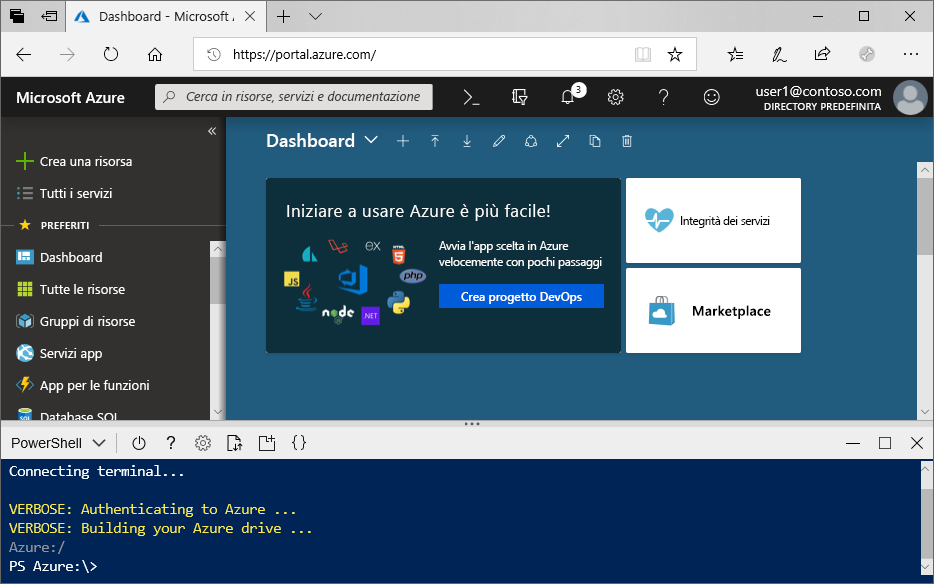
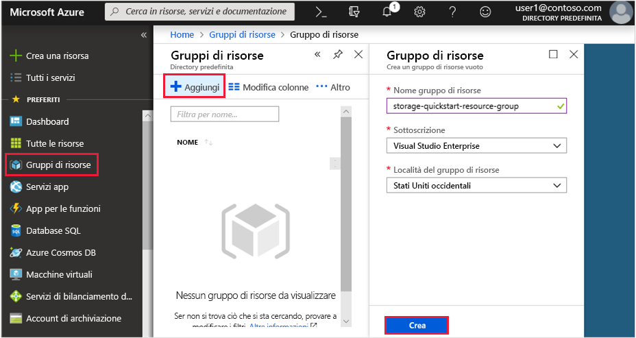
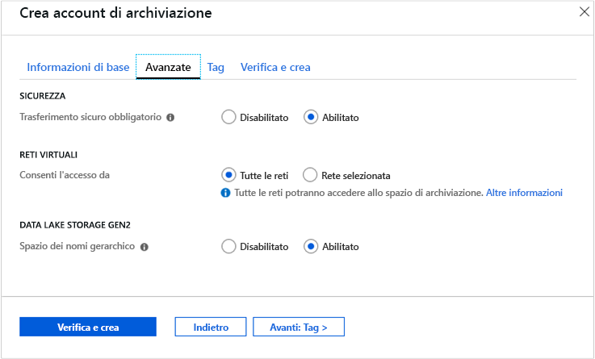

# <a name="quickstart-create-an-azure-data-lake-storage-gen2-storage-account"></a>Guida introduttiva: Creare un account di archiviazione di Azure Data Lake Storage Gen2

Azure Data Lake Storage Gen2 [supporta un servizio spazio dei nomi gerarchico](data-lake-storage-introduction.md) che fornisce un file system nativo basato su directory da usare con Hadoop Distributed File System (HDFS). L'accesso ai dati di Data Lake Storage Gen2 da HDFS è disponibile tramite il [driver ABFS](data-lake-storage-abfs-driver.md).

Questa guida introduttiva illustra come creare un account tramite il [portale di Azure](https://portal.azure.com/), [Azure PowerShell](https://docs.microsoft.com/powershell/azure/overview) o l'[interfaccia della riga di comando di Azure](https://docs.microsoft.com/cli/azure?view=azure-cli-latest).

## <a name="prerequisites"></a>Prerequisiti

Se non si ha una sottoscrizione di Azure, creare un [account gratuito](https://azure.microsoft.com/free/) prima di iniziare. 

|           | Prerequisito |
|-----------|--------------|
|Portale     | Nessuno         |
|PowerShell | Per questa guida introduttiva è richiesto il modulo PowerShell Az.Storage versione **0.7** o successiva. Eseguire il comando `Get-Module -ListAvailable Az.Storage` per trovare la versione corrente. Se dopo aver eseguito questo comando non vengono visualizzati risultati o se viene indicata una versione diversa dalla **0.7**, è necessario aggiornare il modulo di PowerShell. Vedere la sezione [Aggiornare il modulo di PowerShell](#upgrade-your-powershell-module) della guida.
|CLI        | È possibile accedere ad Azure ed eseguire i comandi dell'interfaccia della riga di comando di Azure in uno dei due modi seguenti: <ul><li>È possibile eseguire i comandi dell'interfaccia della riga di comando nel portale di Azure, in Azure Cloud Shell </li><li>È possibile installare l'interfaccia della riga di comando ed eseguire i relativi comandi in locale</li></ul>|

Quando si usa la riga di comando, è possibile scegliere se eseguire Azure Cloud Shell o installare l'interfaccia della riga di comando in locale.

### <a name="use-azure-cloud-shell"></a>Usare Azure Cloud Shell

Azure Cloud Shell è una shell Bash gratuita che è possibile eseguire direttamente nel portale di Azure. Include l'interfaccia della riga di comando di Azure preinstallata e configurata per l'uso con l'account. Fare clic sul pulsante **Cloud Shell** nel menu in alto a destra nel portale di Azure:

[](https://portal.azure.com)

Il pulsante avvia una shell interattiva che è possibile usare per eseguire i passaggi di questa guida introduttiva:

[](https://portal.azure.com)

### <a name="install-the-cli-locally"></a>Installare l'interfaccia della riga di comando in locale

È anche possibile installare e usare l'interfaccia della riga di comando di Azure in locale. Questa guida introduttiva richiede l'interfaccia della riga di comando di Azure 2.0.38 o versioni successive. Eseguire `az --version` per trovare la versione. Se è necessario eseguire l'installazione o l'aggiornamento, vedere [Installare l'interfaccia della riga di comando di Azure](/cli/azure/install-azure-cli).

## <a name="create-a-storage-account-with-azure-data-lake-storage-gen2-enabled"></a>Creare un account di archiviazione con Azure Data Lake Storage Gen2 abilitato

Prima di creare un account, è necessario un gruppo di risorse che funge da contenitore logico per gli account di archiviazione o altre risorse di Azure create. Per pulire le risorse create in questa guida introduttiva, è sufficiente eliminare il gruppo di risorse. Eliminando il gruppo di risorse vengono eliminati anche l'account di archiviazione associato e tutte le altre risorse correlate al gruppo di risorse. Per altre informazioni sui gruppi di risorse, vedere [Panoramica di Azure Resource Manager](../../azure-resource-manager/resource-group-overview.md).

> [!NOTE]
> È necessario creare nuovi account di archiviazione con tipo **Archiviazione V2 (utilizzo generico v2)** per sfruttare le funzionalità di Data Lake Storage Gen2.  

Per altre informazioni sugli account di archiviazione, vedere [Panoramica dell'account di archiviazione di Azure](../common/storage-account-overview.md).

Quando si assegna un nome all'account di archiviazione, tenere presenti queste regole:

- I nomi degli account di archiviazione devono avere una lunghezza compresa tra 3 e 24 caratteri e possono contenere solo numeri e lettere minuscole.
- Nome dell'account di archiviazione deve essere univoco all'interno di Azure. Due account di archiviazione non possono avere lo stesso nome.

## <a name="create-an-account-using-the-azure-portal"></a>Creare un account usando il portale di Azure

Accedere al [Portale di Azure](https://portal.azure.com).

### <a name="create-a-resource-group"></a>Creare un gruppo di risorse

Per creare un gruppo di risorse nel portale di Azure, seguire questa procedura:

1. Nel portale di Azure espandere il menu a sinistra per aprire il menu dei servizi e scegliere **Gruppi di risorse**.
2. Fare clic sul pulsante **Aggiungi** per aggiungere un nuovo gruppo di risorse.
3. Immettere un nome per il nuovo gruppo di risorse.
4. Selezionare la sottoscrizione in cui creare il nuovo gruppo di risorse.
5. Scegliere la posizione per il gruppo di risorse.
6. Fare clic sul pulsante **Create** (Crea).  

   

### <a name="create-a-general-purpose-v2-storage-account"></a>Creare un account di archiviazione per utilizzo generico v2

Per creare un account di archiviazione per utilizzo generico v2 nel portale di Azure, eseguire questa procedura:

> [!NOTE]
> Lo spazio dei nomi gerarchico è attualmente disponibile in tutte le aree pubbliche. Non è attualmente disponibile nei cloud sovrani.

1. Nel portale di Azure espandere il menu a sinistra per aprire il menu dei servizi e scegliere **Tutti i servizi**. Scorrere quindi verso il basso fino ad **Archiviazione** e scegliere **Account di archiviazione**. Nella finestra **Account di archiviazione** visualizzata scegliere **Aggiungi**.
2. Selezionare la **sottoscrizione** e il **gruppo di risorse creato in precedenza**.
3. Immettere un nome per l'account di archiviazione.
4. Impostare **Posizione** su **Stati Uniti occidentali 2**
5. Mantenere i valori predefiniti per questi campi: **Prestazioni**, **Tipo di account**, **Replica**, **Livello di accesso**.
6. Scegliere la sottoscrizione in cui creare l'account di archiviazione.
7. Selezionare **Avanti: Avanzate >**
8. Lasciare i valori **SECURITY** e **VIRTUAL NETWORKS** alle impostazioni predefinite.
9. Nella sezione **Data Lake Storage Gen2 (preview)** (Data Lake Storage Gen2 - anteprima) impostare **Hierarchical namespace** (Spazio dei nomi gerarchico) su **Abilitato**.
10. Fare clic su **Rivedi e crea** per creare l'account di archiviazione.

    

L'account di archiviazione viene ora creato tramite il portale.

### <a name="clean-up-resources"></a>Pulire le risorse

Per rimuovere un gruppo di risorse usando il portale di Azure:

1. Nel portale di Azure espandere il menu a sinistra per aprire il menu dei servizi e scegliere **Gruppi di risorse** per visualizzare l'elenco dei gruppi di risorse.
2. Individuare il gruppo di risorse da eliminare e fare clic con il pulsante destro del mouse su **Altro** (**...**) a destra dell'elenco.
3. Scegliere **Elimina gruppo di risorse** e confermare.

## <a name="create-an-account-using-powershell"></a>Creare un account con PowerShell

Installare innanzitutto la versione più recente del modulo [PowerShellGet](https://docs.microsoft.com/powershell/gallery/installing-psget).

Quindi, aggiornare il modulo di PowerShell, accedere alla sottoscrizione di Azure, creare un gruppo di risorse e quindi creare un account di archiviazione.

### <a name="upgrade-your-powershell-module"></a>Aggiornare il modulo di Powershell

Per interagire con Data Lake Storage Gen2 tramite PowerShell, è necessario installare il modulo Az.Storage, versione **0,7** o successiva.

Iniziare aprendo una sessione di PowerShell con autorizzazioni elevate.

Quindi, stabilire se è installato il modulo AzureRM.Storage.

```powershell
Get-Module -ListAvailable AzureRM.Storage
```

Se viene visualizzato un modulo, disinstallarlo.

```powershell
Uninstall-Module AzureRM.Storage -Force
```

Installare il modulo Az.Storage

```powershell
Install-Module Az.Storage -Repository PSGallery -RequiredVersion 0.7.0 -AllowPrerelease -AllowClobber -Force
```

Abilitare la modalità di compatibilità per AzureRM.

```powershell
Enable-AzureRMAlias
```

Nella modalità di compatibilità tutti gli script che usano il modulo AzureRM.Storage continueranno a funzionare anche se è stato disinstallato tale modulo.

> [!NOTE]
> I moduli di Azure Powershell Az sono i moduli preferiti per l'utilizzo dei servizi di Azure in PowerShell. Per altre informazioni, vedere [Introduzione del nuovo modulo Az di Azure PowerShell](https://docs.microsoft.com/powershell/azure/new-azureps-module-az?view=azurermps-6.13.0).

### <a name="log-in-to-your-azure-subscription"></a>Accedere alla sottoscrizione di Azure

Usare il comando `Login-AzureRmAccount` e seguire le istruzioni visualizzate per eseguire l'autenticazione.

```powershell
Login-AzureRmAccount
```

### <a name="create-a-resource-group"></a>Creare un gruppo di risorse

Per creare un nuovo gruppo di risorse con PowerShell, usare il comando [New-AzureRmResourceGroup](/powershell/module/azurerm.resources/new-azurermresourcegroup): 

> [!NOTE]
> Lo spazio dei nomi gerarchico è attualmente disponibile in tutte le aree pubbliche. Non è attualmente disponibile nei cloud sovrani.

```powershell
# put resource group in a variable so you can use the same group name going forward,
# without hardcoding it repeatedly
$resourceGroup = "storage-quickstart-resource-group"
$location = "westus2"
New-AzureRmResourceGroup -Name $resourceGroup -Location $location
```

### <a name="create-a-general-purpose-v2-storage-account"></a>Creare un account di archiviazione per utilizzo generico v2

Per creare un account di archiviazione per utilizzo generico v2 da PowerShell con l'archiviazione con ridondanza locale, usare il comando [New-AzureRmStorageAccount](/powershell/module/azurerm.storage/New-AzureRmStorageAccount):

```powershell
$location = "westus2"

New-AzureRmStorageAccount -ResourceGroupName $resourceGroup `
  -Name "storagequickstart" `
  -Location $location `
  -SkuName Standard_LRS `
  -Kind StorageV2 `
  -EnableHierarchicalNamespace $True
```

### <a name="clean-up-resources"></a>Pulire le risorse

Per rimuovere il gruppo di risorse e tutte le risorse correlate, incluso il nuovo account di archiviazione, usare il comando [Remove-AzureRmResourceGroup](/powershell/module/azurerm.resources/remove-azurermresourcegroup): 

```powershell
Remove-AzureRmResourceGroup -Name $resourceGroup
```

## <a name="create-an-account-using-azure-cli"></a>Creare un account con l'interfaccia della riga di comando di Azure

Per avviare Azure Cloud Shell, accedere al [portale di Azure](https://portal.azure.com).

Per accedere all'installazione locale dell'interfaccia della riga di comando, eseguire il comando di accesso:

```cli
az login
```

### <a name="add-the-cli-extension-for-azure-data-lake-gen-2"></a>Aggiungere l'estensione della riga di comando di Azure Data Lake Gen2

Per interagire con Data Lake Storage Gen2 tramite l'interfaccia della riga di comando, è necessario aggiungere un'estensione alla shell.

A tale scopo, usando Cloud Shell o una shell locale, immettere il comando seguente: `az extension add --name storage-preview`

### <a name="create-a-resource-group"></a>Creare un gruppo di risorse

Per creare un nuovo gruppo di risorse con l'interfaccia della riga di comando di Azure, usare il comando [az group create](/cli/azure/group#az_group_create).

```azurecli-interactive
az group create `
    --name storage-quickstart-resource-group `
    --location westus2
```

> [!NOTE]
> > Lo spazio dei nomi gerarchico è attualmente disponibile in tutte le aree pubbliche. Non è attualmente disponibile nei cloud sovrani.

### <a name="create-a-general-purpose-v2-storage-account"></a>Creare un account di archiviazione per utilizzo generico v2

Per creare un account di archiviazione per utilizzo generico v2 dall'interfaccia della riga di comando di Azure con l'archiviazione con ridondanza locale, usare il comando [az storage account create](/cli/azure/storage/account#az_storage_account_create).

```azurecli-interactive
az storage account create `
    --name storagequickstart `
    --resource-group storage-quickstart-resource-group `
    --location westus2 `
    --sku Standard_LRS `
    --kind StorageV2 `
    --hierarchical-namespace true
```

### <a name="clean-up-resources"></a>Pulire le risorse

Per rimuovere il gruppo di risorse e tutte le risorse correlate, incluso il nuovo account di archiviazione, usare il comando [az group delete](/cli/azure/group#az_group_delete).

```azurecli-interactive
az group delete --name myResourceGroup
```

## <a name="next-steps"></a>Passaggi successivi

In questa guida introduttiva è stato creato un account di archiviazione con funzionalità di Data Lake Storage Gen2. Per informazioni su come caricare e scaricare BLOB nell'account di archiviazione, consultare l'argomento seguente.

* [AzCopy V10](https://docs.microsoft.com/azure/storage/common/storage-use-azcopy-v10?toc=%2fazure%2fstorage%2fblobs%2ftoc.json)