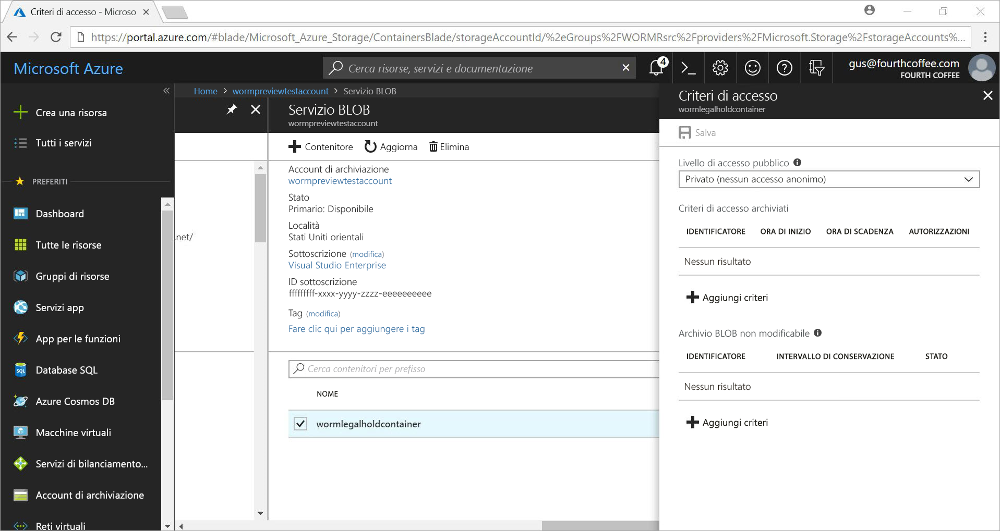
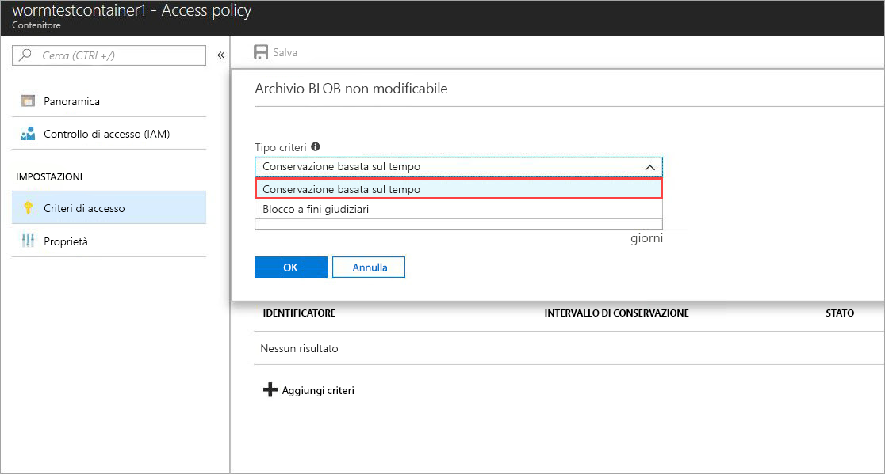
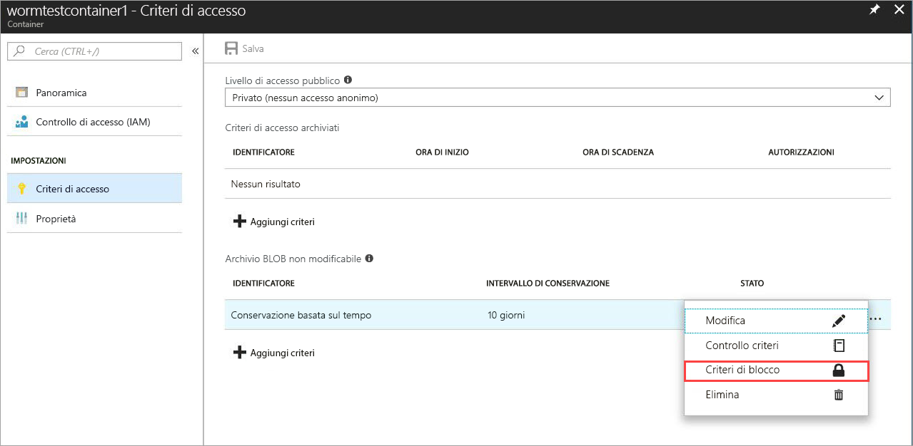
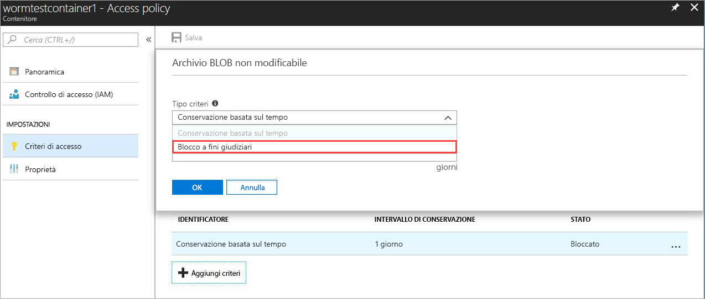

# <a name="store-business-critical-data-in-azure-blob-storage"></a>Archiviare dati critici in Archiviazione BLOB di Azure

L'archiviazione non modificabile per i BLOB di Azure (oggetti) consente agli utenti di archiviare i dati business critical in uno stato WORM (Write Once, Read Many). Questo stato rende i dati non cancellabili e non modificabili per un intervallo di tempo specificato dall'utente. Per la durata dell'intervallo di conservazione, i BLOB possono essere creati e letti, ma non modificati o eliminati.

## <a name="overview"></a>Panoramica

L'archiviazione non modificabile aiuta le istituzioni finanziarie e i settori correlati, in particolare le organizzazioni che si occupano di intermediazione finanziaria, ad archiviare i dati in modo sicuro. Può essere sfruttata anche in qualsiasi altro scenario per proteggere i dati critici dall'eliminazione.  

Le applicazioni tipiche includono:

- **Conformità alle normative**: l'archiviazione non modificabile per Archiviazione BLOB di Azure aiuta le organizzazioni a soddisfare i requisiti di SEC 17a-4(f), CFTC 1.31(d), FINRA e altre normative.

- **Conservazione sicura dei documenti**: l'archiviazione BLOB assicura che i dati non possano essere modificati o eliminati da alcun utente, inclusi quelli con privilegi amministrativi dell'account.

- **Blocco a fini giudiziari**: l'archiviazione non modificabile per Archiviazione BLOB di Azure consente agli utenti di archiviare informazioni riservate di importanza critica per una controversia legale o un'indagine giudiziaria in uno stato antimanomissione per il periodo di tempo desiderato.

L'archiviazione non modificabile offre:

- **Supporto per i criteri di conservazione basati sul tempo**: gli utenti impostano criteri per archiviare i dati per un intervallo di tempo specificato.

- **Supporto per i criteri di blocco a fini giudiziari**: quando l'intervallo di conservazione non è noto, gli utenti possono impostare blocchi a fini giudiziari per archiviare i dati in modo non modificabile finché non viene rimosso il blocco.  Quando viene impostato un blocco a fini giudiziari, i BLOB possono essere creati e letti, ma non modificati o eliminati. Ogni blocco a fini giudiziari è associato a un tag alfanumerico definito dall'utente che viene usato come stringa di identificazione, ad esempio un ID del caso.

- **Supporto per tutti i livelli BLOB**: i criteri WORM sono indipendenti dal livello di Archiviazione BLOB di Azure e si applicano a tutti i livelli (ad accesso frequente, ad accesso sporadico e archivio). Gli utenti possono trasferire i dati nel livello con i costi ottimali per i carichi di lavoro, mantenendo al tempo stesso la non modificabilità dei dati.

- **Configurazione a livello di contenitore**: gli utenti possono configurare criteri di conservazione basati sul tempo e tag di blocco a fini giudiziari a livello di contenitore. Grazie a semplici impostazioni a livello di contenitore, gli utenti possono creare e bloccare i criteri di conservazione basati sul tempo, estendere gli intervalli di conservazione, impostare e rimuovere i blocchi a fini giudiziari e così via. Questi criteri si applicano a tutti i BLOB nel contenitore, nuovi ed esistenti.

- **Supporto della registrazione di controllo**: ogni contenitore include un log di controllo. Sono presenti fino a cinque comandi di conservazione basati sul tempo per i criteri di conservazione basati sul tempo bloccati, con un massimo di tre log per le estensioni dell'intervallo di conservazione. Per la conservazione basata sul tempo, il log contiene l'ID utente, il tipo di comando, i timestamp e l'intervallo di conservazione. Per i blocchi a fini giudiziari, il log contiene l'ID utente, il tipo di comando, i timestamp e i tag di blocco a fini giudiziari. Questo log viene mantenuto per tutta la durata del contenitore, in conformità alle linee guida delle normative SEC 17a-4(f). Il [log attività di Azure](https://docs.microsoft.com/azure/monitoring-and-diagnostics/monitoring-overview-activity-logs) fornisce un log più completo di tutte le attività del piano di controllo. È responsabilità dell'utente archiviare questi log in modo permanente, come potrebbe essere richiesto per scopi legali o di altro tipo.

L'archiviazione non modificabile è abilitata in tutte le aree pubbliche di Azure.

## <a name="how-it-works"></a>Funzionamento

L'archiviazione non modificabile per Archiviazione BLOB di Azure supporta due tipi di criteri non modificabili o WORM: conservazione basata sul tempo e blocchi a fini giudiziari. Per informazioni dettagliate su come creare questi criteri non modificabili, vedere la sezione [Introduzione](#Getting-started).

Quando in un contenitore vengono applicati criteri di conservazione basati sul tempo o un blocco a fini giudiziari, tutti i BLOB esistenti passano allo stato non modificabile (protetti da scrittura ed eliminazione). Anche tutti i nuovi BLOB caricati nel contenitore passeranno allo stato non modificabile.

> [!IMPORTANT]
> I criteri di conservazione basati sul tempo devono essere *bloccati* perché il BLOB sia in uno stato non modificabile (protetto da scrittura ed eliminazione) per la conformità a SEC 17a-4(f) e ad altri requisiti normativi. È consigliabile bloccare i criteri in un periodo di tempo ragionevole, in genere entro 24 ore. Non è consigliabile usare lo stato *sbloccato* per scopi diversi da valutazioni delle funzionalità a breve termine.

Quando vengono applicati criteri di conservazione basati sul tempo a un contenitore, tutti i BLOB nel contenitore rimangono nello stato non modificabile per la durata del periodo di conservazione *effettivo*. Il periodo di conservazione effettivo per i BLOB esistenti è uguale alla differenza tra l'ora di creazione del BLOB e il periodo di conservazione specificato dall'utente.

Per i nuovi BLOB, il periodo di conservazione effettivo è uguale all'intervallo di conservazione specificato dall'utente. Poiché gli utenti possono estendere l'intervallo di conservazione, l'archiviazione non modificabile usa il valore più recente dell'intervallo di conservazione specificato dall'utente per calcolare il periodo di conservazione effettivo.

> [!TIP]
> Esempio:
>
> Un utente crea criteri di conservazione basati sul tempo con un intervallo di conservazione di cinque anni.
>
> Nel contenitore è presente un BLOB, testblob1, creato un anno prima. Il periodo di conservazione effettivo per testblob1 è di quattro anni.
>
> Un nuovo BLOB, testblob2, viene caricato nel contenitore. Il periodo di conservazione effettivo per il nuovo BLOB è di cinque anni.

### <a name="legal-holds"></a>Blocchi a fini giudiziari

Quando si imposta un blocco a fini giudiziari, tutti i BLOB nuovi ed esistenti rimangono nello stato non modificabile finché il blocco a fini giudiziari non viene rimosso. Per altre informazioni su come impostare e rimuovere blocchi a fini giudiziari, vedere la sezione [Introduzione](#Getting-started).

A un contenitore possono essere applicati contemporaneamente sia criteri di conservazione basati sul tempo che un blocco a fini giudiziari. Tutti i BLOB nel contenitore rimangono nello stato non modificabile finché non vengono rimossi tutti i blocchi a fini giudiziari, anche se il relativo periodo di conservazione effettivo è scaduto. Viceversa, un BLOB rimane in uno stato non modificabile fino alla scadenza del periodo di conservazione effettivo anche se sono stati rimossi tutti i blocchi a fini giudiziari.

La tabella seguente illustra i tipi di operazioni BLOB che vengono disabilitate per i diversi scenari di archiviazione non modificabile. Per altre informazioni, vedere la documentazione dell'[API del servizio BLOB di Azure](https://docs.microsoft.com/rest/api/storageservices/blob-service-rest-api).

|Scenario  |Stato BLOB  |Operazioni BLOB non consentite  |
|---------|---------|---------|
|L'intervallo di conservazione effettivo nel BLOB non è ancora scaduto e/o è impostato un blocco a fini giudiziari     |Non modificabile: protetto da eliminazione e scrittura         |Delete Container, Delete Blob, Put Blob<sup>1</sup>, Put Block<sup>1</sup>, Put Block List<sup>1</sup>, Set Blob Metadata, Put Page, Set Blob Properties,  Snapshot Blob, Incremental Copy Blob, Append Block         |
|L'intervallo di conservazione effettivo nel BLOB è scaduto     |Solo protetto da scrittura (le operazioni di eliminazione sono consentite)         |Put Blob<sup>1</sup>, Put Block<sup>1</sup>, Put Block List<sup>1</sup>, Set Blob Metadata, Put Page, Set Blob Properties,  Snapshot Blob, Incremental Copy Blob, Append Block         |
|Tutti i blocchi a fini giudiziari sono stati rimossi e non sono impostati criteri di conservazione basati sul tempo nel contenitore     |Modificabile         |Nessuna         |
|Non sono stati creati criteri WORM (conservazione basata sul tempo o blocco a fini giudiziari)     |Modificabile         |Nessuna         |

<sup>1</sup> L'applicazione può chiamare questa operazione per creare un BLOB una sola volta. Tutte le operazioni successive sul BLOB non sono consentite.

> [!NOTE]
>
> L'archiviazione non modificabile è disponibile solo negli account di archiviazione BLOB e per utilizzo generico V2. L'account deve essere creato tramite [Azure Resource Manager](https://docs.microsoft.com/azure/azure-resource-manager/resource-group-overview).

## <a name="pricing"></a>Prezzi

Per l'uso di questa funzionalità non sono previsti costi aggiuntivi. Il prezzo dei dati non modificabili è lo stesso dei normali dati modificabili. Per informazioni sui prezzi di Archiviazione BLOB di Azure, vedere la [pagina dei prezzi di Archiviazione di Azure](https://azure.microsoft.com/pricing/details/storage/blobs/).


## <a name="getting-started"></a>Introduzione

Le versioni più recenti del [portale di Azure](http://portal.azure.com) e dell'[interfaccia della riga di comando di Azure](https://docs.microsoft.com/cli/azure/install-azure-cli?view=azure-cli-latest) e la versione di anteprima di [Azure PowerShell](https://github.com/Azure/azure-powershell/releases/tag/Azure.Storage.v4.4.0-preview-May2018) supportano l'archiviazione non modificabile per Archiviazione BLOB di Azure.

### <a name="azure-portal"></a>Portale di Azure

1. Creare un nuovo contenitore o selezionare un contenitore esistente per archiviare i BLOB che devono essere mantenuti nello stato non modificabile.
 Il contenitore deve essere in un account di archiviazione per utilizzo generico v2 o BLOB.
2. Selezionare **Criteri di accesso** nelle impostazioni del contenitore. Selezionare quindi **+ Aggiungi criteri** in **Archivio BLOB non modificabile**.

    

3. Per abilitare la conservazione basata sul tempo, scegliere **Conservazione basata su tempo** dal menu a discesa.

    

4. Immettere l'intervallo di conservazione in giorni (il valore minimo è un giorno).

    

    Come si può notare nello screenshot, lo stato iniziale dei criteri è sbloccato. È possibile testare la funzionalità con un intervallo di conservazione più limitato e apportare modifiche ai criteri prima di bloccarli. Il blocco è essenziale per la conformità a normative come SEC 17a-4.

5. Bloccare i criteri. Fare clic con il pulsante destro del mouse sui puntini di sospensione (**...** ). Verrà visualizzato il menu seguente:

    

    Selezionare **Criteri di blocco**. Lo stato dei criteri verrà visualizzato come bloccato. Dopo essere stati bloccati i criteri non possono essere eliminati e sono consentite solo estensioni dell'intervallo di conservazione.

6. Per abilitare i blocchi a fini giudiziari, selezionare **+ Aggiungi criteri**. Scegliere **Blocco a fini giudiziari** dal menu a discesa.

    

7. Creare un blocco a fini giudiziari con uno o più tag.

    

8. Per cancellare un blocco a fini giudiziari, è sufficiente rimuovere il tag.

### <a name="azure-cli"></a>Interfaccia della riga di comando di Azure

La funzionalità è inclusa nei gruppi di comandi seguenti: `az storage container immutability-policy` e `az storage container legal-hold`. Eseguire `-h` per visualizzare i comandi.

### <a name="powershell"></a>PowerShell

[PowerShell versione 4.4.0-preview](https://github.com/Azure/azure-powershell/releases/tag/Azure.Storage.v4.4.0-preview-May20180) supporta l'archiviazione non modificabile.
Per abilitare la funzionalità, seguire questa procedura:

1. Assicurarsi di avere la versione più recente di PowerShellGet installata: `Install-Module PowerShellGet –Repository PSGallery –Force`.
2. Rimuovere eventuali installazioni precedenti di Azure PowerShell.
3. Installare AzureRM: `Install-Module AzureRM –Repository PSGallery –AllowClobber`. È possibile installare Azure in modo analogo da questo repository.
4. Installare la versione di anteprima dei cmdlet del piano di gestione dell'archiviazione: `Install-Module -Name AzureRM.Storage -AllowPrerelease -Repository PSGallery -AllowClobber`.

La sezione [Codice PowerShell di esempio](#sample-powershell-code) più avanti in questo articolo illustra l'utilizzo della funzionalità.

## <a name="client-libraries"></a>Librerie client

Le librerie client seguenti supportano l'archiviazione non modificabile per Archiviazione BLOB di Azure:

- [Libreria client .NET versione 7.2.0-preview e versioni successive](https://www.nuget.org/packages/Microsoft.Azure.Management.Storage/7.2.0-preview)
- [Libreria client Node.js versione 4.0.0 e versioni successive](https://www.npmjs.com/package/azure-arm-storage)
- [Libreria client Python versione 2.0.0 versione finale candidata 2 e versioni successive](https://pypi.org/project/azure-mgmt-storage/2.0.0rc2/)
- [Libreria client Java](https://github.com/Azure/azure-rest-api-specs/tree/master/specification/storage/resource-manager/Microsoft.Storage/preview/2018-03-01-preview)

## <a name="supported-values"></a>Valori supportati

- L'intervallo di conservazione minimo è di un giorno. L'intervallo massimo è di 400 anni.
- Per un account di archiviazione, il numero massimo di contenitori con criteri non modificabili bloccati è 1.000.
- Per un account di archiviazione, il numero massimo di contenitori con un'impostazione di blocco a fini giudiziari è 1.000.
- Per un contenitore, il numero massimo di tag di blocco a fini giudiziari è 10.
- La lunghezza massima di un tag di blocco a fini giudiziari è di 23 caratteri alfanumerici. La lunghezza minima è di tre caratteri.
- Per un contenitore, il numero massimo di estensioni dell'intervallo di conservazione consentite per i criteri non modificabili bloccati è tre.
- Per un contenitore con criteri non modificabili bloccati, vengono conservati un massimo di cinque log di criteri di conservazione basati sul tempo e un massimo di 10 log di criteri di blocco a fini giudiziari per la durata del contenitore.

## <a name="faq"></a>Domande frequenti

**La funzionalità si applica solo ai BLOB in blocchi o anche ai BLOB di pagine e di aggiunta?**

L'archiviazione non modificabile può essere usata con qualsiasi tipo di BLOB, ma è consigliabile usarla principalmente per i BLOB in blocchi. A differenza dei BLOB in blocchi, i BLOB di pagine e i BLOB di aggiunta devono essere creati al di fuori di un contenitore WORM e quindi copiati al suo interno. Una volta copiati questi BLOB in un contenitore WORM, non sono consentite ulteriori *aggiunte* a un BLOB di aggiunta o modifiche a un BLOB di pagine.

**Per usare questa funzionalità è sempre necessario creare un nuovo account di archiviazione?**

È possibile usare l'archiviazione non modificabile con qualsiasi account di archiviazione BLOB o per utilizzo generico V2 esistente o di nuova creazione. Questa funzionalità è disponibile solo per l'archivio BLOB.

**Che cosa accade se si tenta di eliminare un contenitore con un criterio di conservazione basato sul tempo *bloccato* o un blocco a fini giudiziari?**

L'operazione di eliminazione del contenitore avrà esito negativo se esiste almeno un BLOB con criteri di conservazione basati sul tempo bloccati o un blocco a fini giudiziari. L'operazione di eliminazione del contenitore verrà completata solo se non esistono BLOB con un intervallo di conservazione attivo e non sono impostati blocchi a fini giudiziari. È necessario eliminare i BLOB prima di poter eliminare il contenitore.

**Che cosa accade se si tenta di eliminare un account di archiviazione con un contenitore WORM che dispone di un criterio di conservazione basato sul tempo *bloccato* o un blocco a fini giudiziari?**

L'eliminazione dell'account di archiviazione avrà esito negativo se è presente almeno un contenitore WORM con un blocco a fini giudiziari o un BLOB con un intervallo di conservazione attivo.  È necessario eliminare tutti i contenitori WORM prima di poter eliminare l'account di archiviazione. Per informazioni sull'eliminazione di contenitori, vedere la domanda precedente.

**È possibile spostare i dati tra i diversi livelli BLOB (ad accesso frequente, ad accesso sporadico e archivio) quando il BLOB è in stato non modificabile?**

Sì, è possibile usare il comando Set Blob Tier per spostare i dati tra i livelli BLOB, mantenendo al tempo stesso i dati nello stato non modificabile. L'archiviazione non modificabile è supportata nei livelli BLOB ad accesso frequente, ad accesso sporadico e archivio.

**Che cosa accade se non si effettua il pagamento e il periodo di conservazione non è scaduto?**

In caso di mancato pagamento, verranno applicati i normali criteri di conservazione dati previsti nei termini e nelle condizioni del contratto stipulato con Microsoft.

**È disponibile una versione di valutazione o un periodo di tolleranza per provare la funzionalità?**

Sì. Quando vengono creati per la prima volta, i criteri di conservazione basati sul tempo si trovano in uno stato *sbloccato*. In questo stato è possibile apportare qualsiasi modifica all'intervallo di conservazione, ad esempio aumentandolo o riducendolo, ed è anche possibile eliminare i criteri. Una volta bloccati, i criteri rimangono bloccati per sempre, in modo da impedire l'eliminazione. Inoltre, il periodo di conservazione non può più essere ridotto quando il criterio è bloccato. È consigliabile usare lo stato *sbloccato* solo per scopi di valutazione e bloccare i criteri entro un periodo di 24 ore. Ciò consente la conformità a SEC 17a-4(f) e altre normative.

**La funzionalità è disponibile nei cloud nazionali e per enti pubblici?**

L'archiviazione non modificabile è attualmente disponibile solo nelle aree pubbliche di Azure. Qualora si sia interessati a un cloud nazionale specifico, inviare un messaggio di posta elettronica a azurestoragefeedback@microsoft.com.

## <a name="sample-powershell-code"></a>Codice PowerShell di esempio

Lo script di PowerShell di esempio seguente viene fornito a scopo di riferimento. Questo script crea un nuovo account di archiviazione e un nuovo contenitore. Viene quindi illustrato come impostare e rimuovere i blocchi a fini giudiziari, creare e bloccare i criteri di conservazione basati sul tempo (noti anche come criteri di immutabilità) ed estendere l'intervallo di conservazione.

Configurare e testare l'account di archiviazione di Azure:

```powershell
$ResourceGroup = "<Enter your resource group>”
$StorageAccount = "<Enter your storage account name>"
$container = "<Enter your container name>"
$container2 = "<Enter another container name>”
$location = "<Enter the storage account location>"

# Log in to the Azure Resource Manager account
Login-AzureRMAccount
Register-AzureRmResourceProvider -ProviderNamespace "Microsoft.Storage"

# Create your Azure resource group
New-AzureRmResourceGroup -Name $ResourceGroup -Location $location

# Create your Azure storage account
New-AzureRmStorageAccount -ResourceGroupName $ResourceGroup -StorageAccountName `
    $StorageAccount -SkuName Standard_LRS -Location $location -Kind StorageV2

# Create a new container
New-AzureRmStorageContainer -ResourceGroupName $ResourceGroup `
    -StorageAccountName $StorageAccount -Name $container

# Create Container 2 with a storage account object
$accountObject = Get-AzureRmStorageAccount -ResourceGroupName $ResourceGroup `
    -StorageAccountName $StorageAccount
New-AzureRmStorageContainer -StorageAccount $accountObject -Name $container2

# Get a container
Get-AzureRmStorageContainer -ResourceGroupName $ResourceGroup `
    -StorageAccountName $StorageAccount -Name $container

# Get a container with an account object
$containerObject = Get-AzureRmStorageContainer -StorageAccount $accountObject -Name $container

# List containers
Get-AzureRmStorageContainer -ResourceGroupName $ResourceGroup `
    -StorageAccountName $StorageAccount

# Remove a container (add -Force to dismiss the prompt)
Remove-AzureRmStorageContainer -ResourceGroupName $ResourceGroup `
    -StorageAccountName $StorageAccount -Name $container2

# Remove a container with an account object
Remove-AzureRmStorageContainer -StorageAccount $accountObject -Name $container2

# Remove a container with a container object
$containerObject2 = Get-AzureRmStorageContainer -StorageAccount $accountObject -Name $container2
Remove-AzureRmStorageContainer -InputObject $containerObject2
```

Impostare e cancellare i blocchi a fini giudiziari:

```powershell
# Set a legal hold
Add-AzureRmStorageContainerLegalHold -ResourceGroupName $ResourceGroup `
    -StorageAccountName $StorageAccount -Name $container -Tag <tag1>,<tag2>,...

# with an account object
Add-AzureRmStorageContainerLegalHold -StorageAccount $accountObject -Name $container -Tag <tag3>

# with a container object
Add-AzureRmStorageContainerLegalHold -Container $containerObject -Tag <tag4>,<tag5>,...

# Clear a legal hold
Remove-AzureRmStorageContainerLegalHold -ResourceGroupName $ResourceGroup `
    -StorageAccountName $StorageAccount -Name $container -Tag <tag2>

# with an account object
Remove-AzureRmStorageContainerLegalHold -StorageAccount $accountObject -Name $container -Tag <tag3>,<tag5>

# with a container object
Remove-AzureRmStorageContainerLegalHold -Container $containerObject -Tag <tag4>
```

Creare o aggiornare i criteri di immutabilità:
```powershell
# with an account name or container name
Set-AzureRmStorageContainerImmutabilityPolicy -ResourceGroupName $ResourceGroup `
    -StorageAccountName $StorageAccount -ContainerName $container -ImmutabilityPeriod 10

# with an account object
Set-AzureRmStorageContainerImmutabilityPolicy -StorageAccount $accountObject `
    -ContainerName $container -ImmutabilityPeriod 1 -Etag $policy.Etag

# with a container object
$policy = Set-AzureRmStorageContainerImmutabilityPolicy -Container `
    $containerObject -ImmutabilityPeriod 7

# with an immutability policy object
Set-AzureRmStorageContainerImmutabilityPolicy -ImmutabilityPolicy $policy -ImmutabilityPeriod 5
```

Recuperare i criteri di immutabilità:
```powershell
# Get an immutability policy
Get-AzureRmStorageContainerImmutabilityPolicy -ResourceGroupName $ResourceGroup `
    -StorageAccountName $StorageAccount -ContainerName $container

# with an account object
Get-AzureRmStorageContainerImmutabilityPolicy -StorageAccount $accountObject `
    -ContainerName $container

# with a container object
Get-AzureRmStorageContainerImmutabilityPolicy -Container $containerObject
```

Bloccare i criteri di immutabilità (aggiungere -Force per ignorare il prompt):
```powershell
# with an immutability policy object
$policy = Get-AzureRmStorageContainerImmutabilityPolicy -ResourceGroupName `
    $ResourceGroup -StorageAccountName $StorageAccount -ContainerName $container
$policy = Lock-AzureRmStorageContainerImmutabilityPolicy -ImmutabilityPolicy $policy -force

# with an account name or container name
$policy = Lock-AzureRmStorageContainerImmutabilityPolicy -ResourceGroupName `
    $ResourceGroup -StorageAccountName $StorageAccount -ContainerName $container `
    -Etag $policy.Etag

# with an account object
$policy = Lock-AzureRmStorageContainerImmutabilityPolicy -StorageAccount `
    $accountObject -ContainerName $container -Etag $policy.Etag

# with a container object
$policy = Lock-AzureRmStorageContainerImmutabilityPolicy -Container `
    $containerObject -Etag $policy.Etag -force
```

Estendere i criteri di immutabilità:
```powershell

# with an immutability policy object
$policy = Get-AzureRmStorageContainerImmutabilityPolicy -ResourceGroupName `
    $ResourceGroup -StorageAccountName $StorageAccount -ContainerName $container

$policy = Set-AzureRmStorageContainerImmutabilityPolicy -ImmutabilityPolicy `
    $policy -ImmutabilityPeriod 11 -ExtendPolicy

# with an account name or container name
$policy = Set-AzureRmStorageContainerImmutabilityPolicy -ResourceGroupName `
    $ResourceGroup -StorageAccountName $StorageAccount -ContainerName $container `
    -ImmutabilityPeriod 11 -Etag $policy.Etag -ExtendPolicy

# with an account object
$policy = Set-AzureRmStorageContainerImmutabilityPolicy -StorageAccount `
    $accountObject -ContainerName $container -ImmutabilityPeriod 12 -Etag `
    $policy.Etag -ExtendPolicy

# with a container object
$policy = Set-AzureRmStorageContainerImmutabilityPolicy -Container `
    $containerObject -ImmutabilityPeriod 13 -Etag $policy.Etag -ExtendPolicy
```

Rimuovere un criterio di immutabilità (aggiungere -Force per ignorare il prompt):
```powershell
# with an immutability policy object
$policy = Get-AzureRmStorageContainerImmutabilityPolicy -ResourceGroupName `
    $ResourceGroup -StorageAccountName $StorageAccount -ContainerName $container
Remove-AzureRmStorageContainerImmutabilityPolicy -ImmutabilityPolicy $policy

# with an account name or container name
Remove-AzureRmStorageContainerImmutabilityPolicy -ResourceGroupName `
    $ResourceGroup -StorageAccountName $StorageAccount -ContainerName $container `
    -Etag $policy.Etag

# with an account object
Remove-AzureRmStorageContainerImmutabilityPolicy -StorageAccount $accountObject `
    -ContainerName $container -Etag $policy.Etag

# with a container object
Remove-AzureRmStorageContainerImmutabilityPolicy -Container $containerObject `
    -Etag $policy.Etag

```
