# <a name="quickstart-create-a-stream-analytics-job-by-using-the-azure-portal"></a>Guida introduttiva: Creare un processo di Analisi di flusso tramite il portale di Azure

Questa guida introduttiva descrive come iniziare a creare un processo di Analisi di flusso. In questa guida introduttiva si definirà un processo di Analisi di flusso che legge dati di streaming in tempo reale e filtra i messaggi con una temperatura maggiore di 27. Il processo di Analisi di flusso leggerà i dati da un dispositivo hub IoT, li trasformerà e quindi li scriverà in un contenitore nell'archiviazione BLOB. I dati di input usati in questa guida introduttiva sono generati da un simulatore online Raspberry Pi. 

## <a name="before-you-begin"></a>Prima di iniziare

* Se non si ha una sottoscrizione di Azure, creare un [account gratuito](https://azure.microsoft.com/free/).

* Accedere al [portale di Azure](https://portal.azure.com/).

## <a name="prepare-the-input-data"></a>Preparare i dati di input

Prima di definire il processo di Analisi di flusso, è necessario preparare i dati, che saranno poi configurati come input per il processo. Per preparare i dati di input richiesti dal processo, completare questa procedura:

1. Accedere al [portale di Azure](https://portal.azure.com/).

2. Selezionare **Crea una risorsa** > **Internet delle cose** > **Hub IoT**.

3. Nel riquadro **Hub IoT** immettere le informazioni seguenti:
   
   |**Impostazione**  |**Valore consigliato**  |**Descrizione**  |
   |---------|---------|---------|
   |Sottoscrizione  | \<Sottoscrizione in uso\> |  Selezionare la sottoscrizione di Azure da usare. |
   |Gruppo di risorse   |   asaquickstart-resourcegroup  |   Selezionare **Crea nuovo** e immettere il nome di un nuovo gruppo di risorse per l'account. |
   |Region  |  \<Selezionare l'area più vicina agli utenti\> | Selezionare la posizione geografica in cui è possibile ospitare l'hub IoT. Usare la località più vicina agli utenti. |
   |Nome hub IoT  | MyASAIoTHub  |   Scegliere un nome per l'hub IoT.   |

   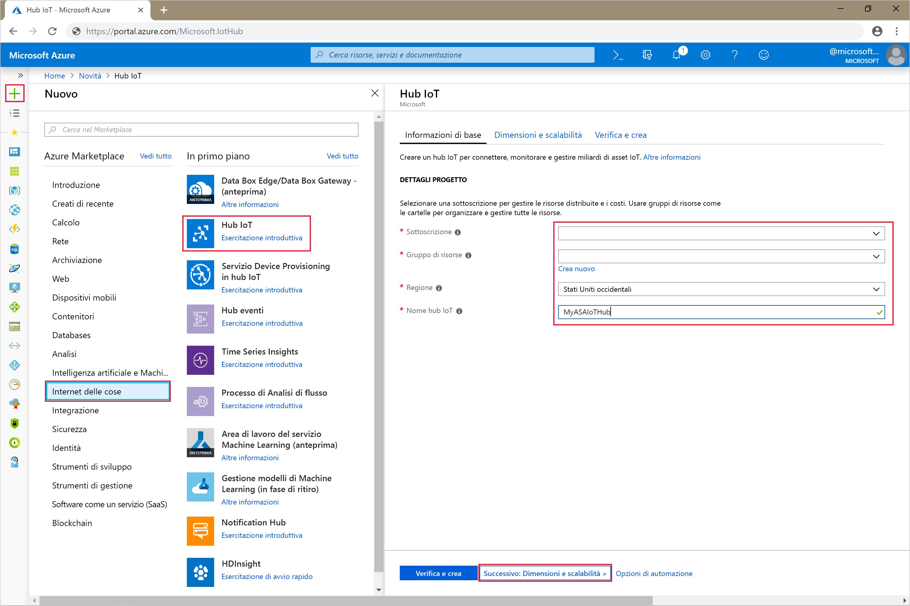

4. Selezionare **Avanti: Dimensioni e piano**.

5. Scegliere un valore per **Piano tariffario e livello di scalabilità**. Per questa guida introduttiva, selezionare il livello **F1 - Gratuito** se ancora disponibile nella sottoscrizione. Per altre informazioni, vedere i [prezzi dell'hub IoT](https://azure.microsoft.com/pricing/details/iot-hub/).

   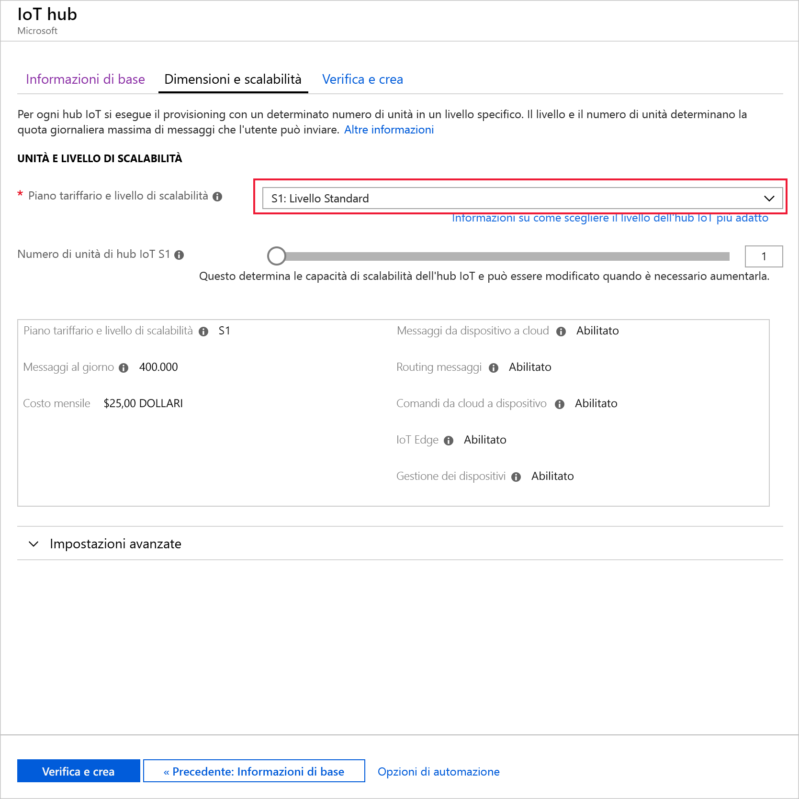

6. Selezionare **Rivedi e crea**. Esaminare le informazioni sull'hub IoT e fare clic su **Crea**. La creazione dell'hub IoT può richiedere alcuni minuti. È possibile monitorare lo stato di avanzamento nel riquadro **Notifiche**.

7. Nel menu di spostamento dell'hub IoT, fare clic su **Aggiungi** in **Dispositivi IoT**. Aggiungere un **ID dispositivo** e fare clic su **Salva**.

   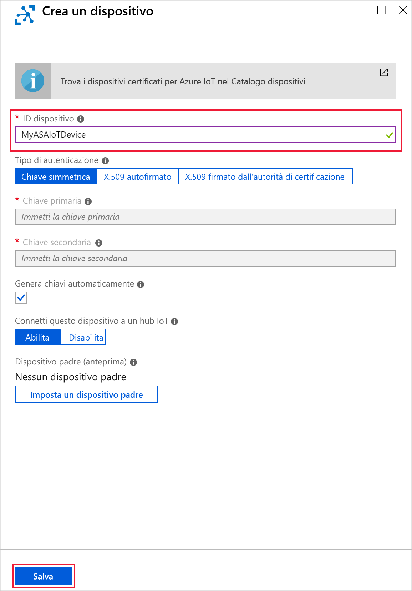

8. Dopo la creazione del dispositivo, aprirlo dall'elenco **Dispositivi IoT**. Copiare il valore di **Stringa di connessione -- Chiave primaria** e salvarlo in un Blocco note per usarlo in seguito.

   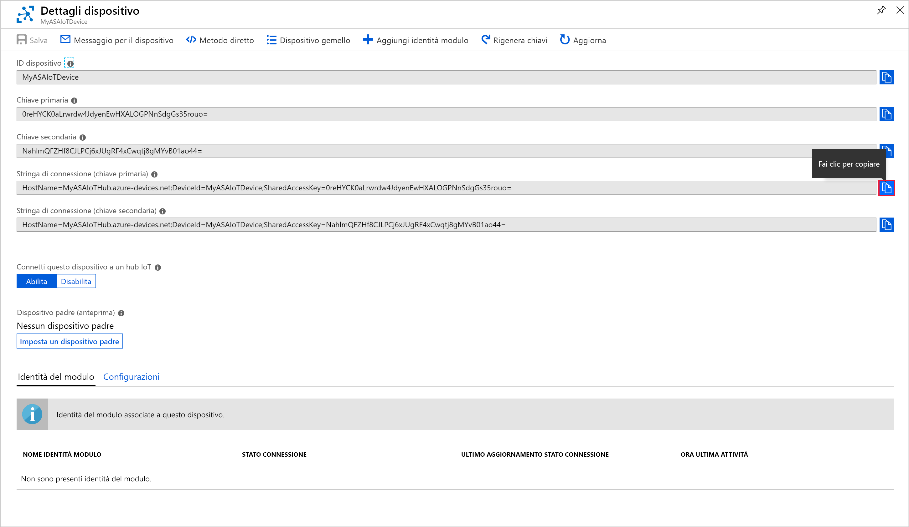

## <a name="create-blob-storage"></a>Creare l'archiviazione BLOB

1. Nell'angolo superiore sinistro del portale di Azure selezionare **Crea risorsa** > **Archiviazione** > **Account di archiviazione**.

2. Nel riquadro **Crea account di archiviazione** immettere un nome, una posizione e un gruppo di risorse per l'account di archiviazione. Scegliere la stessa posizione e lo stesso gruppo di risorse dell'hub IoT creato. Quindi fare clic su **Rivedi e crea**. per creare l'account.

   

3. Dopo aver creato l'account di archiviazione, selezionare il riquadro **BLOB** nella sezione **Panoramica**.

   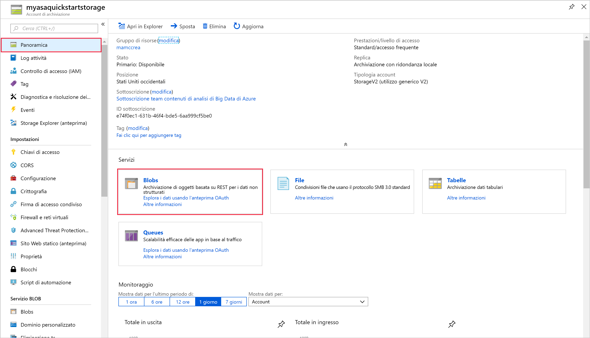

4. Nella pagina **Servizio BLOB** selezionare **Contenitore** e specificare un nome per il contenitore, ad esempio *container1*. Lasciare il **Livello di accesso pubblico** come **Privato (accesso anonimo non consentito)** e selezionare **OK**.

   

## <a name="create-a-stream-analytics-job"></a>Creare un processo di Analisi di flusso.

1. Accedere al portale di Azure.

2. Selezionare **Crea risorsa** nell'angolo superiore sinistro del portale di Azure.  

3. Selezionare **Analisi** > **Processo di Analisi di flusso** nell'elenco risultati.  

4. Compilare la pagina del processo di Analisi di flusso con le informazioni seguenti:

   |**Impostazione**  |**Valore consigliato**  |**Descrizione**  |
   |---------|---------|---------|
   |Nome processo   |  MyASAJob   |   Immettere un nome per identificare il processo di Analisi di flusso. Il nome del processo di Analisi di flusso può contenere solo caratteri alfanumerici, trattini e caratteri di sottolineatura e deve avere una lunghezza compresa tra 3 e 63 caratteri. |
   |Sottoscrizione  | \<Sottoscrizione in uso\> |  Selezionare la sottoscrizione di Azure che si vuole usare per il processo. |
   |Gruppo di risorse   |   asaquickstart-resourcegroup  |   Selezionare lo stesso gruppo di risorse dell'hub IoT. |
   |Località  |  \<Selezionare l'area più vicina agli utenti\> | Selezionare la posizione geografica in cui è possibile ospitare il processo di Analisi di flusso. Usare la località più vicina agli utenti per ottenere prestazioni migliori e ridurre i costi di trasferimento dati. |
   |Unità di streaming  | 1  |   Le unità di streaming rappresentano le risorse di calcolo necessarie per eseguire un processo. Il valore predefinito di questa impostazione è 1. Per informazioni sul ridimensionamento delle unità di streaming, vedere l'articolo [Informazioni sulle unità di streaming](stream-analytics-streaming-unit-consumption.md).   |
   |Ambiente di hosting  |  Cloud  |   Per la distribuzione dei processi di Analisi di flusso è possibile scegliere tra Cloud o Edge. L'opzione Cloud consente di eseguire la distribuzione nel cloud di Azure, mentre l'opzione Edge consente di eseguire la distribuzione in un dispositivo IoT Edge. |

   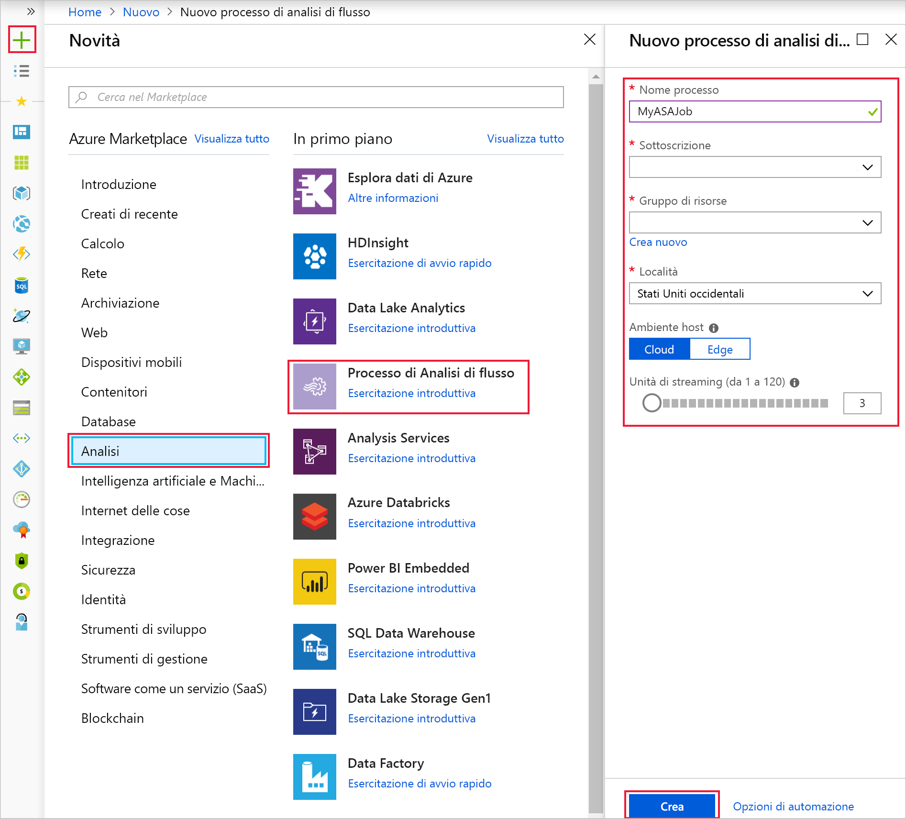

5. Selezionare la casella **Aggiungi al dashboard** per inserire il processo nel dashboard e quindi selezionare **Crea**.  

6. In alto a destra nella finestra del browser verrà visualizzata la notifica *Distribuzione in corso...* . 

## <a name="configure-job-input"></a>Configurare l'input del processo

In questa sezione si configurerà l'input del dispositivo hub IoT per il processo di Analisi di flusso. Usare l'hub IoT creato nella sezione precedente della guida introduttiva.

1. Passare al processo di Analisi di flusso.  

2. Selezionare **Input** > **Aggiungi input del flusso** > **Hub IoT**.  

3. Compilare la pagina **Hub IoT** con i valori seguenti:

   |**Impostazione**  |**Valore consigliato**  |**Descrizione**  |
   |---------|---------|---------|
   |Alias di input  |  IoTHubInput   |  Immettere un nome per identificare l'input del processo.   |
   |Sottoscrizione   |  \<Sottoscrizione in uso\> |  Selezionare la sottoscrizione di Azure che include l'account di archiviazione creato. L'account di archiviazione può essere incluso nella stessa sottoscrizione o in una diversa. Questo esempio presuppone che l'account di archiviazione sia stato creato all'interno della stessa sottoscrizione. |
   |Hub IoT  |  MyASAIoTHub |  Immettere il nome dell'hub IoT creato nella sezione precedente. |

4. Lasciare le altre opzioni impostate sui valori predefiniti e selezionare **Salva** per salvare le impostazioni.  

   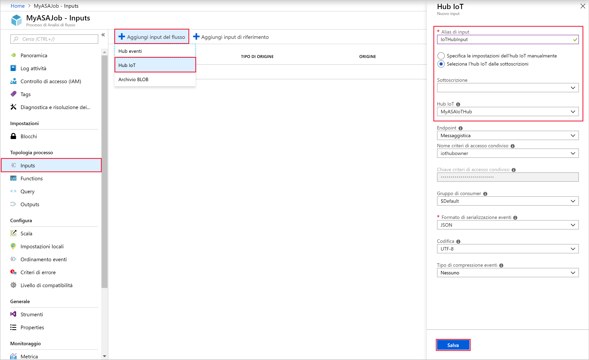
 
## <a name="configure-job-output"></a>Configurare l'output del processo

1. Passare al processo di Analisi di flusso creato in precedenza.  

2. Selezionare**Output** > **Aggiungi** > **Archiviazione BLOB**.  

3. Compilare la pagina **Archivio BLOB** con i valori seguenti:

   |**Impostazione**  |**Valore consigliato**  |**Descrizione**  |
   |---------|---------|---------|
   |Alias di output |   BlobOutput   |   Immettere un nome per identificare l'output del processo. |
   |Sottoscrizione  |  \<Sottoscrizione in uso\>  |  Selezionare la sottoscrizione di Azure che include l'account di archiviazione creato. L'account di archiviazione può essere incluso nella stessa sottoscrizione o in una diversa. Questo esempio presuppone che l'account di archiviazione sia stato creato all'interno della stessa sottoscrizione. |
   |Account di archiviazione |  asaquickstartstorage |   Scegliere o immettere il nome dell'account di archiviazione. I nomi degli account di archiviazione vengono rilevati automaticamente se sono stati creati nella stessa sottoscrizione.       |
   |Contenitore |   container1  |  Selezionare il contenitore esistente creato nell'account di archiviazione.   |

4. Lasciare le altre opzioni impostate sui valori predefiniti e selezionare **Salva** per salvare le impostazioni.  

   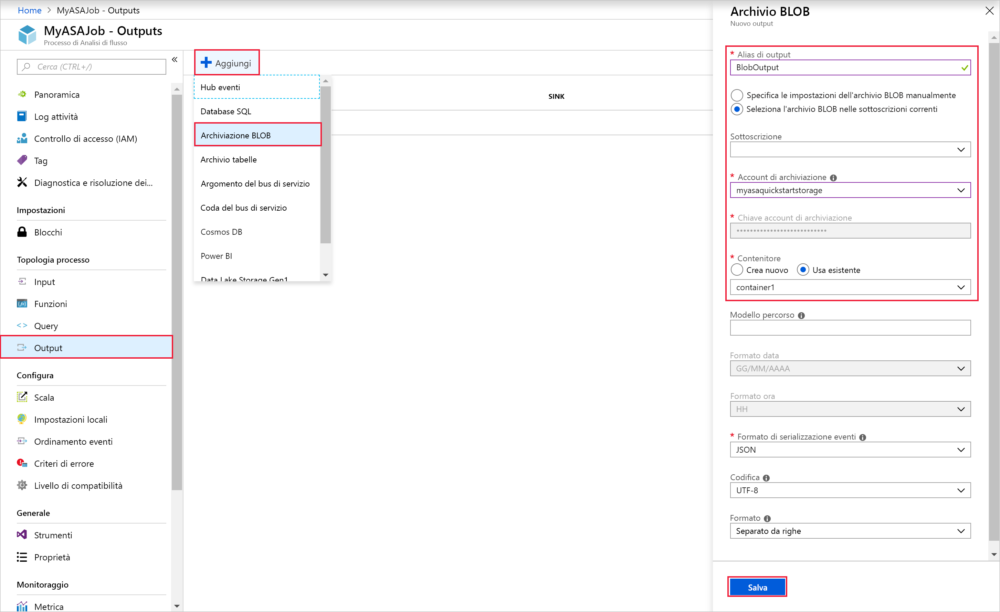
 
## <a name="define-the-transformation-query"></a>Definire la query di trasformazione

1. Passare al processo di Analisi di flusso creato in precedenza.  

2. Selezionare **Query** e aggiornare la query nel modo seguente:  

   ```sql
   SELECT *
   INTO BlobOutput
   FROM IoTHubInput
   HAVING Temperature > 27
   ```

3. In questo esempio la query legge i dati dall'hub IoT e li copia in un nuovo file nel BLOB. Selezionare **Salva**.  

   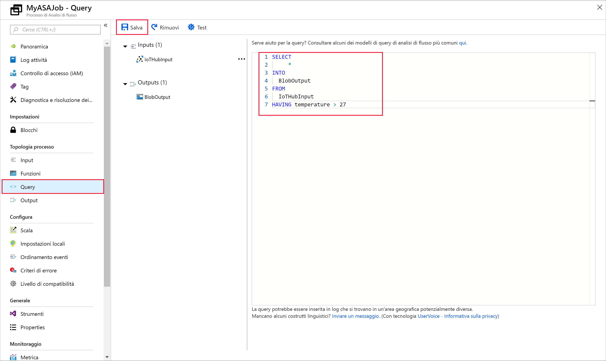

## <a name="run-the-iot-simulator"></a>Eseguire il simulatore IoT

1. Aprire il [simulatore online Azure IoT Raspberry Pi](https://azure-samples.github.io/raspberry-pi-web-simulator/).

2. Sostituire il segnaposto nella riga 15 con la stringa di connessione del dispositivo hub IoT di Azure salvato in una sezione precedente.

3. Fare clic su **Run**. L'output mostra i dati del sensore e i messaggi inviati all'hub IoT.

   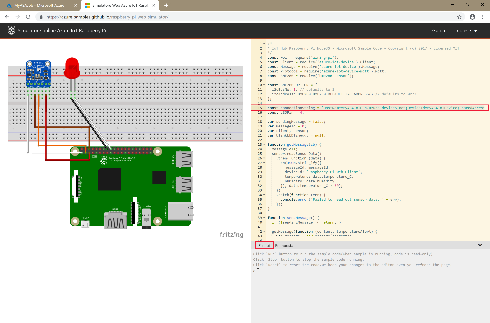

## <a name="start-the-stream-analytics-job-and-check-the-output"></a>Avviare il processo di Analisi di flusso e controllare l'output

1. Tornare alla pagina della panoramica del processo e selezionare **Avvia**.

2. In **Avvia processo**, selezionare **Ora** per il campo **Ora di inizio dell'output del processo**. Quindi, selezionare quindi **Avvia** per avviare il processo.

3. Dopo pochi minuti, individuare nel portale l'account di archiviazione e il contenitore configurato come output per il processo. È ora possibile visualizzare il file di output nel contenitore. L'avvio del processo richiede pochi minuti la prima volta e, dopo l'avvio, l'esecuzione prosegue man mano che arrivano i dati.  

   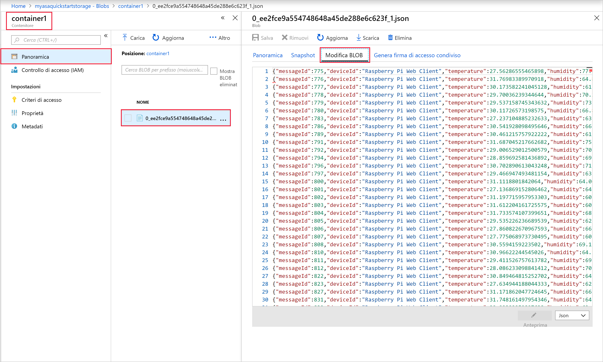

## <a name="clean-up-resources"></a>Pulire le risorse

Quando non sono più necessari, eliminare il gruppo di risorse, il processo di streaming e tutte le risorse correlate. Eliminando il processo si evita di pagare per le unità di streaming utilizzate dal processo. Se si prevede di usare il processo in futuro, è possibile arrestarlo e riavviarlo in un secondo momento, quando è necessario. Se non si intende continuare a usare il processo, eliminare tutte le risorse create tramite questa guida introduttiva seguendo questa procedura:

1. Scegliere **Gruppi di risorse** dal menu a sinistra del portale di Azure e quindi selezionare il nome della risorsa creata.  

2. Nella pagina del gruppo di risorse selezionare **Elimina**, digitare il nome della risorsa da eliminare nella casella di testo e quindi selezionare **Elimina**.

## <a name="next-steps"></a>Passaggi successivi

In questa guida introduttiva è stato distribuito un semplice processo di Analisi di flusso con il portale di Azure. È anche possibile distribuire processi di Analisi di flusso usando [PowerShell](stream-analytics-quick-create-powershell.md), [Visual Studio](stream-analytics-quick-create-vs.md) e [Visual Studio Code](quick-create-vs-code.md).

Per informazioni sulla configurazione di altre origini di input e sull'esecuzione del rilevamento in tempo reale, continuare con l'articolo seguente:

> [!div class="nextstepaction"]
> [Rilevamento delle frodi in tempo reale tramite Analisi di flusso di Azure](stream-analytics-real-time-fraud-detection.md)

