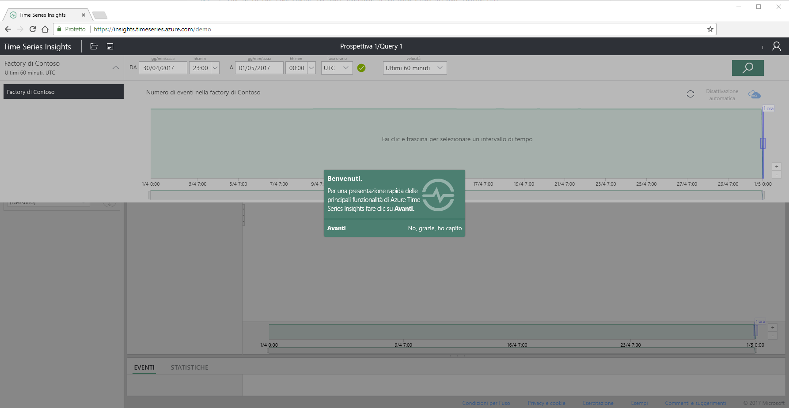
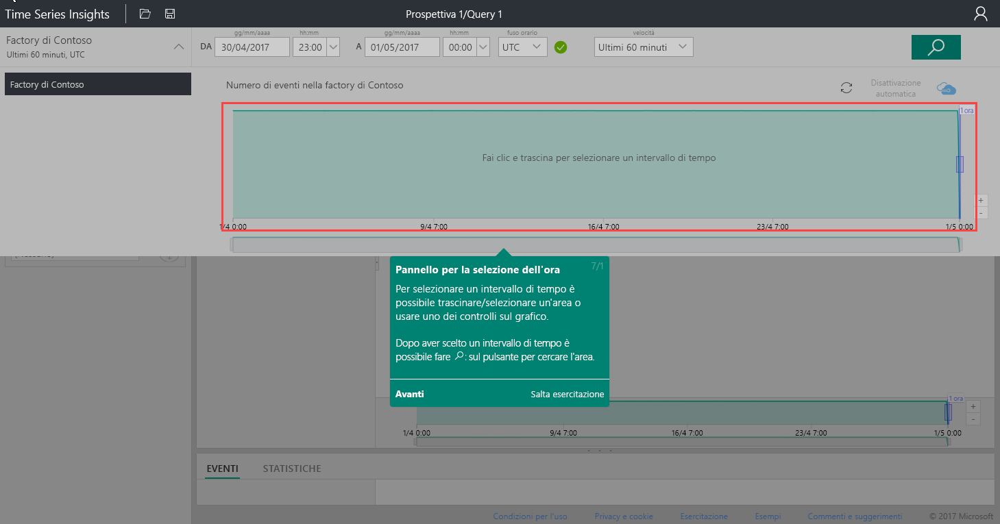
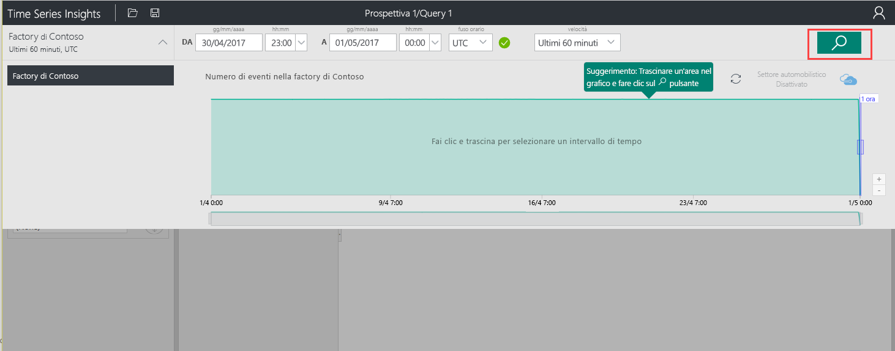
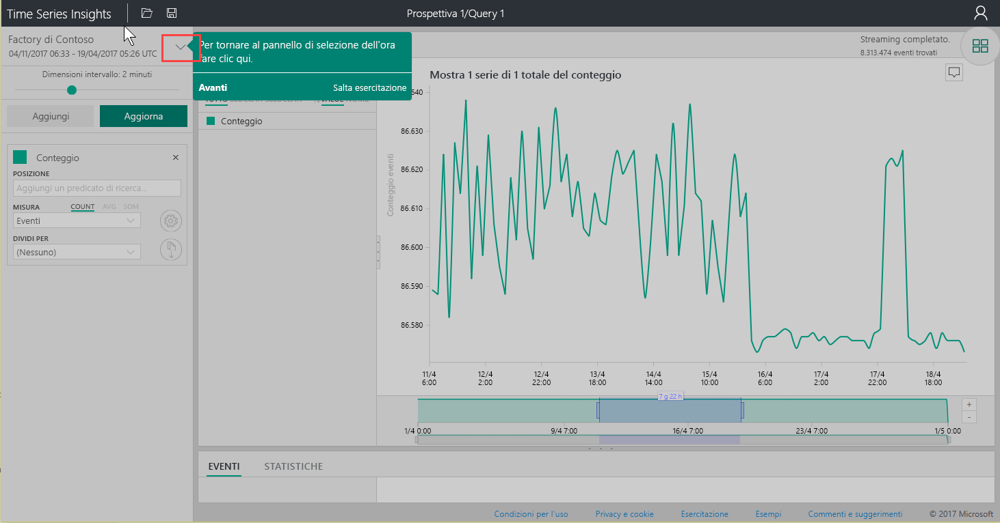
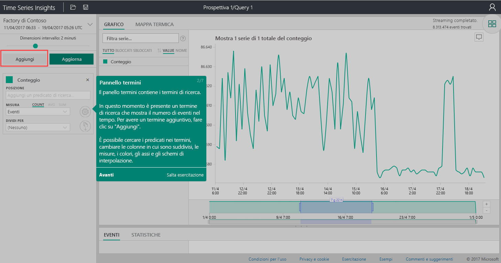
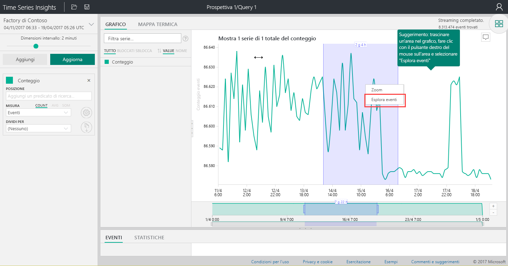
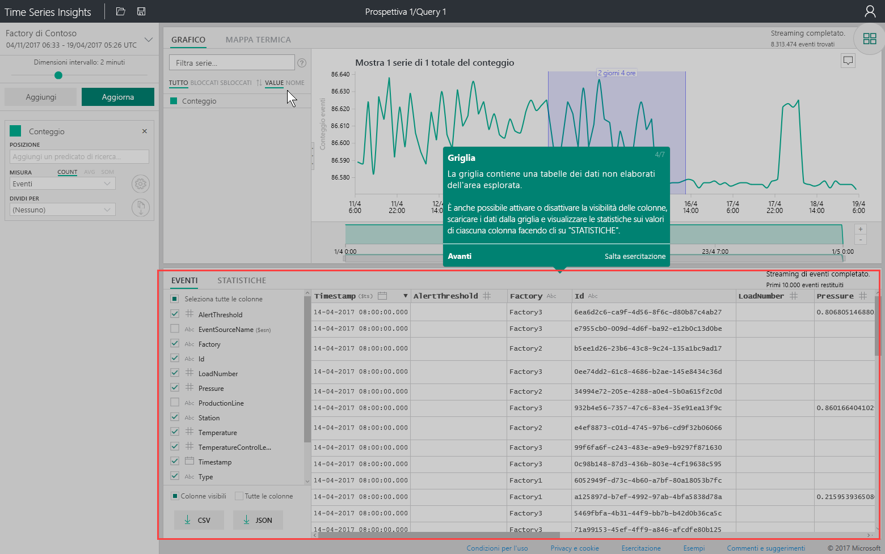
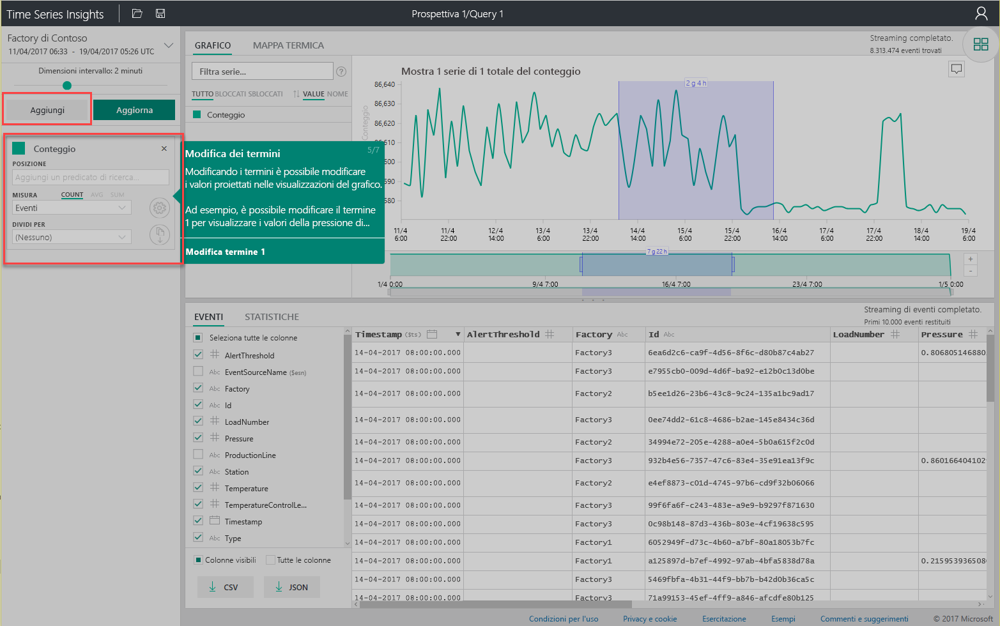
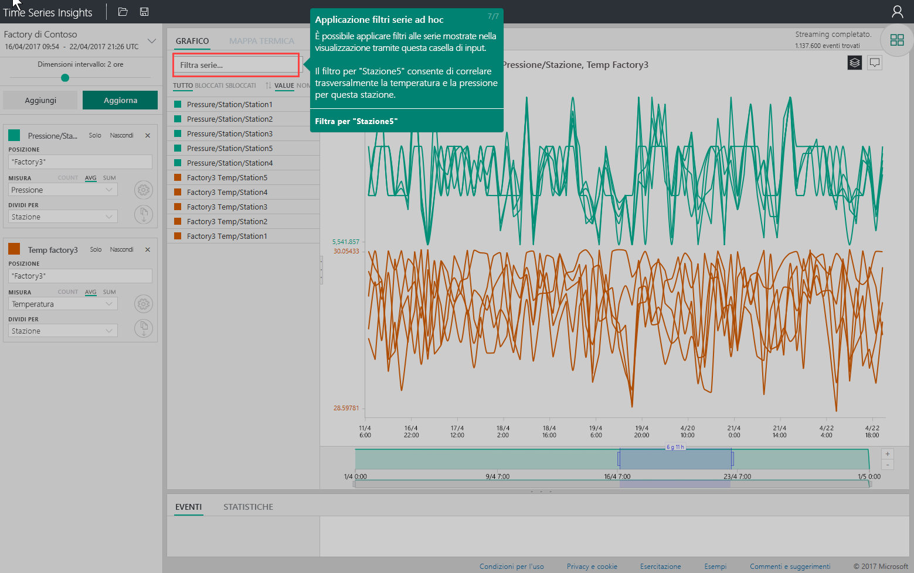

# Guida introduttiva: Esplorare Azure Time Series Insights

Argomento di avvio rapido sull'uso dello strumento di esplorazione di Azure Time Series Insights in un ambiente di dimostrazione gratuito. Si imparerà a usare il Web browser per visualizzare grandi volumi di dati IoT e verranno introdotte le caratteristiche principali attualmente disponibili a livello generale.

Azure Time Series Insights è un servizio completamente gestito per analisi, archiviazione e visualizzazione, che semplifica l'esplorazione e l'analisi di miliardi di eventi IoT contemporaneamente. Offre una visualizzazione globale dei dati, consentendo di convalidare rapidamente le soluzioni IoT e di evitare così costosi periodi di inattività per i dispositivi di importanza strategica. Con Azure Time Series Insights è possibile individuare tendenze nascoste e anomalie, nonché eseguire analisi della causa radice.

Per una maggiore flessibilità, Azure Time Series Insights può essere aggiunto a un'applicazione preesistente mediante le potenti [API REST](./time-series-insights-update-tsq.md) e l'[SDK client](./tutorial-create-tsi-sample-spa.md). Le API consentono di archiviare, eseguire query e utilizzare dati di serie temporali in un'applicazione client di propria scelta. È anche possibile usare l'SDK client per aggiungere componenti dell'interfaccia utente all'applicazione esistente.

Lo strumento di esplorazione di Time Series InsightsTime è una presentazione guidata delle funzionalità attualmente disponibili a livello generale.

## Preparare l'ambiente demo

1. Creare un [account Azure gratuito](https://azure.microsoft.com/free/?ref=microsoft.com&utm_source=microsoft.com&utm_medium=docs&utm_campaign=visualstudio) se non ne è ancora stato creato uno.

1. Nel browser passare alla [demo della disponibilità generale](https://insights.timeseries.azure.com/demo).

1. Se viene richiesto, accedere allo strumento di esplorazione di Time Series Insights usando le credenziali dell'account Azure.

1. Viene visualizzata la pagina della demo introduttiva di Time Series Insights. Fare clic su **Next** (Avanti) per iniziare la demo introduttiva.

   

## Esplorare l'ambiente demo

1. Viene visualizzato il **pannello di selezione di data e ora**. Usare questo pannello per selezionare un intervallo di tempo da visualizzare.

   

1. Fare clic e trascinare nell'area e quindi fare clic sul pulsante **Search** (Cerca).

   

   In Time Series Insights viene visualizzato un grafico riferito all'intervallo di tempo specificato. È possibile eseguire diverse operazioni all'interno del grafico a linee, ad esempio applicare filtri, bloccare i dati, ordinarli e impilarli.

   Per tornare al **pannello di selezione di data e ora**, fare clic sulla Freccia GIÙ come illustrato nella figura seguente:

   

1. Fare clic su **Add** (Aggiungi) nel **pannello Terms** (Termini) per aggiungere un nuovo termine di ricerca.

   

1. Nel grafico è possibile selezionare un'area, fare clic con il pulsante destro del mouse all'interno dell'area e scegliere **Explore Events** (Esplora eventi).

   

   Verrà visualizzata una griglia di dati non elaborati relativi all'area di riferimento:

   

## Selezionare e filtrare i dati

1. Modificare i termini per modificare i valori nel grafico e aggiungere un altro termine per creare correlazioni incrociate tra tipi diversi di valori:

   

1. Immettere un termine di filtro nella casella **Filter series** (Filtra serie) per applicare filtri improvvisati alle serie. Per l'esempio descritto in questa guida introduttiva immettere **Station5** per creare una correlazione incrociata tra la temperatura e la pressione della stazione specifica.

   

Dopo aver completato la guida introduttiva, è possibile usare il set di dati di esempio per creare visualizzazioni diverse.

## Passaggi successivi

A questo punto si è pronti a creare l'ambiente Time Series Insights vero e proprio:
> [!div class="nextstepaction"]
> [Pianificare l'ambiente Time Series Insights](time-series-insights-environment-planning.md)
