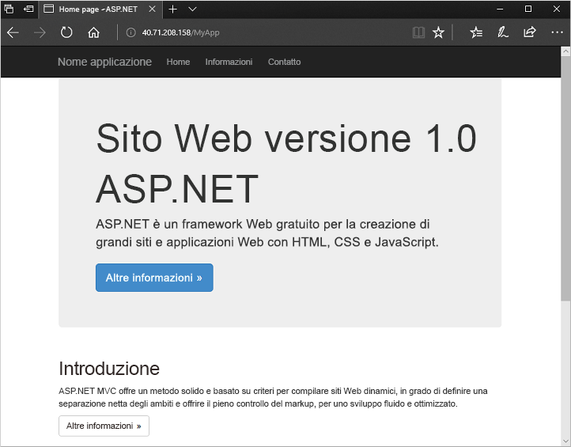

# <a name="quickstart-create-a-virtual-machine-scale-set-with-azure-powershell"></a>Guida introduttiva: Creare un set di scalabilità di macchine virtuali con Azure PowerShell
Un set di scalabilità di macchine virtuali consente di distribuire e gestire un set di macchine virtuali identiche con scalabilità automatica. È possibile ridimensionare manualmente il numero di VM nel set di scalabilità o definire regole di scalabilità automatica in base all'uso delle risorse, ad esempio la CPU, alla richiesta di memoria o al traffico di rete. Un servizio Azure Load Balancer distribuisce quindi il traffico alle istanze di macchina virtuale nel set di scalabilità. In questa guida introduttiva si crea un set di scalabilità di macchine virtuali e si distribuisce un'applicazione di esempio con Azure PowerShell.

Se non si ha una sottoscrizione di Azure, creare un [account gratuito](https://azure.microsoft.com/free/?WT.mc_id=A261C142F) prima di iniziare.

[!INCLUDE [cloud-shell-powershell.md](../../includes/cloud-shell-powershell.md)]

Se si sceglie di installare e usare PowerShell in locale, per questa esercitazione è necessario il modulo Azure PowerShell 6.0.0 o versione successiva. Eseguire `Get-Module -ListAvailable AzureRM` per trovare la versione. Se è necessario eseguire l'aggiornamento, vedere [Installare e configurare Azure PowerShell](/powershell/azure/install-azurerm-ps). Se si esegue PowerShell in locale, è anche necessario eseguire `Connect-AzureRmAccount` per creare una connessione con Azure.


## <a name="create-a-scale-set"></a>Creare un set di scalabilità
Creare un set di scalabilità di macchine virtuali con il comando [New-AzureRmVmss](/powershell/module/azurerm.compute/new-azurermvmss). L'esempio seguente crea un set di scalabilità denominato *myScaleSet* che usa l'immagine della piattaforma *Windows Server 2016 Datacenter*. Vengono create automaticamente le risorse di rete di Azure per la rete virtuale, l'indirizzo IP pubblico e il bilanciamento del carico. Quando richiesto, è possibile impostare le credenziali amministrative per le istanze di macchina virtuale nel set di scalabilità:

```azurepowershell-interactive
New-AzureRmVmss `
  -ResourceGroupName "myResourceGroup" `
  -Location "EastUS" `
  -VMScaleSetName "myScaleSet" `
  -VirtualNetworkName "myVnet" `
  -SubnetName "mySubnet" `
  -PublicIpAddressName "myPublicIPAddress" `
  -LoadBalancerName "myLoadBalancer" `
  -UpgradePolicyMode "Automatic"
```

La creazione e la configurazione di tutte le macchine virtuali e risorse del set di scalabilità richiedono alcuni minuti.


## <a name="deploy-sample-application"></a>Distribuire l'applicazione di esempio
Per testare il set di scalabilità, installare un'applicazione Web di base. Usare l'estensione script personalizzati di Azure per scaricare ed eseguire uno script che installa IIS nelle istanze di macchina virtuale. Questa estensione è utile per la configurazione post-distribuzione, l'installazione di software o qualsiasi altra attività di configurazione o gestione. Per altre informazioni, vedere [Panoramica dell'estensione script personalizzata](../virtual-machines/windows/extensions-customscript.md).

Usare l'estensione script personalizzati per installare un server Web IIS di base. Applicare l'estensione di script personalizzati che installa IIS nel modo seguente:

```azurepowershell-interactive
# Define the script for your Custom Script Extension to run
$publicSettings = @{
    "fileUris" = (,"https://raw.githubusercontent.com/Azure-Samples/compute-automation-configurations/master/automate-iis.ps1");
    "commandToExecute" = "powershell -ExecutionPolicy Unrestricted -File automate-iis.ps1"
}

# Get information about the scale set
$vmss = Get-AzureRmVmss `
            -ResourceGroupName "myResourceGroup" `
            -VMScaleSetName "myScaleSet"

# Use Custom Script Extension to install IIS and configure basic website
Add-AzureRmVmssExtension -VirtualMachineScaleSet $vmss `
    -Name "customScript" `
    -Publisher "Microsoft.Compute" `
    -Type "CustomScriptExtension" `
    -TypeHandlerVersion 1.8 `
    -Setting $publicSettings

# Update the scale set and apply the Custom Script Extension to the VM instances
Update-AzureRmVmss `
    -ResourceGroupName "myResourceGroup" `
    -Name "myScaleSet" `
    -VirtualMachineScaleSet $vmss
```

## <a name="allow-traffic-to-application"></a>Consentire il traffico verso l'applicazione

 Per consentire l'accesso all'applicazione Web di base, creare un gruppo di sicurezza di rete con [New-AzureRmNetworkSecurityRuleConfig](/powershell/module/azurerm.network/new-azurermnetworksecurityruleconfig) e [New-AzureRmNetworkSecurityGroup](/powershell/module/azurerm.network/new-azurermnetworksecuritygroup). Per altre informazioni, vedere [Rete per i set di scalabilità di macchine virtuali](virtual-machine-scale-sets-networking.md).

 ```azurepowershell-interactive
 # Get information about the scale set
 $vmss = Get-AzureRmVmss `
             -ResourceGroupName "myResourceGroup" `
             -VMScaleSetName "myScaleSet"

 #Create a rule to allow traffic over port 80
 $nsgFrontendRule = New-AzureRmNetworkSecurityRuleConfig `
   -Name myFrontendNSGRule `
   -Protocol Tcp `
   -Direction Inbound `
   -Priority 200 `
   -SourceAddressPrefix * `
   -SourcePortRange * `
   -DestinationAddressPrefix * `
   -DestinationPortRange 80 `
   -Access Allow

 #Create a network security group and associate it with the rule
 $nsgFrontend = New-AzureRmNetworkSecurityGroup `
   -ResourceGroupName  "myResourceGroup" `
   -Location EastUS `
   -Name myFrontendNSG `
   -SecurityRules $nsgFrontendRule

 $vnet = Get-AzureRmVirtualNetwork `
   -ResourceGroupName  "myResourceGroup" `
   -Name myVnet

 $frontendSubnet = $vnet.Subnets[0]

 $frontendSubnetConfig = Set-AzureRmVirtualNetworkSubnetConfig `
   -VirtualNetwork $vnet `
   -Name mySubnet `
   -AddressPrefix $frontendSubnet.AddressPrefix `
   -NetworkSecurityGroup $nsgFrontend

 Set-AzureRmVirtualNetwork -VirtualNetwork $vnet

 # Update the scale set and apply the Custom Script Extension to the VM instances
 Update-AzureRmVmss `
     -ResourceGroupName "myResourceGroup" `
     -Name "myScaleSet" `
     -VirtualMachineScaleSet $vmss
 ```

## <a name="test-your-scale-set"></a>Testare il set di scalabilità
Per vedere il set di scalabilità in azione, accedere all'applicazione Web di esempio in un Web browser. Ottenere l'indirizzo IP pubblico del servizio di bilanciamento del carico con il comando [Get-AzureRmPublicIpAddress](/powershell/module/azurerm.network/get-azurermpublicipaddress). L'esempio seguente mostra l'indirizzo IP creato nel gruppo di risorse *myResourceGroup*:

```azurepowershell-interactive
Get-AzureRmPublicIpAddress -ResourceGroupName "myResourceGroup" | Select IpAddress
```

Immettere l'indirizzo IP pubblico del servizio di bilanciamento del carico in un Web browser. Il servizio di bilanciamento del carico distribuisce il traffico a una delle istanze di macchina virtuale, come illustrato nell'esempio seguente:




## <a name="clean-up-resources"></a>Pulire le risorse
Quando il gruppo di risorse, il set di scalabilità e tutte le risorse correlate non sono più necessari, è possibile usare il comando [Remove-AzureRmResourceGroup](/powershell/module/azurerm.resources/remove-azurermresourcegroup) per rimuoverli, come segue. Il parametro `-Force` conferma che si desidera eliminare le risorse senza un prompt aggiuntivo a tale scopo. Il parametro `-AsJob` restituisce il controllo al prompt senza attendere il completamento dell'operazione.

```azurepowershell-interactive
Remove-AzureRmResourceGroup -Name "myResourceGroup" -Force -AsJob
```


## <a name="next-steps"></a>Passaggi successivi
In questa guida introduttiva è stato creato un set di scalabilità di base ed è stata usata l'estensione script personalizzati per installare un server Web IIS di base nelle istanze di macchina virtuale. Per altre informazioni, passare all'esercitazione su come creare e gestire i set di scalabilità di macchine virtuali di Azure.

> [!div class="nextstepaction"]
> [Creare e gestire i set di scalabilità di macchine virtuali di Azure](tutorial-create-and-manage-powershell.md)
