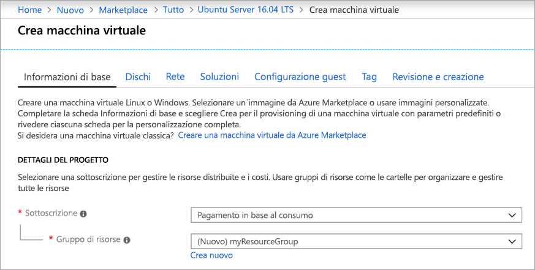
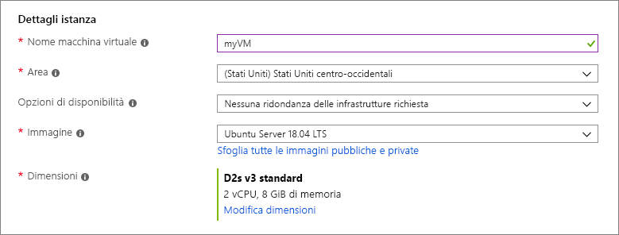
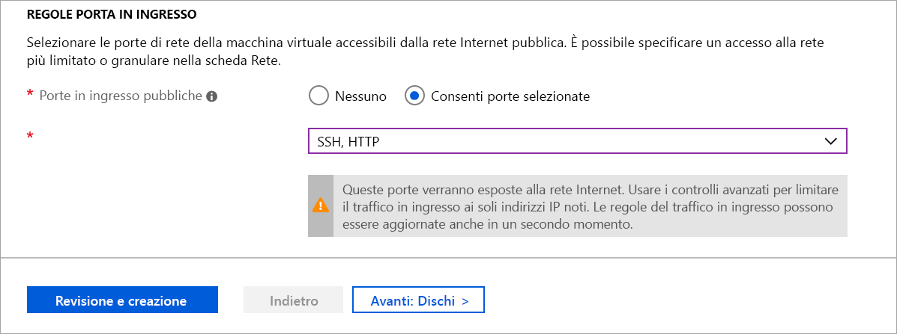

# <a name="quickstart-create-a-linux-virtual-machine-in-the-azure-portal"></a>Guida introduttiva: Creare una macchina virtuale Linux nel portale di Azure

È possibile creare macchine virtuali di Azure tramite il portale di Azure. Questo metodo fornisce un'interfaccia utente basata su browser per creare le macchine virtuali e le risorse associate. Questa guida introduttiva illustra come usare il portale di Azure per distribuire una macchina virtuale Linux in Azure che esegue Ubuntu. Per vedere la macchina virtuale in azione, eseguire SSH nella macchina virtuale e installare il server Web NGINX.

Se non si ha una sottoscrizione di Azure, creare un [account gratuito](https://azure.microsoft.com/free/?WT.mc_id=A261C142F) prima di iniziare.

## <a name="create-ssh-key-pair"></a>Creare una coppia di chiavi SSH

Per completare questa guida introduttiva è necessaria una coppia di chiavi SSH. Se è già disponibile una coppia di chiavi SSH, questo passaggio può essere ignorato.

Per creare una coppia di chiavi SSH e accedere alle macchine virtuali Linux, eseguire il comando seguente da una shell Bash e seguire le istruzioni visualizzate. Ad esempio, è possibile usare [Azure Cloud Shell](../../cloud-shell/overview.md) o il [sottosistema di Windows per Linux](/windows/wsl/install-win10). L'output del comando include il nome del file di chiave pubblica. Copiare il contenuto del file di chiave pubblica (`cat ~/.ssh/id_rsa.pub`) negli Appunti:

```bash
ssh-keygen -t rsa -b 2048
```

Per informazioni più dettagliate su come creare coppie di chiavi SSH, incluso l'uso di PuTTy, vedere [Come usare le chiavi SSH con Windows in Azure](ssh-from-windows.md).

## <a name="log-in-to-azure"></a>Accedere ad Azure

Accedere al portale di Azure all'indirizzo http://portal.azure.com

## <a name="create-virtual-machine"></a>Crea macchina virtuale

1. Scegliere **Crea una risorsa** nell'angolo superiore sinistro del portale di Azure.

1. Nella casella di ricerca sopra l'elenco delle risorse di Azure Marketplace, cercare e selezionare **Ubuntu Server 16.04 LTS** di Canonical e quindi scegliere **Crea**.

1. Nella scheda **Nozioni di base**, sotto **Dettagli progetto**, verificare che sia selezionata la sottoscrizione corretta e quindi scegliere **Crea nuovo** sotto **Gruppo di risorse**. Nella finestra popup, digitare *myResourceGroup* come nome del gruppo di risorse, quindi scegliere **OK*. 

    

1. Sotto **Dettagli dell'istanza**, digitare *myVM* come **nome della macchina virtuale** e scegliere *Stati Uniti orientali* come **Regione**. Lasciare invariate le altre impostazioni predefinite.

    

1. Sotto **Account amministratore**, selezionare **Chiave pubblica SSH**, digitare il nome utente, quindi incollare la chiave pubblica nella casella di testo. Rimuovere gli eventuali spazi iniziali o finali nella chiave pubblica.

    

1. Sotto **Regole porta in ingresso** > **Porte in ingresso pubbliche**, scegliere **Consentire porte selezionate**, quindi selezionare **SSH (22)** e **HTTP (80)** dall'elenco a discesa. 

    

1. Lasciare invariate le impostazioni predefinite rimanenti, quindi selezionare il pulsante **Rivedi + Crea** nella parte inferiore della pagina.

    
## <a name="connect-to-virtual-machine"></a>Connettersi alla macchina virtuale

Creare una connessione SSH con la macchina virtuale.

1. Selezionare il pulsante **Connetti** nella pagina di panoramica per la macchina virtuale. 

    

2. Nella pagina **Connetti a macchina virtuale** mantenere le opzioni predefinite per la connessione con nome DNS sulla porta 22. In **Accedi con l'account locale della macchina virtuale** viene visualizzato un comando di connessione. Fare clic sul pulsante per copiare il comando. Di seguito è mostrato un esempio di comando di connessione SSH:

    ```bash
    ssh azureuser@myvm-123abc.eastus.cloudapp.azure.com
    ```

3. Incollare il comando di connessione SSH in una shell, ad esempio Azure Cloud Shell o Bash in Ubuntu in Windows per creare la connessione. 

## <a name="install-web-server"></a>Installare il server Web

Per visualizzare la macchina virtuale in azione, installare il server Web NGINX. Per aggiornare le origini dei pacchetti e installare il pacchetto NGINX più recente, eseguire i comandi seguenti dalla sessione SSH:

```bash
# update packages
sudo apt-get -y update

# install NGINX
sudo apt-get -y install nginx
```

Al termine, usare `exit` per chiudere la sessione SSH e tornare alle proprietà della macchina virtuale nel portale di Azure.


## <a name="view-the-web-server-in-action"></a>Visualizzare il server Web in azione

Con NGINX installato e la porta 80 aperta per la macchina virtuale, è ora possibile accedere al server Web da Internet. Aprire un Web browser e immettere l'indirizzo IP pubblico della VM. L'indirizzo IP pubblico è reperibile nella pagina di panoramica per la macchina virtuale o all'inizio della pagina *Rete* in cui viene aggiunta la regola di porta in ingresso.


## <a name="clean-up-resources"></a>Pulire le risorse

Quando non serve più, è possibile eliminare il gruppo di risorse, la macchina virtuale e tutte le risorse correlate. A tale scopo, selezionare il gruppo di risorse per la macchina virtuale, selezionare **Elimina** e quindi confermare il nome del gruppo di risorse da eliminare.

## <a name="next-steps"></a>Passaggi successivi

In questa guida introduttiva è stata distribuita una macchina virtuale semplice, sono stati creati un gruppo di sicurezza di rete e una regola ed è stato installato un server Web. Per altre informazioni sulle macchine virtuali di Azure, passare all'esercitazione per le VM di Linux.

> [!div class="nextstepaction"]
> [Esercitazioni per le macchine virtuali di Linux in Azure](./tutorial-manage-vm.md)
