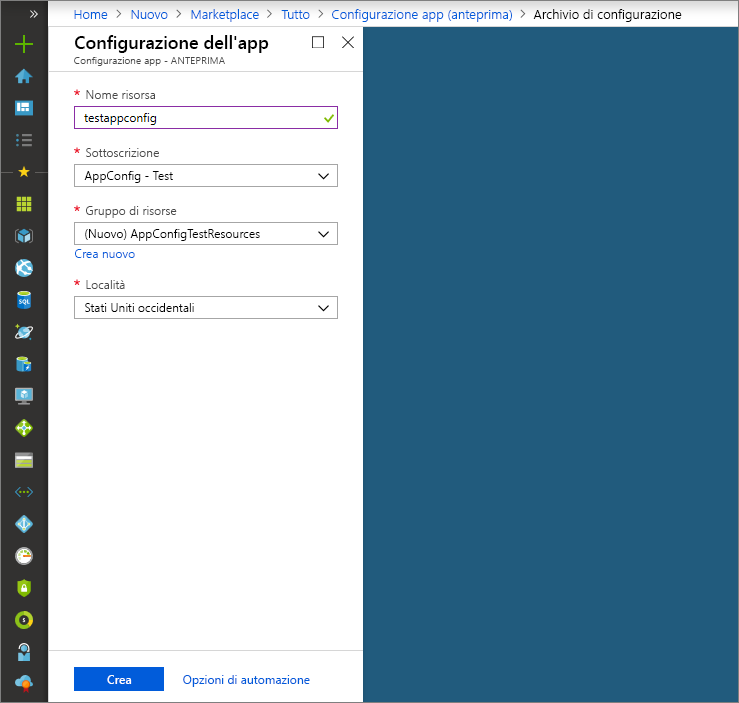

1. Per creare un nuovo archivio di configurazione app, accedere prima di tutto al [portale di Azure](https://aka.ms/azconfig/portal). Nell'angolo in alto a sinistra della pagina, fare clic su **Crea una risorsa**. Nella casella di testo **Cerca nel Marketplace** digitare **Configurazione app**, quindi premere **INVIO**.

    

2. Nei risultati della ricerca fare clic su **Configurazione app** e quindi su **Crea**.

3. Nella pagina **Configurazione app** > **Crea** immettere le impostazioni seguenti:

    | Impostazione | Valore consigliato | DESCRIZIONE |
    |---|---|---|
    | **Nome risorsa** | Nome globalmente univoco | Immettere un nome di risorsa univoco da usare per la risorsa archivio di configurazione app. Il nome deve essere una stringa contenente da 1 a 63 caratteri che possono includere solo numeri, lettere e il carattere `-`. Il nome non può iniziare o terminare con il carattere `-` e i caratteri `-` consecutivi non sono validi.  |
    | **Sottoscrizione** | Sottoscrizione in uso | Selezionare la sottoscrizione di Azure da usare per testare Configurazione app. Se l'account ha una sola sottoscrizione, questa viene selezionata automaticamente e l'elenco a discesa **Sottoscrizione** non viene visualizzato. |
    | **Gruppo di risorse** | *AppConfigTestResources* | Selezionare o creare un gruppo di risorse per la risorsa archivio di configurazione app. Questo gruppo è utile per gestire risorse multiple: ad esempio è possibile eliminare più risorse con un'unica operazione, eliminando il gruppo di risorse. Per altre informazioni, vedere [Uso di gruppi di risorse per gestire le risorse di Azure](/azure/azure-resource-manager/resource-group-overview). |
    | **Posizione** | *Stati Uniti centrali* | Usare **Posizione** per specificare la posizione geografica in cui viene ospitato l'archivio di configurazione app. Per ottenere prestazioni ottimali, è consigliabile creare le risorse nella stessa area degli altri componenti dell'applicazione. |

    

4. Fare clic su **Create**(Crea). Per il completamento della distribuzione possono essere necessari alcuni minuti.

5. Dopo aver completato la distribuzione, fare clic su **Impostazioni** > **Chiavi di accesso**. Prendere nota della stringa di connessione della chiave primaria di sola lettura o di quella di sola scrittura. Questa informazione verrà usata in seguito per configurare l'applicazione in modo da comunicare con l'archivio di configurazione app appena creato.

6. Fare clic su **Esplora chiave-valore** e su **+ Crea** per aggiungere le coppie chiave-valore seguenti:

    | Chiave | Valore |
    |---|---|
    | TestApp:Settings:BackgroundColor | white |
    | TestApp:Settings:FontSize | 24 |
    | TestApp:Settings:FontColor | black |
    | TestApp:Settings:Message | Dati di Configurazione app di Azure |

    Lasciare vuoti i campi **Etichetta** e **Tipo di contenuto** per il momento.
