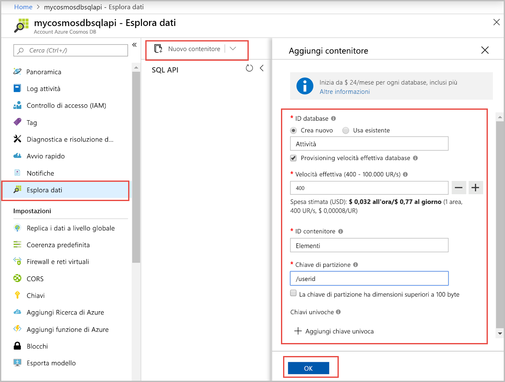

È ora possibile usare lo strumento Esplora dati nel portale di Azure per creare un database e una raccolta. 

1. Fare clic su **Esplora dati** > **Nuova raccolta**. 
    
    A destra verrà visualizzata l'area **Aggiungi raccolta**. Per vederla potrebbe essere necessario scorrere verso destra.

    

2. Nella pagina **Aggiungi raccolta** immettere le impostazioni per la nuova raccolta.

    Impostazione|Valore consigliato|DESCRIZIONE
    ---|---|---
    ID database|Attività|Immettere *Tasks* come nome del nuovo database. I nomi dei database devono avere una lunghezza compresa tra 1 e 255 caratteri e non possono contenere `/, \\, #, ?` o spazi finali.
    ID raccolta|Items|Immettere *Items* come nome della nuova raccolta. Gli ID delle raccolte prevedono gli stessi requisiti relativi ai caratteri dei nomi di database.
    Chiave di partizione| `<Your partition key>`| Immettere una chiave di partizione, ad esempio */userid*.
    Velocità effettiva|400 UR|Modificare la velocità effettiva in 400 unità richiesta al secondo (UR/sec). Se si vuole ridurre la latenza, è possibile aumentare la velocità effettiva in un secondo momento. 
    
    Oltre alle impostazioni precedenti, è possibile aggiungere **Chiavi univoche** per la raccolta. In questo esempio il campo viene lasciato vuoto. Le chiavi univoche consentono agli sviluppatori di aggiungere un livello di integrità dei dati nel database. Se si definiscono criteri di chiave univoca durante la creazione di una raccolta, si ha la sicurezza che uno o più valori siano univoci per ogni chiave di partizione. Per altre informazioni, vedere l'articolo [Chiavi univoche in Azure Cosmos DB](../articles/cosmos-db/unique-keys.md).
    
    Fare clic su **OK**.

    In Esplora dati verranno visualizzati il nuovo database e la nuova raccolta.

    