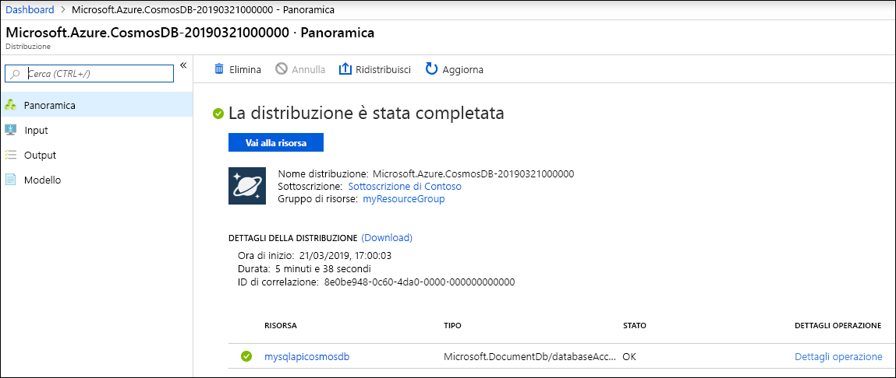

1. In una nuova finestra del browser accedere al [portale di Azure](https://portal.azure.com/).
2. Fare clic su **Crea una risorsa** > **Database** > **Azure Cosmos DB**.
   
   

3. Nella pagina **Nuovo account** immettere le impostazioni per il nuovo account Azure Cosmos DB. 
 
    Impostazione|Valore|DESCRIZIONE
    ---|---|---
    ID|*Immettere un nome univoco*|Immettere un nome univoco per identificare l'account Azure Cosmos DB. Poiché all'ID fornito viene aggiunto *documents.azure.com* per creare l'URI, usare un ID univoco.  L'ID può contenere solo lettere minuscole, numeri e il segno meno (-) e deve avere una lunghezza compresa tra 3 e 50 caratteri.
    API|SQL|L'API determina il tipo di account da creare. Azure Cosmos DB mette a disposizione cinque API: SQL (database di documenti) Gremlin (database di grafi), MongoDB (database di documenti), API Tabella e API Cassandra. Per ognuna di queste è attualmente necessario un account separato.   Selezionare **SQL** poiché in questo articolo si creerà un database di documenti e una query usando la sintassi SQL.   [Altre informazioni sull'API SQL](../articles/cosmos-db/documentdb-introduction.md)|
    Sottoscrizione|*Sottoscrizione in uso*|Selezionare la sottoscrizione di Azure da usare per l'account Azure Cosmos DB. 
    Gruppo di risorse|Creare un nuovo gruppo di risorse  *Immettere quindi lo stesso nome univoco specificato sopra in ID*|Selezionare **Crea nuovo**, quindi immettere il nome di un nuovo gruppo di risorse per l'account. Per semplicità si può usare lo stesso nome usato come ID. 
    Località|*Selezionare l'area più vicina agli utenti*|Selezionare una posizione geografica in cui ospitare l'account Azure Cosmos DB. Usare la località più vicina agli utenti per offrire loro la massima velocità di accesso ai dati.
    Abilita ridondanza geografica| Lasciare vuoto | Consente di creare una versione replicata del database in una seconda area abbinata. Lasciare vuoto.  

    Fare quindi clic su **Crea**.

    

4. La creazione dell'account richiede alcuni minuti, Attendere che nel portale venga visualizzata la pagina **Complimenti, l'account Azure Cosmos DB è stato creato**.

    

