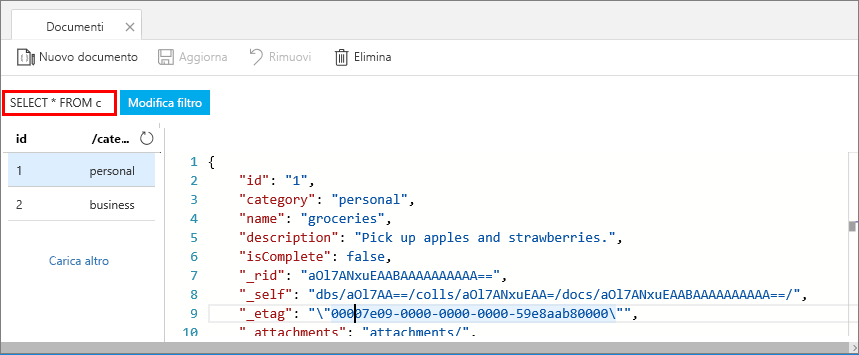

È ora possibile usare le query in Esplora dati per recuperare e filtrare i dati.

1. Per impostazione predefinita, la query è impostata su `SELECT * FROM c`. La query predefinita recupera e visualizza tutti i documenti nella raccolta. 

    

2. Restare nella scheda **Documenti** e modificare la query facendo clic sul pulsante **Modifica filtro**, aggiungendo `ORDER BY c._ts DESC` nella casella del predicato della query e quindi facendo clic su **Applica filtro**.

    

La query modificata elenca i documenti in ordine decrescente in base al timestamp, pertanto il secondo documento creato appare ora in cima all'elenco. Se si ha familiarità con la sintassi SQL, è possibile immettere in questa casella una qualsiasi delle [query SQL](../articles/cosmos-db/sql-api-sql-query.md) supportate. 

Con questa azione si completa il lavoro in Esplora dati. Prima di passare all'uso del codice, si noti che è possibile usare Esplora dati anche per creare stored procedure, UDF e trigger per eseguire la logica di business lato server, nonché scalare la velocità effettiva. Esplora dati espone tutti i tipi di accesso ai dati a livello di codice predefiniti disponibili nelle API, ma consente anche di accedere facilmente ai dati nel portale di Azure.