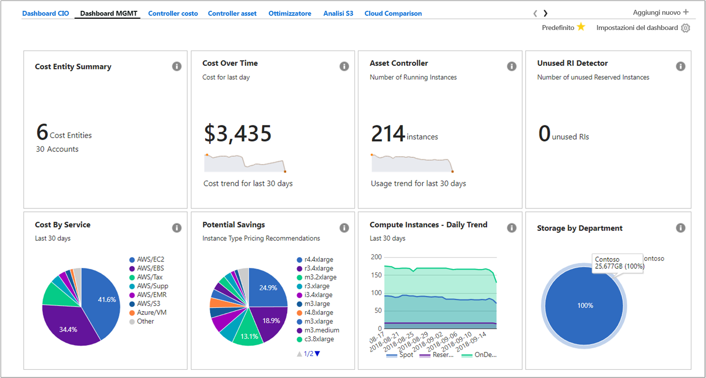
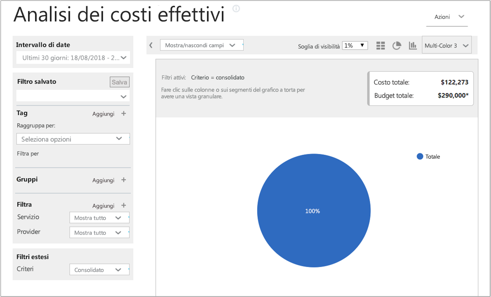
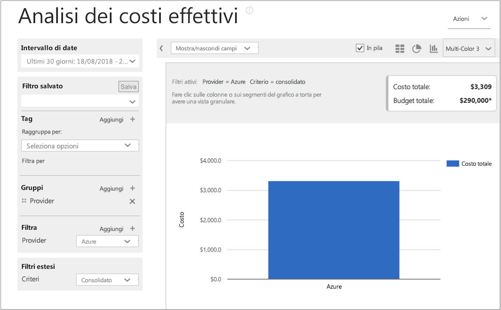
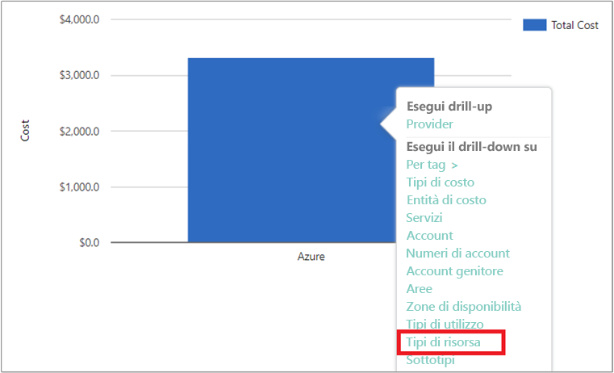
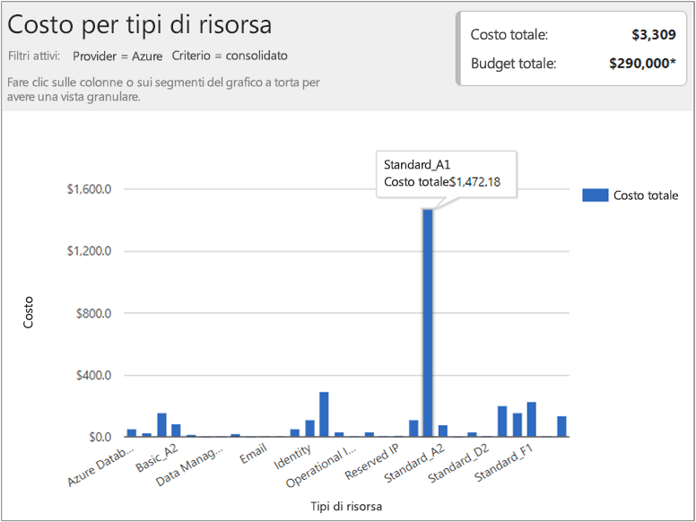
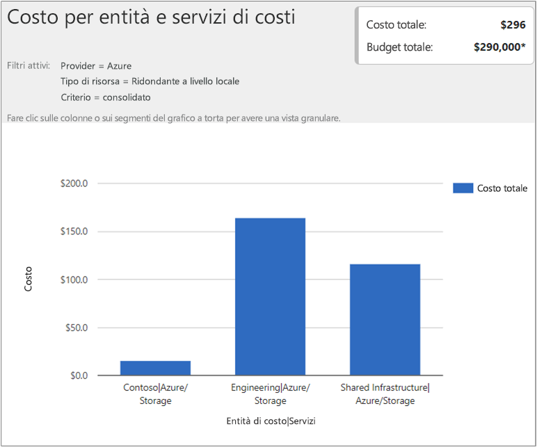

## Visualizzare i dati di costo

Azure Cost Management di Cloudyn consente di accedere a tutti i dati della risorsa cloud. Tra i report del dashboard è possibile trovare report sia standard che personalizzati in una visualizzazione a schede. I seguenti sono esempi di un popolare dashboard e di un report che mostrano immediatamente i dati relativi ai costi.

In questo esempio il dashboard di gestione mostra i costi consolidati per l'azienda Contoso in tutte le risorse cloud. Contoso usa Azure, AWS e Google. I dashboard offrono informazioni immediate e consentono di esplorare velocemente i report.  

Se non si è certi dello scopo di un report in un dashboard, passare il puntatore sopra il simbolo **i** per visualizzare una spiegazione. Fare clic su un report in un dashboard per visualizzare il report completo.

Per visualizzare i report, è anche possibile usare il menu dei report nella parte superiore del portale. Di seguito sono illustrate le spese per le risorse di Azure di Contoso negli ultimi 30 giorni. Fare clic su **Cost** (Costo)  > **Cost Analysis** (Analisi dei costi)  > **Actual Cost Analysis** (Analisi dei costi effettivi). Cancellare gli eventuali valori se nel report sono presenti impostazioni per tag, gruppi o filtri.

In questo esempio 75.970 dollari è il costo totale e il budget è di 130.000 dollari.

A questo punto si modifica il formato del report e si impostano i gruppi e i filtri per limitare i risultati relativi ai costi di Azure. Impostare l'**intervallo di date** sugli ultimi 30 giorni. Nell'angolo in alto a destra fare clic sul simbolo delle colonne per la formattazione come grafico a barre e in Groups (Gruppi) selezionare **Provider**. Impostare quindi un filtro per **Provider** su **Azure**.

In questo esempio il costo totale delle risorse di Azure era di 3.839 dollari negli ultimi 30 giorni.

Fare clic con il pulsante destro del mouse sulla barra del provider (Azure) ed eseguire il drill-down fino a **Resource types** (Tipi di risorsa).

L'immagine seguente mostra i costi per le risorse di Azure sostenuti da Contoso. Il totale era di 3.839 dollari. In questo esempio circa metà dei costi era dovuta all'archiviazione con ridondanza locale e l'altra metà circa dei costi alle diverse istanze delle VM.

Fare clic con il pulsante destro del mouse su un tipo di risorsa e scegliere **Cost Entities** (Entità costi) per visualizzare le entità dei costi e i servizi che hanno utilizzato la risorsa. La VM e i servizi ruoli di lavoro in DevOps hanno utilizzato 486,60 dollari e 435,71 dollari in questo esempio. Il totale di entrambi è pari a 922 dollari.

Per guardare un video di esercitazione sulla visualizzazione dei dati di fatturazione cloud, vedere [Analyzing your cloud billing data with Azure Cost Management by Cloudyn](https://youtu.be/G0pvI3iLH-Y) (Analisi dei dati di fatturazione cloud con Gestione costi di Azure di Cloudyn).
