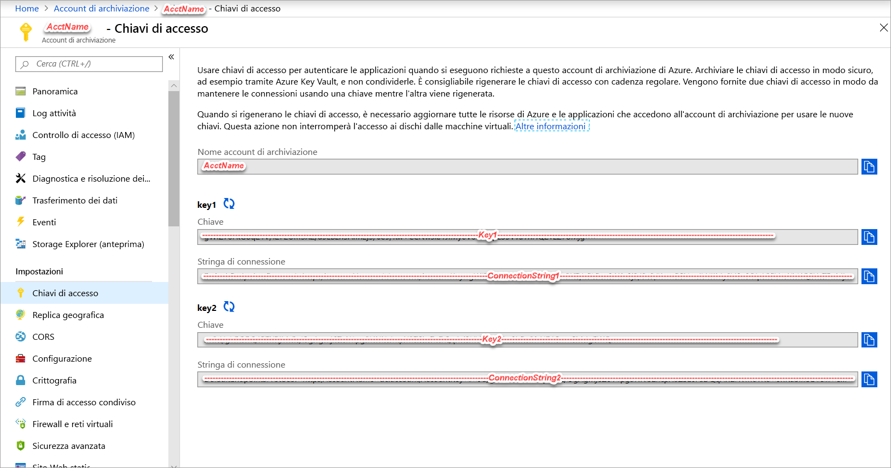
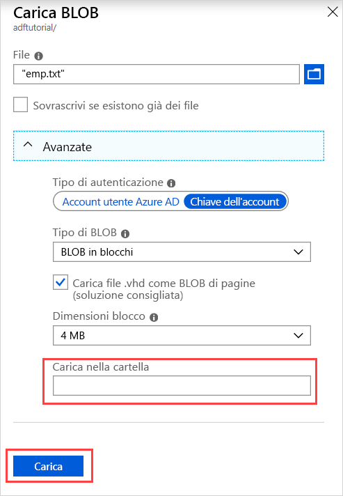

## <a name="prerequisites"></a>Prerequisiti

### <a name="azure-subscription"></a>Sottoscrizione di Azure
Se non si ha una sottoscrizione di Azure, creare un [account gratuito](https://azure.microsoft.com/free/) prima di iniziare.

### <a name="azure-roles"></a>Ruoli di Azure
Per creare istanze di Data Factory, l'account utente usato per accedere ad Azure deve essere un membro del ruolo *collaboratore* o *proprietario* oppure un *amministratore* della sottoscrizione di Azure. Per visualizzare le autorizzazioni disponibili nella sottoscrizione, nel portale di Azure selezionare il nome utente nell'angolo in alto a destra e quindi selezionare **Autorizzazioni**. Se si accede a più sottoscrizioni, selezionare quella appropriata. 

Per creare e gestire le risorse figlio per Data Factory, inclusi i set di dati, i servizi collegati, le pipeline, i trigger e i runtime di integrazione, sono applicabili i requisiti seguenti:
- Per creare e gestire le risorse figlio nel portale di Azure, è necessario appartenere al ruolo **Collaboratore Data Factory** a livello di gruppo di risorse o superiore.
- Per creare e gestire le risorse figlio con PowerShell o l'SDK, è sufficiente il ruolo di **collaboratore** a livello di risorsa o superiore.

Per istruzioni di esempio su come aggiungere un utente a un ruolo, vedere l'articolo [Aggiungere i ruoli](../articles/billing/billing-add-change-azure-subscription-administrator.md).

Per altre informazioni, vedere gli articoli seguenti:
- [Ruolo Collaboratore Data Factory](../articles/role-based-access-control/built-in-roles.md#data-factory-contributor)
- [Roles and permissions for Azure Data Factory](../articles/data-factory/concepts-roles-permissions.md) (Ruoli e autorizzazioni per Azure Data Factory)

### <a name="azure-storage-account"></a>Account di archiviazione di Azure
In questa guida introduttiva si usa un account di archiviazione di Azure per utilizzo generico (specificamente, di archiviazione BLOB) come archivio dati sia di *origine* che di *destinazione*. Se non si ha un account di archiviazione di Azure per utilizzo generico, vedere [Creare un account di archiviazione](../articles/storage/common/storage-quickstart-create-account.md) per informazioni su come crearne uno. 

#### <a name="get-the-storage-account-name-and-account-key"></a>Recuperare il nome e la chiave dell'account di archiviazione
Per questa guida introduttiva è necessario avere il nome e la chiave dell'account di archiviazione di Azure. La procedura seguente illustra i passaggi per recuperare il nome e la chiave dell'account di archiviazione: 

1. In un Web browser passare al [portale di Azure](https://portal.azure.com). Accedere con nome utente e password di Azure. 
2. Selezionare **Tutti i servizi** nel menu a sinistra, filtrare con la parola chiave **archiviazione** e selezionare **Account di archiviazione**.

   
3. Nell'elenco degli account di archiviazione filtrare, se necessario, e quindi selezionare il proprio account di archiviazione. 
4. Nella pagina **Account di archiviazione** selezionare **Chiavi di accesso** nel menu.

   
5. Copiare negli Appunti i valori delle caselle **Nome account di archiviazione** e **key1**. Incollarli in un blocco note o in qualsiasi altro editor e salvarli. Verranno usati più avanti in questa guida introduttiva.   

#### <a name="create-the-input-folder-and-files"></a>Creare la cartella e i file di input
In questa sezione viene creato un contenitore BLOB denominato **adftutorial** nell'archivio BLOB di Azure. Viene creata una cartella denominata **input** nel contenitore e viene caricato un file di esempio in tale cartella. 

1. Nella pagina **Account di archiviazione** passare a **Panoramica** e quindi selezionare **BLOB**. 

   
2. Nella pagina **Servizio BLOB** selezionare **+ Contenitore** sulla barra degli strumenti. 

       
3. Nella finestra di dialogo **Nuovo contenitore** immettere **adftutorial** come nome e quindi fare clic su **OK**. 

   
4. Selezionare **adftutorial** nell'elenco di contenitori. 

   
5. Nella pagina **Contenitore** selezionare **Carica** sulla barra degli strumenti.  

   
6. Nella pagina **Carica BLOB** selezionare **Avanzate**.

   
7. Avviare il **Blocco note** e creare un file denominato **emp.txt** con il contenuto seguente. Salvarlo nella cartella **c:\ADFv2QuickStartPSH**. Se non esiste ancora, creare la cartella **ADFv2QuickStartPSH**.
    
   ```
   John, Doe
   Jane, Doe
   ```    
8. Nella pagina **Carica BLOB** del portale di Azure cercare e selezionare il file **emp.txt** nella casella **File**. 
9. Immettere il valore **input** nella casella **Carica nella cartella**. 

        
10. Verificare che la cartella sia **input** e il file sia **emp.txt** e selezionare **Carica**.
    
    Verranno visualizzati il file **emp.txt** e lo stato del caricamento nell'elenco. 
12. Chiudere la pagina **Carica BLOB** facendo clic su **X** nell'angolo. 

    
1. Tenere aperta la pagina **Contenitore** perché verrà usata per verificare l'output alla fine di questa guida introduttiva.