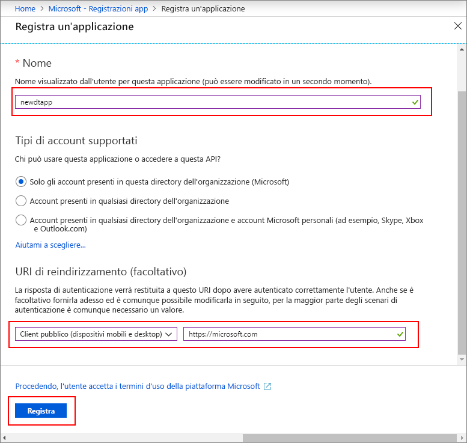

1. Nel [portale di Azure](https://portal.azure.com) aprire **Azure Active Directory** dal pannello di spostamento a sinistra e quindi aprire il riquadro **Proprietà**. Copia il valore di **ID directory** in un file temporaneo. Questo valore verrà usato per configurare l'applicazione di esempio nella sezione seguente.

    

1. Aprire il riquadro **Registrazioni app** e quindi fare clic sul pulsante **Registrazione nuova applicazione**.
    
    

1. Assegnare un nome descrittivo a questa registrazione di app nel campo **Nome**. Scegliere **_Nativa_** per **Tipo di applicazione** e **_https://microsoft.com_** per **URI di reindirizzamento**. Fare clic su **Create**(Crea).

    

1. Aprire l'app registrata e copiare il valore del campo **ID applicazione** in un file temporaneo. Questo valore identifica l'app di Azure Active Directory. L'ID applicazione verrà usato per configurare l'applicazione di esempio nelle sezioni seguenti.

    

1. Aprire il riquadro di registrazione dell'app e fare clic su **Impostazioni** > **Autorizzazioni necessarie**:
    - Fare clic su **Aggiungi** in alto a sinistra per aprire il riquadro **Aggiungi accesso all'API**.
    - Fare clic su **Selezionare un'API** e cercare **Gemelli digitali di Azure**. Se la ricerca non individua l'API, cercare invece **Azure Smart Spaces**.
    - Selezionare l'opzione **Azure Digital Twins (Azure Smart Spaces Service)** (Gemelli digitali di Azure - servizio Azure Smart Spaces) e fare clic su **Seleziona**.
    - Fare clic su **Selezionare le autorizzazioni**. Selezionare la casella delle autorizzazioni delegate **Accesso in lettura/scrittura** e fare clic su **Seleziona**.
    - Fare clic su **Fine** nel riquadro **Aggiungi accesso all'API**.
    - Nel riquadro **Autorizzazioni necessarie** fare clic sul pulsante **Concedi autorizzazioni** e accettare la conferma visualizzata.

       
