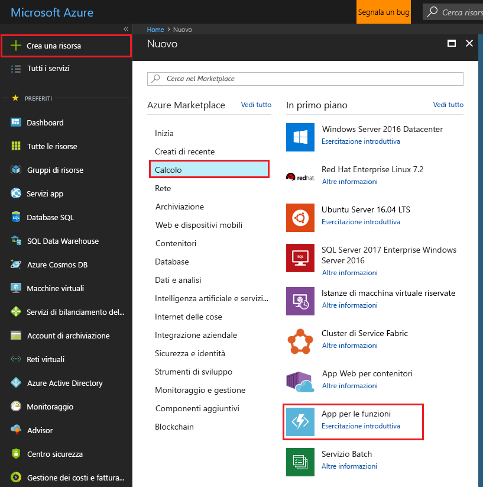
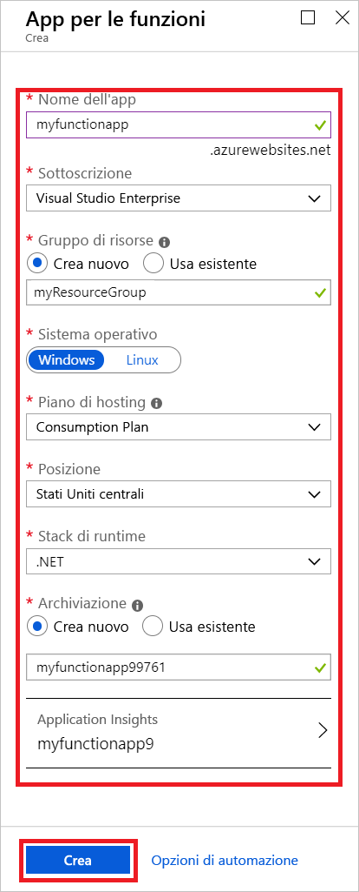
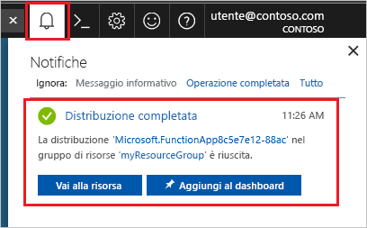

1. Selezionare il pulsante **Nuovo** nell'angolo superiore sinistro del portale di Azure e quindi selezionare **Calcolo** > **App per le funzioni**.

    

2. Usare le impostazioni dell'app per le funzioni come indicato nella tabella sottostante l'immagine.

    

    | Impostazione      | Valore consigliato  | DESCRIZIONE                                        |
    | ------------ |  ------- | -------------------------------------------------- |
    | **Nome app** | Nome globalmente univoco | Nome che identifica la nuova app per le funzioni. I caratteri validi sono `a-z`, `0-9` e `-`.  | 
    | **Sottoscrizione** | Sottoscrizione in uso | Sottoscrizione in cui viene creata questa nuova app per le funzioni. | 
    | **[Gruppo di risorse](../articles/azure-resource-manager/resource-group-overview.md)** |  myResourceGroup | Nome del nuovo gruppo di risorse in cui creare l'app per le funzioni. |
    | **Sistema operativo** | Windows | L'hosting senza server attualmente è disponibile solo in un ambiente di esecuzione su Windows. Per l'hosting su Linux, vedere [Creare la prima funzione eseguita in Linux usando l'interfaccia della riga di comando di Azure](../articles/azure-functions/functions-create-first-azure-function-azure-cli-linux.md). |
    | **[Piano di hosting](../articles/azure-functions/functions-scale.md)** | Piano a consumo | Piano di hosting che definisce come vengono allocate le risorse all'app per le funzioni. Nel **piano a consumo** predefinito le risorse vengono aggiunte dinamicamente in base alle esigenze delle funzioni. In questo hosting [senza server](https://azure.microsoft.com/overview/serverless-computing/) si paga solo per il periodo in cui le funzioni sono in esecuzione. In caso di esecuzione in un piano di servizio app, è necessario gestire il [ridimensionamento dell'app per le funzioni](../articles/azure-functions/functions-scale.md).  |
    | **Posizione** | Europa occidentale | Scegliere un'[area](https://azure.microsoft.com/regions/) nelle vicinanze o vicino ad altri servizi a cui accedono le funzioni. |
    | **Stack di runtime** | Lingua preferita | Scegliere un runtime che supporti il linguaggio di programmazione della funzione preferito. Scegliere **.NET** per le funzioni C# e F #. |
    | **[Archiviazione](../articles/storage/common/storage-quickstart-create-account.md)** |  Nome globalmente univoco |  Creare un account di archiviazione usato dall'app per le funzioni. I nomi degli account di archiviazione devono avere una lunghezza compresa tra 3 e 24 caratteri e possono contenere solo numeri e lettere minuscole. È anche possibile usare un account esistente, che dovrà soddisfare i [requisiti dell'account di archiviazione](../articles/azure-functions/functions-scale.md#storage-account-requirements). |
    | **[Application Insights](../articles/azure-functions/functions-monitoring.md)** | Predefinito | Application Insights è abilitato per impostazione predefinita. Scegliere una posizione vicino ad app per le funzioni.  |

3. Selezionare **Crea** per effettuare il provisioning dell'app per le funzioni e distribuirla.

4. Selezionare l'icona di notifica nell'angolo superiore destro del portale e attendere la visualizzazione del messaggio **La distribuzione è riuscita**.

    

5. Selezionare **Vai alla risorsa** per visualizzare la nuova app per le funzioni.

> [!TIP]
> In caso di problemi nell'individuare le app per le funzioni nel portale, provare ad [aggiungere le app per le funzioni ai preferiti nel portale di Azure](../articles/azure-functions/functions-how-to-use-azure-function-app-settings.md#favorite).
