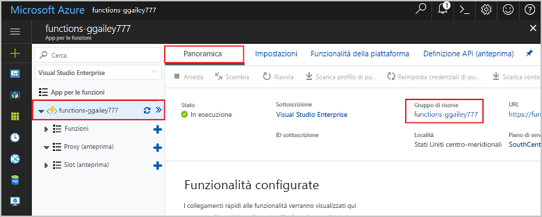

Altre guide introduttive di questa raccolta si basano sui valori di questa guida introduttiva. Se si prevede di continuare a usare le guide introduttive successive o i servizi creati con questa guida introduttiva, non eseguire la pulizia delle risorse.

Il termine *risorse* in Azure si riferisce ad app per le funzioni, funzioni, account di archiviazione e così via. Le risorse sono raggruppate in *gruppi di risorse*, ed è possibile eliminare tutti gli elementi in un gruppo eliminando il gruppo. 

Per completare queste guide introduttive sono state create risorse. Per tali risorse potrebbero venire addebitati costi, a seconda dello [stato dell'account](https://azure.microsoft.com/account/) e dei [prezzi dei servizi](https://azure.microsoft.com/pricing/). Se le risorse non sono più necessarie, ecco come eliminarle:

1. Nel portale di Azure passare alla pagina **Gruppo di risorse**. 

   Per visualizzare tale pagina dalla pagina dell'app per le funzioni, selezionare la scheda **Panoramica** e quindi selezionare il collegamento sotto **Gruppo di risorse**.

   

   Per visualizzare tale pagina dal dashboard, selezionare **Gruppi di risorse** e quindi selezionare il gruppo di risorse usato nella guida introduttiva.

2. Nella pagina **Gruppo di risorse** esaminare l'elenco delle risorse incluse e verificare che siano quelle da eliminare.
 
3. Selezionare **Elimina gruppo di risorse** e seguire le istruzioni.

   L'eliminazione potrebbe richiedere alcuni minuti. Al termine, viene visualizzata una notifica per pochi secondi. È anche possibile selezionare l'icona a forma di campana nella parte superiore della pagina per visualizzare la notifica.
