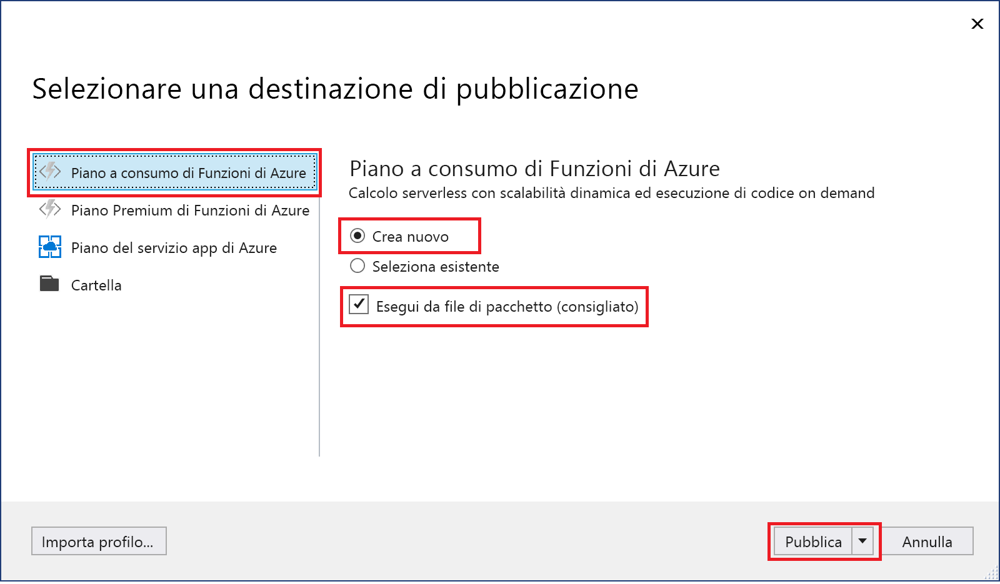
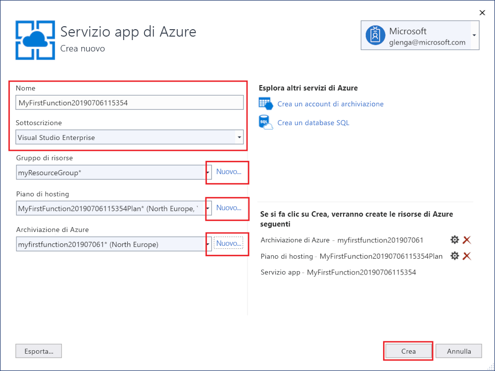
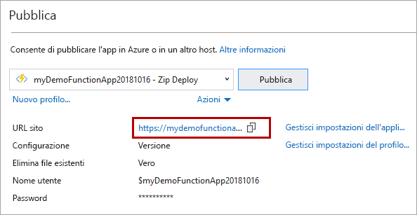

1. In **Esplora soluzioni** fare clic con il pulsante destro del mouse sul progetto e scegliere **Pubblica**.

2. Selezionare **App per le funzioni di Azure**, scegliere **Crea nuova** e quindi selezionare **Pubblica**.

     

    Quando si fa clic su **Esegui da file di pacchetto (scelta consigliata)** , l'app per le funzioni verrà distribuita usando [ZipDeploy](../articles/azure-functions/functions-deployment-technologies.md#zip-deploy) con la modalità [Run-From-Package](../articles/azure-functions/run-functions-from-deployment-package.md) abilitata. Si tratta della modalità consigliata per eseguire le funzioni, che garantisce prestazioni ottimali.

    >[!CAUTION]
    >Se si sceglie **Seleziona esistente**, tutti i file nell'app per le funzioni esistente in Azure vengono sovrascritti da file del progetto locale. Usare questa opzione solo quando si ripubblicano gli aggiornamenti a un'app per le funzioni esistente.

3. Se non si è ancora connesso Visual Studio al proprio account di Azure, selezionare **Aggiungi un account...** .

4. Nella finestra di dialogo **Crea servizio app** usare le impostazioni di **Hosting** specificate nella tabella sotto l'immagine:

    

    | Impostazione      | Valore consigliato  | DESCRIZIONE                                |
    | ------------ |  ------- | -------------------------------------------------- |
    | **Nome app** | Nome globalmente univoco | Nome che identifica in modo univoco la nuova app per le funzioni. |
    | **Sottoscrizione** | Scegliere la sottoscrizione | Sottoscrizione di Azure da usare. |
    | **[Gruppo di risorse](../articles/azure-resource-manager/resource-group-overview.md)** | myResourceGroup |  Nome del gruppo di risorse in cui creare l'app per le funzioni. Per creare un nuovo gruppo di risorse scegliere **Nuovo**.|
    | **[Piano di servizio app](../articles/azure-functions/functions-scale.md)** | Piano a consumo | Assicurarsi di scegliere **Consumo** in **Dimensione** dopo aver fatto clic su **Nuovo** per creare un piano senza server. Scegliere anche una **Località**  nelle [vicinanze](https://azure.microsoft.com/regions/) o vicino ad altri servizi a cui accedono le funzioni. Se si esegue un piano diverso da **Consumo**, è necessario gestire il [ridimensionamento dell'app per le funzioni](../articles/azure-functions/functions-scale.md).  |
    | **[Account di archiviazione](../articles/storage/common/storage-quickstart-create-account.md)** | Account di archiviazione per utilizzo generico | L'account di archiviazione di Azure è necessario per il runtime di Funzioni. Fare clic su **Nuovo** per creare un account di archiviazione per utilizzo generico. È anche possibile usare un account esistente che soddisfi i [requisiti dell'account di archiviazione](../articles/azure-functions/functions-scale.md#storage-account-requirements).  |

5. Fare clic su **Crea** per creare un'app per le funzioni e le relative risorse in Azure con queste impostazioni e distribuire il codice di progetto della funzione. 

6. Al termine della distribuzione prendere nota del valore di **URL sito**, ovvero l'indirizzo dell'app per le funzioni in Azure.

    
