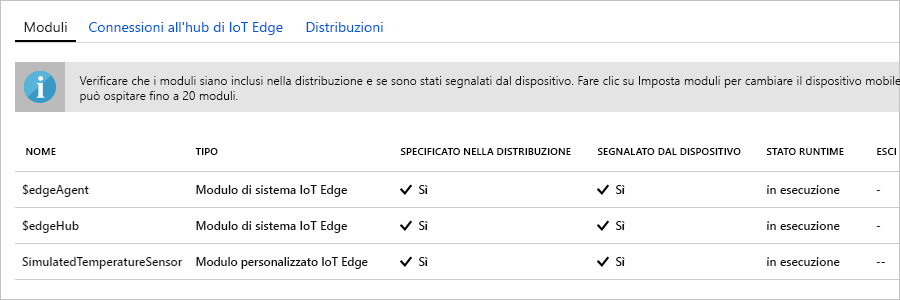

Una delle principali funzionalità di Azure IoT Edge è la possibilità di distribuire i moduli nei dispositivi IoT Edge dal cloud. Un modulo di IoT Edge è un pacchetto eseguibile implementato come contenitore. In questa sezione viene distribuito un modulo pre-compilato dalla [sezione Moduli IoT Edge di Azure Marketplace](https://azuremarketplace.microsoft.com/marketplace/apps/category/internet-of-things?page=1&subcategories=iot-edge-modules). Questo modulo genera dati di telemetria simulati per il dispositivo IoT Edge.

1. Nel [portale di Azure](https://portal.azure.com) immettere **Simulated Temperature Sensor** nella ricerca e aprire il risultato di Marketplace.

   

2. Scegliere il dispositivo IoT Edge che riceverà il modulo. In **Target Devices for IoT Edge Module** (Dispositivi di destinazione per il modulo IoT Edge) specificare le informazioni seguenti:

   1. **Sottoscrizione**: selezionare la sottoscrizione che contiene l'hub IoT in uso.

   2. **Hub IoT**: selezionare il nome dell'hub IoT in uso.

   3. **Nome del dispositivo IoT Edge**: se è stato usato il nome del dispositivo suggerito in precedenza in questa guida introduttiva, immettere **myEdgeDevice**. In alternativa, selezionare **Trova dispositivo** per scegliere da un elenco dei dispositivi nell'hub IoT. 
   
   4. Selezionare **Create**.

3. Dopo avere scelto un modulo IoT Edge da Azure Marketplace e un dispositivo IoT Edge che riceverà il modulo, viene visualizzata una procedura guidata in tre passaggi che consente di definire esattamente come verrà distribuito il modulo. Nel passaggio **Aggiungi moduli** della procedura guidata il modulo **SimulatedTemperatureSensor** viene inserito automaticamente. Nelle esercitazioni si userà questa pagina per aggiungere moduli aggiuntivi alla distribuzione. Per questa guida introduttiva, è sufficiente distribuire un modulo. Selezionare **Avanti** per continuare con il passaggio successivo della procedura guidata.

4. Nel passaggio **Specifica route** della procedura guidata definire come vengono passati i messaggi tra i moduli e all'hub IoT. Per la guida introduttiva, si vuole che tutti i messaggi da tutti i moduli siano passati all'hub IoT (`$upstream`). Se non viene compilato automaticamente, aggiungere il codice seguente e quindi selezionare **Avanti**:

   ```json
    {
    "routes": {
        "route": "FROM /messages/* INTO $upstream"
        }
    }
   ```

5. Nel passaggio **Rivedi distribuzione** della procedura guidata è possibile visualizzare in anteprima il file JSON che definisce tutti i moduli distribuiti nel dispositivo IoT Edge. Si noti che sono inclusi il modulo **SimulatedTemperatureSensor**, nonché due moduli di sistema aggiuntivi denominati **edgeAgent** ed **edgeHub**. Al termine, selezionare **Invia**.

   Quando si invia una nuova distribuzione a un dispositivo IoT Edge, non viene eseguito il push di alcun elemento al dispositivo. Al contrario, il dispositivo richiede periodicamente eventuali nuove istruzioni all'hub IoT. Quando rileva le nuove informazioni di distribuzione, il dispositivo le usa per eseguire il pull delle immagini dei moduli dal cloud e avvia l'esecuzione dei moduli in locale. Il processo potrebbe richiedere alcuni minuti. 

6. Dopo aver inviato i dettagli della distribuzione del modulo, verrà nuovamente visualizzata la pagina **IoT Edge** dell'hub IoT. Selezionare il dispositivo dall'elenco dei dispositivi IoT Edge per visualizzarne i dettagli. 

7. Nella pagina dei dettagli dispositivo scorrere verso il basso fino alla sezione **Moduli**. Dovrebbero essere elencati tre moduli: $edgeAgent $edgeHub e SimulatedTemperatureSensor. Se uno o più moduli sono elencati come specificato nella distribuzione ma non segnalati dal dispositivo, il dispositivo IoT Edge ne sta ancora eseguendo l'avvio. Attendere alcuni istanti e selezionare **Aggiorna** nella parte superiore della pagina. 

   
