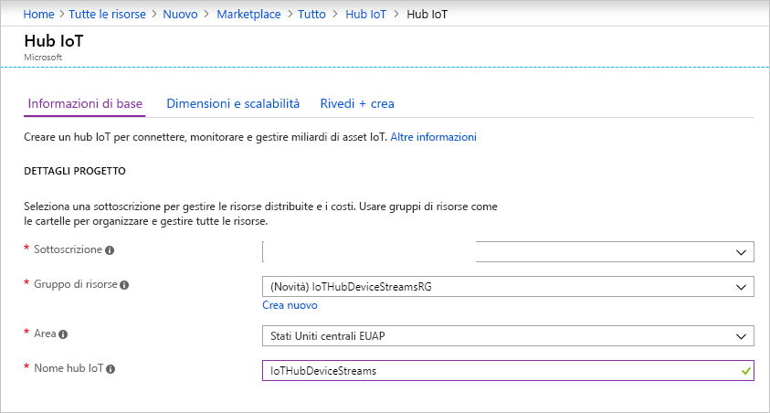
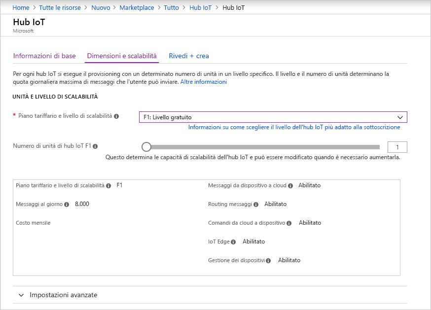

Questa sezione illustra come creare un hub IoT usando il [portale di Azure](https://portal.azure.com).

1. Accedere al [portale di Azure](https://portal.azure.com).

1. Fare clic su **Crea una risorsa** e quindi selezionare **Internet delle cose**.

1. Nell'elenco a destra selezionare **Hub IoT**. Viene visualizzata la prima pagina per la creazione di un hub IoT.

   

   Compilare i campi:

   a. Nell'elenco a discesa **Sottoscrizione** selezionare la sottoscrizione da usare per l'hub IoT.

   b. In **Gruppo di risorse** eseguire una di queste operazioni: 
      * Per creare un nuovo gruppo di risorse, selezionare **Crea nuovo** e immettere il nome da usare. 
      * Per usare un gruppo di risorse esistente, selezionare **Usa esistente** e quindi scegliere il gruppo di risorse nell'elenco a discesa. 
      
        Per altre informazioni, vedere l'articolo su come [gestire gruppi di risorse di Azure Resource Manager](../articles/azure-resource-manager/manage-resource-groups-portal.md).

   c. Nell'elenco a discesa **Area** selezionare l'area in cui si vuole collocare l'hub. Selezionare un'area che supporta l'anteprima dei flussi del dispositivo per l'hub IoT, ossia **Stati Uniti centrali** o **Stati Uniti centrali EUAP**.

   d. Nella casella **Nome hub IoT** immettere un nome per l'hub IoT. Il nome deve essere univoco a livello globale. Se il nome immesso è disponibile, viene visualizzato un segno di spunta verde.

   [!INCLUDE [iot-hub-pii-note-naming-hub](iot-hub-pii-note-naming-hub.md)]

1. Per continuare a creare l'hub IoT, selezionare **Avanti: Dimensioni e piano**.

   

   In questo riquadro è possibile accettare le impostazioni predefinite e selezionare **Rivedi e crea** nella parte inferiore. Valutare le opzioni seguenti:

   * Nell'elenco a discesa **Piano tariffario e livello di scalabilità** selezionare uno dei livelli standard (**S1**, **S2** o **S3**) oppure **F1: Livello gratuito**. Questa scelta può anche essere guidata dalle dimensioni della flotta e dai carichi di lavoro non di streaming che si prevedono nell'hub (ad esempio, i messaggi di telemetria). Ad esempio, il livello gratuito è utilizzabile a scopo di test e valutazione. Consente la connessione di 500 dispositivi all'hub IoT e un massimo di 8.000 messaggi al giorno. Per ogni sottoscrizione di Azure è possibile creare un solo hub IoT nel livello gratuito. 

   * Per **Numero di unità di hub IoT**: questa scelta dipende dal carico di lavoro non di streaming previsto nell'hub. È possibile selezionare 1 per il momento.

   Per altre informazioni sulle opzioni dei livelli, vedere [Scegliere il livello di hub IoT più adatto](../articles/iot-hub/iot-hub-scaling.md).

1. Per rivedere le scelte effettuate, selezionare la scheda **Rivedi e crea**. Il riquadro che si apre è simile al seguente:

   

1. Per creare il nuovo hub IoT, fare clic su **Crea**. La procedura richiede alcuni minuti.
