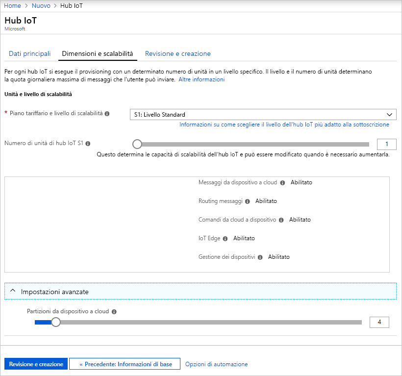
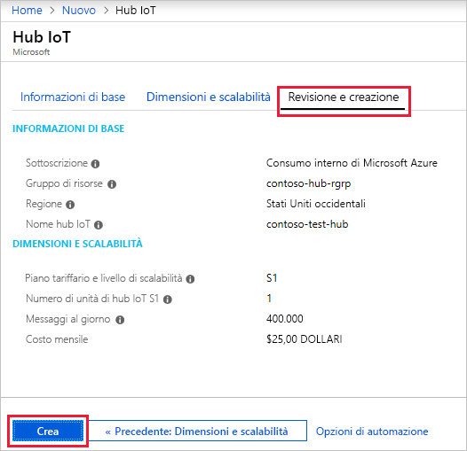

Questa sezione illustra come creare un hub IoT usando il [portale di Azure](https://portal.azure.com).

1. Accedere al [Portale di Azure](https://portal.azure.com). 

2. Scegliere **+Crea una risorsa** e quindi scegliere **Internet delle cose**.

3. Fare clic su **Hub IoT** nell'elenco a destra. Verrà visualizzata la prima schermata per la creazione di un hub IoT.

   

   Compilare i campi.

   **Sottoscrizione** selezionare la sottoscrizione da usare per l'hub IoT.

   **Gruppo di risorse**: è possibile creare un nuovo gruppo di risorse o selezionarne uno esistente. Per crearne uno nuovo, fare clic su **Crea nuovo** e specificare il nome da usare. Per usare un gruppo di risorse esistente, fare clic su **Usa esistente** e selezionare il gruppo di risorse nell'elenco a discesa. Per altre informazioni, vedere l'articolo su come [gestire gruppi di risorse di Azure Resource Manager](../articles/azure-resource-manager/manage-resource-groups-portal.md).

   **Area**: si tratta dell'area in cui si vuole collocare l'hub. Selezionare la località più vicina nell'elenco a discesa.

   **Nome hub IoT**: inserire il nome dell'hub IoT. Il nome deve essere univoco a livello globale. Se il nome immesso è disponibile, viene visualizzato un segno di spunta verde.

   [!INCLUDE [iot-hub-pii-note-naming-hub](iot-hub-pii-note-naming-hub.md)]

4. Fare clic su **Avanti: Dimensioni e piano** per continuare a creare l'hub IoT.

   

   In questa schermata è sufficiente accettare le impostazioni predefinite e fare semplicemente clic su **Revisione e creazione** nella parte inferiore. 

   **Piano tariffario e livello di scalabilità**: È possibile scegliere tra livelli diversi a seconda del numero di funzionalità che si desidera e di quanti messaggi si inviano al giorno tramite la soluzione. Il livello gratuito è utilizzabile a scopo di test e valutazione. Consente la connessione di 500 dispositivi all'hub IoT e un massimo di 8.000 messaggi al giorno. Ogni sottoscrizione Azure può creare hub IoT nel livello gratuito. 

   **Unità di hub IoT**: Il numero di messaggi consentiti per unità al giorno dipende dal piano tariffario dell'hub. Ad esempio, se si desidera che l'hub IoT supporti 700.000 messaggi in entrata, selezionare due unità del piano S1.

   Per informazioni dettagliate sulle altre opzioni relative al livello, vedere [Scegliere il livello più adatto di hub IoT](../articles/iot-hub/iot-hub-scaling.md).

   **Partizioni avanzate/da dispositivo a cloud**: questa proprietà associa i messaggi da dispositivo a cloud al numero di lettori simultanei di tali messaggi. La maggior parte degli hub IoT richiede solo quattro partizioni. 

5. Fare clic su **Revisione e creazione** per rivedere le scelte effettuate. Dovrebbe essere visualizzata una schermata simile alla seguente.

   

6. Fare clic su **Crea** per creare il nuovo hub IoT. La creazione dell'hub richiede alcuni minuti.
